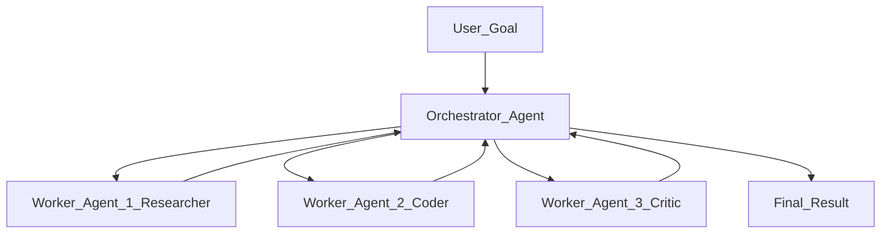

# 🏢 Multi-Agent Systems

> [!abstract] TL;DR
> Multi-agent systems (MAS) coordinate multiple specialized AI agents to solve tasks that benefit from parallelism, specialization, or verification. Patterns include orchestrator-worker (one agent delegates to others), peer-to-peer (agents converse as equals), and hierarchical (nested orchestrators). Frameworks like AutoGen and CrewAI provide the communication and coordination infrastructure.

## Intuition — Analogy First

Think of a **company org chart**:

The **CEO** (Orchestrator Agent) receives a strategic goal: "Launch a new product line by Q3." They don't do the work themselves — they delegate:
- **VP Engineering** (Coder Agent): designs and builds the product
- **VP Marketing** (Research Agent): runs competitor analysis and writes copy
- **VP Finance** (Analyst Agent): models the revenue projections
- **VP QA** (Critic Agent): reviews everyone's work and flags problems

Each VP is a specialist. Each may manage their own team (sub-agents). The CEO synthesizes everyone's outputs into a final deliverable.

The key insight: a single generalist agent trying to do all of this serially makes mistakes — it forgets context, lacks depth, and can't parallelize. Specialists working in a coordinated system are faster, more accurate, and more robust.

## How It Works — Mechanics

### Architecture Patterns

**1. Orchestrator + Workers (most common)**



**2. Peer-to-Peer (AutoGen style)**
Two or more agents hold a conversation, each responding to the other. Can include human-in-the-loop as one "agent".

**3. Hierarchical**
Orchestrator delegates to sub-orchestrators, who delegate to workers. Used for very complex tasks.

**4. Pipeline (Assembly Line)**
Agents are chained — output of agent N is input to agent N+1. Good for structured workflows.

### Why Multiple Agents?

| Reason | Explanation |
|--------|-------------|
| **Parallelism** | Independent subtasks run simultaneously |
| **Specialization** | Each agent optimized for its domain (different prompts, tools, models) |
| **Verification** | A critic agent reviews the primary agent's output — self-consistency check |
| **Context management** | Smaller, focused context per agent beats one bloated context |
| **Scalability** | Add more workers to handle load |

### Inter-Agent Communication

Agents communicate by passing messages (text, structured JSON, or tool calls). Each agent is itself an LLM with its own system prompt, tools, and memory.

**Agent-as-tool pattern** — an orchestrator can call a worker agent as if it were a tool:
```python
tools = [
    Tool(name="researcher", func=researcher_agent.run, description="Researches topics"),
    Tool(name="coder", func=coder_agent.run, description="Writes and executes code"),
]
```

## The Math

A multi-agent system is a tuple $(\mathcal{A}, \mathcal{M}, \mathcal{E})$:
- $\mathcal{A} = \{a_1, \ldots, a_n\}$ — set of agents
- $\mathcal{M}$ — message passing protocol
- $\mathcal{E}$ — shared environment (tools, memory, external APIs)

Agent $a_i$ at step $t$ generates a response:
$$r_i^t = \text{LLM}_i(\text{system}_i, h_i^t)$$

Where $h_i^t$ is agent $i$'s message history (may include messages from other agents).

**Completion condition**: the system terminates when the orchestrator outputs a final answer or a maximum total step count $\sum_i T_i \leq K$ is exceeded.

**Failure modes are multiplicative**: if each agent has reliability $p_i$, a pipeline of $n$ agents has end-to-end reliability $\prod_i p_i$. With 5 agents each at 90% reliability: $0.9^5 = 59\%$. This is why verification and retry logic are essential.

## Code Demo

```python
# ── AutoGen: Two-Agent Conversation ───────────────────────────────────────
import autogen

config_list = [{"model": "gpt-4o-mini", "api_key": "your-key"}]

llm_config = {
    "config_list": config_list,
    "temperature": 0,
    "seed": 42,  # reproducible
}

# Assistant agent — does the work
assistant = autogen.AssistantAgent(
    name="CodingAssistant",
    llm_config=llm_config,
    system_message=(
        "You are an expert Python developer. Write clean, well-commented code. "
        "Always include error handling and type hints."
    ),
)

# User proxy — represents the human, can execute code
user_proxy = autogen.UserProxyAgent(
    name="UserProxy",
    human_input_mode="NEVER",  # fully automated
    max_consecutive_auto_reply=5,
    code_execution_config={
        "work_dir": "coding_workspace",
        "use_docker": False,
    },
    is_termination_msg=lambda x: x.get("content", "").rstrip().endswith("TERMINATE"),
)

# Start the conversation
user_proxy.initiate_chat(
    assistant,
    message="Write a Python function that finds the top 5 most frequent words in a text file, "
            "then test it with a sample paragraph. End with TERMINATE when done.",
)


# ── CrewAI: Role-based Multi-Agent System ─────────────────────────────────
from crewai import Agent, Task, Crew, Process
from crewai_tools import SerperDevTool, ScrapeWebsiteTool

search_tool = SerperDevTool()
scrape_tool = ScrapeWebsiteTool()

# Define specialist agents with roles and backstories
researcher = Agent(
    role="Senior Research Analyst",
    goal="Find comprehensive, accurate information on the given topic",
    backstory=(
        "You are a veteran research analyst with 15 years of experience. "
        "You excel at synthesizing information from multiple sources and "
        "identifying key trends and insights."
    ),
    tools=[search_tool, scrape_tool],
    llm="gpt-4o-mini",
    verbose=True,
    max_iter=5,
)

writer = Agent(
    role="Technical Writer",
    goal="Transform research findings into clear, engaging technical content",
    backstory=(
        "You are a technical writer who specializes in making complex topics "
        "accessible. You write in a clear, structured style."
    ),
    llm="gpt-4o-mini",
    verbose=True,
)

critic = Agent(
    role="Quality Reviewer",
    goal="Review content for accuracy, clarity, and completeness",
    backstory="You are a meticulous reviewer who catches errors and improves quality.",
    llm="gpt-4o-mini",
    verbose=True,
)

# Define tasks
research_task = Task(
    description=(
        "Research the latest developments in {topic}. "
        "Find at least 3 credible sources and extract key facts, statistics, and trends."
    ),
    expected_output="A structured research report with findings, sources, and key insights",
    agent=researcher,
)

writing_task = Task(
    description=(
        "Using the research findings, write a 500-word technical blog post about {topic}. "
        "Include a compelling introduction, 3 main points, and a conclusion."
    ),
    expected_output="A polished 500-word blog post in Markdown format",
    agent=writer,
    context=[research_task],  # depends on research_task output
)

review_task = Task(
    description="Review the blog post for technical accuracy, clarity, and engagement. "
                "Provide specific improvement suggestions.",
    expected_output="A reviewed version of the blog post with tracked changes and suggestions",
    agent=critic,
    context=[writing_task],
)

# Assemble the crew
crew = Crew(
    agents=[researcher, writer, critic],
    tasks=[research_task, writing_task, review_task],
    process=Process.sequential,  # or Process.hierarchical for orchestrator pattern
    verbose=True,
    memory=True,  # agents share memory
)

result = crew.kickoff(inputs={"topic": "vector databases for production AI"})
print(result.raw)
```

## Real-World Example

**MetaGPT** simulates a software company: a Product Manager agent writes PRs, an Architect agent designs the system, Engineer agents write code, QA agents test it, and a DevOps agent deploys — all coordinated in a multi-agent loop.

**AutoGen at Microsoft** powers code generation workflows where a UserProxy agent (executing code in a sandbox) and an AssistantAgent (generating code) iterate until tests pass. Used in Microsoft's internal developer tooling.

**CrewAI** powers production pipelines at companies like Cisco, where research agents gather threat intelligence and writer agents produce security reports — replacing workflows that previously required 3-4 human specialists.

## Trade-offs

| Dimension | Pro | Con |
|-----------|-----|-----|
| **Quality** | Critic agents catch errors | Agents may agree even when both wrong |
| **Speed** | Parallel execution | Coordination overhead |
| **Cost** | Specialized cheap models per task | Multiple LLM calls multiply cost |
| **Robustness** | Redundancy and verification | Cascading failures: one bad agent derails all |
| **Complexity** | Handles tasks too large for one context | Much harder to debug than single agent |
| **Scalability** | Add workers to scale throughput | Communication bottlenecks in centralized patterns |

## When to Use vs Avoid

**Use multi-agent when:**
- Task naturally decomposes into independent parallel workstreams
- You need specialist depth (a research agent + coding agent > one generalist)
- Verification/critic pass is important for quality assurance
- Task exceeds context window of a single agent

**Avoid multi-agent when:**
- Task is sequential and linear (no benefit from parallelism)
- Budget is very constrained (coordination = extra LLM calls)
- You haven't first verified a single agent fails at the task
- Debugging complexity would outweigh the quality benefit

## Common Pitfalls

1. **Infinite conversation loops** — two AutoGen agents keep responding to each other. Fix: `is_termination_msg` condition and `max_consecutive_auto_reply`.
2. **Cascading hallucinations** — Agent A hallucinates a fact; Agent B uses it as ground truth. Fix: critic agent with tool access to verify claims.
3. **Context loss between agents** — Agent B doesn't have Agent A's intermediate results. Fix: explicit context passing in task definitions.
4. **Agent role confusion** — researcher agent writes code, coder agent writes essays. Fix: strong system prompts with role boundaries and `allow_delegation=False`.
5. **No early exit on failure** — one agent fails silently, rest of crew produces garbage. Fix: error checking between tasks, circuit breaker pattern.

## Related Concepts

- [[_MOC_Generative_AI|↑ Section MOC]]

- [[AI_Agents_Overview]] — single-agent foundation
- [[Plan_and_Execute]] — orchestrator pattern applied to planning
- [[Memory_in_Agents]] — shared memory across agents
- [[ReAct_Pattern]] — reasoning strategy used within each agent
- [[Tool_Use_and_Function_Calling]] — agents calling tools, including other agents

## Review Questions

1. Why does end-to-end reliability degrade multiplicatively in a pipeline of agents, and what two architectural patterns mitigate this?
2. Compare the AutoGen peer-to-peer pattern with CrewAI's role-based pattern. For what type of task is each better suited?
3. Design a multi-agent system for automated code review: which agents would you create, what roles/tools would each have, and how would they communicate?

## Sources

- Wu, Q. et al. (2023). *AutoGen: Enabling Next-Gen LLM Applications via Multi-Agent Conversation*. https://arxiv.org/abs/2308.08155
- Hong, S. et al. (2023). *MetaGPT: Meta Programming for Multi-Agent Collaborative Framework*. https://arxiv.org/abs/2308.00352
- CrewAI Documentation. https://docs.crewai.com/
- Guo, T. et al. (2024). *Large Language Model based Multi-Agents: A Survey of Progress and Challenges*. https://arxiv.org/abs/2402.01680

#multi-agent #autogen #crewai #agent-orchestration #metagpt #generative-ai #advanced-agents
