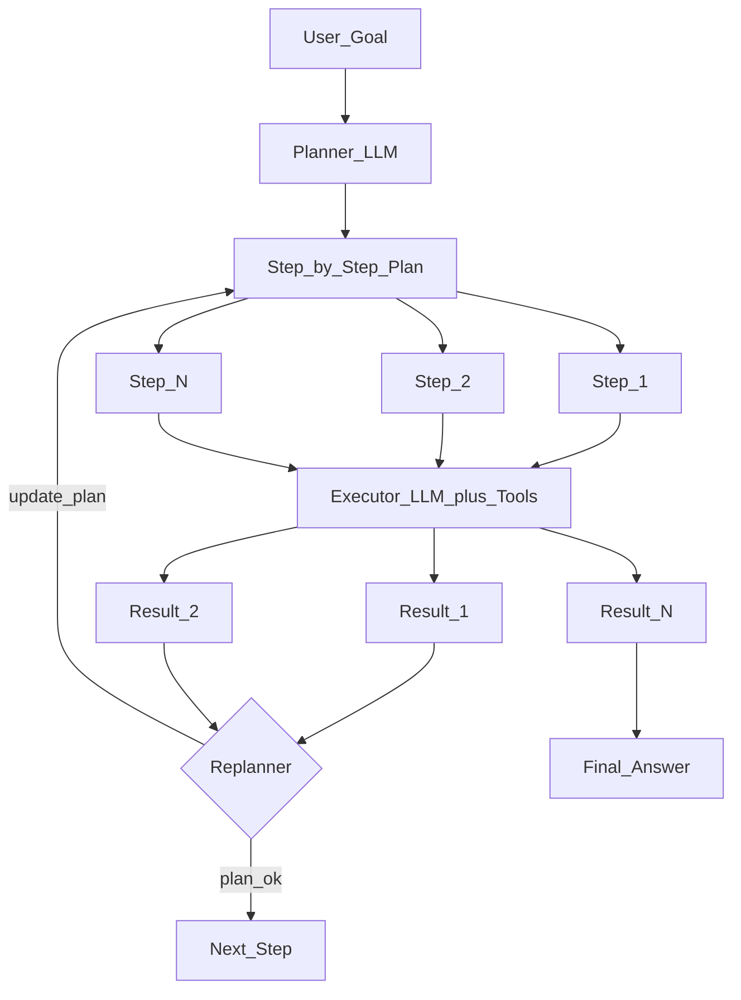

# 🗺️ Plan and Execute Agent Pattern

> [!abstract] TL;DR
> Plan-and-Execute separates an agent into two phases: a **Planner** that generates a full step-by-step plan upfront, and an **Executor** that carries out each step using tools. This separation enables better reasoning on complex multi-step tasks and allows the plan to be updated as new information arrives — without re-planning from scratch at every step.

## Intuition — Analogy First

Think of a **project manager directing workers**:

The **PM (planner)** thinks through the entire project before any work starts: "We need to (1) gather requirements, (2) design the architecture, (3) write the code, (4) test it, (5) deploy it." They produce a project plan.

The **workers (executors)** execute each task one at a time, reporting results back. The PM reviews results after each milestone and may revise the plan — "Step 3 took longer than expected, we'll skip the optional refactor."

Compare this to **ReAct** — which is like a worker who plans and executes simultaneously, step by step, with no upfront roadmap. ReAct is more reactive (good for exploration), Plan-and-Execute is better for structured, multi-step projects where the overall shape is knowable upfront.

## How It Works — Mechanics

### Architecture



### Phase 1: Planning

The Planner LLM receives the goal and generates a structured plan. The plan is typically an ordered list of steps, each with:
- A description of what to do
- Which tool or sub-agent will execute it
- What the expected output is

**Key insight**: the Planner uses a larger/smarter LLM focused solely on reasoning; it doesn't have access to tools. This separation means the planner's context stays small and focused on strategy.

### Phase 2: Execution

The Executor takes each step from the plan and uses tools/agents to complete it. The Executor is often a ReAct agent for each step — it can handle the tactical tool use, while the Planner handled the strategic breakdown.

### Phase 3: Replanning (optional)

After each step, a Replanner reviews the result and updates the plan if needed. This makes Plan-and-Execute adaptive, not brittle.

### vs ReAct

| Aspect | ReAct | Plan-and-Execute |
|--------|-------|-----------------|
| Planning | Implicit, at each step | Explicit, upfront |
| Long-horizon tasks | Loses track over many steps | Structured plan guides execution |
| Adaptability | High (replans every step) | Moderate (replans at milestones) |
| Token efficiency | Can be redundant | Planner context stays focused |
| Best for | Exploratory, unpredictable tasks | Structured, known workflows |
| LLM calls | N (one per step) | 1 plan + N executor calls |

## The Math

Let the goal $G$ decompose into steps $S = [s_1, s_2, \ldots, s_n]$.

**Planner** generates:
$$S = \text{Planner}(G, \text{context})$$

**Executor** for each step:
$$r_i = \text{Executor}(s_i, r_1, \ldots, r_{i-1})$$

**Replanner** (optional):
$$S' = \text{Replanner}(G, S, r_1, \ldots, r_i) \quad \text{if replanning triggered}$$

**Total LLM calls** = 1 (planner) + n (executor steps) + k (replanning events)

The key advantage: the Planner call is $O(|G|)$ tokens, not $O(|G| + |h_t|)$ — it doesn't accumulate the full execution trace in its context, keeping it focused and cheaper per call.

## Code Demo

```python
# ── Plan-and-Execute with LangChain ───────────────────────────────────────
from langchain_experimental.plan_and_execute import (
    PlanAndExecute,
    load_agent_executor,
    load_chat_planner,
)
from langchain_openai import ChatOpenAI
from langchain.tools import tool
from langchain_community.tools import DuckDuckGoSearchRun

# ── Tools for the executor ────────────────────────────────────────────────
@tool
def calculator(expression: str) -> str:
    """Evaluate a math expression. Input: valid Python arithmetic expression."""
    try:
        return str(eval(expression, {"__builtins__": {}}, {}))
    except Exception as e:
        return f"Error: {e}"

search = DuckDuckGoSearchRun()
tools = [search, calculator]

# ── Two LLMs: planner (smart) and executor (can be smaller) ───────────────
planner_llm = ChatOpenAI(model="gpt-4o", temperature=0)    # strategic
executor_llm = ChatOpenAI(model="gpt-4o-mini", temperature=0)  # tactical

# ── Build planner and executor ────────────────────────────────────────────
planner = load_chat_planner(planner_llm)
executor = load_agent_executor(executor_llm, tools, verbose=True)

# ── Combine into Plan-and-Execute agent ───────────────────────────────────
agent = PlanAndExecute(planner=planner, executor=executor, verbose=True)

result = agent.invoke(
    "Research the top 3 programming languages by popularity in 2024, "
    "find their GitHub star counts for their official repos, "
    "and create a ranked summary with percentage shares."
)
print(result["output"])


# ── Manual Plan-and-Execute (for full control) ────────────────────────────
from langchain_openai import ChatOpenAI
from langchain_core.prompts import ChatPromptTemplate
from langchain_core.output_parsers import JsonOutputParser
from pydantic import BaseModel
from typing import List

class Plan(BaseModel):
    steps: List[str]

class PlannerExecutorAgent:
    def __init__(self, tools: list):
        self.planner_llm = ChatOpenAI(model="gpt-4o", temperature=0)
        self.executor_llm = ChatOpenAI(model="gpt-4o-mini", temperature=0)
        self.tools = {t.name: t for t in tools}

    def plan(self, goal: str) -> List[str]:
        prompt = ChatPromptTemplate.from_messages([
            ("system", "You are a planner. Break the goal into clear, ordered steps. "
                       "Return JSON: {{steps: [step1, step2, ...]}}"),
            ("human", "Goal: {goal}"),
        ])
        chain = prompt | self.planner_llm | JsonOutputParser()
        result = chain.invoke({"goal": goal})
        return result["steps"]

    def execute_step(self, step: str, context: str) -> str:
        # Each step is executed by a ReAct sub-agent
        from langchain.agents import AgentExecutor, create_react_agent
        from langchain import hub
        prompt = hub.pull("hwchase17/react")
        agent = create_react_agent(self.executor_llm, list(self.tools.values()), prompt)
        executor = AgentExecutor(agent=agent, tools=list(self.tools.values()), max_iterations=4)
        result = executor.invoke({"input": f"Context: {context}\n\nTask: {step}"})
        return result["output"]

    def run(self, goal: str) -> str:
        steps = self.plan(goal)
        print(f"Plan: {steps}")
        context = ""
        for i, step in enumerate(steps):
            print(f"\n--- Executing Step {i+1}: {step} ---")
            result = self.execute_step(step, context)
            context += f"\nStep {i+1} result: {result}"
        return context

agent = PlannerExecutorAgent(tools=[search, calculator])
agent.run("Find Apple's revenue for 2023 and compute its 5-year CAGR assuming 2018 revenue was $265B")
```

## Real-World Example

**AutoGPT** (2023) was an early Plan-and-Execute system: given a high-level goal, it would generate tasks (plan), execute them using tools (web browser, file system, code execution), and persist memory across steps. It pioneered the pattern but suffered from runaway loops on open-ended goals.

**Devin (Cognition AI)** uses a refined version: the Planner decomposes a GitHub issue into implementation tasks (understand → design → code → test → PR), while the Executor agent handles each using an IDE, terminal, and browser. Crucially, Devin's planner can re-plan when tests fail.

**Microsoft's Magnetic One** (2024) implements a multi-agent Plan-and-Execute where an Orchestrator agent creates and revises plans, dispatching subtasks to specialized agents (web surfer, file manager, coder, terminal).

## Trade-offs

| Dimension | Pro | Con |
|-----------|-----|-----|
| **Long-horizon tasks** | Plan guides execution coherently | Rigid plan may miss dynamic info |
| **Efficiency** | Planner context stays small | Two LLM systems to maintain |
| **Debuggability** | Explicit plan is inspectable | Execution errors hard to attribute |
| **Cost** | Executor can use cheaper model | Extra planner call upfront |
| **Adaptability** | Replanner handles surprises | Replanning adds latency |
| **Parallelism** | Independent steps can run in parallel | Requires dependency analysis |

## When to Use vs Avoid

**Use Plan-and-Execute when:**
- Task has 5+ steps with a knowable structure upfront
- Task involves multiple tools or domains that benefit from specialization
- You want the overall strategy to be auditable/reviewable before execution
- Steps can be parallelized (different executors for independent tasks)

**Avoid when:**
- Task is highly exploratory (you don't know what you need until you start)
- Task is simple (1-3 tool calls — ReAct is simpler)
- Plan quality depends on intermediate results that can't be predicted

## Common Pitfalls

1. **Over-granular plans** — planner creates 20 tiny steps for a 3-step task. Fix: prompt planner to produce 3-7 high-level steps.
2. **Under-granular plans** — "Step 1: do everything" — too vague for executor. Fix: require executor-actionable steps.
3. **Plan-reality mismatch** — plan assumes tool X exists but executor only has tool Y. Fix: include available tools in planner's context.
4. **No replanning** — execution fails midway, agent reports failure without adapting. Fix: always include a replanner.
5. **Context bleed** — executor for step 5 doesn't have results from steps 1-4. Fix: explicitly pass accumulated context to each executor call.

## Related Concepts

- [[_MOC_Generative_AI|↑ Section MOC]]

- [[ReAct_Pattern]] — alternative: plan and execute interleaved at each step
- [[AI_Agents_Overview]] — broader agent architecture
- [[Multi_Agent_Systems]] — Plan-and-Execute with specialist sub-agents
- [[Memory_in_Agents]] — how executor results persist across steps

## Review Questions

1. Draw the information flow in a Plan-and-Execute agent with replanning. At which points does the LLM have access to tool results, and at which points does it not?
2. For the task "Build and deploy a web scraper for a given URL", design a 5-step plan. Which steps could run in parallel? Which must be sequential?
3. When would you prefer ReAct over Plan-and-Execute for a complex task, and what property of the task drives that choice?

## Sources

- Wang, L. et al. (2023). *Plan-and-Solve Prompting*. https://arxiv.org/abs/2305.04091
- Significant Gravitas (2023). *AutoGPT*. https://github.com/Significant-Gravitas/AutoGPT
- Cognition AI (2024). *Devin: The First AI Software Engineer*. https://www.cognition.ai/blog/introducing-devin
- LangChain Plan-and-Execute. https://python.langchain.com/docs/modules/agents/agent_types/plan_and_execute
- Fourney et al. (2024). *Magentic-One: A Generalist Multi-Agent System for Solving Complex Tasks*. Microsoft Research.

#plan-and-execute #agents #planning #langchain #autogpt #advanced-agents #generative-ai
