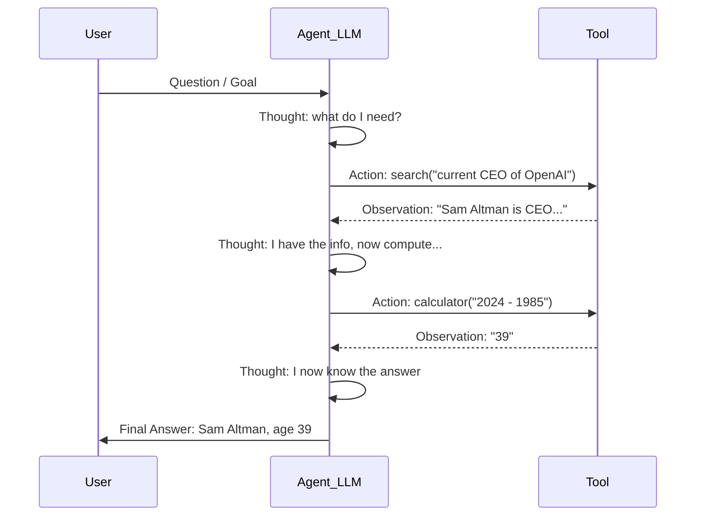

# 🔍 ReAct Pattern

> [!abstract] TL;DR
> ReAct (Reasoning + Acting) interleaves chain-of-thought reasoning with tool actions. The model produces a **Thought** (why it's doing something), an **Action** (what tool to call), and then reads the **Observation** (tool result) before thinking again. This grounded reasoning cycle dramatically improves reliability over pure chain-of-thought because every hypothesis can be tested against real data.

## Intuition — Analogy First

A **detective's investigation** is pure ReAct:

1. *Thought:* "The suspect was seen near the warehouse. I should check if they have an alibi."
2. *Action:* Call the witness. Ask where the suspect was at 9pm.
3. *Observation:* Witness says suspect was at a restaurant.
4. *Thought:* "That doesn't match the timeline. I should verify the restaurant's records."
5. *Action:* Pull the restaurant's credit card receipts.
6. *Observation:* No record of the suspect's card that evening.
7. *Thought:* "The alibi is false. Now I need to check security footage..."

Notice: the detective doesn't just reason in their head (chain-of-thought). They take real actions and update their theory based on real evidence. That's grounded reasoning. That's ReAct.

Pure Chain-of-Thought is like a detective who only thinks — they never actually check their assumptions against reality, so they can confidently reason to a wrong answer.

## How It Works — Mechanics

### The Trace Format

Every ReAct step follows this structure:

```
Thought: [LLM's internal reasoning about what to do next]
Action: [tool_name]
Action Input: [input to the tool]
Observation: [tool result injected by the framework]
... (repeat until done)
Thought: I now know the final answer.
Final Answer: [response to user]
```

The framework:
1. Sends the prompt + history to the LLM
2. Parses the `Action` and `Action Input` lines
3. Calls the actual tool
4. Appends the `Observation` to the context
5. Loops back to step 1



### vs Chain-of-Thought

| Aspect | Chain-of-Thought | ReAct |
|--------|------------------|-------|
| Grounding | Only in parametric knowledge | In real tool results |
| Hallucination risk | High for factual questions | Lower — facts come from tools |
| Requires tools | No | Yes |
| Token cost | Lower | Higher (tool calls add tokens) |
| Best for | Reasoning/math | Factual/multi-step tasks |

### Implementation Approaches

**Prompting approach** — zero-shot ReAct via a carefully crafted system prompt that includes the Thought/Action/Observation format and list of available tools.

**Framework approach** — LangChain's `AgentExecutor`, LlamaIndex's `ReActAgent` handle parsing, tool dispatch, and loop automatically.

**Native function calling** — modern APIs (OpenAI, Anthropic) support tool use natively; the Thought step is implicit in the LLM's reasoning before it calls a tool.

## The Math

The ReAct agent generates a trajectory $\tau = (t_1, a_1, o_1, t_2, a_2, o_2, \ldots)$ where:
- $t_i$ = thought (text generated by LLM)
- $a_i$ = action (parsed tool call)
- $o_i$ = observation (tool return value, appended as text)

The LLM models:
$$P(t_i, a_i \mid \text{prompt}, t_1, a_1, o_1, \ldots, t_{i-1}, a_{i-1}, o_{i-1})$$

Key property: observations $o_i$ are **grounded** — they come from external sources, not the model's weights. This makes the reasoning chain verifiable and correctable.

**Stopping condition** — the agent stops when it generates a "Final Answer" token or exceeds `max_iterations`. In practice:

$$\text{stop when} \quad a_i = \text{"Final Answer"} \quad \text{or} \quad i > K$$

## Code Demo

```python
# ── 1. Manual ReAct prompt (zero-shot, no framework) ──────────────────────
REACT_SYSTEM_PROMPT = """You are an assistant that answers questions using tools.

Available tools:
- search(query: str) -> str: Search the web for current information
- calculator(expression: str) -> str: Evaluate a math expression

Use this format EXACTLY:
Thought: [your reasoning about what to do]
Action: [tool name]
Action Input: [input to the tool]
Observation: [tool result — this will be filled in for you]
... (repeat Thought/Action/Observation as needed)
Thought: I now have the final answer.
Final Answer: [your answer to the original question]

Begin!
"""

# ── 2. LangChain ReAct agent (modern LCEL approach) ───────────────────────
from langchain import hub
from langchain.agents import AgentExecutor, create_react_agent
from langchain_openai import ChatOpenAI
from langchain.tools import tool
from langchain_community.tools import DuckDuckGoSearchRun

@tool
def calculator(expression: str) -> str:
    """Evaluate a mathematical expression. Input: a Python math expression string."""
    try:
        return str(eval(expression, {"__builtins__": {}}, {}))
    except Exception as e:
        return f"Error: {e}"

search_tool = DuckDuckGoSearchRun()
tools = [search_tool, calculator]

llm = ChatOpenAI(model="gpt-4o-mini", temperature=0)

# Pull the standard ReAct prompt from LangChain Hub
react_prompt = hub.pull("hwchase17/react")

# Create agent runnable
agent = create_react_agent(llm=llm, tools=tools, prompt=react_prompt)

# Wrap in executor (handles loop, parsing, tool dispatch)
agent_executor = AgentExecutor(
    agent=agent,
    tools=tools,
    verbose=True,           # shows Thought/Action/Observation trace
    max_iterations=8,
    handle_parsing_errors=True,  # gracefully handle malformed outputs
    return_intermediate_steps=True,  # get full trace in result
)

# ── 3. Run it ─────────────────────────────────────────────────────────────
result = agent_executor.invoke({
    "input": "Who is the current CTO of Anthropic, and what year were they born? "
             "How old will they be in 2030?"
})

print("Final Answer:", result["output"])

# Inspect the trace
for step in result["intermediate_steps"]:
    action, observation = step
    print(f"\nAction: {action.tool}({action.tool_input})")
    print(f"Observation: {observation[:200]}")
```

## Real-World Example

**LangChain and LlamaIndex** both use ReAct as the default agent strategy under the hood. When you use `create_react_agent` or `ReActAgent`, every LLM call follows the Thought→Action→Observation pattern.

In practice:
- A customer support bot using ReAct will: *Thought: I need to look up the order* → *Action: lookup_order(id=12345)* → *Observation: order shipped 2 days ago* → *Final Answer: Your order shipped Monday and arrives Thursday.*
- Without grounding, it might hallucinate a tracking number.

The pattern was validated at Google/DeepMind scale: ReAct outperformed chain-of-thought alone on HotpotQA (multi-hop reasoning) and Fever (fact verification) benchmarks by grounding reasoning in Wikipedia searches.

## Trade-offs

| Dimension | Pro | Con |
|-----------|-----|-----|
| **Accuracy** | Grounded in real data | Only as good as the tools |
| **Transparency** | Thoughts are visible/auditable | Thoughts can be misleading |
| **Flexibility** | Works with any tools | Requires parseable output format |
| **Cost** | Proportional to task complexity | Every step costs tokens |
| **Robustness** | Can recover from wrong assumptions | Parsing failures break the loop |

## When to Use vs Avoid

**Use ReAct when:**
- Task requires current/external information (search, databases)
- Multi-hop reasoning where intermediate results affect next steps
- You want an auditable trace of reasoning
- Using LangChain/LlamaIndex (it's the default)

**Avoid ReAct when:**
- Pure reasoning task with no external lookups needed (use chain-of-thought)
- Very low latency required (each tool call adds round-trip time)
- Fixed, known multi-step procedure (use explicit chains or Plan-and-Execute)

## Common Pitfalls

1. **Malformed output** — LLM doesn't follow Thought/Action format exactly. Fix: `handle_parsing_errors=True`, retry with error message.
2. **Observation too long** — tool returns 10,000 characters, overflows context. Fix: truncate/summarize tool outputs.
3. **Reasoning in circles** — agent repeats the same action after getting the same observation. Fix: add observation to the "don't repeat" instructions; check `max_iterations`.
4. **Wrong tool selection** — LLM picks a plausible-sounding tool that doesn't actually help. Fix: write clear, distinct tool descriptions.
5. **Thought-action mismatch** — Thought says "I'll search for X" but Action input is "Y". Fix: lower temperature, explicit instruction to match thought to action.

## Related Concepts

- [[_MOC_Generative_AI|↑ Section MOC]]

- [[AI_Agents_Overview]] — broader agent architecture
- [[Chain_of_Thought]] — pure reasoning without tool grounding
- [[Tool_Use_and_Function_Calling]] — the mechanics of calling tools
- [[Plan_and_Execute]] — alternative where planning is separated from execution
- [[Multi_Agent_Systems]] — multiple ReAct agents working together

## Review Questions

1. What is the key difference between ReAct and chain-of-thought prompting, and why does grounding improve reliability on factual tasks?
2. Trace through a ReAct agent solving: "What is the market cap of Apple as of today, and how does it compare to Amazon's?" — write out the full Thought/Action/Observation/Thought sequence.
3. A ReAct agent enters an infinite loop, calling the same search tool 20 times with identical queries. Identify two root causes and the corresponding fixes.

## Sources

- Yao, S. et al. (2022). *ReAct: Synergizing Reasoning and Acting in Language Models*. ICLR 2023. https://arxiv.org/abs/2210.03629
- Wei, J. et al. (2022). *Chain-of-Thought Prompting Elicits Reasoning in Large Language Models*. NeurIPS 2022.
- LangChain ReAct Agent Docs. https://python.langchain.com/docs/modules/agents/agent_types/react
- Shinn, N. et al. (2023). *Reflexion: Language Agents with Verbal Reinforcement Learning*. https://arxiv.org/abs/2303.11366

#react-pattern #agents #reasoning #chain-of-thought #langchain #tool-use #grounded-reasoning
