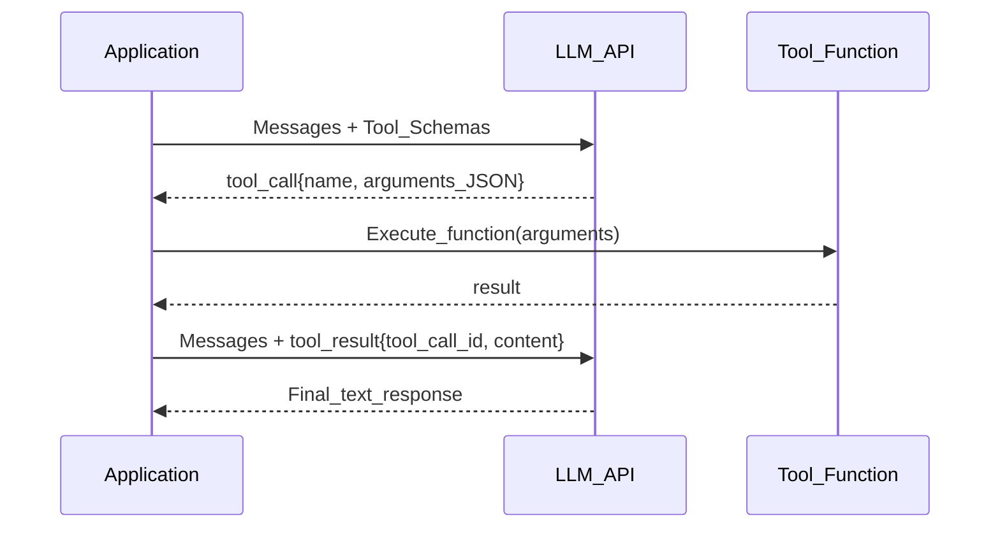

# 🔧 Tool Use and Function Calling

> [!abstract] TL;DR
> Function calling (aka tool use) lets an LLM request the execution of a specific function by outputting structured JSON matching a provided schema. The host application intercepts this, runs the real function, and returns the result — the LLM then uses it to form its final response. This is the backbone of every production AI agent.

## Intuition — Analogy First

Imagine giving an AI a **toolbox** with a user manual for each tool:

- Hammer: drives nails. Inputs: nail (object), force (integer).
- Screwdriver: turns screws. Inputs: screw (object), direction ("clockwise" | "counter-clockwise").
- Tape measure: measures distance. Inputs: from (string), to (string).

The AI reads the manuals, decides which tool to pick up and how to use it, and hands you a completed job form: "I need the tape measure. From: front_door. To: window." You take the form, run the measurement, write the result on it, and hand it back. The AI then continues.

That's function calling: the LLM writes the job form (structured JSON), you run the actual function, and the result flows back. The LLM never touches the real tool — it just specifies what it wants.

## How It Works — Mechanics

### The Function Calling Lifecycle



### Tool Schema Definition

Tools are described with JSON Schema. Both OpenAI and Anthropic follow a similar format:

```json
{
  "name": "get_weather",
  "description": "Get current weather for a location. Use this when the user asks about weather.",
  "parameters": {
    "type": "object",
    "properties": {
      "location": {
        "type": "string",
        "description": "City and country, e.g. 'London, UK'"
      },
      "unit": {
        "type": "string",
        "enum": ["celsius", "fahrenheit"],
        "description": "Temperature unit"
      }
    },
    "required": ["location"]
  }
}
```

### Parallel Tool Calls

Modern APIs support parallel tool calls — the LLM can request multiple tool calls in a single response. The host runs them concurrently, then returns all results together:

```
LLM requests: [get_weather(London), get_weather(Tokyo), get_weather(NYC)]
Host runs all 3 in parallel.
LLM receives all 3 results and forms one response.
```

### Tool vs Plugin vs Function

| Term | What it means |
|------|--------------|
| **Function calling** | LLM outputs structured JSON to trigger a function (OpenAI term) |
| **Tool use** | Same concept, Anthropic's terminology |
| **Plugin** | ChatGPT's hosted tool marketplace (deprecated in favor of GPTs/Custom Actions) |
| **Action** | GPT Actions / Copilot Extensions — function calling with OAuth flow |

## The Math

A tool-augmented LLM generates a response:

$$r \sim P(r \mid x, \mathcal{T})$$

Where $\mathcal{T}$ is the set of tool schemas. The response $r$ is either:
- A final text response: $r = t \in \text{Text}$
- A tool call: $r = (f_i, \theta_i)$ where $f_i \in \mathcal{T}$ and $\theta_i$ are arguments

The full trajectory:

$$r_0 = (f_{i_1}, \theta_{i_1}), \quad o_1 = f_{i_1}(\theta_{i_1}), \quad r_1 = (f_{i_2}, \theta_{i_2}), \ldots, \quad r_n \in \text{Text}$$

**Safety constraint**: the application controls execution. The LLM can only *request* a tool call — it cannot execute arbitrary code directly. This sandboxing is fundamental to tool use safety.

## Code Demo

```python
# ── OpenAI Function Calling ───────────────────────────────────────────────
import json
from openai import OpenAI

client = OpenAI()

# ── Define tools with JSON Schema ─────────────────────────────────────────
tools = [
    {
        "type": "function",
        "function": {
            "name": "get_stock_price",
            "description": "Get the current stock price for a ticker symbol",
            "parameters": {
                "type": "object",
                "properties": {
                    "ticker": {"type": "string", "description": "Stock ticker e.g. AAPL"},
                    "currency": {"type": "string", "enum": ["USD", "EUR", "GBP"], "default": "USD"},
                },
                "required": ["ticker"],
            },
        },
    },
    {
        "type": "function",
        "function": {
            "name": "calculate_portfolio_value",
            "description": "Calculate total value of a stock portfolio",
            "parameters": {
                "type": "object",
                "properties": {
                    "holdings": {
                        "type": "array",
                        "items": {
                            "type": "object",
                            "properties": {
                                "ticker": {"type": "string"},
                                "shares": {"type": "number"},
                            },
                        },
                        "description": "List of holdings with ticker and share count",
                    }
                },
                "required": ["holdings"],
            },
        },
    },
]

# ── Simulated tool implementations ────────────────────────────────────────
def get_stock_price(ticker: str, currency: str = "USD") -> dict:
    # In production: call a real stock API
    mock_prices = {"AAPL": 189.50, "GOOGL": 175.25, "MSFT": 415.00}
    price = mock_prices.get(ticker.upper(), 0.0)
    return {"ticker": ticker, "price": price, "currency": currency}

def calculate_portfolio_value(holdings: list) -> dict:
    total = sum(get_stock_price(h["ticker"])["price"] * h["shares"] for h in holdings)
    return {"total_value": total, "currency": "USD"}

TOOL_REGISTRY = {
    "get_stock_price": get_stock_price,
    "calculate_portfolio_value": calculate_portfolio_value,
}

# ── Agent loop ────────────────────────────────────────────────────────────
def run_with_tools(user_message: str):
    messages = [{"role": "user", "content": user_message}]

    while True:
        response = client.chat.completions.create(
            model="gpt-4o-mini",
            messages=messages,
            tools=tools,
            tool_choice="auto",  # let LLM decide; or "required" to force tool use
        )
        msg = response.choices[0].message

        # No tool calls → final response
        if not msg.tool_calls:
            return msg.content

        # Append assistant message (with tool calls)
        messages.append(msg)

        # Execute all tool calls (parallel if multiple)
        for tool_call in msg.tool_calls:
            fn_name = tool_call.function.name
            fn_args = json.loads(tool_call.function.arguments)
            result = TOOL_REGISTRY[fn_name](**fn_args)
            messages.append({
                "role": "tool",
                "tool_call_id": tool_call.id,
                "content": json.dumps(result),
            })

    # Loop continues until no tool calls

result = run_with_tools(
    "What's the total value of my portfolio: 10 shares of AAPL and 5 shares of MSFT?"
)
print(result)


# ── Anthropic Tool Use (same concept, different API) ──────────────────────
import anthropic

anthropic_client = anthropic.Anthropic()

anthropic_tools = [
    {
        "name": "get_stock_price",
        "description": "Get current stock price for a ticker",
        "input_schema": {
            "type": "object",
            "properties": {
                "ticker": {"type": "string", "description": "Stock ticker symbol"},
            },
            "required": ["ticker"],
        },
    }
]

# Pydantic-based tool definition (cleaner, type-safe)
from pydantic import BaseModel, Field

class StockPriceInput(BaseModel):
    ticker: str = Field(description="Stock ticker symbol, e.g. AAPL")
    currency: str = Field(default="USD", description="Currency for the price")
```

## Real-World Example

**ChatGPT's Code Interpreter** is a tool called `python` — the LLM generates Python code as the "arguments", the host runs it in a sandbox, and returns stdout/stderr/images. Every advanced data analysis in ChatGPT uses this pattern.

**Claude's computer use** (Anthropic, 2024) exposes tools like `computer` (mouse clicks, keyboard input, screenshots), `bash` (shell commands), and `text_editor` (file operations). Claude uses tool calling to control a real desktop computer.

**GitHub Copilot Extensions** allow third-party tools (e.g., a Datadog extension) to be called by Copilot using the same function calling mechanism — Copilot decides when to query Datadog for deployment metrics.

## Trade-offs

| Dimension | Pro | Con |
|-----------|-----|-----|
| **Safety** | LLM cannot execute directly | Requires host to implement tools |
| **Reliability** | Structured JSON — parseable | LLM may generate invalid arguments |
| **Flexibility** | Any function can be a tool | Tool descriptions need careful writing |
| **Parallelism** | Multiple tools in one call | Parallel execution adds complexity |
| **Debugging** | Full call/result trace | Intermediate tool calls are verbose |

## When to Use vs Avoid

**Use function calling when:**
- LLM needs real-time or dynamic information (prices, weather, databases)
- You need structured output that triggers side effects (send email, create ticket)
- Building agents that interact with external systems
- You want reproducible, auditable LLM-to-system interactions

**Avoid when:**
- Information can be included in the system prompt (no runtime lookup needed)
- Very high latency budget (each tool call adds round-trips)
- Simple text transformation — no external data needed

## Common Pitfalls

1. **Vague tool descriptions** — LLM doesn't know when to use a tool. Fix: write descriptions with "Use this when..." guidance.
2. **Missing required parameters** — LLM omits a required argument. Fix: mark non-optional fields as `required` in schema.
3. **Hallucinated arguments** — LLM passes a plausible-but-wrong value (e.g., invented ticker symbol). Fix: validate inputs in the tool implementation; return clear errors.
4. **No error handling in tools** — tool crashes silently. Fix: always return structured error messages the LLM can understand.
5. **Too many tools** — giving the LLM 50 tools causes confusion and wrong selection. Fix: keep to ≤10 tools; use dynamic tool selection or tool retrieval for large toolsets.
6. **Ignoring parallel calls** — running sequential tool calls when parallel would be faster. Fix: check `len(msg.tool_calls) > 1` and dispatch concurrently.

## Related Concepts

- [[_MOC_Generative_AI|↑ Section MOC]]

- [[AI_Agents_Overview]] — agents are built on top of tool use
- [[ReAct_Pattern]] — reasoning strategy that decides when to call tools
- [[Structured_Output]] — function calling is a form of structured output
- [[Multi_Agent_Systems]] — agents can be tools for other agents

## Review Questions

1. Why can't the LLM directly execute a function — it can only request execution? What safety and architectural properties does this enforced indirection provide?
2. Your LLM keeps calling `search_database(query="SELECT * FROM users")` when it should call `get_user_by_id(user_id=123)`. What changes to the tool schema and description would fix this?
3. Design the tool schemas for a customer support agent that needs to: look up orders, issue refunds, and escalate to a human. What validation should each tool perform before executing?

## Sources

- OpenAI Function Calling Guide. https://platform.openai.com/docs/guides/function-calling
- Anthropic Tool Use Documentation. https://docs.anthropic.com/en/docs/build-with-claude/tool-use
- Qin, Y. et al. (2023). *Tool Learning with Foundation Models*. https://arxiv.org/abs/2304.08354
- Schick, T. et al. (2023). *Toolformer: Language Models Can Teach Themselves to Use Tools*. NeurIPS 2023. https://arxiv.org/abs/2302.04761

#function-calling #tool-use #agents #openai #anthropic #structured-output #llm-tools
