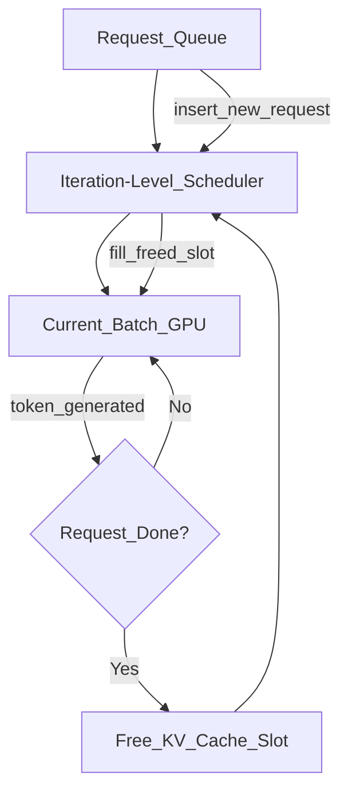

# 🍽️ Continuous Batching

> [!abstract] TL;DR
> Static batching wastes GPU time: short requests finish early but block GPU until the longest request in the batch completes. Continuous batching (iteration-level scheduling) inserts new requests mid-generation the instant a slot frees up. Combined with PagedAttention (non-contiguous KV cache memory), vLLM achieves 10-50x throughput improvement over naive serving.

## Intuition — Analogy First

**A restaurant seating policy:**

**Static batching** = a restaurant that only seats new diners when an **entire table finishes** — even if 3 of 4 people have left. The one lingering coffee drinker blocks the table for the next party. GPU time is wasted.

**Continuous batching** = a restaurant with a **flexible seating policy**: the instant a chair opens (a request finishes generating), a new customer is seated. The table (GPU batch) is always full; no idle chairs.

Now add **PagedAttention** (the kitchen's prep system): instead of reserving an entire counter for each dish (pre-allocating max sequence length for KV cache), the kitchen uses a shared prep space divided into small identical slots, allocated on demand as each dish progresses. No prep space wasted on dishes that finish early.

Together: maximum throughput, minimum waste.

## How It Works — Mechanics

### Static Batching (the problem)

In static batching, a batch of requests starts together and ends together:

- Request A: generates 50 tokens (done in 0.5s)
- Request B: generates 200 tokens (done in 2s)
- Request C: generates 500 tokens (done in 5s)

A, B, C are batched together. A finishes at 0.5s but the GPU continues computing for A's position (producing padding) until C finishes at 5s. **A wastes 4.5s of GPU time**.

**GPU utilization**: low. Most of the batch is padding by the end.

### Continuous Batching (the solution)



At every **iteration** (token generation step), the scheduler:
1. Checks which requests just finished
2. Removes finished requests from the batch
3. Inserts new waiting requests into freed slots
4. Runs the next GPU forward pass with the updated batch

Result: batch is always full; GPU utilization approaches 100%.

### PagedAttention (KV Cache Memory Management)

The problem with continuous batching: KV caches have variable length per request. If you pre-allocate max_seq_len for each slot, you waste memory for short requests.

**PagedAttention** treats KV cache like OS virtual memory:

| OS Concept | PagedAttention Equivalent |
|-----------|--------------------------|
| Physical page (4KB) | KV block (e.g., 16 tokens × all layers) |
| Page table | Maps logical sequence positions to physical blocks |
| Free page list | Available KV blocks |
| Page allocation | Allocate new block when sequence grows |
| Page deallocation | Free all blocks when request finishes |

**Benefits**:
- No pre-allocation — blocks allocated on demand
- No memory fragmentation — fixed-size blocks, no wasted space
- **Copy-on-write prefix sharing**: multiple requests with the same system prompt share physical KV blocks for that prefix — one copy for N requests

### vLLM Architecture

vLLM implements both continuous batching and PagedAttention:

1. **Scheduler**: decides which requests to run each iteration
2. **Block manager**: allocates/frees KV cache blocks (PagedAttention)
3. **Worker**: executes GPU forward passes with modified attention kernel
4. **Async engine**: handles request queue, streaming responses

## The Math

**Static batching throughput**:
$$\text{throughput}_{\text{static}} = \frac{B}{\max_i T_i}$$

Where $B$ = batch size, $T_i$ = generation length of request $i$. The batch is limited by the slowest request.

**Continuous batching throughput**: (idealized)
$$\text{throughput}_{\text{continuous}} \approx \frac{B_{\text{eff}}}{\bar{T}}$$

Where $B_{\text{eff}}$ = effective batch size (always full), $\bar{T}$ = average generation length.

**Memory savings from PagedAttention**:

With static allocation (pre-allocate max):
$$\text{memory}_{\text{static}} = N_{\text{requests}} \times S_{\text{max}} \times \text{KV cost per token}$$

With PagedAttention (allocate actual):
$$\text{memory}_{\text{paged}} = \sum_i S_i \times \text{KV cost per token} + \text{fragmentation overhead}$$

Fragmentation overhead < 4% (last block of each request may be partially filled).

**Prefix sharing savings**: if $M$ requests share a system prompt of length $L$:
$$\text{saved memory} = (M-1) \times L \times \text{KV cost per token}$$

## Code Demo

```python
# ── vLLM: Continuous batching + PagedAttention ────────────────────────────
# pip install vllm

from vllm import LLM, SamplingParams
from vllm.engine.arg_utils import AsyncEngineArgs
from vllm.engine.async_llm_engine import AsyncLLMEngine
import asyncio
import time

# ── 1. Synchronous batch inference (offline) ──────────────────────────────
llm = LLM(
    model="meta-llama/Llama-2-7b-chat-hf",
    tensor_parallel_size=1,          # number of GPUs
    gpu_memory_utilization=0.9,      # fraction of GPU memory for KV cache
    max_num_seqs=256,                # max concurrent sequences in flight
    max_model_len=4096,              # max sequence length
    enable_prefix_caching=True,      # reuse KV cache for shared prefixes
)

sampling_params = SamplingParams(
    temperature=0.8,
    top_p=0.95,
    max_tokens=200,
    stop=["</s>", "\n\n"],
)

# vLLM automatically batches and uses continuous batching
prompts = [
    "Explain KV caching in one paragraph.",
    "What is speculative decoding?",
    "How does PagedAttention work?",
    "What is continuous batching?",
    "Explain transformer attention in simple terms.",
]

start = time.time()
outputs = llm.generate(prompts, sampling_params)
elapsed = time.time() - start

for output in outputs:
    print(f"Prompt: {output.prompt[:50]}...")
    print(f"Output: {output.outputs[0].text[:100]}...")
    print(f"Tokens: {len(output.outputs[0].token_ids)}")
    print()

print(f"Total time: {elapsed:.2f}s | "
      f"Throughput: {sum(len(o.outputs[0].token_ids) for o in outputs)/elapsed:.1f} tokens/s")


# ── 2. Async engine (production serving) ─────────────────────────────────
async def serve_requests():
    engine_args = AsyncEngineArgs(
        model="meta-llama/Llama-2-7b-chat-hf",
        gpu_memory_utilization=0.9,
        max_num_seqs=256,
        enable_prefix_caching=True,
    )
    engine = AsyncLLMEngine.from_engine_args(engine_args)

    async def generate(request_id: str, prompt: str):
        sampling_params = SamplingParams(temperature=0.7, max_tokens=100)
        results = engine.generate(prompt, sampling_params, request_id=request_id)
        async for result in results:
            pass  # streaming token by token
        return result.outputs[0].text

    # Simulate concurrent requests arriving at different times
    tasks = []
    for i, prompt in enumerate(["Tell me about AI", "What is Python?", "Explain SQL"]):
        tasks.append(asyncio.create_task(generate(f"req-{i}", prompt)))
        await asyncio.sleep(0.1)  # stagger arrivals

    results = await asyncio.gather(*tasks)
    for r in results:
        print(r[:100])

# asyncio.run(serve_requests())


# ── 3. Throughput comparison: vLLM vs HuggingFace naive ───────────────────
"""
Benchmark results (Llama-2-7B, 1x A100-80GB):

HuggingFace (static batching, batch=8):
- Throughput: ~500 tokens/s
- GPU utilization: ~40%

vLLM (continuous batching, max_seqs=256):
- Throughput: ~6000 tokens/s
- GPU utilization: ~90%

Speedup: ~12x

(Source: vLLM paper, 2023)
"""

# ── 4. Prefix caching demo (reduces TTFT for repeated system prompts) ──────
system_prompt = "You are a helpful AI assistant specialized in financial analysis. " \
                "Always provide accurate information and cite sources."

# With prefix caching enabled, first request computes KV for system_prompt.
# Subsequent requests with same system_prompt REUSE those KV blocks.
requests_with_same_system_prompt = [
    f"{system_prompt}\n\nUser: {user_query}"
    for user_query in ["What is inflation?", "Explain GDP", "What are bonds?"]
]

outputs = llm.generate(requests_with_same_system_prompt, sampling_params)
# Second and third requests have reduced TTFT (system prompt KV cached)
```

## Real-World Example

**vLLM** (UC Berkeley, 2023) is deployed at OpenAI, Anyscale, Databricks, and hundreds of companies for LLM serving. The original paper demonstrated:
- 2.2-4.3x throughput improvement over HuggingFace with static batching
- 11-20x improvement over simpler baselines
- Memory efficiency within 4% of optimal

**Anyscale RayServe + vLLM**: Anyscale integrated vLLM into their Ray Serve framework, allowing companies to serve LLMs with continuous batching across multiple GPUs automatically.

**OpenAI's API** uses continuous batching at extreme scale — thousands of concurrent requests are batched together on their GPU clusters, with iteration-level scheduling to maximize utilization.

## Trade-offs

| Dimension | Static Batching | Continuous Batching |
|-----------|----------------|---------------------|
| Throughput | Low (wasted GPU time) | 10-50x higher |
| Implementation | Simple | Complex (scheduler + memory manager) |
| Latency per request | Predictable | Variable (depends on queue depth) |
| Memory | Wasteful (max allocation) | Efficient (PagedAttention) |
| First token latency | Low (starts immediately) | Slightly higher (scheduling overhead) |

## When to Use vs Avoid

**Always use continuous batching in production LLM serving**. There is no good reason to use static batching for serving variable-length requests.

**vLLM is the default recommendation** for production serving. Alternatives:
- TensorRT-LLM (NVIDIA) — faster on NVIDIA hardware
- DeepSpeed-FastGen — continuous batching with ZeRO
- TGI (HuggingFace) — production serving with continuous batching

**Consider static batching only when:**
- Batch of requests all have identical length (offline processing)
- Need maximum simplicity for research/debugging

## Common Pitfalls

1. **OOM from too many concurrent sequences** — each sequence has a KV cache. Fix: tune `max_num_seqs` and `gpu_memory_utilization` for your hardware.
2. **Not enabling prefix caching** — shared system prompts are recomputed for each request. Fix: `enable_prefix_caching=True` in vLLM (default in newer versions).
3. **Ignoring `max_model_len`** — default may be too large, over-allocating KV memory. Fix: set `max_model_len` to your actual max sequence length.
4. **Sequential request submission** — submitting requests one at a time defeats batching. Fix: use async engine; submit all requests concurrently.
5. **Mixing long and short requests** — long requests hold KV cache blocks; short requests finish and free blocks quickly. Fix: this is actually fine — continuous batching handles it automatically.

## Related Concepts

- [[_MOC_Generative_AI|↑ Section MOC]]

- [[KV_Cache]] — PagedAttention is KV cache + OS-style paging
- [[Speculative_Decoding]] — works on top of continuous batching
- [[Flash_Attention]] — GPU kernel optimization complementary to batching

## Review Questions

1. Explain why static batching has poor GPU utilization when request lengths vary. Draw a timeline showing how continuous batching fills the gap.
2. How does PagedAttention reduce memory waste compared to pre-allocated KV cache? What is copy-on-write prefix sharing and when does it apply?
3. You're serving a chatbot API where 80% of requests use the same 500-token system prompt. How much memory does prefix caching save for a batch of 100 concurrent users, assuming 1536-dim, 40 layers, 40 heads, FP16?

## Sources

- Kwon, W. et al. (2023). *Efficient Memory Management for Large Language Model Serving with PagedAttention*. SOSP 2023. https://arxiv.org/abs/2309.06180
- Yu, G. et al. (2022). *Orca: A Distributed Serving System for Transformer-Based Generative Models*. OSDI 2022.
- vLLM Blog. https://blog.vllm.ai/2023/06/20/vllm.html
- Agrawal, A. et al. (2024). *Sarathi-Serve: Efficient LLM Inference by Piggybacking Decodes with Chunked Prefills*. https://arxiv.org/abs/2403.02310

#continuous-batching #vllm #paged-attention #llm-serving #inference-optimization #throughput
