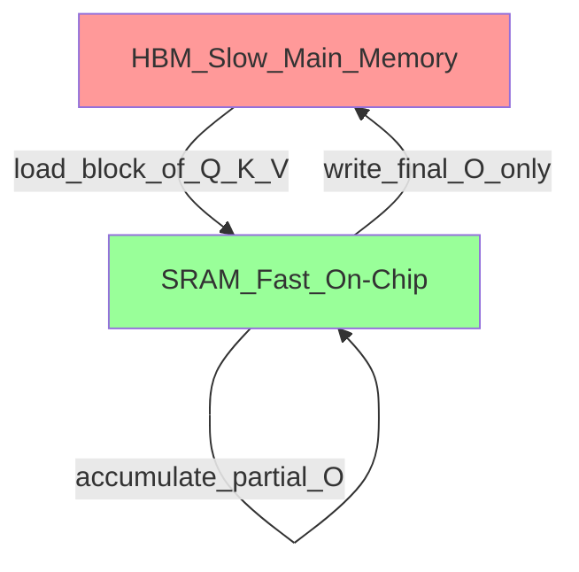

# ⚡ FlashAttention

> [!abstract] TL;DR
> Standard attention materializes the full N×N attention matrix in GPU HBM (high-bandwidth memory), making it O(N²) memory and memory-bandwidth bound. FlashAttention fuses the attention computation into a single kernel using tiling — it never writes the full attention matrix to HBM, reducing memory from O(N²) to O(N) and achieving 2-4x speedup. It is now mandatory for training and inference of LLMs with context > 4K tokens.

## Intuition — Analogy First

**Printing a spreadsheet vs computing in your head:**

Suppose you need to compute the weighted average of 10,000 rows of numbers (the softmax-weighted sum that is attention). 

**Standard attention** = print out the entire 10,000×10,000 spreadsheet (the attention matrix), then compute your averages by reading the printout. The printing and reading is the bottleneck — you have to write 100M cells to paper (HBM), then read them back.

**FlashAttention** = compute the weighted average in your head, row by row, without ever printing anything. You process a small tile at a time, update a running total, and move on. No spreadsheet is ever materialized.

The insight: GPUs have fast SRAM (on-chip, like working memory) and slow HBM (main GPU memory, like disk). Standard attention causes tons of slow HBM traffic. FlashAttention keeps everything in fast SRAM by tiling, and only writes the final output to HBM.

## How It Works — Mechanics

### Standard Attention — The Memory Problem

Standard attention:
1. Compute $S = QK^T / \sqrt{d_k}$ → shape $(N, N)$ — write to HBM
2. Compute $P = \text{softmax}(S)$ → shape $(N, N)$ — read from HBM, write back
3. Compute $O = PV$ → shape $(N, d_v)$ — read $P$ from HBM again

HBM reads/writes = $O(N^2)$. For $N=8192$, the attention matrix is $8192 \times 8192 \times 4$ bytes ≈ 256 MB. This matrix is written and read multiple times.

### FlashAttention — Tiling

FlashAttention divides $Q$, $K$, $V$ into blocks that fit in SRAM (on-chip):



**Key trick — online softmax**: compute softmax incrementally as new K blocks are processed, without ever seeing the full row of $S$ at once. Use the "log-sum-exp trick" to maintain numerical stability:

$$m_i = \max_j S_{ij}, \quad l_i = \sum_j e^{S_{ij} - m_i}$$

Update $m$ and $l$ as new blocks arrive:
$$m_{\text{new}} = \max(m_{\text{old}}, m_{\text{block}}), \quad l_{\text{new}} = e^{m_{\text{old}} - m_{\text{new}}} l_{\text{old}} + e^{m_{\text{block}} - m_{\text{new}}} l_{\text{block}}$$

This lets FlashAttention process attention in tiles without materializing the full attention matrix.

### Memory Comparison

| Approach | Memory Complexity | HBM Access |
|----------|-----------------|------------|
| Standard attention | O(N²) | Many reads/writes of N×N matrix |
| FlashAttention | O(N) | Only read Q,K,V once; write O once |
| FlashAttention-2 | O(N) | Fewer non-matmul ops, better GPU utilization |

**In numbers**: for $N=4096$, $d=128$:
- Standard attention matrix: $4096^2 \times 4$ bytes ≈ 64 MB per head
- FlashAttention tile in SRAM: $B_r \times B_c \times 4$ ≈ few KB

### FlashAttention-2 Improvements

FlashAttention-2 (2023) further improved upon FA-1:
- Reduced non-matmul FLOPs (non-matmul operations are bottlenecks on tensor cores)
- Better parallelism across sequence length dimension
- Causal masking optimization
- Result: 2x faster than FA-1; up to 73% of theoretical A100 FLOPs

## The Math

**Standard attention** for a single head:
$$O = \text{softmax}\left(\frac{QK^T}{\sqrt{d_k}}\right) V$$

Memory: $O(N^2)$ for the attention matrix.

**FlashAttention tiling**: divide $Q$ into blocks $Q_1, \ldots, Q_{T_r}$ of size $B_r$, and $K, V$ into blocks of size $B_c$.

For each $Q_i$ block, iterate over all $K_j, V_j$ blocks:

$$S_{ij} = Q_i K_j^T / \sqrt{d_k} \quad \in \mathbb{R}^{B_r \times B_c}$$

Maintain running statistics:
$$m_i^{(j)} = \max(m_i^{(j-1)}, \text{rowmax}(S_{ij}))$$
$$l_i^{(j)} = e^{m_i^{(j-1)} - m_i^{(j)}} l_i^{(j-1)} + \text{rowsum}(e^{S_{ij} - m_i^{(j)}})$$
$$O_i^{(j)} = \text{diag}(e^{m_i^{(j-1)} - m_i^{(j)}}) O_i^{(j-1)} + e^{S_{ij} - m_i^{(j)}} V_j$$

Final output: $O_i = \text{diag}(l_i^{(T_c)})^{-1} O_i^{(T_c)}$

**Block size**: $B_c = \lceil M / (4d) \rceil$, $B_r = \min(\lceil M / (4d) \rceil, d)$, where $M$ = SRAM size.

**IO complexity**: $O(N^2 d / M)$ HBM reads — $M / d$ times fewer than standard attention.

## Code Demo

```python
# ── FlashAttention via HuggingFace (easiest path) ────────────────────────
# pip install flash-attn --no-build-isolation  (requires CUDA 11.6+)
from transformers import AutoModelForCausalLM, AutoTokenizer
import torch

# Enable FlashAttention-2 via attn_implementation
model = AutoModelForCausalLM.from_pretrained(
    "meta-llama/Llama-2-7b-hf",
    torch_dtype=torch.bfloat16,          # FA requires fp16 or bf16
    attn_implementation="flash_attention_2",  # use FA2 kernels
    device_map="auto",
)

tokenizer = AutoTokenizer.from_pretrained("meta-llama/Llama-2-7b-hf")
inputs = tokenizer("Explain FlashAttention in simple terms:", return_tensors="pt").to("cuda")

output = model.generate(**inputs, max_new_tokens=100)
print(tokenizer.decode(output[0], skip_special_tokens=True))


# ── Direct flash_attn usage ───────────────────────────────────────────────
import torch
from flash_attn import flash_attn_qkvpacked_func, flash_attn_func
from flash_attn.bert_padding import unpad_input, pad_input

batch_size, seq_len, num_heads, head_dim = 2, 1024, 16, 64
dtype = torch.float16
device = "cuda"

# Standard attention (for comparison)
def standard_attention(q, k, v):
    """Standard O(N²) attention."""
    scale = head_dim ** -0.5
    attn = torch.softmax(q @ k.transpose(-2, -1) * scale, dim=-1)
    return attn @ v

# FlashAttention
def flash_attention_demo(q, k, v, causal=False):
    """FlashAttention: O(N) memory, same output."""
    return flash_attn_func(q, k, v, causal=causal, softmax_scale=head_dim ** -0.5)

# Create random Q, K, V
q = torch.randn(batch_size, seq_len, num_heads, head_dim, dtype=dtype, device=device)
k = torch.randn(batch_size, seq_len, num_heads, head_dim, dtype=dtype, device=device)
v = torch.randn(batch_size, seq_len, num_heads, head_dim, dtype=dtype, device=device)

# Flash attention (causal for autoregressive models)
out_flash = flash_attention_demo(q, k, v, causal=True)
print(f"FlashAttention output shape: {out_flash.shape}")


# ── Memory and speed comparison ───────────────────────────────────────────
import time

def benchmark_attention(seq_len: int, use_flash: bool):
    q = torch.randn(1, seq_len, 16, 64, dtype=torch.float16, device="cuda")
    k = torch.randn_like(q)
    v = torch.randn_like(q)

    # Warmup
    for _ in range(3):
        if use_flash:
            flash_attn_func(q, k, v, causal=True)
        else:
            q_t = q.transpose(1, 2)  # (batch, heads, seq, dim)
            k_t = k.transpose(1, 2)
            v_t = v.transpose(1, 2)
            attn = torch.softmax(q_t @ k_t.transpose(-2, -1) / 64**0.5, dim=-1)
            _ = attn @ v_t
    torch.cuda.synchronize()

    start = time.time()
    for _ in range(100):
        if use_flash:
            flash_attn_func(q, k, v, causal=True)
        else:
            q_t = q.transpose(1, 2)
            k_t = k.transpose(1, 2)
            v_t = v.transpose(1, 2)
            attn = torch.softmax(q_t @ k_t.transpose(-2, -1) / 64**0.5, dim=-1)
            _ = attn @ v_t
    torch.cuda.synchronize()
    elapsed = time.time() - start

    peak_mem = torch.cuda.max_memory_allocated() / 1024**2
    return elapsed / 100 * 1000, peak_mem

print("\nBenchmark (seq_len=4096, 100 iterations):")
t_std, m_std = benchmark_attention(4096, use_flash=False)
torch.cuda.reset_peak_memory_stats()
t_fa, m_fa = benchmark_attention(4096, use_flash=True)
print(f"  Standard: {t_std:.1f}ms, {m_std:.0f}MB peak")
print(f"  FlashAttn: {t_fa:.1f}ms, {m_fa:.0f}MB peak")
print(f"  Speedup: {t_std/t_fa:.1f}x | Memory reduction: {m_std/m_fa:.1f}x")
```

## Real-World Example

**All modern LLM training** — GPT-4, LLaMA 2/3, Mistral, Gemma, Phi — uses FlashAttention. It's no longer optional at scale. Enabling FA-2 cut Llama 2 training time by ~2x vs standard attention.

**Long context models** are only practical because of FlashAttention. Models like Claude (200K tokens), GPT-4 Turbo (128K), and Gemini 1.5 (1M tokens) would require O(N²) = 40 TB of attention matrix memory without FA. FA reduces this to O(N) ≈ 400 GB.

**Mistral 7B** uses Sliding Window Attention — a FlashAttention variant where each token only attends to the last W tokens. With W=4096, even arbitrarily long sequences have bounded attention memory.

## Trade-offs

| Dimension | Standard Attention | FlashAttention |
|-----------|-------------------|----------------|
| Memory | O(N²) | O(N) |
| Speed | Baseline | 2-4x faster |
| Implementation | Simple | CUDA kernel (complex) |
| Hardware req. | Any GPU | CUDA, requires FA installation |
| Compatibility | All dtypes | FP16/BF16 only |
| Debugging | Easy (can inspect matrix) | Harder (no intermediate matrix) |

## When to Use vs Avoid

**Always use FlashAttention for:**
- Training any transformer model
- Inference with context > 4K tokens
- Any production LLM serving

**Cannot use if:**
- CPU inference (no CUDA)
- FP32 training (FA requires FP16/BF16)
- Custom attention patterns not supported by FA (use xformers or manual implementation)

## Common Pitfalls

1. **FP32 input** — FlashAttention requires FP16 or BF16 tensors. Fix: cast to `torch.float16` or `torch.bfloat16` before FA calls.
2. **Installing without CUDA** — `pip install flash-attn` fails on CPU-only systems. Fix: install only on CUDA-capable machines; use xformers as CPU fallback.
3. **Wrong `attn_implementation`** — typo in `attn_implementation="flash_attention_2"` silently falls back to standard attention. Fix: verify with model config inspection.
4. **Not upgrading from FA1** — FlashAttention-2 is 2x faster than FA1. Fix: `pip install flash-attn --upgrade`.
5. **Causal mask mismatch** — using `causal=False` for a causal LLM. Fix: always set `causal=True` for decoder-only models.

## Related Concepts

- [[_MOC_Generative_AI|↑ Section MOC]]

- [[Attention_Mechanism]] — the operation FlashAttention optimizes
- [[KV_Cache]] — complementary optimization; both needed for efficient LLM serving
- [[Continuous_Batching]] — batching optimization that pairs with FA
- [[LLM_Architecture_Deep_Dive]] — transformer architecture context

## Review Questions

1. Standard attention writes the N×N attention matrix to HBM. For a sequence of N=8192 tokens with 40 heads and head_dim=128, calculate how many GB this matrix occupies in FP16. Why does FlashAttention avoid this?
2. Explain the "online softmax" trick that allows FlashAttention to compute softmax without seeing the full row at once. What two running statistics does it maintain?
3. FlashAttention achieves the same mathematical output as standard attention despite never materializing the full attention matrix. Walk through why this is possible using the tiling approach.

## Sources

- Dao, T. et al. (2022). *FlashAttention: Fast and Memory-Efficient Exact Attention with IO-Awareness*. NeurIPS 2022. https://arxiv.org/abs/2205.14135
- Dao, T. (2023). *FlashAttention-2: Faster Attention with Better Parallelism and Work Partitioning*. ICLR 2024. https://arxiv.org/abs/2307.08691
- HuggingFace: Flash Attention Integration. https://huggingface.co/docs/transformers/perf_infer_gpu_one#flashattention-2
- flash-attn GitHub. https://github.com/Dao-AILab/flash-attention

#flash-attention #attention #inference-optimization #gpu-optimization #transformers #memory-efficiency
