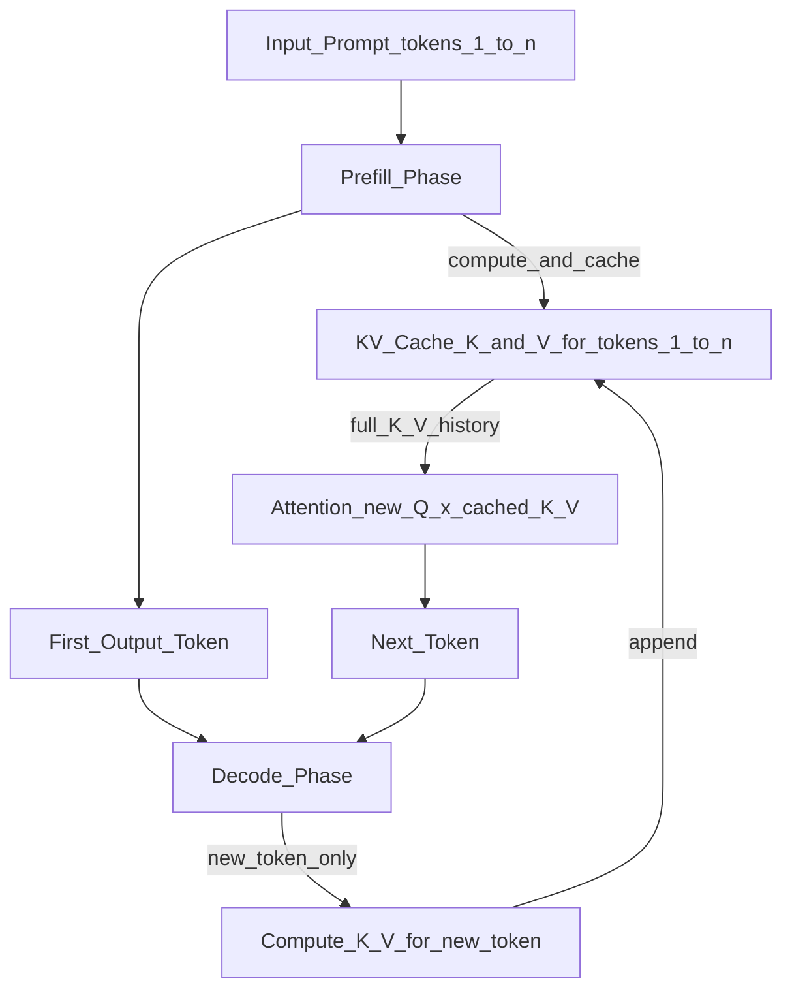

# 💾 KV Cache

> [!abstract] TL;DR
> LLM auto-regressive generation recomputes Keys and Values for all previous tokens at every step — O(n²) compute per generation. The KV cache stores these Keys and Values so they're computed once and reused. Without it, generating 1000 tokens requires 1000+999+998+… attention computations; with it, each new token needs only one new K/V computation. It's the single most important optimization for LLM inference throughput.

## Intuition — Analogy First

Imagine you're **writing a long essay word by word**, but before writing each new word, you must re-read the entire essay from scratch to maintain context.

Without KV cache: re-read from beginning every word. For a 1000-word essay, that's 1+2+3+...+1000 = ~500,000 reading operations.

With KV cache: you keep a **running transcript** on your desk. To write the next word, you just glance at the transcript — you don't re-read from the beginning. 1000 reading operations total — one per word.

The Keys and Values in attention are exactly this "transcript" — they encode what previous tokens mean in the context of each attention head. Caching them means you never recompute "what this token meant" after you've already computed it.

## How It Works — Mechanics

### Without KV Cache

In transformer auto-regressive generation, to predict token $t+1$:
1. Run full forward pass on tokens $1..t$
2. Compute Q, K, V for all tokens $1..t$
3. Compute attention for all token pairs
4. Output logits for position $t$, sample next token $t+1$

Repeat for token $t+2$: run full forward pass on tokens $1..t+1$. This is $O(t^2)$ total compute.

### With KV Cache

1. First forward pass: compute and **cache** K and V for tokens $1..t$
2. For token $t+1$: compute Q, K, V **only for the new token**
3. **Append** new K, V to cache
4. Compute attention: Q (new) × K (all cached) → attention scores
5. Attend to V (all cached) → output for new token



### KV Cache Memory

The memory cost of storing KV cache:

$$\text{KV memory} = 2 \times L \times H \times d_h \times S \times B$$

Where:
- $L$ = number of layers
- $H$ = number of attention heads
- $d_h$ = head dimension
- $S$ = sequence length (grows as generation proceeds)
- $B$ = batch size
- $2$ = Key + Value

**Example (LLaMA 2-70B, FP16)**:
- $L=80$, $H=64$, $d_h=128$, $S=4096$, $B=1$
- $= 2 \times 80 \times 64 \times 128 \times 4096 \times 2$ bytes
- $= 2 \times 80 \times 64 \times 128 \times 4096 \times 2 = 10.7$ GB per sequence

This shows why KV cache is the memory bottleneck for LLM serving.

### Reducing KV Cache Size

**Multi-Query Attention (MQA)**: all heads share a single K and V projection. Memory: $H \times d_h$ → $d_h$. Used in: Falcon, PaLM.

**Grouped Query Attention (GQA)**: $G$ groups each sharing K/V. $G$ heads share one K, V. Memory: $H \times d_h$ → $G \times d_h$. Used in: LLaMA 2 70B ($G=8$), Mistral, Gemma.

$$\text{KV memory reduction} = H / G$$

LLaMA 2-70B with GQA ($H=64$, $G=8$): 8x KV cache memory reduction.

**PagedAttention (vLLM)**: manages KV cache with OS-style paging — non-contiguous physical memory, pages shared across requests (prefix caching). Eliminates memory waste from fixed-size reservations.

## The Math

**Standard attention** at decode step $t$:
$$\text{Attention}(Q_t, K_{1:t}, V_{1:t}) = \text{softmax}\left(\frac{Q_t K_{1:t}^T}{\sqrt{d_k}}\right) V_{1:t}$$

Where $Q_t \in \mathbb{R}^{1 \times d_k}$ (single new token query), $K_{1:t} \in \mathbb{R}^{t \times d_k}$ (all cached keys), $V_{1:t} \in \mathbb{R}^{t \times d_v}$ (all cached values).

**Compute savings**: without cache, step $t$ computes $Q_{1:t}, K_{1:t}, V_{1:t}$: $O(t \cdot d)$ operations. With cache, step $t$ only computes $Q_t, K_t, V_t$: $O(d)$ operations. Over $T$ steps: $O(T^2 \cdot d)$ → $O(T \cdot d)$.

**Memory vs compute trade-off**: caching K/V trades memory for recomputation. This is why KV cache is memory-bound, not compute-bound.

## Code Demo

```python
# ── Illustrate KV cache memory growth ────────────────────────────────────
import torch
from transformers import AutoTokenizer, AutoModelForCausalLM

# ── 1. KV cache memory calculation ───────────────────────────────────────
def kv_cache_memory_gb(
    n_layers: int,
    n_heads: int,
    n_kv_heads: int,  # for GQA: n_kv_heads < n_heads; for MQA: n_kv_heads = 1
    head_dim: int,
    seq_len: int,
    batch_size: int,
    dtype_bytes: int = 2,  # FP16 = 2 bytes
) -> float:
    """Calculate KV cache memory in GB."""
    memory_bytes = (
        2              # Key + Value
        * n_layers
        * n_kv_heads   # GQA/MQA reduces this
        * head_dim
        * seq_len
        * batch_size
        * dtype_bytes
    )
    return memory_bytes / (1024 ** 3)

# LLaMA 2 7B (MHA, no GQA)
mha_7b = kv_cache_memory_gb(n_layers=32, n_heads=32, n_kv_heads=32,
                              head_dim=128, seq_len=4096, batch_size=1)
print(f"LLaMA 2-7B (MHA) KV cache @ 4096 tokens: {mha_7b:.2f} GB")

# LLaMA 2 70B (GQA: 8 KV heads)
gqa_70b = kv_cache_memory_gb(n_layers=80, n_heads=64, n_kv_heads=8,
                               head_dim=128, seq_len=4096, batch_size=1)
print(f"LLaMA 2-70B (GQA-8) KV cache @ 4096 tokens: {gqa_70b:.2f} GB")

# Show growth with sequence length
for seq_len in [512, 2048, 8192, 32768]:
    mem = kv_cache_memory_gb(n_layers=32, n_heads=32, n_kv_heads=32,
                              head_dim=128, seq_len=seq_len, batch_size=8)
    print(f"  Seq {seq_len:6d} × batch 8: {mem:.2f} GB")

# ── 2. HuggingFace: KV cache in practice ─────────────────────────────────
model_name = "gpt2"  # small model for demo
tokenizer = AutoTokenizer.from_pretrained(model_name)
model = AutoModelForCausalLM.from_pretrained(model_name, torch_dtype=torch.float16)
model.eval()

inputs = tokenizer("The quick brown fox", return_tensors="pt")

with torch.no_grad():
    # WITHOUT cache (slow, for comparison)
    output_no_cache = model.generate(
        inputs.input_ids,
        max_new_tokens=20,
        use_cache=False,     # disable KV cache
        do_sample=False,
    )

    # WITH cache (default, fast)
    output_with_cache = model.generate(
        inputs.input_ids,
        max_new_tokens=20,
        use_cache=True,      # KV cache enabled (default)
        do_sample=False,
    )

    # Manual: get the cache object
    out = model(**inputs, use_cache=True)
    past_key_values = out.past_key_values
    print(f"\nKV cache structure: {len(past_key_values)} layers")
    print(f"Layer 0 K shape: {past_key_values[0][0].shape}")
    # Shape: (batch, n_heads, seq_len, head_dim)

# ── 3. vLLM: PagedAttention for KV cache management ──────────────────────
# pip install vllm
from vllm import LLM, SamplingParams

llm = LLM(
    model="meta-llama/Llama-2-7b-chat-hf",
    gpu_memory_utilization=0.9,   # fraction of GPU memory for KV cache
    max_num_seqs=256,              # max concurrent sequences
)

sampling_params = SamplingParams(temperature=0.8, top_p=0.95, max_tokens=100)
outputs = llm.generate(["Tell me about KV caching in LLMs"], sampling_params)
print(outputs[0].outputs[0].text)
```

## Real-World Example

**vLLM's PagedAttention** (2023) revolutionized LLM serving by treating KV cache like OS virtual memory. Traditional serving reserved a fixed KV cache block per request (wasting memory when generation is shorter than expected). PagedAttention allocates fixed-size "pages" on demand and shares pages across requests with identical prefixes (e.g., same system prompt). This achieved 24x throughput improvement over HuggingFace's serving at the time.

**OpenAI's Prompt Caching** (2024): Anthropic and OpenAI offer API-level KV caching — if you send the same system prompt repeatedly, the K/V for that prefix are cached server-side, reducing cost and latency for subsequent requests with the same prefix.

## Trade-offs

| Dimension | Without KV Cache | With KV Cache |
|-----------|-----------------|---------------|
| Compute | O(n²) per generation | O(n) per generation |
| Memory | Minimal (no storage) | Grows with seq_len × batch_size |
| Throughput | Very low | 10-100x higher |
| Long sequences | N/A (too slow) | Limited by memory (KV cache OOM) |
| Latency per token | High (recompute) | Low (cache hit) |

## When to Use vs Avoid

**Always use KV cache for:**
- Any production LLM serving
- Any generation longer than 1 token

**KV cache challenges:**
- Very long contexts (>100K tokens): KV cache dominates memory — use GQA, quantized KV cache, or streaming eviction
- Large batches: each sequence has its own KV cache — use PagedAttention to manage memory
- Dynamic length requests: PagedAttention prevents wasted reservations

## Common Pitfalls

1. **Ignoring KV cache in memory budgeting** — GPU OOM at runtime because KV cache wasn't accounted for. Fix: calculate KV memory before deployment; use vLLM's `gpu_memory_utilization` parameter.
2. **Not using GQA models for long sequences** — MHA models at 32K context have enormous KV caches. Fix: prefer GQA/MQA models (Mistral, LLaMA 2-70B) for long-context applications.
3. **KV cache invalidation** — changing any prefix token invalidates cached KVs. Fix: keep system prompts static; use prefix caching APIs.
4. **Disabling KV cache by mistake** — `use_cache=False` in HuggingFace; generation becomes O(n²). Fix: always verify `use_cache=True` in production.

## Related Concepts

- [[_MOC_Generative_AI|↑ Section MOC]]

- [[LLM_Architecture_Deep_Dive]] — transformer architecture that generates K/V
- [[Speculative_Decoding]] — uses KV cache of the draft model efficiently
- [[Continuous_Batching]] — PagedAttention manages KV cache for batches
- [[Flash_Attention]] — optimizes attention computation alongside KV cache

## Review Questions

1. Derive why KV cache reduces auto-regressive generation from O(n²) to O(n) compute. At which point in the generation process are K/V computed versus reused?
2. A model has 40 layers, 40 attention heads, head dimension 128, and you're serving batch size 32 with max sequence length 8192 in FP16. Calculate the KV cache memory footprint. How does this change if you switch to GQA with 8 KV heads?
3. Explain PagedAttention: what problem does OS-style memory paging solve for KV cache management, and what is "prefix caching" in this context?

## Sources

- Kwon, W. et al. (2023). *Efficient Memory Management for Large Language Model Serving with PagedAttention*. SOSP 2023. https://arxiv.org/abs/2309.06180
- Shazeer, N. (2019). *Fast Transformer Decoding: One Write-Head is All You Need* (MQA). https://arxiv.org/abs/1911.02150
- Ainslie, J. et al. (2023). *GQA: Training Generalized Multi-Query Transformer Models from Multi-Head Checkpoints*. https://arxiv.org/abs/2305.13245
- vLLM Blog: PagedAttention. https://blog.vllm.ai/2023/06/20/vllm.html

#kv-cache #attention #inference-optimization #vllm #paged-attention #gqa #transformers
