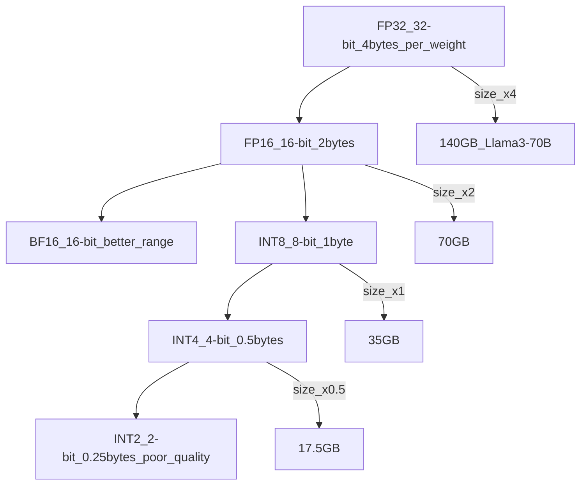

# 🗜️ Quantization for Inference

> [!abstract] TL;DR
> Quantization reduces model weight precision from FP32/FP16 to INT8 or INT4, compressing model size by 2-8x with minimal quality loss. Post-training quantization (PTQ) methods like GPTQ and AWQ use calibration data to find optimal quantization parameters. GGUF quantization enables running 70B models on consumer hardware. The result: Llama 3 70B in INT4 fits in ~40GB instead of ~140GB.

## Intuition — Analogy First

**MP3 compression for neural networks.**

A raw audio file captures sound with 32-bit floating point precision — millions of gradations per sample. An MP3 compresses it to 128kbps — far fewer bits, lossy compression. For most listeners, the difference is imperceptible. The file is 10x smaller.

Quantization does the same for model weights: instead of 32-bit floats (4 bytes per weight), you store 4-bit integers (0.5 bytes per weight) — 8x compression. The network still works because:
1. Weights are not random — they have patterns and correlations
2. Small quantization errors average out across billions of operations
3. Modern quantization methods (GPTQ, AWQ) are adaptive — they compensate for quantization error

The key question is always: **how much quality do you trade for how much compression?**

## How It Works — Mechanics

### Quantization Levels



### Post-Training Quantization (PTQ) Methods

**Naive round-to-nearest**: clip float weights to the nearest representable INT value. Simple but causes significant quality loss for INT4.

**GPTQ** (2022): layer-by-layer quantization using Optimal Brain Surgeon (OBS). For each layer:
1. Quantize one weight
2. Update remaining weights in the layer to compensate for the quantization error
3. Uses a small calibration dataset (128-512 samples)

Result: INT4 GPTQ with ≈2% perplexity increase vs FP16.

**AWQ** (2023): Activation-aware Weight Quantization. Key insight: not all weights are equally important — weights multiplied by large activations cause larger errors when quantized. AWQ finds the 1% most important weights (salient) and protects them by scaling.

Result: slightly better than GPTQ; faster inference on some hardware.

**GGUF** (GGML Universal Format): Used by llama.cpp. Quantizes entire model into a single binary file. Supports mixed precision (attention layers at higher precision, FFN at lower). Enables CPU inference and Apple Silicon inference.

Common GGUF quant types:
| Type | Bits/weight | Size ratio | Notes |
|------|-------------|-----------|-------|
| Q2_K | 2.5 | 0.16x | Very lossy |
| Q4_0 | 4.0 | 0.25x | Fast, some quality loss |
| Q4_K_M | 4.5 | 0.28x | Best 4-bit quality/speed balance |
| Q5_K_M | 5.7 | 0.36x | Better quality, most use this |
| Q8_0 | 8.0 | 0.50x | Near FP16 quality |

### Quantization-Aware Training (QAT)

Train the model with simulated quantization in the forward pass — model learns to be robust to quantization. Better quality than PTQ but requires retraining. Used by Google for edge inference.

### KV Cache Quantization

Quantize the KV cache to INT8 or INT4 separately from model weights — reduces memory for long contexts significantly.

## The Math

**Uniform quantization**: map float $x$ to integer $q$:

$$q = \text{round}\left(\frac{x - z}{s}\right), \quad \hat{x} = s \cdot q + z$$

Where:
- $s$ = scale factor $= (x_{\max} - x_{\min}) / (2^b - 1)$
- $z$ = zero point $= -\text{round}(x_{\min}/s)$
- $b$ = bits (4 for INT4)

**Quantization error**:
$$\epsilon = x - \hat{x} = x - s \cdot \text{round}((x - z)/s) - z$$

Maximum error: $\epsilon_{\max} = s/2$

**GPTQ objective**: given a layer weight matrix $W$, find quantized $\hat{W}$ minimizing output error:

$$\min_{\hat{W}} \|WX - \hat{W}X\|_2^2$$

GPTQ solves this using the Hessian of the layer's outputs w.r.t. weights.

**Model size formula**:
$$\text{size}_{\text{quant}} = \frac{b}{32} \times \text{size}_{FP32}$$

For 70B model in INT4: $\frac{4}{32} \times 140\text{GB} = 17.5\text{GB}$

## Code Demo

```python
# ── Method 1: BitsAndBytes (simplest, INT8/INT4) ──────────────────────────
# pip install bitsandbytes transformers accelerate

from transformers import AutoModelForCausalLM, AutoTokenizer, BitsAndBytesConfig
import torch

# INT8 quantization (load_in_8bit)
bnb_8bit_config = BitsAndBytesConfig(
    load_in_8bit=True,
    llm_int8_threshold=6.0,          # outlier threshold
    llm_int8_skip_modules=None,      # skip specific modules
)

# INT4 quantization (QLoRA-style, NF4 data type)
bnb_4bit_config = BitsAndBytesConfig(
    load_in_4bit=True,
    bnb_4bit_quant_type="nf4",           # NormalFloat4 (better than INT4)
    bnb_4bit_compute_dtype=torch.bfloat16,  # compute in bf16 after dequant
    bnb_4bit_use_double_quant=True,    # quantize the scale factors too
)

model_4bit = AutoModelForCausalLM.from_pretrained(
    "meta-llama/Llama-2-7b-hf",
    quantization_config=bnb_4bit_config,
    device_map="auto",
)
tokenizer = AutoTokenizer.from_pretrained("meta-llama/Llama-2-7b-hf")

inputs = tokenizer("Explain quantization:", return_tensors="pt").to("cuda")
output = model_4bit.generate(**inputs, max_new_tokens=100)
print(tokenizer.decode(output[0], skip_special_tokens=True))

# Check memory savings
import torch
print(f"GPU memory: {torch.cuda.memory_allocated()/1e9:.1f}GB")


# ── Method 2: GPTQ (better quality than BnB for INT4) ────────────────────
# pip install auto-gptq optimum

from auto_gptq import AutoGPTQForCausalLM, BaseQuantizeConfig

# Quantize a model with GPTQ
quantize_config = BaseQuantizeConfig(
    bits=4,                          # 4-bit quantization
    group_size=128,                  # quantize in groups of 128 weights
    desc_act=False,                  # activation ordering (slower but better)
)

model_to_quantize = AutoGPTQForCausalLM.from_pretrained(
    "facebook/opt-125m",             # start from FP16
    quantize_config=quantize_config,
)

# Calibration data (128 samples)
from datasets import load_dataset
data = load_dataset("wikitext", "wikitext-2-raw-v1", split="train")
examples = [tokenizer(text, return_tensors="pt") for text in data["text"][:128] if len(text) > 100]

model_to_quantize.quantize(examples)
model_to_quantize.save_quantized("./opt-125m-4bit-gptq")

# Load quantized GPTQ model
gptq_model = AutoGPTQForCausalLM.from_quantized(
    "./opt-125m-4bit-gptq",
    use_safetensors=True,
    device_map="auto",
)


# ── Method 3: AWQ ─────────────────────────────────────────────────────────
# pip install autoawq

from awq import AutoAWQForCausalLM

awq_config = {
    "zero_point": True,
    "q_group_size": 128,
    "w_bit": 4,
    "version": "GEMM",
}

model_awq = AutoAWQForCausalLM.from_pretrained("facebook/opt-125m")
model_awq.quantize(tokenizer, quant_config=awq_config)
model_awq.save_quantized("./opt-125m-4bit-awq")


# ── Method 4: GGUF with llama.cpp (CPU / Apple Silicon inference) ─────────
# Install: pip install llama-cpp-python

from llama_cpp import Llama

# Download GGUF model from HuggingFace (e.g., TheBloke's quantizations)
# huggingface-cli download TheBloke/Llama-2-7B-Chat-GGUF llama-2-7b-chat.Q4_K_M.gguf

llm_gguf = Llama(
    model_path="./llama-2-7b-chat.Q4_K_M.gguf",
    n_ctx=4096,        # context window
    n_gpu_layers=-1,   # offload all layers to GPU (-1 = all, 0 = CPU only)
    n_threads=8,       # CPU threads
)

response = llm_gguf(
    "Q: What is quantization in machine learning? A:",
    max_tokens=200,
    stop=["Q:"],
    echo=True,
)
print(response["choices"][0]["text"])


# ── Size comparison ───────────────────────────────────────────────────────
import subprocess

size_comparison = {
    "Llama 2-7B FP32": "28 GB",
    "Llama 2-7B FP16": "14 GB",
    "Llama 2-7B INT8 (BnB)": "7 GB",
    "Llama 2-7B INT4 (GPTQ/AWQ)": "3.5 GB",
    "Llama 2-7B Q4_K_M (GGUF)": "4.1 GB",
    "Llama 3-70B FP16": "140 GB",
    "Llama 3-70B INT4 (AWQ)": "35 GB",
    "Llama 3-70B Q4_K_M (GGUF)": "42 GB",  # runs on 2x24GB GPUs or Mac M2 Ultra
}

for model, size in size_comparison.items():
    print(f"  {model:45s}: {size}")
```

## Real-World Example

**Llama 3 70B on a MacBook Pro M2 Max**: Using GGUF Q4_K_M quantization (42GB), the 70B model runs at ~8 tokens/second on the 96GB M2 Max unified memory. Without quantization, the FP16 model would require 140GB — impossible on this hardware. GGUF + llama.cpp made 70B inference accessible to developers on consumer hardware.

**TheBloke on HuggingFace** manually quantized hundreds of models into GPTQ and GGUF formats, enabling the LLM community to run models they couldn't otherwise afford. His GPTQ models are downloaded millions of times per month.

**Production serving**: companies running Mistral-7B or Llama-3-8B in GPTQ INT4 can fit 4 model replicas per A100-80GB GPU instead of 1, quadrupling throughput for the same hardware cost.

## Trade-offs

| Precision | Size | Perplexity increase | Use case |
|-----------|------|---------------------|---------|
| FP32 | Baseline (100%) | 0% | Training (less common) |
| FP16/BF16 | 50% | ~0% | Default inference |
| INT8 (GPTQ) | 25% | <1% | Production serving |
| INT4 NF4 | 12.5% | 1-3% | GPU-constrained serving |
| Q4_K_M (GGUF) | ~13% | 1-4% | CPU / Apple Silicon |
| INT2 | 6% | >10% | Research only |

## When to Use vs Avoid

**Use INT8 (BnB/GPTQ) when:**
- Need slight memory reduction with near-zero quality loss
- Production serving with strong quality requirements

**Use INT4 (GPTQ/AWQ) when:**
- GPU memory is the constraint (can't fit full FP16 model)
- Serving throughput is more important than marginal quality

**Use GGUF when:**
- CPU inference or Apple Silicon
- Developer laptop testing of large models
- Edge/offline deployment

**Avoid quantization when:**
- Quality is paramount (medical, legal, financial) — test first
- Model is already small (INT4 on a 1B model saves little)

## Common Pitfalls

1. **Group size too large** — `group_size=1024` saves memory but reduces quality vs `group_size=128`. Fix: use `group_size=128` as default.
2. **Not testing quality after quantization** — assuming INT4 = FP16 quality. Fix: always run perplexity or task-specific eval after quantizing.
3. **Mixing quantized and unquantized model outputs** — comparing quantized model outputs to FP16 baselines unfairly. Fix: compare on same evaluation setup.
4. **GGUF layer offloading** — `n_gpu_layers=0` = pure CPU (slow). Fix: set `n_gpu_layers=-1` to offload all layers to GPU if available.
5. **Forgetting to quantize KV cache** — model weights are quantized but KV cache is still FP16. Fix: use `--kv-cache-dtype float8` in vLLM for additional memory savings.

## Related Concepts

- [[_MOC_Generative_AI|↑ Section MOC]]

- [[Mixed_Precision_Training]] — FP16/BF16 training, related but different from PTQ
- [[KV_Cache]] — KV cache can also be quantized separately
- [[QLoRA]] — INT4 quantization during fine-tuning
- [[LLM_Architecture_Deep_Dive]] — model architecture context

## Review Questions

1. What is the quantization error formula, and why does INT4 have 8x larger max error than FP16 for the same value range? How does group-wise quantization reduce this?
2. Explain the key difference between GPTQ and AWQ: what signal does GPTQ use to compensate for quantization error, and what insight does AWQ use that GPTQ ignores?
3. You need to deploy Llama 3-70B on a server with 2x A100 40GB GPUs (80GB total). Calculate whether GPTQ INT4 fits, and estimate the quality trade-off vs FP16.

## Sources

- Frantar, E. et al. (2022). *GPTQ: Accurate Post-Training Quantization for Generative Pre-trained Transformers*. ICLR 2023. https://arxiv.org/abs/2210.17323
- Lin, J. et al. (2023). *AWQ: Activation-aware Weight Quantization for LLM Compression and Acceleration*. https://arxiv.org/abs/2306.00978
- Dettmers, T. et al. (2022). *LLM.int8(): 8-bit Matrix Multiplication for Transformers at Scale*. NeurIPS 2022. https://arxiv.org/abs/2208.07339
- Georgi Gerganov (2023). *llama.cpp GGML/GGUF Format*. https://github.com/ggerganov/llama.cpp

#quantization #gptq #awq #gguf #int4 #llama-cpp #inference-optimization #model-compression
