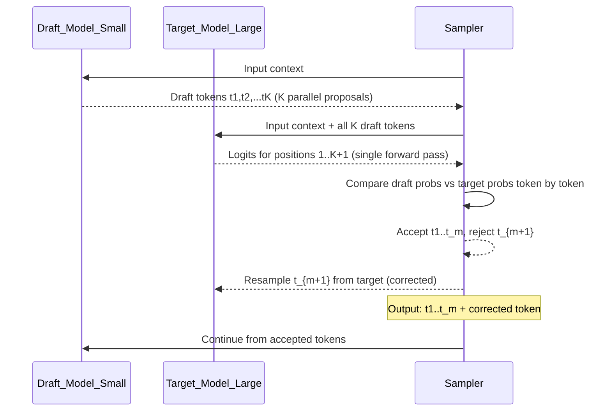

# 🔮 Speculative Decoding

> [!abstract] TL;DR
> Speculative decoding uses a small fast "draft" model to generate K candidate tokens, then sends all K to the large "target" model for parallel verification in a single forward pass. Accepted tokens are free (no extra latency); rejected tokens fall back to target model sampling. Net speedup: 2–4x with identical output quality to the target model alone.

## Intuition — Analogy First

A **fast junior drafter and a meticulous expert reviewer**:

The **junior drafter** (small model, 3B parameters) writes a paragraph quickly — they're fast but occasionally wrong. The **expert reviewer** (large model, 70B parameters) reviews the paragraph all at once — they can evaluate 8 sentences simultaneously in the same time it takes to write 1.

Process:
1. Junior writes 8 sentences (fast, cheap)
2. Expert reviews all 8 in parallel (one pass)
3. Expert approves sentences 1-5, catches an error at sentence 6
4. Everything after the error is discarded; expert corrects sentence 6
5. Junior picks up from there, writes 8 more

Result: instead of the expert writing every word themselves (slow), the expert is a reviewer — spending most of their time approving fast junior work. Net throughput: 3-4x the expert's solo writing speed.

**The guarantee**: because the expert approves/rejects based on their own probability distribution, the final output is mathematically identical to what the expert would have produced alone.

## How It Works — Mechanics

### The Algorithm



### Acceptance Sampling

For each draft token $t_k$ with draft probability $p_d(t_k)$ and target probability $p_t(t_k)$:

Accept with probability $\min\left(1, \frac{p_t(t_k)}{p_d(t_k)}\right)$

If accepted, continue to $t_{k+1}$. If rejected, sample a corrected token from a modified distribution:

$$q(x) = \text{normalize}\left(\max\left(0, p_t(x) - p_d(x)\right)\right)$$

This ensures the marginal distribution of accepted tokens equals the target distribution — **identical output quality**.

### Draft Model Options

| Draft Source | Description | Notes |
|-------------|-------------|-------|
| Small model (same family) | Llama-68M drafting for Llama-70B | Most common; good alignment |
| Distilled model | Draft model fine-tuned to match target | Better acceptance rate |
| Medusa heads | Extra draft heads on the target model | No separate model; train heads |
| EAGLE | Shallow draft model with feature sharing | Near-SOTA speedup |
| Self-speculative | Early exit from target model as draft | No extra model needed |

### Expected Speedup

If each draft token is accepted with probability $\alpha$ independently:

$$\mathbb{E}[\text{accepted tokens per step}] = \frac{1 - \alpha^{K+1}}{1 - \alpha}$$

For $\alpha = 0.8$, $K=8$: expected 4.6 accepted tokens per target forward pass.

**Effective speedup ratio**:
$$\text{speedup} \approx \frac{\mathbb{E}[\text{accepted}]}{\text{cost of target pass} / \text{cost of K draft passes}}$$

In practice: 2-4x on standard text tasks; higher for highly predictable continuations (code, structured text).

## The Math

**Correctness proof**: speculative decoding produces samples from the target distribution.

Let $p_d$ = draft probability, $p_t$ = target probability, $t$ = draft token.

**Accept**: probability $\min(1, p_t(t)/p_d(t))$

**Conditional acceptance rate**: $A = \sum_x \min(p_d(x), p_t(x))$

**On rejection**: sample from:
$$q(x) = \frac{\max(0, p_t(x) - p_d(x))}{1 - A}$$

**Marginal distribution of output token**:
$$P(\text{output} = x) = A \cdot p_t(x \mid x\text{ accepted}) + (1-A) \cdot q(x) = p_t(x)$$

This shows the output distribution is exactly $p_t$ regardless of $p_d$. The draft model only affects speed, not quality.

**Memory overhead**: requires KV cache for both draft and target models simultaneously. For Llama-70B + Llama-7B draft: target KV cache + 10% extra for draft.

## Code Demo

```python
# ── Conceptual speculative decoding implementation ────────────────────────
import torch
import torch.nn.functional as F
from transformers import AutoTokenizer, AutoModelForCausalLM
from typing import Optional

class SpeculativeDecoder:
    """
    Speculative decoding: draft model generates K tokens,
    target model verifies them in one forward pass.
    """

    def __init__(
        self,
        target_model_name: str,
        draft_model_name: str,
        device: str = "cuda",
        K: int = 4,  # draft tokens per step
    ):
        self.K = K
        self.device = device

        print(f"Loading target model: {target_model_name}")
        self.tokenizer = AutoTokenizer.from_pretrained(target_model_name)
        self.target = AutoModelForCausalLM.from_pretrained(
            target_model_name, torch_dtype=torch.float16
        ).to(device).eval()

        print(f"Loading draft model: {draft_model_name}")
        self.draft = AutoModelForCausalLM.from_pretrained(
            draft_model_name, torch_dtype=torch.float16
        ).to(device).eval()

    @torch.no_grad()
    def generate_draft_tokens(
        self, input_ids: torch.Tensor, K: int
    ) -> tuple[list[int], list[torch.Tensor]]:
        """Generate K draft tokens greedily with their probabilities."""
        draft_tokens = []
        draft_probs = []
        current_ids = input_ids.clone()

        for _ in range(K):
            out = self.draft(current_ids, use_cache=False)
            logits = out.logits[:, -1, :]
            probs = F.softmax(logits, dim=-1)
            token = torch.multinomial(probs, 1)
            draft_tokens.append(token.item())
            draft_probs.append(probs.squeeze())
            current_ids = torch.cat([current_ids, token], dim=-1)

        return draft_tokens, draft_probs

    @torch.no_grad()
    def verify_and_accept(
        self,
        input_ids: torch.Tensor,
        draft_tokens: list[int],
        draft_probs: list[torch.Tensor],
    ) -> tuple[list[int], bool]:
        """
        Target model verifies K draft tokens in one forward pass.
        Returns accepted tokens + whether all were accepted.
        """
        # Append all draft tokens to input
        draft_tensor = torch.tensor(draft_tokens, device=self.device).unsqueeze(0)
        full_ids = torch.cat([input_ids, draft_tensor], dim=-1)

        # Single target forward pass over all K+1 positions
        out = self.target(full_ids, use_cache=False)
        target_logits = out.logits[0]  # (seq_len, vocab)

        accepted_tokens = []

        for i, (draft_token, draft_prob) in enumerate(zip(draft_tokens, draft_probs)):
            # Target prob at position input_len + i
            target_probs = F.softmax(target_logits[len(input_ids[0]) + i - 1], dim=-1)
            target_p = target_probs[draft_token].item()
            draft_p = draft_prob[draft_token].item()

            # Acceptance probability
            accept_prob = min(1.0, target_p / (draft_p + 1e-8))

            if torch.rand(1).item() < accept_prob:
                accepted_tokens.append(draft_token)
            else:
                # Reject: sample corrected token from target
                corrected_probs = torch.clamp(target_probs - draft_prob, min=0)
                if corrected_probs.sum() > 0:
                    corrected_probs = corrected_probs / corrected_probs.sum()
                    corrected_token = torch.multinomial(corrected_probs, 1).item()
                else:
                    corrected_token = torch.multinomial(target_probs, 1).item()
                accepted_tokens.append(corrected_token)
                return accepted_tokens, False  # stop at first rejection

        # All K accepted; also sample bonus token from target at position K
        bonus_probs = F.softmax(target_logits[len(input_ids[0]) + K - 1], dim=-1)
        bonus_token = torch.multinomial(bonus_probs, 1).item()
        accepted_tokens.append(bonus_token)
        return accepted_tokens, True

    def generate(self, prompt: str, max_new_tokens: int = 100) -> str:
        input_ids = self.tokenizer.encode(prompt, return_tensors="pt").to(self.device)
        generated = input_ids.clone()

        total_draft_tokens = 0
        total_accepted_tokens = 0

        for _ in range(max_new_tokens // self.K + 1):
            draft_tokens, draft_probs = self.generate_draft_tokens(generated, self.K)
            accepted, all_accepted = self.verify_and_accept(generated, draft_tokens, draft_probs)

            total_draft_tokens += self.K
            total_accepted_tokens += len(accepted)

            accepted_tensor = torch.tensor(accepted, device=self.device).unsqueeze(0)
            generated = torch.cat([generated, accepted_tensor], dim=-1)

            if generated.shape[1] - input_ids.shape[1] >= max_new_tokens:
                break

        acceptance_rate = total_accepted_tokens / total_draft_tokens
        print(f"Acceptance rate: {acceptance_rate:.2%} | "
              f"Effective speedup: ~{acceptance_rate * self.K:.1f}x")

        return self.tokenizer.decode(generated[0], skip_special_tokens=True)


# ── HuggingFace native speculative decoding ───────────────────────────────
from transformers import AutoModelForCausalLM, AutoTokenizer
import torch

tokenizer = AutoTokenizer.from_pretrained("facebook/opt-6.7b")

# Large target model
target_model = AutoModelForCausalLM.from_pretrained(
    "facebook/opt-6.7b", torch_dtype=torch.float16, device_map="auto"
)

# Small draft model (same family)
draft_model = AutoModelForCausalLM.from_pretrained(
    "facebook/opt-125m", torch_dtype=torch.float16, device_map="auto"
)

inputs = tokenizer("The capital of France is", return_tensors="pt").to("cuda")

# HuggingFace handles speculative decoding natively
outputs = target_model.generate(
    **inputs,
    assistant_model=draft_model,   # speculative decoding!
    max_new_tokens=50,
    do_sample=False,
)
print(tokenizer.decode(outputs[0], skip_special_tokens=True))
```

## Real-World Example

**Google's PaLM-2 deployment** uses speculative decoding with a distilled smaller version of PaLM-2 as the draft model, achieving ~2.5x throughput improvement. The smaller model is trained specifically to predict PaLM-2's outputs, maximizing acceptance rate.

**Meta's production LLaMA serving** uses speculative decoding with a Llama-68M draft model for the 70B model, achieving 2-3x speedup on conversational tasks.

**HuggingFace Transformers** added native speculative decoding via `assistant_model` parameter (4.36+). This makes it accessible to any HuggingFace user with two models.

## Trade-offs

| Dimension | Pro | Con |
|-----------|-----|-----|
| **Speed** | 2-4x faster generation | Requires a draft model |
| **Quality** | Mathematically identical to target | Acceptance rate varies by task |
| **Memory** | Target + draft KV cache | ~10-30% extra memory |
| **Implementation** | HuggingFace native support | Complex to implement correctly |
| **Speedup variance** | Very fast for predictable text | Near 1x for unpredictable text |

## When to Use vs Avoid

**Use speculative decoding when:**
- Generating long outputs (>50 tokens) from a large model
- Text is somewhat predictable (code, structured text, common patterns)
- Have GPU memory for both draft and target models
- Throughput is the primary optimization target

**Avoid when:**
- Output is highly stochastic / creative (low acceptance rate negates speedup)
- Memory-constrained (can't fit both models)
- Generating very short outputs (<10 tokens)
- Using quantized models (alignment between full-precision target and quantized draft is poor)

## Common Pitfalls

1. **Draft/target vocabulary mismatch** — different tokenizers means token IDs don't align. Fix: always use models with the same tokenizer.
2. **Draft model too different** — if draft and target have very different distributions, acceptance rate is near 0. Fix: use a model from the same family or a distilled version.
3. **Temperature mismatch** — applying temperature to draft but not target (or vice versa) breaks the acceptance sampling math. Fix: apply same sampling parameters to both.
4. **Ignoring memory overhead** — assuming speculative decoding is "free." Fix: account for both KV caches; verify GPU memory headroom.
5. **Large K with low acceptance** — K=8 with 60% acceptance rate means you often only accept 1-2 tokens. Fix: reduce K or improve draft model alignment.

## Related Concepts

- [[_MOC_Generative_AI|↑ Section MOC]]

- [[KV_Cache]] — both models maintain separate KV caches
- [[Continuous_Batching]] — batching strategy that benefits from speculative decoding's parallel nature
- [[LLM_Architecture_Deep_Dive]] — target and draft model architecture

## Review Questions

1. Prove (informally) that speculative decoding produces outputs from the target distribution even when the draft model is wrong. Why is the rejection+resampling step essential?
2. You achieve an average acceptance rate of 0.75 with K=4 draft tokens. What is the expected number of accepted tokens per target forward pass, and what approximate speedup does this give?
3. Speculative decoding with K=8 is slower on creative writing tasks than on code generation, even with the same draft model. Explain why, connecting to the concept of token probability distributions.

## Sources

- Leviathan, Y. et al. (2023). *Fast Inference from Transformers via Speculative Decoding*. ICML 2023. https://arxiv.org/abs/2211.17192
- Chen, C. et al. (2023). *Accelerating Large Language Model Decoding with Speculative Sampling*. https://arxiv.org/abs/2302.01318
- Cai, T. et al. (2024). *Medusa: Simple LLM Inference Acceleration Framework with Multiple Decoding Heads*. https://arxiv.org/abs/2401.10774
- HuggingFace Speculative Decoding Docs. https://huggingface.co/docs/transformers/generation_strategies#speculative-decoding

#speculative-decoding #inference-optimization #llm-serving #draft-model #transformers #speedup
