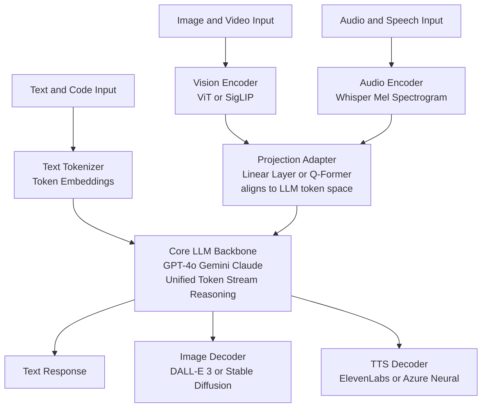

# Multimodal AI

> [!abstract] TL;DR
> Multimodal AI models understand and/or generate content across multiple data types — text, image, audio, video, and code — within a single model or tightly coupled system. They range from Vision-Language Models (VLMs) that bolt a pretrained vision encoder onto an LLM via a lightweight adapter, to native any-to-any systems like GPT-4o and Gemini that process all modalities inside one unified transformer backbone.

---

## Intuition

**Analogy:** A traditional AI is a brilliant scholar who can only read books — no diagrams, no audio lectures, no video demonstrations. They are deeply knowledgeable within text but completely blind to everything else. A multimodal AI is a scholar who grew up learning through all senses simultaneously: reading captions alongside seeing the corresponding photos, listening to lectures while following slides, watching demonstrations. Reality itself is multimodal — a chart communicates in three seconds what a table of numbers obscures for three minutes.

Multimodality in AI collapses that artificial text-only boundary. An LLM that sees an image of broken terminal output can debug it. A voice assistant that truly "hears" can detect hesitation and emotion, not just words. These capabilities require bridging fundamentally different signal types — pixel grids, waveforms, token sequences — into a shared semantic representation the model can reason over.

---

## How It Works

### Core Mechanics

Every multimodal system shares one goal: map all input modalities into a common token or embedding space that an autoregressive or diffusion-based model can then reason over.

**Step 1 — Encode each modality separately**
- Text: tokenizer → token embeddings (identical to any LLM)
- Image: vision encoder (ViT or CNN) → a sequence of visual patch tokens or a feature map
- Audio: log-mel spectrogram or raw waveform encoder → acoustic tokens
- Video: sample N frames, apply vision encoder per-frame (or 3D CNN), producing a temporal sequence of visual tokens

**Step 2 — Align modality representations to the LLM token space**
- Simple projection: a single linear layer maps visual features from D_vision to D_llm (used in LLaVA)
- Q-Former: N learned query tokens cross-attend over image features, producing exactly N compact vectors regardless of image size (used in InstructBLIP)
- Native integration: visual and audio tokens are inserted directly into the token stream at training time with no special connector (used in GPT-4o, Gemini)

**Step 3 — Unified autoregressive reasoning**
The LLM processes the combined token sequence (text + visual + audio tokens) and generates output autoregressively. For image or audio output, special tokens trigger specialized decoder heads (diffusion model, TTS engine).

### Architecture Families

**A. Vision Encoder + LLM (adapter-based VLMs)**

A pretrained vision encoder is frozen or lightly fine-tuned, connected to a pretrained LLM via a lightweight adapter. The LLM backbone changes minimally — vision knowledge is injected through the connector.

- **LLaVA (Liu et al., 2023):** CLIP ViT-L/14 vision encoder → single linear projection layer → Vicuna or LLaMA-2 LLM. Surprisingly capable with minimal training data and a simple connector.
- **LLaVA-1.5 / LLaVA-NeXT:** MLP connector instead of linear; higher resolution images via dynamic patching; outperforms GPT-4V on several academic benchmarks.
- **InstructBLIP (Dai et al., 2023):** CLIP image encoder → Q-Former (32 learned query tokens cross-attend over all image patch features, producing exactly 32 vectors regardless of image resolution) → LLM. The Q-Former acts as an information bottleneck that compresses thousands of visual tokens into 32 task-relevant vectors.

**B. Native any-to-any models**

Vision, audio, and text are trained together end-to-end from the beginning. The model learns joint representations natively — modalities are not separate modules bolted together.

- **GPT-4o (OpenAI, 2024):** Processes text, image, and audio tokens in a single transformer. Audio is tokenized natively, enabling sub-300ms end-to-end voice responses — no separate ASR or TTS model.
- **Gemini 1.5 Pro/Flash (Google DeepMind, 2024):** Native multimodal from pretraining; 1M-token context handles full-length movies; Mixture-of-Experts (MoE) architecture for efficiency at scale.
- **Claude 3+ family (Anthropic):** Native vision with strong document understanding, chart reading, and dense PDF analysis.

**C. Specialist pipelines**

Chain best-in-class specialist models: Whisper (ASR) → LLM → ElevenLabs (TTS). Fastest to build, easiest to swap components, but incurs latency at each handoff and information loss at each boundary (prosody is lost when audio is transcribed before the LLM sees it).

### Flow / Architecture



---

## Modality Taxonomy

| Modality | Input tasks | Output tasks | Key models |
|---|---|---|---|
| Text | QA, summarization, classification | Generation, translation, code | GPT-4o, Claude, Gemini |
| Image | Captioning, VQA, OCR, chart reading | Text-to-image, image editing | GPT-4V, LLaVA, DALL-E 3 |
| Audio / Speech | ASR, speaker ID, diarization | TTS, voice cloning, music | Whisper, ElevenLabs, MusicGen |
| Video | Captioning, QA, action recognition | Text-to-video | Gemini 1.5, Sora |
| Code | Bug detection, understanding | Code generation, completion | GPT-4o, Claude |
| Structured data | Table QA, chart extraction | Chart generation, reports | GPT-4V, Gemini Flash |

---

## Image Understanding

VLMs are the most mature and widely deployed multimodal category. The core tasks form a hierarchy from perception to reasoning:

**Image Captioning:** Generate a natural language description. Fine-grained models produce descriptions including spatial relationships, attributes, counts, and visual context.

**Visual QA (VQA):** Answer questions about an image ("How many red cars are in this parking lot?"). The model must ground language to specific image regions, counting objects or reading scene attributes.

**Document Understanding:** Treat PDFs, invoices, contracts, and forms as images — understanding both visual layout and embedded text simultaneously. The spatial arrangement of fields (which label is next to which value) carries semantic meaning lost to pure OCR.

**Chart and Table Reading:** Extract numerical trends, axis labels, legends, and comparisons from charts. This requires both OCR (reading axis values) and visual reasoning (interpreting trend lines, bar heights). GPT-4V and Claude 3 Opus excel; small open-source VLMs often hallucinate chart values.

**Visual Grounding:** Locate a specific object in an image given a text description, returning bounding box coordinates. Used in robotic manipulation, document parsing, and zero-shot detection.

**OCR:** Extract text from images including handwritten notes, receipts, low-contrast scans, and dense tables. VLM-based OCR (Claude, GPT-4V) handles cases that break traditional Tesseract-based pipelines.

---

## Image Generation

Text-to-image is the output side of multimodal AI. A text prompt is encoded (via CLIP or T5), and a generative model synthesizes the image conditioned on that encoding.

- **DALL-E 3 (OpenAI, 2023):** Cascaded diffusion with CLIP text conditioning. Trained with recaptioned data (ChatGPT rewrites user prompts to be more descriptive before training), giving it strong instruction following. Best commercial option for accurate prompt adherence.
- **Stable Diffusion (Stability AI):** Open-weight latent diffusion model. CLIP text encoder conditions a U-Net denoiser that operates in a compressed VAE latent space (48x smaller than pixel space). Rich ecosystem: ControlNet spatial conditioning, LoRA fine-tunes, inpainting, img2img. See [[Stable_Diffusion]] for the full architecture deep-dive.
- **Midjourney:** Closed API with proprietary diffusion model; known for aesthetic quality and artistic style coherence.
- **FLUX.1 (Black Forest Labs, 2024):** From the original Stable Diffusion team. Uses a flow-matching-based Diffusion Transformer (DiT architecture) instead of a U-Net; 12B parameter model; significantly better text rendering than SD.

---

## Speech-to-Text (ASR)

Automatic Speech Recognition converts audio waveforms to text transcripts.

**Whisper (OpenAI, 2022):** The dominant open-source ASR model. Trained on 680,000 hours of multilingual audio-text pairs scraped from the internet. Architecture: log-mel spectrogram (80 bins, 30-second window) → CNN stem → Transformer encoder → Transformer decoder that generates text tokens autoregressively. Handles 99 languages, noisy conditions, accents, and technical vocabulary.

Model sizes: `tiny` (39M) → `base` (74M) → `small` (244M) → `medium` (769M) → `large-v3` (1.5B). Use `large-v3` for highest accuracy; `small` or `medium` for real-time with GPU.

**Key ASR metrics:**
- **WER (Word Error Rate):** `(substitutions + deletions + insertions) / reference_word_count`. Lower is better. Human-level English WER is ~5%. Whisper large-v3 achieves ~2.7% on clean English speech.
- **RTF (Real-Time Factor):** `processing_time / audio_duration`. RTF < 1.0 means the model transcribes faster than real time.

**Commercial APIs:** Deepgram Nova-2 and Google STT offer native streaming APIs with <300ms latency per utterance. Deepgram is particularly strong for noisy environments and custom vocabulary.

**Real-time vs batch:**
- Batch: transcribe the complete audio file after recording ends. Whisper is batch-oriented by default.
- Streaming: transcribe audio chunks as they arrive using Voice Activity Detection (VAD) to detect speech end. Faster-Whisper (CTranslate2 runtime) + Silero VAD is the standard open-source streaming stack.

---

## Text-to-Speech (TTS)

**ElevenLabs:** State-of-the-art neural TTS. Voice cloning from a 1-minute audio sample. Multilingual, real-time streaming API, emotion and speaking rate control via voice settings. Industry standard for high-quality English voice synthesis.

**Azure Neural TTS:** Production-grade TTS at enterprise scale. Fine-grained prosody control via SSML: `<prosody rate="slow" pitch="+2st">`. 400+ neural voices across 140 languages. Integrates natively with Azure AI services.

**Kokoro (2024):** Lightweight open-weight TTS (~82M parameters). Runs locally on CPU at real-time speeds. Apache-2.0 license. English quality approaches ElevenLabs at zero API cost — the default choice for on-premise deployments.

**Voice cloning:** Encode a reference speaker's audio into a speaker embedding (d-vector or x-vector), then condition the TTS decoder on that embedding. Zero-shot cloning from a few seconds is production-ready (ElevenLabs Instant Voice Clone). Fine-tuning cloning from 1-10 minutes of audio gives higher fidelity for a specific speaker.

**Prosody control:** Rate, pitch, emphasis, pause duration, and speaking style can all be controlled — either via SSML markup (Azure) or voice settings (ElevenLabs) or conditioning vectors (research TTS systems like Voicebox, StyleTTS2).

---

## Real-Time Voice Pipeline

The STT → LLM → TTS chain for interactive voice AI. Target: sub-1-second perceived latency end-to-end.

```
Audio in → VAD → ASR (Whisper) → LLM streaming → TTS streaming → Audio out
  100ms    50ms     200-400ms     first token 100ms   TTFA 150-250ms   ≈ 700ms total
```

**Latency budget breakdown:**

| Stage | Target | Technique |
|---|---|---|
| VAD (end-of-speech detection) | < 50ms | Silero VAD or WebRTC VAD |
| ASR (Whisper transcription) | 200-400ms | Faster-Whisper (CTranslate2), `small` model on GPU |
| LLM first token | 100-200ms | Quantized model, warmed KV cache, Flash Attention |
| TTS time-to-first-audio (TTFA) | 150-300ms | Streaming TTS, Kokoro or Deepgram Aura |
| **Total perceived** | **< 800ms** | Overlap stages via streaming pipeline |

**Critical technique — streaming overlap:** Do not wait for the full LLM response before starting TTS. Stream LLM output to TTS sentence-by-sentence. As soon as the first sentence is complete, TTS begins synthesizing it while the LLM continues generating the rest. This overlap eliminates the full LLM generation wait from the critical path.

Native multimodal systems (GPT-4o) bypass the STT and TTS boundaries entirely — audio tokens flow directly into and out of the model, giving reported end-to-end latency of ~230ms vs. ~700ms for the best specialist pipelines.

---

## Video Understanding

Video is temporally structured image data. The core challenge is handling temporal length efficiently.

**Frame sampling:** Sample N frames uniformly or at keyframe boundaries. Encode each frame with the vision encoder. Concatenate all frame token sequences into one long input. Effective for short clips (< 5 minutes); token count grows linearly with N (a 10-minute video at 1fps = 600 frames × ~256 tokens/frame = 153,600 visual tokens — expensive).

**Video captioning:** Generate a natural language description of a video event or scene, including temporal ordering ("the door opens and then the light turns on").

**Video QA:** "At what minute does the presenter first mention the Q4 results?" Requires temporal grounding — locating a specific moment in the video corresponding to a text query.

**Long video understanding (Gemini 1.5 Flash):** Supports 1M-token context, enabling full movies (2-3 hours) or multi-hour recordings. Sparse frame sampling (sample every 1-5 seconds rather than every frame) keeps token counts manageable. Gemini's native video understanding processes video natively without chunking — the model attends globally across the entire video.

**Alternative approach — hierarchical summarization:** Chunk video into 30-60 second segments, summarize each chunk with a VLM, then reason over the text summaries with a text-only LLM. Lower cost than full-video VLM but loses fine-grained visual detail.

---

## Audio Processing

Beyond speech, audio multimodality covers:

**Music generation — MusicGen (Meta, 2023):** Text-to-music via an EnCodec audio codec tokenizer (discretizes audio waveforms into tokens) + a Transformer language model that generates token sequences. Supports melody conditioning: provide a reference audio clip ("generate jazz that follows this guitar melody"). Open-weight model available on Hugging Face.

**Sound classification:** Classify environmental audio events (dog bark, siren, glass breaking, keyboard typing). Used in content moderation, smart home devices, and industrial monitoring. Models: PANNs (Pretrained Audio Neural Networks), BEATs, audio spectrogram transformers (AST).

**Speaker diarization:** Segment an audio recording by speaker identity ("Who spoke when?"). Pipeline: VAD → speaker embedding extraction (x-vectors or ECAPA-TDNN) → clustering (agglomerative or spectral). Output: timestamped speaker segments. Standard library: `pyannote.audio` (open source, HuggingFace Hub). Production APIs: AssemblyAI, Rev.ai.

---

## Multimodal RAG

Standard RAG chunks documents into text and embeds with a text model. This breaks for documents with charts, tables, figures, and layouts where meaning is visual.

**ColPali (Faysse et al., 2024):** Embed entire document pages as images using a vision-language model (PaliGemma). Each page image produces a grid of patch embeddings (late interaction retrieval, similar to ColBERT for text). At query time, the text query is matched against the patch embeddings of each page — patches in the chart region score high for chart-specific queries. Outperforms text-chunking RAG on visually complex documents by 15-30% on DocVQA benchmarks because the visual layout, colors, and spatial relationships are never lost.

**Text-extraction pipeline (baseline):**
1. OCR all pages (Tesseract, Azure Form Recognizer)
2. Caption figures and tables with a VLM
3. Embed text + captions with a text embedding model
4. Retrieve relevant chunks at query time
- Weakness: chart captions may omit exact values; table structure is flattened; VLM captioning adds cost per document.

**Hybrid approach (production recommendation):** Combine ColPali page-image retrieval with text embedding retrieval, merge ranked results (reciprocal rank fusion). More robust than either alone — text retrieval handles keyword-heavy queries, ColPali handles visual queries.

---

## Production Considerations

**Image token compression:** A 1024×1024 image at ViT patch size 14px yields ~5,400 visual tokens. Each token has the same KV cache and compute cost as a text token inside the LLM. Mitigation strategies:
- InstructBLIP Q-Former: compress to 32 fixed query tokens
- LLaVA-NeXT dynamic patching: only tile at high resolution where the image has detail; use low resolution for simple images
- Token merging (ToMe): merge similar adjacent visual tokens during the forward pass — reduces token count 30-50% with minimal accuracy loss

**Cost of vision:** Vision is expensive relative to text. GPT-4o charges per image token; a typical 512px image costs approximately 800 tokens; a high-resolution 2048px image can cost 3,000-6,000 tokens. At scale, image-understanding queries cost 5-20x more than equivalent text queries. Always resize images to the minimum resolution that preserves necessary detail.

**Multimodal safety attack surfaces:**
- **Visual prompt injection:** hide malicious instructions inside images (white text on white background, text embedded in a QR code, instructions in image metadata). The model "reads" the hidden instruction and follows it.
- **NSFW image generation:** requires content classifiers on both user image input and generated image output.
- **Modality-specific jailbreaks:** text-based safety filters may not apply uniformly to image-embedded instructions — some models that refuse a text instruction will comply when the same instruction appears in an image.

**Quantization for VLMs:** Use 4-bit quantization (bitsandbytes, GGUF via llama.cpp, or AWQ) to deploy 7B-34B VLMs locally. Quantize the LLM backbone; the vision encoder (ViT) is smaller and typically left in float16. A 7B VLM in 4-bit fits in ~6GB VRAM, enabling deployment on consumer GPUs.

---

## Code Demo

```python
import anthropic
import base64
from pathlib import Path
from openai import OpenAI


# ── Shared utility ────────────────────────────────────────────────────────────

def encode_image_b64(image_path: str) -> tuple[str, str]:
    """Return (base64_data, media_type) for a local image file."""
    path = Path(image_path)
    media_types = {
        ".jpg": "image/jpeg", ".jpeg": "image/jpeg",
        ".png": "image/png", ".gif": "image/gif",
        ".webp": "image/webp",
    }
    media_type = media_types.get(path.suffix.lower(), "image/jpeg")
    data = base64.standard_b64encode(path.read_bytes()).decode("utf-8")
    return data, media_type


# ── Anthropic Claude: Image Understanding ─────────────────────────────────────

def claude_image_qa(image_path: str, question: str) -> str:
    """Ask Claude a question about a local image file."""
    client = anthropic.Anthropic()
    data, media_type = encode_image_b64(image_path)
    message = client.messages.create(
        model="claude-opus-4-5",
        max_tokens=1024,
        messages=[
            {
                "role": "user",
                "content": [
                    {
                        "type": "image",
                        "source": {
                            "type": "base64",
                            "media_type": media_type,
                            "data": data,
                        },
                    },
                    {"type": "text", "text": question},
                ],
            }
        ],
    )
    return message.content[0].text


# Extract structured data from a chart image
chart_answer = claude_image_qa(
    "sales_chart.png",
    "What is the peak sales month and the year-over-year revenue growth percentage? "
    "List every y-axis value you can read from the chart as a bulleted list.",
)
print(chart_answer)


# ── OpenAI GPT-4o: Vision API ─────────────────────────────────────────────────

def openai_image_qa(image_path: str, question: str) -> str:
    """Ask GPT-4o a question about a local image."""
    client = OpenAI()
    data, _ = encode_image_b64(image_path)
    response = client.chat.completions.create(
        model="gpt-4o",
        messages=[
            {
                "role": "user",
                "content": [
                    {
                        "type": "image_url",
                        "image_url": {"url": f"data:image/jpeg;base64,{data}"},
                    },
                    {"type": "text", "text": question},
                ],
            }
        ],
        max_tokens=1024,
    )
    return response.choices[0].message.content


# ── OpenAI Whisper: Speech-to-Text ────────────────────────────────────────────

def transcribe_audio(audio_path: str) -> dict:
    """Transcribe audio with word-level timestamps using Whisper API."""
    client = OpenAI()
    with open(audio_path, "rb") as audio_file:
        transcript = client.audio.transcriptions.create(
            model="whisper-1",
            file=audio_file,
            response_format="verbose_json",
            timestamp_granularities=["word"],
        )
    return {
        "text": transcript.text,
        "language": transcript.language,
        "duration": transcript.duration,
        "words": [
            {"word": w.word, "start": w.start, "end": w.end}
            for w in transcript.words
        ],
    }


result = transcribe_audio("meeting.mp3")
print(f"Transcript ({result['language']}, {result['duration']:.1f}s):\n{result['text'][:300]}")
for word_info in result["words"][:5]:
    print(f"  {word_info['word']:15s} [{word_info['start']:.2f}s -> {word_info['end']:.2f}s]")


# ── OpenAI TTS: Text-to-Speech (streaming) ───────────────────────────────────

def synthesize_speech(text: str, output_path: str, voice: str = "nova") -> None:
    """Synthesize speech with OpenAI TTS-1-HD, streaming to avoid buffering delay.
    Voice options: alloy, echo, fable, onyx, nova, shimmer
    """
    client = OpenAI()
    with client.audio.speech.with_streaming_response.create(
        model="tts-1-hd",
        voice=voice,
        input=text,
    ) as response:
        response.stream_to_file(output_path)


synthesize_speech(
    text="Quarterly revenue exceeded projections by 23 percent, driven by strong cloud segment growth.",
    output_path="response.mp3",
    voice="nova",
)


# ── LLaVA via HuggingFace Transformers (local open-source VLM) ───────────────

from transformers import LlavaNextProcessor, LlavaNextForConditionalGeneration
from PIL import Image
import torch

processor = LlavaNextProcessor.from_pretrained("llava-hf/llava-v1.6-mistral-7b-hf")
model = LlavaNextForConditionalGeneration.from_pretrained(
    "llava-hf/llava-v1.6-mistral-7b-hf",
    torch_dtype=torch.float16,
    load_in_4bit=True,   # 4-bit quant: 7B model fits in ~6GB VRAM
)

image = Image.open("architecture_diagram.png")
conversation = [
    {
        "role": "user",
        "content": [
            {"type": "image"},
            {
                "type": "text",
                "text": "Describe the architecture shown in this diagram. "
                        "List each component and the data flow between them.",
            },
        ],
    }
]
prompt = processor.apply_chat_template(conversation, add_generation_prompt=True)
inputs = processor(images=image, text=prompt, return_tensors="pt").to(model.device)

with torch.no_grad():
    output_ids = model.generate(**inputs, max_new_tokens=512, temperature=0.2)

response = processor.decode(output_ids[0], skip_special_tokens=True)
print(response.split("[/INST]")[-1].strip())
```

---

## Real-World Example

> **Example: Gemini 1.5 Flash in Google Workspace Document Q&A.** When a user uploads a 200-page analyst report PDF and asks "What were the three main risk factors flagged, and what percentage decline does the bear case project for Q3?", Gemini processes each page as an image at 1M-token context. It reads the bar charts visually (detecting the Q3 dip from chart height, not from a table row that OCR might have extracted inaccurately), identifies the highlighted risk section by its visual formatting (red text, warning icon), and extracts the exact percentage from the axis label of the bear-case scenario chart. A text-only pipeline would have required: OCR → chunking → embedding → retrieval → LLM reading flattened text. The visual approach handles this in one pass with richer signal. The cost: a 200-page PDF at ~800 tokens/page = 160,000 visual tokens — at GPT-4o pricing, approximately $0.40 per document query.

---

## Trade-offs

| Aspect | Native Multimodal (GPT-4o, Gemini) | Specialist Pipeline (Whisper + LLM + TTS) |
|---|---|---|
| End-to-end latency | Lower — no inter-model handoffs | Higher — 100-500ms added per boundary |
| Modality signal richness | Full signal preserved (tone, prosody in audio) | Information lost at each transcription boundary |
| Cost per query | Higher — large unified model | Lower — smaller specialized models |
| Flexibility | Locked to one vendor's model | Swap each component independently |
| Customization | Hard — limited fine-tuning surface for multimodal | Fine-tune each specialist on domain data |
| Local deployment | Very hard — 70B+ param models | Feasible — Whisper small + 7B LLM + Kokoro on 24GB GPU |
| Debugging | Opaque — hard to isolate which modality caused the error | Traceable — inspect intermediate text/audio at each stage |
| Safety surface | Single policy | Each component needs its own safety checks |

---

## When to Use vs Avoid

**Use native multimodal when:**
- Real-time voice AI requiring < 500ms perceived latency
- Joint image-text reasoning where modality separation loses meaning ("Given this architecture diagram, write the corresponding Python class hierarchy")
- Long video understanding — no other approach scales to hours of video in a single context
- Prosody and tone matter in audio (therapy, sales coaching, emotional support)

**Use specialist pipelines when:**
- Cost is a primary constraint and tasks are decomposable without information loss
- Best-in-class accuracy per modality is required (Whisper for ASR, Claude for reasoning, ElevenLabs for voice cloning)
- Fully local or on-premise deployment is required
- You need interpretability — inspect the text transcript, LLM response, and audio separately

**Avoid vision models when:**
- Input has no visual component — text-only queries pay unnecessary image token costs
- Strict latency requirements with high-resolution inputs — tokenizing a 4K image can take 50-100ms alone
- The visual content is simple (single-color backgrounds, pure text screenshots) — OCR + text model is faster and cheaper

---

## Common Pitfalls

- **Ignoring image token cost at scale** — A 1024px image costs 800-1500 tokens in GPT-4o. Running 10,000 document-understanding queries/day at 1500 tokens/image adds up to 15M tokens/day in image costs alone, before any text tokens. Always resize images to the minimum resolution that preserves the detail needed for the task.
- **Losing prosodic signal at the ASR boundary** — Transcribing audio to text before the LLM discards all prosodic information: speaker emphasis, hesitation, emotional tone, pace. If prosody matters, use a native multimodal model or extract audio embeddings separately alongside the transcript.
- **Hallucinating chart values** — VLMs confidently state chart values that do not exist in the image. For any critical numerical extraction (financial reports, medical charts), validate VLM output against a structured OCR or data extraction fallback. Never trust a VLM's exact numbers without verification.
- **Assuming OCR is a solved problem** — Standard OCR (Tesseract) breaks on handwriting, low-contrast scans, non-Latin scripts, and dense table layouts. VLM-based document reading handles these better but at higher cost. Evaluate on representative samples from your actual document corpus before committing to an approach.
- **Not handling image resolution tiers** — Many VLMs process at fixed resolutions (336×336 or 448×448). Dense document pages or small-print charts may need tiling (split image into overlapping tiles, process each separately, merge answers) or dynamic-resolution models (LLaVA-NeXT, InternVL2).
- **Sequential TTS instead of streaming** — Waiting for the full LLM response before starting TTS adds 500ms-3s of dead time. Always stream LLM output sentence-by-sentence to TTS; perceived latency drops by 50-70%.
- **Visual prompt injection in production** — Any system that accepts user-uploaded images must sanitize for hidden instructions. White text on white background, instructions in image EXIF metadata, or text hidden in QR-code-like patterns can override the system prompt. Apply content scanning before passing user images to the model.

---

## Related Concepts

- [[_MOC_Generative_AI|Section MOC]]

- [[CLIP]] — the foundational image-text alignment model; most VLM vision encoders use CLIP or its successor SigLIP; CLIP embeddings power both retrieval and text-to-image conditioning
- [[Vision_Transformer_ViT]] — the image encoder architecture inside VLMs; splits an image into patch tokens that the LLM then attends over
- [[Stable_Diffusion]] — the leading open-weight text-to-image model; represents the image generation output side of multimodal AI; uses a CLIP text encoder for conditioning
- [[Diffusion_Models]] — the mathematical foundation for image, video, and audio generation in most current generative multimodal systems
- [[ControlNet]] — extends Stable Diffusion with spatial conditioning (depth maps, edge maps, poses); an example of image-conditioned image generation
- [[Segment_Anything_SAM]] — Meta's visual grounding model; can be combined with VLMs for region-level understanding and visual QA on specific image crops
- [[DINO]] — self-supervised vision features used as vision encoders in some VLMs and in ColPali for document retrieval; produces richer patch features than supervised ViT
- [[LLM_Architecture_Deep_Dive]] — the decoder-only backbone all VLMs are built on; RMSNorm, GQA, RoPE, and SwiGLU all apply equally to multimodal LLMs
- [[Attention_Mechanism]] — cross-attention is the key mechanism for image-text alignment in VLMs; the Q-Former and Flamingo cross-attention gates are direct applications
- [[Embedding_Models]] — multimodal embedding models (CLIP, ImageBind) extend embedding spaces across text, image, and audio for cross-modal retrieval
- [[RAG_Overview]] — multimodal RAG (ColPali) extends traditional text RAG to visually rich documents; page-image retrieval replaces text-chunk retrieval
- [[KV_Cache]] — visual tokens massively inflate the KV cache at inference; Q-Former and token merging are designed specifically to reduce visual token count before the KV cache

---

## Review Questions

1. LLaVA connects a CLIP vision encoder to an LLM via a single linear projection. InstructBLIP uses a Q-Former that compresses all image patch features into exactly 32 query vectors. What is the fundamental trade-off between these two connector designs in terms of visual information preservation, compute cost, and robustness to images with many fine-grained details (e.g., a dense data table)?

2. A company wants to build a real-time voice assistant that must respond within 500ms and run fully on-premise without any external API calls. Compare the architecture you would propose (native multimodal vs. specialist pipeline, specific model choices) and justify each decision against the constraints.

3. You are building a RAG system over 50,000 analyst reports — documents dense with charts, embedded tables, and multi-column layouts. Compare the retrieval quality vs. cost trade-offs of: (a) text extraction + text embedding only, (b) VLM captioning of all figures + text embedding, and (c) ColPali page-image retrieval. Which would you deploy first, and what metric would you use to decide when to upgrade to a more expensive approach?

---

## Sources

- [LLaVA: Visual Instruction Tuning (Liu et al., 2023)](https://arxiv.org/abs/2304.08485)
- [InstructBLIP (Dai et al., 2023)](https://arxiv.org/abs/2305.06500)
- [GPT-4V System Card (OpenAI, 2023)](https://openai.com/research/gpt-4v-system-card)
- [Gemini 1.5: Unlocking multimodal understanding across millions of tokens of context (Reid et al., 2024)](https://arxiv.org/abs/2403.05530)
- [Whisper: Robust Speech Recognition via Large-Scale Weak Supervision (Radford et al., 2022)](https://arxiv.org/abs/2212.04356)
- [ColPali: Efficient Document Retrieval with Vision Language Models (Faysse et al., 2024)](https://arxiv.org/abs/2407.01449)
- [MusicGen: Simple and Controllable Music Generation (Copet et al., 2023)](https://arxiv.org/abs/2306.05284)
- [FLUX.1 Technical Report (Black Forest Labs, 2024)](https://blackforestlabs.ai/announcing-black-forest-labs/)
- [Flamingo: a Visual Language Model for Few-Shot Learning (Alayrac et al., 2022)](https://arxiv.org/abs/2204.14198)

---

#multimodal #vlm #vision-language #whisper #tts #asr #image-understanding #generative-ai #colpali #vqa #document-understanding
