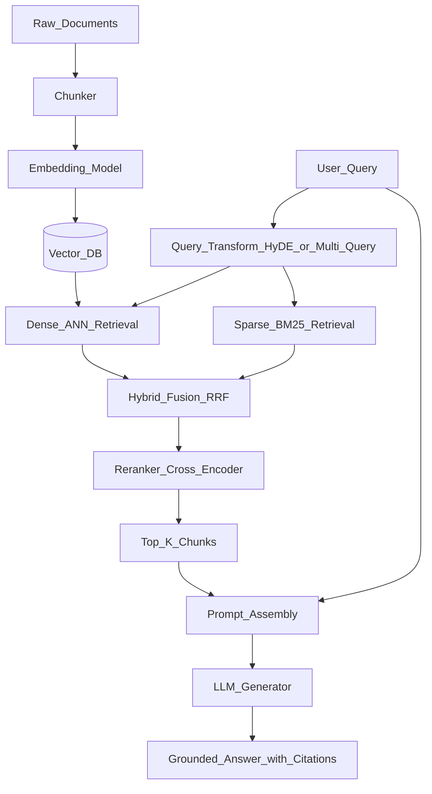

# RAG (Retrieval-Augmented Generation)

> [!abstract] TL;DR
> RAG fixes the three hardest problems with raw LLMs — hallucination, stale knowledge, and context limits — by making the model look things up at inference time rather than memorizing everything at train time. A user query triggers retrieval of relevant document chunks from a vector database, those chunks are injected into the prompt as grounding context, and the LLM generates an answer tied to verifiable evidence.

---

## Intuition

**Analogy:** A student taking an open-book exam.

A student relying purely on memory can still fail — misremembered facts, knowledge from an outdated edition, topics never covered in class. Put that same student in an open-book exam with a well-organized index: they look up the right chapter, read the relevant passage, and write a grounded, citable answer.

RAG is that open-book exam. The vector database is the textbook with a smart index. The embedding model is the index. The LLM is the student who reads the retrieved passages and synthesizes an answer. The crucial constraint: the student is told to answer only from what they can find in the book — not from memory.

---

## Why RAG Exists: The LLM Problem Set

| Problem | Description | RAG Fix |
|---------|-------------|---------|
| **Hallucination** | LLMs generate plausible-sounding but false information — they can't distinguish what they know from what they've pattern-matched | Ground generation in retrieved context; the LLM can only reference what is in the prompt |
| **Knowledge cutoff** | LLMs are frozen at training time — can't answer about events after their cutoff date | Retrieve from a live, updated document store at inference time |
| **Context limits** | Even 128K-token context windows can't hold an entire knowledge base — injecting everything is slow and expensive | Retrieve only the 2–5K tokens most relevant to the current query |
| **Attribution** | Users need to know where an answer came from before they can trust it | Retrieved chunks carry source metadata (URL, file name, page number) that can be surfaced as citations |

---

## How It Works

### The Full RAG Pipeline



The pipeline has two phases: **offline indexing** (top row, runs once per document) and **online query** (bottom row, runs on every user request).

---

### Phase 1: Indexing — Build the Knowledge Base

#### Step A: Chunking

LLMs have finite context windows. Injecting a full document wastes tokens and buries the signal. Chunking splits documents into retrievable units that are small enough to be precise but large enough to be meaningful.

| Strategy | How It Works | Best For |
|----------|-------------|----------|
| **Fixed-size** | Split every N characters/tokens with M overlap | Simple baseline; uniform prose |
| **Recursive character** | Try `\n\n` → `\n` → `.` → ` ` in order — use the finest separator that fits the limit | Mixed documents (code, prose, headers) — the LangChain default |
| **Semantic** | Embed sentences; start a new chunk when cosine similarity to the previous sentence drops below a threshold | Captures topic boundaries; expensive at index time |
| **Hierarchical (parent-child)** | Index small child chunks (512 tokens) for precise retrieval; when a child is retrieved, return the larger parent chunk (2048 tokens) to the LLM | Best accuracy-to-context tradeoff; native in LlamaIndex |

**Rule of thumb:** `chunk_size=512 tokens`, `overlap=64 tokens` is a safe starting point for technical documentation. Tune by measuring RAGAS Context Precision against a held-out query set.

#### Step B: Embedding

Each chunk is passed through an embedding model to produce a dense vector. The vector's position in high-dimensional space encodes its meaning. The same model must be used at query time — vectors from different models are incomparable.

| Model | Dims | Notes |
|-------|------|-------|
| `text-embedding-3-small` (OpenAI) | 1536 | Fast, low cost — best default choice |
| `text-embedding-3-large` (OpenAI) | 3072 | Higher quality for high-stakes retrieval |
| `all-mpnet-base-v2` (Sentence-Transformers) | 768 | Open-source, CPU-friendly, no API cost |
| `bge-m3` (BAAI) | 1024 | Multilingual, state-of-the-art open-source |

See [[Embedding_Models]] for a full comparison with MTEB benchmark scores.

#### Step C: Vector Database Storage

Vectors along with metadata (source file, page, timestamp, chunk ID) are upserted into a vector database. The DB builds an ANN index (HNSW or IVF-PQ) over the vectors to enable fast approximate nearest-neighbor lookup.

See [[Vector_Databases_Overview]], [[Pinecone]], [[Weaviate]], [[Chroma]], [[pgvector]], [[ANN_Algorithms]].

---

### Phase 2: Retrieval — Find the Relevant Chunks

#### Dense Retrieval (Semantic)

The query is embedded with the same model used at index time. ANN search finds the K vectors most similar by cosine distance. Fast (sub-10ms via HNSW) but misses exact keyword matches — a query for "SKU-98123" will retrieve semantically similar items, not necessarily the one matching that exact code.

#### Sparse Retrieval (BM25)

BM25 is a classical TF-IDF-derived ranking function that scores documents by term frequency and inverse document frequency. It captures exact keyword matches that semantic search misses — product codes, proper nouns, rare technical terms.

$$\text{BM25}(D, Q) = \sum_{q_i \in Q} \text{IDF}(q_i) \cdot \frac{f(q_i, D) \cdot (k_1 + 1)}{f(q_i, D) + k_1 \cdot \left(1 - b + b \cdot \frac{|D|}{\text{avgdl}}\right)}$$

where $k_1 = 1.5$, $b = 0.75$ are standard constants and $f(q_i, D)$ is the term frequency of $q_i$ in document $D$.

#### Hybrid Retrieval with Reciprocal Rank Fusion (RRF)

Combine dense and sparse rank lists using RRF — no score normalization needed, since ranks are always integers:

$$\text{RRF}(d) = \sum_{r \in R} \frac{1}{k + \text{rank}_r(d)}$$

where $k = 60$ is the smoothing constant and $R$ is the set of rank lists (dense + sparse). A document appearing at rank 1 in both lists scores $\frac{1}{61} + \frac{1}{61} \approx 0.033$ — better than any document that appears only in one list. Hybrid retrieval consistently outperforms either retriever alone by 5–15% recall@K on standard benchmarks.

#### Reranking

Initial retrieval (top-20 or top-50 candidates) uses a fast **bi-encoder** — query and document are embedded separately and compared by dot product. A **cross-encoder reranker** then reads each (query, chunk) pair jointly, allowing it to model fine-grained relevance that bi-encoders miss. This is computationally expensive per pair, but applied only to the small candidate set (not the full corpus). The top-K reranked chunks (typically 3–5) go to the LLM.

Cross-encoder options: `ms-marco-MiniLM-L-6-v2` (local, fast), Cohere Rerank API (`rerank-english-v3.0`, highest quality), `bge-reranker-v2-m3` (open-source multilingual).

---

### Phase 3: Generation — Produce the Grounded Answer

The prompt template combines three elements:
1. A system instruction — role, response format, citation rules, grounding constraint
2. The retrieved chunks — each labeled with its source metadata
3. The user's original question

The LLM is instructed to answer **only** from the provided context. This grounding constraint is what turns RAG from a retrieval-informed suggestion into a verifiably grounded answer.

```
System: Answer using only the provided context. Cite sources inline as [1], [2].
         If the context is insufficient, say "I don't have that information."

Context:
[1] (source: docs/api_guide.pdf, page 12)
{chunk_1_text}

[2] (source: docs/faq.md)
{chunk_2_text}

Question: {user_question}
```

---

## Code Demo

```python
# Complete RAG pipeline: chunking → embedding → hybrid retrieval → reranking → generation
# pip install langchain langchain-openai langchain-community langchain-cohere
# pip install chromadb rank-bm25 cohere

from langchain_openai import ChatOpenAI, OpenAIEmbeddings
from langchain_community.vectorstores import Chroma
from langchain.text_splitter import RecursiveCharacterTextSplitter
from langchain_community.retrievers import BM25Retriever
from langchain.retrievers import EnsembleRetriever
from langchain.retrievers.contextual_compression import ContextualCompressionRetriever
from langchain_cohere import CohereRerank
from langchain_core.prompts import ChatPromptTemplate
from langchain_core.output_parsers import StrOutputParser
from langchain_core.runnables import RunnablePassthrough
from langchain_core.documents import Document

# ── 1. Sample knowledge base ───────────────────────────────────────────────────
raw_docs = [
    Document(
        page_content="RAG stands for Retrieval-Augmented Generation. "
                     "It was introduced by Lewis et al. in 2020 at NeurIPS. "
                     "RAG combines retrieval from a knowledge base with LLM generation "
                     "to produce grounded, verifiable answers.",
        metadata={"source": "rag_paper.pdf", "page": 1},
    ),
    Document(
        page_content="Dense retrieval uses bi-encoder models to embed queries and documents "
                     "into a shared vector space. Cosine similarity finds the nearest neighbors. "
                     "FAISS and HNSW are popular ANN indexes for dense retrieval at scale.",
        metadata={"source": "retrieval_survey.pdf", "page": 5},
    ),
    Document(
        page_content="BM25 is a sparse retrieval algorithm based on term frequency and "
                     "inverse document frequency. It excels at exact keyword matching "
                     "and is the standard baseline for information retrieval benchmarks.",
        metadata={"source": "ir_textbook.pdf", "page": 23},
    ),
    Document(
        page_content="Reranking uses cross-encoder models that jointly encode the query and "
                     "each candidate document to produce a fine-grained relevance score. "
                     "Cross-encoders are slower than bi-encoders but significantly more accurate.",
        metadata={"source": "reranking_guide.pdf", "page": 2},
    ),
    Document(
        page_content="RAGAS (Retrieval Augmented Generation Assessment) measures RAG quality "
                     "via three metrics: Faithfulness, Answer Relevance, and Context Precision. "
                     "All metrics can be computed without human labels using an LLM-as-judge.",
        metadata={"source": "ragas_docs.pdf", "page": 1},
    ),
]

# ── 2. Chunk documents ─────────────────────────────────────────────────────────
splitter = RecursiveCharacterTextSplitter(
    chunk_size=512,
    chunk_overlap=64,
    separators=["\n\n", "\n", ".", " ", ""],
)
chunks = splitter.split_documents(raw_docs)
print(f"Chunked into {len(chunks)} chunks")

# ── 3. Create embeddings and dense vector store ────────────────────────────────
embeddings = OpenAIEmbeddings(model="text-embedding-3-small")
vectorstore = Chroma.from_documents(
    chunks,
    embeddings,
    persist_directory="./rag_chroma_db",
    collection_metadata={"hnsw:space": "cosine"},
)

# ── 4. Hybrid retriever: dense + BM25 fused with RRF ──────────────────────────
dense_retriever = vectorstore.as_retriever(search_kwargs={"k": 6})

bm25_retriever = BM25Retriever.from_documents(chunks)
bm25_retriever.k = 6

# EnsembleRetriever applies RRF-style merging with configurable weights
hybrid_retriever = EnsembleRetriever(
    retrievers=[bm25_retriever, dense_retriever],
    weights=[0.4, 0.6],          # slightly favour semantic
)

# ── 5. Cross-encoder reranker (Cohere) ────────────────────────────────────────
reranker = CohereRerank(model="rerank-english-v3.0", top_n=3)
final_retriever = ContextualCompressionRetriever(
    base_compressor=reranker,
    base_retriever=hybrid_retriever,
)

# ── 6. Generation chain with LCEL ─────────────────────────────────────────────
RAG_PROMPT = ChatPromptTemplate.from_template("""
You are a helpful assistant. Answer the question using ONLY the provided context.
Cite each source inline as [Source: filename]. If the context is insufficient,
say "I don't have that information in the provided context."

Context:
{context}

Question: {question}

Answer:""")

llm = ChatOpenAI(model="gpt-4o-mini", temperature=0)


def format_docs(docs):
    parts = []
    for doc in docs:
        source = doc.metadata.get("source", "unknown")
        parts.append(f"[Source: {source}]\n{doc.page_content}")
    return "\n\n---\n\n".join(parts)


rag_chain = (
    {"context": final_retriever | format_docs, "question": RunnablePassthrough()}
    | RAG_PROMPT
    | llm
    | StrOutputParser()
)

# ── 7. Run queries ─────────────────────────────────────────────────────────────
for question in [
    "What is RAG and who introduced it?",
    "How does BM25 differ from dense retrieval?",
    "What metrics does RAGAS use?",
]:
    print(f"\nQ: {question}")
    print(f"A: {rag_chain.invoke(question)}")

# ── 8. HyDE: Hypothetical Document Embeddings (advanced query transform) ───────
# Short or vague queries embed poorly in document space — they look like questions,
# not answers. HyDE generates a hypothetical answer first; that answer is more
# document-like and retrieves better matches.
hyde_prompt = ChatPromptTemplate.from_template(
    "Write a short technical passage that directly answers this question: {question}\n\nPassage:"
)
hyde_chain = hyde_prompt | llm | StrOutputParser()

query = "How do cross-encoders improve RAG over bi-encoders?"
hypothetical_doc = hyde_chain.invoke({"question": query})
hyde_results = vectorstore.similarity_search(hypothetical_doc, k=4)
print(f"\nHyDE retrieved {len(hyde_results)} chunks for a vague query via hypothetical passage")
```

---

## Advanced Patterns

When naive RAG (embed query → cosine search → generate) hits quality walls, these patterns address specific failure modes:

| Pattern | Problem it Solves | Mechanism |
|---------|------------------|-----------|
| **HyDE** (Hypothetical Document Embeddings) | Short or vague queries embed poorly in document space | LLM generates a hypothetical answer; embed that answer instead of the original question |
| **Multi-Query / Query Decomposition** | Complex questions require evidence from multiple retrieval passes | LLM generates 3–5 query variants; union their results; deduplicate before reranking |
| **Self-RAG** | LLM blindly uses all retrieved chunks including irrelevant ones | LLM scores each retrieved chunk for relevance with a reflection token before generating; skips low-relevance chunks |
| **Corrective RAG (CRAG)** | Retrieved context is consistently low quality for a given query | If retrieval confidence < threshold, fall back to web search; otherwise proceed with local retrieval |
| **RAG Fusion** | Single retrieval pass misses relevant documents due to query-document vocabulary mismatch | Generate multiple query variants → multiple retrievals → RRF fusion across all result sets |
| **Parent-Child Chunking** | Small chunks enable precise retrieval but lack surrounding context | Index small child chunks (512 tokens) for matching; return the full parent chunk (2048 tokens) to the LLM |

See [[Advanced_RAG]] for deep-dive implementation of HyDE, multi-query, and parent-child chunking.
See [[GraphRAG]] for knowledge-graph-based retrieval that handles global, cross-document synthesis questions.
See [[Naive_RAG]] for the baseline pipeline that these patterns improve upon.

---

## RAG vs Fine-tuning vs Long Context

This is the highest-leverage architectural decision in any LLM application.

| Dimension | RAG | Fine-tuning | Long Context |
|-----------|-----|-------------|--------------|
| **Knowledge update** | Real-time — add documents without retraining | Static — requires retraining for new knowledge | Static — requires new context per request |
| **Hallucination control** | Strong — answers grounded in retrieved text | Moderate — memorizes facts but still hallucinates | Moderate — LLM may ignore distant context ("lost in the middle") |
| **Cost at scale** | Per-query retrieval + LLM tokens for context window | One-time training cost; inference is cheaper afterward | High — long context means high token cost per query |
| **Domain adaptation** | Knowledge and facts only | Behavior, style, tone, task format | No adaptation — same model behavior |
| **Attribution** | Natural — chunks carry source metadata | None — model cannot cite its training sources | Possible if source documents are in-context |
| **Latency** | Retrieval adds 50–200ms | No retrieval overhead at inference | Long prompts increase time-to-first-token |
| **Best for** | Dynamic knowledge, private data, citations | Behavioral change, task specialization, style | Single-document QA, code analysis, short-context translation |

**Decision heuristic:**

- Need current or proprietary knowledge? **RAG first.**
- Need the model to write/behave differently (tone, format, task structure)? **Fine-tune with** [[LoRA]] **or** [[Full_Fine_Tuning]].
- Single document under 32K tokens and latency is acceptable? **Long context.**
- Production chatbot over a large, evolving document corpus? **RAG + optionally a fine-tuned retriever or reranker.**

These strategies are not mutually exclusive: a fine-tuned model (for style) + RAG (for knowledge) is a common production architecture.

---

## RAG Evaluation: The RAGAS Triad

Never deploy RAG to production without measuring quality. Three metrics — computable without human labels using an LLM-as-judge — cover the major failure modes:

| Metric | What it Measures | Failure Mode Caught |
|--------|-----------------|---------------------|
| **Faithfulness** | Is every claim in the answer supported by the retrieved context? Score: 0–1 | Hallucination — LLM generates facts not in context |
| **Answer Relevance** | Does the answer directly address the user's question? Score: 0–1 | Off-topic answers, verbose padding that ignores the question |
| **Context Precision** | Of the retrieved chunks, what fraction are actually relevant to the question? Score: 0–1 | Noisy retrieval — irrelevant chunks dilute useful signal |

```python
# RAGAS evaluation — computes all three metrics via LLM-as-judge
# pip install ragas datasets
from ragas import evaluate
from ragas.metrics import faithfulness, answer_relevancy, context_precision
from datasets import Dataset

evaluation_data = {
    "question": ["What is RAG and who introduced it?"],
    "answer": ["RAG (Retrieval-Augmented Generation) was introduced by Lewis et al. at NeurIPS 2020."],
    "contexts": [["RAG was introduced by Lewis et al. in 2020 at NeurIPS. RAG combines retrieval "
                  "from a knowledge base with LLM generation to produce grounded answers."]],
    "ground_truth": ["RAG was introduced by Lewis et al. in 2020 and combines retrieval with generation."],
}

result = evaluate(
    Dataset.from_dict(evaluation_data),
    metrics=[faithfulness, answer_relevancy, context_precision],
)
print(result)
# Output: {'faithfulness': 0.98, 'answer_relevancy': 0.95, 'context_precision': 1.0}
```

See [[RAG_Evaluation]] for a complete evaluation framework including context recall, latency SLOs, and regression testing in CI.

---

## Production Considerations

### Semantic Caching

Cache LLM responses keyed by embedding similarity of the query. If a new query is semantically close (cosine > 0.95) to a cached query, return the stored answer immediately. Reduces LLM costs by 20–60% in chatbot applications where users ask paraphrases of the same question repeatedly.

```python
# GPTCache — drop-in semantic cache layer over any LLM API call
# pip install gptcache
from gptcache import cache
from gptcache.embedding import OpenAI as GPTCacheOpenAI
from gptcache.manager import CacheBase, VectorBase, get_data_manager
from gptcache.similarity_evaluation.distance import SearchDistanceEvaluation

cache.init(
    embedding_func=GPTCacheOpenAI().to_embeddings,
    data_manager=get_data_manager(
        CacheBase("sqlite"),
        VectorBase("faiss", dimension=1536),
    ),
    similarity_evaluation=SearchDistanceEvaluation(),
)
# Subsequent calls to OpenAI automatically check the cache before hitting the API
```

### Latency Budget

| Component | Typical Latency | Key Optimisation |
|-----------|----------------|-----------------|
| Query embedding | 10–30 ms | Cache common query embeddings |
| ANN retrieval (dense) | 5–15 ms | Tune HNSW `ef` parameter; pre-filter by metadata namespace |
| BM25 search | 2–10 ms | In-memory inverted index; already fast |
| Cross-encoder reranking | 50–200 ms | Use lighter model; skip for low-stakes queries; run async |
| LLM generation | 300 ms–3 s | Streaming response; see [[LLM_Inference_Optimization]] |
| **Total (p95, no cache)** | **~500 ms–3.5 s** | Parallelise embedding + BM25; stream LLM output |

### Cost at Scale

| Cost Driver | Approximate Unit Cost | Optimisation |
|------------|----------------------|--------------|
| Query embedding | < $0.001 per 1K queries (`text-embedding-3-small`) | Semantic cache; batch at index time |
| Vector DB storage | $0.025–$0.10 / GB / month (managed) | Use quantised vectors (int8); pgvector if already on Postgres |
| LLM generation | $0.15–$15 / 1M tokens (varies by model) | Keep `top_k` ≤ 5; use smaller model for low-risk queries |
| Reranker API | ~$1 / 1K searches (Cohere) | Apply only to queries above a complexity threshold |

---

## Real-World Example

> **Example:** Notion AI uses RAG for workspace Q&A. When a user asks "What did we decide about the API naming convention?", Notion embeds the question, retrieves the 3–5 most relevant workspace pages from its per-workspace vector namespace, and passes those pages to GPT-4 to synthesize a grounded answer with links back to the source pages. Every workspace is an isolated namespace in the vector database — hundreds of millions of documents indexed globally, with retrieval isolated per customer. This is production RAG at scale.

**GitHub Copilot Chat** uses a code-aware RAG variant: repository files are chunked at the function and class level, embedded with a code-specialized model, and retrieved to answer questions like "where is the auth middleware defined?" The LLM answers with full code context and can navigate across files.

**Perplexity.ai** layers RAG over live web search: every query triggers a web crawl for fresh content, chunking and embedding of results on-the-fly, retrieval of the most relevant passages, and LLM synthesis with inline citations.

---

## Trade-offs

| Aspect | Pro | Con |
|--------|-----|-----|
| **Accuracy** | Grounded answers with verifiable citations | Only as accurate as the retrieved chunks — bad retrieval yields bad answers |
| **Freshness** | Add or update documents without retraining the LLM | Index must be kept in sync with source documents; stale index = stale answers |
| **Scalability** | Handles millions of documents via ANN indexing | Memory-intensive at scale: 6 GB per 1M vectors at 1536 dims (float32) |
| **Latency** | Retrieval typically < 100 ms | Adds a retrieval hop before every LLM call; reranking adds another 50–200 ms |
| **Cost** | Cheaper than fine-tuning for knowledge updates | Embedding + vector DB storage + reranking API add per-query costs |
| **Complexity** | Modular — each stage can be improved independently | More moving parts means more failure modes and more components to monitor |

---

## When to Use vs Avoid

**Use RAG when:**
- Knowledge changes frequently (product catalogs, news, regulatory updates, internal wikis)
- Knowledge base is too large for fine-tuning or long-context injection
- Users need citations — "show me the source of that answer"
- Domain data is proprietary and cannot be sent to a fine-tuning provider
- You need to control which facts the model can access (namespace isolation per customer)

**Avoid (or use alternatives) when:**
- The task is style, tone, or behavioral change — use [[LoRA]] / [[Full_Fine_Tuning]]
- The entire knowledge base fits in a 128K context window and latency is acceptable — long context
- Knowledge is fully static, small, and well-captured in the base model — few-shot prompting
- Query volume is very low — the infrastructure cost (vector DB, embedding pipeline) exceeds the benefit

---

## Common Pitfalls

- **Wrong chunk size** — chunks too large dilute the signal; chunks too small lose surrounding context. Measure RAGAS Context Precision at multiple chunk sizes before committing.
- **Inconsistent embedding model** — indexing with `text-embedding-3-small` and querying with `text-embedding-3-large` destroys the semantic space. Pin the embedding model version in config; treat it like a database schema.
- **Dense-only retrieval** — relying on semantic similarity alone misses exact-match queries (product SKUs, version numbers, proper names). Always add BM25 and fuse with RRF.
- **Skipping reranking** — cosine similarity at retrieval time is a coarse signal. A cross-encoder reranker pays 50–200 ms to eliminate false positives before they pollute the LLM context.
- **Hallucination despite grounding** — LLMs can still generate from parametric memory even when context is provided. Enforce grounding via the system prompt and validate with faithfulness scoring; do not assume retrieval alone prevents hallucination.
- **Stale index** — source documents updated but vectors not re-embedded. Implement change detection (content hash on upsert) and webhook-triggered re-indexing for critical knowledge bases.
- **No evaluation baseline** — deploying RAG without RAGAS scores means you cannot detect regressions when you change the chunker, embedding model, or prompt. Establish a held-out evaluation dataset before the first production deploy.

---

## Related Concepts

- [[_MOC_Generative_AI|Section MOC]]

- [[Vector_Databases_Overview]] — the storage and ANN retrieval backbone of every RAG system
- [[Embedding_Models]] — converts text to dense vectors; the embedding model choice drives retrieval quality
- [[ANN_Algorithms]] — HNSW and IVF-PQ: the indexing algorithms that make vector search fast at scale
- [[Pinecone]] — managed production vector DB with namespacing and sparse-dense hybrid search
- [[Weaviate]] — open-source vector DB with native BM25 hybrid search and module ecosystem
- [[Chroma]] — lightweight embedded vector DB ideal for local RAG development and prototyping
- [[pgvector]] — add vector similarity search to an existing PostgreSQL database without new infrastructure
- [[LangChain]] — most widely used framework for composing RAG pipelines with LCEL
- [[LlamaIndex]] — data-first framework with superior document hierarchy and parent-child chunk handling
- [[Naive_RAG]] — the baseline implementation: fixed chunking, cosine retrieval, direct generation
- [[Advanced_RAG]] — HyDE, multi-query, reranking, and parent-child chunking in full depth
- [[RAG_Evaluation]] — RAGAS metrics, evaluation datasets, and production monitoring pipelines
- [[GraphRAG]] — knowledge-graph-based retrieval for synthesis questions across an entire corpus
- [[LLM_Inference_Optimization]] — latency and throughput optimizations at the generation stage
- [[AI_Agents_Overview]] — RAG is a core tool in agentic systems; agents use it as a long-term memory tool
- [[Full_Fine_Tuning]] — the alternative when behavioral change is needed, not knowledge grounding
- [[LoRA]] — parameter-efficient fine-tuning, often combined with RAG in production systems

---

## Review Questions

1. A user asks your RAG chatbot "What is our refund policy?" and receives a confident but incorrect answer. Walk through every stage of the RAG pipeline and identify three distinct places where the failure could have originated — and what metric or log would reveal each one.
2. You are building a RAG system for a legal firm. Documents include case law (long, dense), contracts (structured tables), and statutes (hierarchical numbered sections). Compare fixed-size, recursive character, and parent-child chunking for this corpus and argue which strategy you would choose and why.
3. Your hybrid retriever uses dense + BM25 with RRF. A PM asks: "Why not just raise the cosine similarity threshold instead of adding BM25 and all this complexity?" Give a concrete counterexample — a query type where high cosine threshold would fail — and explain why RRF over dual-retrieval is fundamentally more robust.

---

## Sources

- Lewis, P. et al. (2020). *Retrieval-Augmented Generation for Knowledge-Intensive NLP Tasks*. NeurIPS 2020. https://arxiv.org/abs/2005.11401
- Es, S. et al. (2023). *RAGAS: Automated Evaluation of Retrieval Augmented Generation*. https://arxiv.org/abs/2309.15217
- Gao, Y. et al. (2023). *Retrieval-Augmented Generation for Large Language Models: A Survey*. https://arxiv.org/abs/2312.10997
- Asai, A. et al. (2023). *Self-RAG: Learning to Retrieve, Generate, and Critique through Self-Reflection*. https://arxiv.org/abs/2310.11511
- Shi, W. et al. (2023). *REPLUG: Retrieval-Augmented Black-Box Language Models*. https://arxiv.org/abs/2301.12652
- Robertson, S. & Zaragoza, H. (2009). *The Probabilistic Relevance Framework: BM25 and Beyond*. Foundations and Trends in Information Retrieval.
- Cormack, G. V. et al. (2009). *Reciprocal Rank Fusion outperforms Condorcet and individual Rank Learning Methods*. SIGIR 2009.

---

#rag #retrieval-augmented-generation #llm #vector-databases #generative-ai #nlp #embeddings #hybrid-search #reranking #ragas
