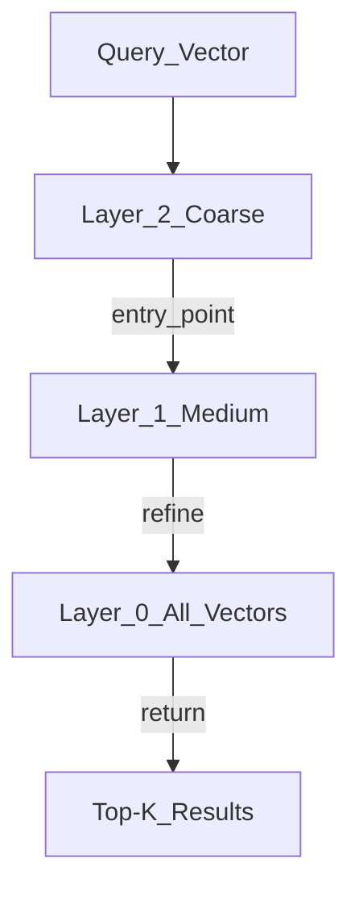

# ⚡ ANN Algorithms for Vector Search

> [!abstract] TL;DR
> Exact K-nearest-neighbor search scales as O(n·d) — too slow for millions of vectors. Approximate Nearest Neighbor (ANN) algorithms sacrifice a small fraction of accuracy for orders-of-magnitude speedup. **HNSW** (graph-based, default in most vector DBs) and **IVF** (cluster-based, used in FAISS) are the two dominant approaches. Understanding them lets you tune vector DBs for your latency/recall trade-off.

## Intuition — Analogy First

**Finding the nearest coffee shop:**

**Exact KNN** = walk to every coffee shop in the city, measure the distance to each, return the closest. O(n) — works for 10 shops, terrible for 10,000.

**IVF (Inverted File Index)** = look at a city map divided into districts (Voronoi cells). Find which district you're in, check only the shops in the 2-3 nearest districts. Fast, but might miss a shop just across a district boundary.

**HNSW (Hierarchical Navigable Small World)** = use a hierarchy of transit maps. At the top level: coarse map of cities (fast to scan). Navigate to the right city, then drill down to the neighborhood map, then the street map. Each level narrows the search. Like asking "which country → which city → which neighborhood → which street" rather than searching every street at once.

## How It Works — Mechanics

### 1. HNSW (Hierarchical Navigable Small World)

The **default algorithm** in Pinecone, Weaviate, Qdrant, Chroma, pgvector.

HNSW builds a **multi-layer graph**:
- **Layer 0**: all vectors, densely connected (many neighbors)
- **Layer 1**: subset of vectors, sparser connections
- **Layer 2**: smaller subset, even sparser
- **Layer L (top)**: very few vectors, very sparse

**Search algorithm** (greedy):
1. Start at a random entry point at the top layer
2. Greedily move to the neighbor closest to the query
3. When no neighbor is closer, descend to the next layer
4. Repeat until layer 0 — return top-K



**Key parameters**:
- `M` (max connections per node, default 16): higher → better recall, more memory
- `ef_construction` (candidates during build, default 200): higher → better graph quality, slower indexing
- `ef_search` (candidates during search, default 10): higher → better recall, slower search

### 2. IVF (Inverted File Index)

Used in **FAISS** (Facebook AI Similarity Search) and as a fallback in some vector DBs.

**Build phase**:
1. K-means cluster all vectors into `n_lists` Voronoi cells
2. Store each vector in its nearest centroid's list

**Search phase**:
1. Compute distance from query to all `n_lists` centroids
2. Search only the `n_probe` nearest cells (default: `n_probe=1`)
3. Return top-K from those cells

**Parameters**:
- `n_lists`: number of clusters (typical: $\sqrt{n}$ to $4\sqrt{n}$)
- `n_probe`: cells to search at query time (trade recall vs speed)

### 3. PQ (Product Quantization)

Compresses vectors for memory savings. Splits each $d$-dimensional vector into $m$ sub-vectors of $d/m$ dimensions, each quantized to one of $k=256$ centroids. Storage: $m$ bytes per vector (vs $d \times 4$ bytes for float32).

- Example: 1536-dim → split into 96 sub-vectors of 16 dims → 96 bytes/vector (vs 6144 bytes)
- Quality loss: 5-15% recall drop depending on compression level

**IVF + PQ** (most common FAISS config) = cluster for fast search + quantize for memory efficiency.

### Recall vs Speed Trade-off

| Algorithm | Recall@10 | QPS (1M vectors) | Memory |
|-----------|-----------|-----------------|--------|
| Exact KNN | 100% | ~100 | 4 GB |
| HNSW (M=16) | 99% | ~10,000 | 8 GB |
| IVF-Flat | 98% | ~2,000 | 4 GB |
| IVFPQ | 90% | ~20,000 | 0.4 GB |

## The Math

**Exact KNN complexity**: $O(n \cdot d)$ per query — linear in dataset size.

**HNSW construction complexity**: $O(n \log n)$ — each insertion traverses the hierarchy.

**HNSW search complexity**: $O(\log n)$ per query — traversal shortens exponentially at higher layers.

**IVF search complexity**: $O(n_{\text{probe}} \cdot n/n_{\text{lists}} \cdot d)$ — only search fraction of data.

**Recall@K definition**:
$$\text{recall@}K = \frac{|\text{ANN results}_K \cap \text{exact KNN results}_K|}{K}$$

Higher is better. Typical production target: recall@10 ≥ 0.95.

**HNSW memory**: each node stores $M$ neighbor IDs per layer.
$$\text{memory} = n \times (d \times 4 + M \times L_{\text{avg}} \times 4) \text{ bytes}$$

## Code Demo

```python
# ── FAISS: IndexHNSWFlat (best recall) ────────────────────────────────────
import faiss
import numpy as np

d = 384          # dimension
n = 100_000      # number of vectors

# Generate random vectors (replace with real embeddings)
np.random.seed(42)
vectors = np.random.rand(n, d).astype("float32")
faiss.normalize_L2(vectors)   # normalize for cosine similarity

# Build HNSW index
M = 32                              # max connections per node
ef_construction = 200               # candidates during indexing
index_hnsw = faiss.IndexHNSWFlat(d, M, faiss.METRIC_INNER_PRODUCT)
index_hnsw.hnsw.efConstruction = ef_construction
index_hnsw.add(vectors)

# Search
query = np.random.rand(1, d).astype("float32")
faiss.normalize_L2(query)

index_hnsw.hnsw.efSearch = 64       # candidates during search (tune for recall/speed)
k = 10
distances, indices = index_hnsw.search(query, k)
print(f"HNSW top-{k} indices: {indices[0]}")
print(f"HNSW scores: {distances[0]}")


# ── FAISS: IVF-PQ (high throughput, low memory) ───────────────────────────
n_lists = 1000       # Voronoi cells (~sqrt(n))
n_probe = 50         # cells to search (higher = better recall)
m_pq = 48            # PQ sub-vectors (must divide d evenly)
nbits = 8            # bits per sub-vector (256 centroids)

# IVF + PQ requires training
quantizer = faiss.IndexFlatIP(d)
index_ivfpq = faiss.IndexIVFPQ(quantizer, d, n_lists, m_pq, nbits,
                                faiss.METRIC_INNER_PRODUCT)
index_ivfpq.train(vectors)           # K-means clustering
index_ivfpq.add(vectors)
index_ivfpq.nprobe = n_probe

distances, indices = index_ivfpq.search(query, k)
print(f"\nIVF-PQ top-{k} indices: {indices[0]}")


# ── Recall@K evaluation ───────────────────────────────────────────────────
def compute_recall(approx_indices: np.ndarray, exact_indices: np.ndarray, k: int) -> float:
    """Compute recall@k: fraction of true nearest neighbors found."""
    recall_scores = []
    for approx, exact in zip(approx_indices, exact_indices):
        found = len(set(approx[:k]) & set(exact[:k]))
        recall_scores.append(found / k)
    return float(np.mean(recall_scores))

# Get exact results for comparison
index_exact = faiss.IndexFlatIP(d)
index_exact.add(vectors)

n_queries = 100
queries = np.random.rand(n_queries, d).astype("float32")
faiss.normalize_L2(queries)

_, exact_indices = index_exact.search(queries, k)
_, hnsw_indices = index_hnsw.search(queries, k)
_, ivfpq_indices = index_ivfpq.search(queries, k)

print(f"\nRecall@{k}:")
print(f"  HNSW: {compute_recall(hnsw_indices, exact_indices, k):.3f}")
print(f"  IVFPQ: {compute_recall(ivfpq_indices, exact_indices, k):.3f}")


# ── Save and load FAISS index ─────────────────────────────────────────────
faiss.write_index(index_hnsw, "hnsw_index.faiss")
loaded_index = faiss.read_index("hnsw_index.faiss")
```

## Real-World Example

**Meta (Facebook)** uses FAISS at billion-vector scale for content recommendation: every post, video, and user is embedded; when a user interacts with content, FAISS finds the 100 most similar items in milliseconds from a billion-item index. FAISS was open-sourced specifically to enable this.

**Pinecone** uses HNSW internally for its pod-based indexes. The reason HNSW dominates production vector DBs: it achieves >99% recall@10 at >10,000 QPS — good enough for enterprise SLAs.

**Spotify's music recommendation** uses ANN (HNSW) to find songs with similar audio features. Collab filtering embeddings → HNSW index → "you might also like" suggestions.

## Trade-offs

| Algorithm | Recall | Speed (QPS) | Memory | Build Time | Best For |
|-----------|--------|-------------|--------|-----------|----------|
| Exact Flat | 100% | Low | Baseline | None | <100K vectors |
| HNSW | 98-99% | Very high | 2x baseline | Medium | Production default |
| IVF-Flat | 96-99% | High | Baseline | Medium | Memory-constrained |
| IVFPQ | 88-96% | Very high | 10-100x smaller | High | Billion-scale |
| LSH | 80-90% | High | Low | Low | Legacy / streaming |

## When to Use vs Avoid

**Use HNSW when:**
- Default choice for <100M vectors
- Need high recall (>99%) + high throughput
- Memory is available (2x vector size overhead)

**Use IVF-PQ when:**
- Billion-scale indexes (memory is the constraint)
- Can tolerate 5-10% recall drop
- GPU inference (FAISS GPU indexes are IVF-based)

**Avoid exact search when:**
- More than ~100K vectors (query latency > 100ms)
- Concurrent requests at production scale

## Common Pitfalls

1. **Not tuning `ef_search`** — default value is very low; recall suffers. Fix: tune `ef_search` until recall@10 ≥ 0.95 on your data, then trade off with QPS.
2. **`n_lists` too small in IVF** — all vectors end up in a few cells, negating the speedup. Fix: use $n_{\text{lists}} \approx \sqrt{n}$ as starting point.
3. **Forgetting to train IVF** — `index.add()` before `index.train()` causes an error. Fix: always train before adding vectors.
4. **Not normalizing before inner product search** — inner product ≠ cosine similarity unless vectors are unit-normalized. Fix: `faiss.normalize_L2(vectors)`.
5. **Building HNSW on CPU then expecting GPU speed** — HNSW doesn't have GPU support in FAISS. Fix: use IVF-PQ for GPU, or use a dedicated vector DB.

## Related Concepts

- [[_MOC_Generative_AI|↑ Section MOC]]

- [[Vector_Databases_Overview]] — HNSW/IVF are the indexing layer inside vector DBs
- [[Embedding_Models]] — the vectors being indexed
- [[KNN]] — the exact algorithm ANN approximates
- [[Pinecone]] — managed HNSW under the hood
- [[Weaviate]] — open-source HNSW implementation

## Review Questions

1. Explain why HNSW achieves O(log n) search complexity despite having O(n) vectors. What is the role of the layer hierarchy, and what does "greedy search" mean in this context?
2. You have 10 million 768-dimensional vectors. You need recall@10 ≥ 0.95 and query latency < 5ms. Compare HNSW and IVFPQ configurations that could meet this SLA.
3. What does "recall@10 = 0.95" mean concretely, and why is 100% recall not always the right target for production systems?

## Sources

- Malkov, Y. & Yashunin, D. (2018). *Efficient and Robust Approximate Nearest Neighbor Search Using Hierarchical Navigable Small World Graphs*. IEEE TPAMI 2020. https://arxiv.org/abs/1603.09320
- Johnson, J. et al. (2019). *Billion-Scale Similarity Search with GPUs*. IEEE Big Data. https://arxiv.org/abs/1702.08734
- ANN-Benchmarks. http://ann-benchmarks.com/ — benchmark comparing ANN algorithms
- Pinecone Learning Center: Understanding HNSW. https://www.pinecone.io/learn/hnsw/

#ann #hnsw #faiss #ivf #product-quantization #vector-search #algorithms #vector-database
