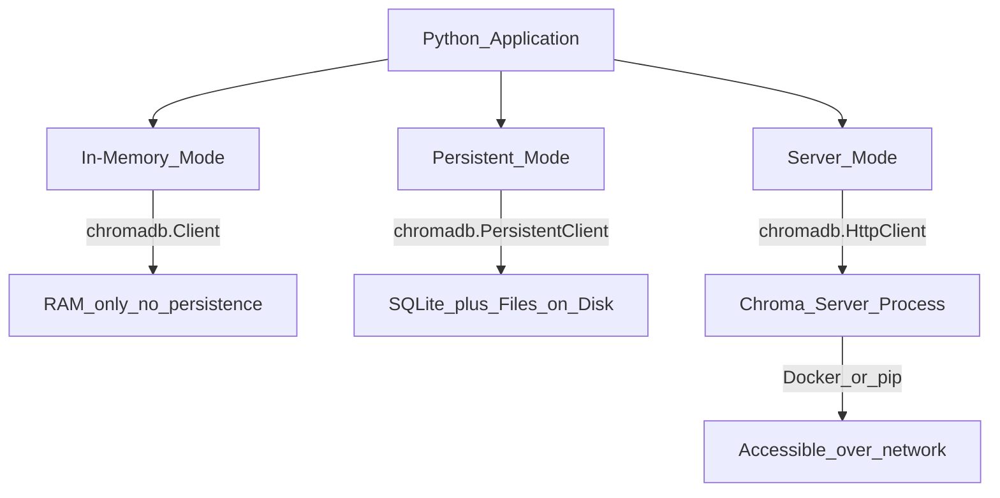

# 🎨 Chroma

> [!abstract] TL;DR
> Chroma is the SQLite of vector databases — lightweight, embeddable, zero configuration. It runs in-process (no separate server), supports persistent storage, and has built-in embedding functions for OpenAI and HuggingFace. It's the fastest way to get a RAG prototype running, and scales to small/medium production workloads (<5M vectors).

## Intuition — Analogy First

**SQLite vs PostgreSQL** is the perfect analogy.

SQLite: no server to start, no config to write, just `import sqlite3` and you have a database. Perfect for apps, scripts, prototypes, and small-scale production. Embedded directly in your application.

PostgreSQL: separate process, configuration, connection pooling, backups — powerful, scalable, but requires ops work.

Chroma is SQLite for vectors: `import chromadb` and you're running vector search in your Python process. No Docker, no API keys, no cloud account. Just code.

When you outgrow SQLite, you move to PostgreSQL. When you outgrow Chroma, you move to Pinecone or Weaviate. But you'd be surprised how far SQLite takes you — and how far Chroma does too.

## How It Works — Mechanics

### Deployment Modes



**In-memory** (`chromadb.EphemeralClient()`): data is lost when the process exits. Best for testing and unit tests.

**Persistent** (`chromadb.PersistentClient(path="./db")`): stores data in a local directory using SQLite + files. Best for development and small production deployments.

**Server mode** (`chromadb.HttpClient(host="...", port=8000)`): Chroma runs as a separate HTTP server. Client connects over the network. Supports multiple concurrent clients.

### Core Concepts

| Concept | Description |
|---------|-------------|
| **Client** | Entry point — creates and manages collections |
| **Collection** | Named group of embeddings (like a table) |
| **Document** | The original text content |
| **Embedding** | The vector representation (auto-generated or provided) |
| **Metadata** | JSON dict stored alongside each document |
| **ID** | Unique identifier for each record |

### Embedding Functions

Chroma has built-in embedding function wrappers:
- `OpenAIEmbeddingFunction` — calls OpenAI Embeddings API
- `HuggingFaceEmbeddingFunction` — calls HuggingFace Inference API
- `SentenceTransformerEmbeddingFunction` — runs sentence-transformers locally
- `DefaultEmbeddingFunction` — runs `all-MiniLM-L6-v2` locally (no API key needed)

## The Math

Chroma uses HNSW for indexing (via the `hnswlib` Python library). Similarity metrics:
- `cosine` (default for text)
- `l2` (Euclidean)
- `ip` (inner product)

**Distance to similarity**: Chroma returns distances (lower = more similar). For cosine: `similarity = 1 - distance`.

**Capacity limits**:
- In-memory: bounded by RAM (practical limit ~5M vectors for typical hardware)
- Persistent: bounded by disk space; loaded into RAM on query

## Code Demo

```python
# ── 1. Install: pip install chromadb sentence-transformers ─────────────────

# ── 2. In-memory (ephemeral) — for tests ──────────────────────────────────
import chromadb
from chromadb.utils import embedding_functions

# Default embedding function (runs all-MiniLM-L6-v2 locally, no API key)
default_ef = embedding_functions.DefaultEmbeddingFunction()

client_mem = chromadb.EphemeralClient()
collection_mem = client_mem.create_collection(
    name="test",
    embedding_function=default_ef,
    metadata={"hnsw:space": "cosine"},
)

# ── 3. Persistent mode — for development and small production ─────────────
client = chromadb.PersistentClient(path="./chroma_storage")

# Get or create (idempotent — safe to call on startup)
collection = client.get_or_create_collection(
    name="knowledge_base",
    embedding_function=embedding_functions.OpenAIEmbeddingFunction(
        api_key="your-openai-api-key",
        model_name="text-embedding-3-small",
    ),
    metadata={"hnsw:space": "cosine"},
)

# ── 4. Add documents ───────────────────────────────────────────────────────
collection.add(
    ids=["doc1", "doc2", "doc3", "doc4", "doc5"],
    documents=[
        "Chroma is a lightweight open-source vector database",
        "RAG combines retrieval-augmented generation with LLMs",
        "HNSW is an efficient approximate nearest neighbor algorithm",
        "Python is widely used for machine learning and data science",
        "Neural networks learn patterns from large datasets",
    ],
    metadatas=[
        {"source": "documentation", "topic": "databases", "year": 2024},
        {"source": "blog", "topic": "ai", "year": 2024},
        {"source": "paper", "topic": "algorithms", "year": 2023},
        {"source": "wiki", "topic": "programming", "year": 2024},
        {"source": "textbook", "topic": "ai", "year": 2023},
    ],
)

# ── 5. Query ──────────────────────────────────────────────────────────────
results = collection.query(
    query_texts=["how do vector search algorithms work?"],
    n_results=3,
    where={"topic": {"$in": ["ai", "algorithms"]}},  # metadata pre-filter
    include=["documents", "distances", "metadatas"],
)

print("Query results:")
for doc, dist, meta in zip(
    results["documents"][0],
    results["distances"][0],
    results["metadatas"][0],
):
    similarity = 1 - dist  # cosine distance to similarity
    print(f"  Sim: {similarity:.4f} | {doc[:60]}... | topic: {meta['topic']}")

# ── 6. Update and delete ──────────────────────────────────────────────────
collection.update(
    ids=["doc1"],
    documents=["Chroma is a lightweight open-source vector database for RAG"],
    metadatas=[{"source": "documentation", "topic": "databases", "year": 2025}],
)

collection.delete(ids=["doc5"])

print(f"\nCollection count: {collection.count()}")  # 4

# ── 7. Server mode setup ──────────────────────────────────────────────────
# Terminal: chroma run --path /chroma_storage --port 8000
# OR: docker run -p 8000:8000 chromadb/chroma

client_http = chromadb.HttpClient(host="localhost", port=8000)
# Same API — just connects over HTTP

# ── 8. With LangChain (most common usage pattern) ─────────────────────────
from langchain_community.vectorstores import Chroma
from langchain_openai import OpenAIEmbeddings
from langchain.text_splitter import RecursiveCharacterTextSplitter
from langchain_community.document_loaders import TextLoader

embeddings = OpenAIEmbeddings(model="text-embedding-3-small")

# Create from documents (LangChain wrapper)
texts = ["Document 1 content...", "Document 2 content...", "Document 3 content..."]
vectorstore = Chroma.from_texts(
    texts=texts,
    embedding=embeddings,
    persist_directory="./langchain_chroma",
    collection_name="my_docs",
)

# Similarity search
docs = vectorstore.similarity_search("query text", k=3)
docs_with_scores = vectorstore.similarity_search_with_score("query text", k=3)

# As retriever (for use in LangChain chains)
retriever = vectorstore.as_retriever(
    search_type="mmr",           # Maximum Marginal Relevance (diverse results)
    search_kwargs={"k": 5, "fetch_k": 20},
)
```

## Real-World Example

**Most LangChain and LlamaIndex tutorials** use Chroma as the default vector store because it requires zero setup — no account, no Docker, no API key — just `pip install chromadb`. This has made it the most-used vector DB in the developer ecosystem for learning and prototyping.

**Small-scale production RAG**: a legal firm's internal knowledge base (10K documents, ~500K vectors) runs perfectly on Chroma in persistent mode. The team avoided Pinecone costs and operational complexity for a system serving 20 internal users.

## Trade-offs

| Dimension | Chroma | Pinecone | Weaviate |
|-----------|--------|----------|---------|
| Setup time | 0 minutes | 5 minutes | 15+ minutes |
| Infrastructure | None | None | Docker or cloud |
| Scale | <5M vectors | <100M vectors | <1B vectors |
| Features | Basic | Namespaces, hybrid | Full-featured |
| Cost | Free (compute) | $$$ | Free OSS / $$$ cloud |

## When to Use vs Avoid

**Use Chroma when:**
- Prototyping RAG (fastest to get running)
- Learning vector databases
- Small production (<1M vectors)
- Need local / offline operation
- Cost-sensitive (free)

**Avoid Chroma when:**
- Need >5M vectors in production
- Need multi-tenancy with strong isolation
- Need managed uptime SLA
- Hybrid search is important

## Common Pitfalls

1. **Persistent client not specifying path** — data is ephemeral without a path. Fix: always use `PersistentClient(path="./db")` for data that should survive restarts.
2. **Duplicate IDs** — `add()` with an existing ID raises an error. Fix: use `upsert()` to handle both insert and update.
3. **Not specifying embedding function consistently** — the function used at creation must be reused when loading. Fix: define embedding function as a constant and reuse it.
4. **n_results > collection size** — Chroma raises an error if you request more results than exist. Fix: `n_results = min(n_results, collection.count())`.
5. **Thread safety** — Chroma's default client is not thread-safe. Fix: use a single client per process; for multi-threaded serving, use server mode.

## Related Concepts

- [[_MOC_Generative_AI|↑ Section MOC]]

- [[Vector_Databases_Overview]] — comparison of all options
- [[pgvector]] — another free option, but inside PostgreSQL
- [[Pinecone]] — managed cloud alternative when you outgrow Chroma
- [[ANN_Algorithms]] — HNSW internals (via hnswlib)
- [[RAG_Overview]] — Chroma's primary use case

## Review Questions

1. What are the three deployment modes of Chroma and when would you choose each? What changes when you switch from persistent to server mode in terms of client code?
2. Chroma returns "distances" not "scores." For cosine metric, how do you convert a distance of 0.15 to a similarity score, and what does that score mean intuitively?
3. Your Chroma collection has grown to 10 million documents and query latency has increased to 2 seconds. Walk through two migration strategies: staying with Chroma (hardware optimization) and migrating to Pinecone (data migration steps).

## Sources

- Chroma Documentation. https://docs.trychroma.com/
- Chroma GitHub. https://github.com/chroma-core/chroma
- LangChain + Chroma Integration. https://python.langchain.com/docs/integrations/vectorstores/chroma
- Chroma: Getting Started Guide. https://docs.trychroma.com/getting-started

#chroma #chromadb #vector-database #open-source #prototyping #rag #langchain #sqlite-of-vectors
