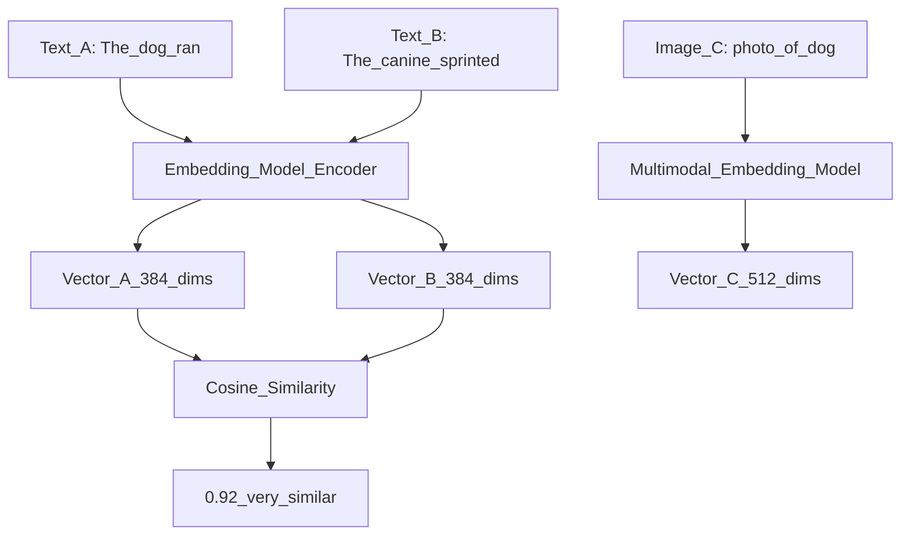

# 🎯 Embedding Models

> [!abstract] TL;DR
> Embedding models convert text (or images, code, etc.) into dense numerical vectors where semantic similarity is preserved — similar meanings end up as nearby vectors. They are the bridge between raw content and vector databases. Choosing the right embedding model (dimension size, domain, language) is one of the highest-impact decisions in any RAG or semantic search system.

## Intuition — Analogy First

**GPS coordinates for meaning.**

Every city on Earth has a latitude and longitude. Two cities that are geographically close have similar coordinates. You can measure the distance between any two cities by computing the distance between their coordinates.

Embedding models do the same for meaning: every sentence gets assigned coordinates in a high-dimensional space. "The dog ran fast" and "The canine sprinted quickly" end up at very similar coordinates — even though they share no words. "Quantum entanglement" ends up far away from both.

These coordinates are the embedding vector. The embedding model is the function that assigns coordinates. A good embedding model is one where the coordinate system accurately reflects semantic relationships.

## How It Works — Mechanics

### The Embedding Pipeline



### Model Families

**Text Embeddings (Sentence-Transformers)**

Fine-tuned BERT/RoBERTa variants, optimized for semantic similarity:

| Model | Dims | Speed | Quality | Notes |
|-------|------|-------|---------|-------|
| all-MiniLM-L6-v2 | 384 | Very fast | Good | Best default for prototyping |
| all-mpnet-base-v2 | 768 | Fast | Better | Better quality, 2x larger |
| BGE-large-en-v1.5 | 1024 | Medium | Excellent | MTEB top performer (English) |
| E5-large-v2 | 1024 | Medium | Excellent | Add "query:" / "passage:" prefix |
| nomic-embed-text | 768 | Fast | Excellent | Long context (8192 tokens) |

**API Embeddings**

| Model | Dims | Notes |
|-------|------|-------|
| OpenAI text-embedding-3-small | 1536 | Good quality, cheap, resizable |
| OpenAI text-embedding-3-large | 3072 | Best quality, resizable to any dim |
| Cohere embed-v3.0 | 1024 | Multilingual, task-type aware |
| Google textembedding-gecko | 768 | Good multilingual |

**Image Embeddings**
- **CLIP** (OpenAI): aligns text and image in shared space — can retrieve images by text queries
- **DINO** / **DINOv2** (Meta): self-supervised image features, excellent for visual similarity

**Code Embeddings**
- **CodeBERT**: code + natural language
- **UniXcoder**: multi-task code understanding

### What Makes a Good Embedding Model?

1. **Semantic similarity preserved** — "cat" and "feline" are close; "cat" and "database" are far
2. **Isotropy** — vectors spread across the space, not all clustered near the origin
3. **Task alignment** — retrieval embeddings optimized for asymmetric tasks (short query → long passage), vs classification embeddings

### MTEB Benchmark

The **Massive Text Embedding Benchmark** (MTEB) is the standard for evaluating embedding models across 56 tasks (retrieval, clustering, classification, etc.).

Top performers (2024): BGE-large, E5-mistral-7b-instruct, text-embedding-3-large, GTE-Qwen2-7B-instruct.

## The Math

An embedding model $f_\theta$ maps text to a vector:
$$f_\theta: \text{text} \rightarrow \mathbb{R}^d$$

**Training objective** (contrastive learning):
$$\mathcal{L} = -\log \frac{\exp(\text{sim}(f(a_i), f(p_i)) / \tau)}{\sum_j \exp(\text{sim}(f(a_i), f(p_j)) / \tau)}$$

Where:
- $a_i$ = anchor sentence
- $p_i$ = positive (semantically similar) sentence
- $\tau$ = temperature
- All other $p_j$ in the batch are negatives

**Cosine similarity**:
$$\text{sim}(a, b) = \frac{a \cdot b}{\|a\| \cdot \|b\|}$$

**Dimension trade-off**: larger $d$ → more expressive but more memory. For 1M documents:
- $d=384$: 1.5 GB (float32)
- $d=1536$: 6 GB (float32)
- $d=3072$: 12 GB (float32)

**Matryoshka Representation Learning (MRL)**: text-embedding-3 models can be truncated to smaller dimensions with minimal quality loss — e.g., use $d=256$ instead of $d=1536$ for 6x memory savings.

## Code Demo

```python
# ── Sentence-Transformers (local, free, fast) ─────────────────────────────
from sentence_transformers import SentenceTransformer, util
import torch

model = SentenceTransformer("all-MiniLM-L6-v2")

sentences = [
    "The quick brown fox jumps over the lazy dog",
    "A fast auburn fox leaps above a sleepy canine",
    "Machine learning is a subset of artificial intelligence",
    "Deep learning uses neural networks with many layers",
    "The stock market closed higher today",
]

embeddings = model.encode(sentences, convert_to_tensor=True, normalize_embeddings=True)
print(f"Embedding shape: {embeddings.shape}")  # (5, 384)

# Pairwise similarity
similarity_matrix = util.cos_sim(embeddings, embeddings)
print("\nSimilarity matrix (first 3x3):")
for i in range(3):
    for j in range(3):
        print(f"  [{i},{j}] {similarity_matrix[i][j]:.3f}")

# ── Semantic search: asymmetric retrieval ─────────────────────────────────
query = "how do neural networks learn?"
corpus = [
    "Neural networks learn by adjusting weights through backpropagation",
    "The Eiffel Tower is in Paris, France",
    "Gradient descent minimizes the loss function in deep learning",
    "Pizza originated in Naples, Italy",
    "Transformers use self-attention to process sequences",
]

model_retrieval = SentenceTransformer("BAAI/bge-large-en-v1.5")

# BGE requires specific prefixes for asymmetric retrieval
query_embedding = model_retrieval.encode(f"Represent this sentence for searching: {query}",
                                          normalize_embeddings=True)
corpus_embeddings = model_retrieval.encode(corpus, normalize_embeddings=True)

scores = util.cos_sim(query_embedding, corpus_embeddings)[0]
top_k = torch.topk(scores, k=3)

print(f"\nQuery: {query}")
for score, idx in zip(top_k.values, top_k.indices):
    print(f"  Score: {score:.4f} | {corpus[idx]}")

# ── OpenAI Embeddings (API, higher quality) ──────────────────────────────
from openai import OpenAI
import numpy as np

client = OpenAI()

def get_embedding(text: str, model: str = "text-embedding-3-small") -> list[float]:
    """Get embedding from OpenAI API."""
    response = client.embeddings.create(input=text, model=model)
    return response.data[0].embedding

def cosine_similarity(a: list, b: list) -> float:
    a_arr, b_arr = np.array(a), np.array(b)
    return float(np.dot(a_arr, b_arr) / (np.linalg.norm(a_arr) * np.linalg.norm(b_arr)))

# Matryoshka: truncate to smaller dimension
def get_embedding_truncated(text: str, dims: int = 256) -> list[float]:
    response = client.embeddings.create(
        input=text,
        model="text-embedding-3-small",
        dimensions=dims,   # MRL: truncate to dims, re-normalized automatically
    )
    return response.data[0].embedding

# ── MTEB evaluation snippet ───────────────────────────────────────────────
# pip install mteb
from mteb import MTEB
from sentence_transformers import SentenceTransformer

model = SentenceTransformer("BAAI/bge-small-en-v1.5")
evaluation = MTEB(tasks=["NFCorpus"])  # one retrieval task
results = evaluation.run(model, output_folder="mteb_results/")
```

## Real-World Example

**OpenAI text-embedding-3-large** (3072 dimensions) powers enterprise search at companies like Shopify and Zapier. It reduced the embedding size by 5x compared to ada-002 while improving MTEB scores by 20%, making production RAG both cheaper and more accurate.

**Cohere Embed v3** introduced task-type-aware embeddings: you specify `input_type="search_query"` or `input_type="search_document"` and the model produces different embeddings optimized for the asymmetric retrieval task — query embedding and passage embedding live in compatible but different subspaces.

## Trade-offs

| Dimension | Local (sentence-transformers) | API (OpenAI/Cohere) |
|-----------|------------------------------|---------------------|
| Cost | Free (compute) | $$$ per token |
| Latency | Fast (GPU) / slower (CPU) | ~50ms per batch |
| Privacy | Data stays local | Data sent to API |
| Quality | Very good (BGE, E5) | Best (text-embedding-3-large) |
| Maintenance | Model updates, infra | Zero maintenance |

## When to Use vs Avoid

**Use smaller models (all-MiniLM, all-mpnet) when:**
- Prototyping or cost-sensitive
- Latency is critical (local GPU inference)
- English-only, general text

**Use larger/API models (BGE-large, text-embedding-3-large) when:**
- Production RAG where quality matters
- Multilingual or domain-specific content
- Can afford the cost/latency

**Avoid**:
- Don't mix embedding models between indexing and querying
- Don't use word embeddings (Word2Vec) for sentence similarity — use sentence-level models

## Common Pitfalls

1. **Using bag-of-words model for semantic similarity** — TF-IDF finds keyword overlap, not meaning. Fix: use sentence-transformers.
2. **Mixing models** — indexing with model A, querying with model B gives garbage results. Fix: one model per index, documented and enforced.
3. **Not normalizing** — using dot product on unnormalized vectors gives length-biased results. Fix: normalize to unit length and use cosine similarity, or use models that output normalized vectors.
4. **Ignoring domain shift** — using a general model for legal/medical/code without fine-tuning. Fix: domain-specific models or fine-tune on in-domain data.
5. **Token length overflow** — input longer than model's max tokens gets silently truncated. Fix: chunk documents before embedding; check `model.max_seq_length`.

## Related Concepts

- [[_MOC_Generative_AI|↑ Section MOC]]

- [[Vector_Databases_Overview]] — where embeddings are stored and searched
- [[Word_Embeddings]] — earlier embedding approaches (Word2Vec, GloVe, FastText)
- [[ANN_Algorithms]] — how embedding vectors are indexed for fast search
- [[RAG_Overview]] — embedding models are the core of RAG retrieval

## Review Questions

1. Why does the cosine similarity between embedding vectors capture semantic relatedness better than Euclidean distance for text embeddings? Under what conditions does Euclidean distance become appropriate?
2. Your RAG system's retrieval quality is poor despite using a good LLM. You've noticed your embedding model was trained on Wikipedia. Your documents are legal contracts. What three approaches can improve retrieval without changing the LLM?
3. Explain Matryoshka Representation Learning: how can you truncate a 3072-dimensional embedding to 256 dimensions without re-embedding, and why does this work at all?

## Sources

- Reimers, N. & Gurevych, I. (2019). *Sentence-BERT: Sentence Embeddings using Siamese BERT-Networks*. EMNLP 2019.
- Muennighoff, N. et al. (2022). *MTEB: Massive Text Embedding Benchmark*. https://arxiv.org/abs/2210.07316
- Kusupati, A. et al. (2022). *Matryoshka Representation Learning*. NeurIPS 2022. https://arxiv.org/abs/2205.13147
- Xiao, S. et al. (2023). *C-Pack: Packaged Resources to Advance General Chinese Embedding*. BGE paper. https://arxiv.org/abs/2309.07597

#embeddings #sentence-transformers #bge #e5 #openai-embeddings #semantic-search #mteb
