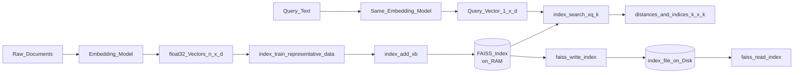
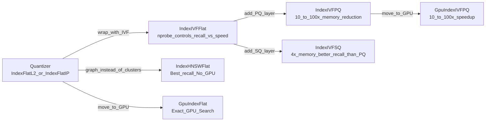

# FAISS (Facebook AI Similarity Search)

> [!abstract] TL;DR
> FAISS is Meta's open-source C++/Python library for efficient similarity search and clustering of dense vectors. It is not a database — it has no persistence layer, no metadata filtering, and no REST API. What it does have is unmatched raw indexing power: GPU-accelerated ANN search, billion-scale IVF-PQ indexes, and a composable index family (Flat, IVF, HNSW, PQ, SQ) that gives you surgical control over the recall-speed-memory triangle. Use it when speed is the constraint and you're willing to own the infrastructure.

---

## Intuition

**Analogy:** Imagine you have a warehouse with a billion labeled boxes, each containing a fingerprint. You need to find the 10 boxes whose fingerprints most resemble a new one in under a millisecond.

Brute force (exact search) = open every box, compare every fingerprint. Accurate, but physically impossible at a billion boxes. FAISS gives you a smarter warehouse layout. **IndexFlatL2** still opens every box — perfect recall, but only viable when the warehouse is small. **IndexIVFFlat** first organizes boxes into labeled zones (clusters), then only checks the 3-5 nearest zones — you might miss a box right at a zone boundary, but you finish in a fraction of the time. **IndexIVFPQ** goes further: it shrinks each fingerprint to a compact sketch (Product Quantization), so the same warehouse fits into a single truck instead of a fleet.

FAISS is the warehouse architect. Your embedding model packs the boxes; FAISS decides how to lay them out for fast retrieval.

---

## How It Works

### Core Index Types

FAISS indexes are composable — complex indexes wrap simpler ones (called the **quantizer**). Understanding each layer demystifies the configuration.

| Index | Full Name | Recall | Speed | Memory | Training | GPU |
|-------|-----------|--------|-------|--------|----------|-----|
| `IndexFlatL2` | Exact L2 brute-force | 100% | Low | 1x | None | Yes |
| `IndexFlatIP` | Exact inner product | 100% | Low | 1x | None | Yes |
| `IndexIVFFlat` | IVF + exact within clusters | 95-99% | Medium | 1x | Required | Yes |
| `IndexIVFPQ` | IVF + Product Quantization | 88-96% | Very High | 0.01-0.05x | Required | Yes |
| `IndexHNSWFlat` | HNSW navigable graph | 98-99% | Very High | 2x | None | No |
| `IndexIVFSQ` | IVF + Scalar Quantization | 95-98% | High | 0.25x | Required | Yes |

**IndexFlatL2 / IndexFlatIP** — The baseline. Computes exact distance to every vector. `IndexFlatL2` uses squared Euclidean distance; `IndexFlatIP` uses inner product (equals cosine similarity when vectors are L2-normalized). Use as a correctness reference or for datasets under 100K vectors.

**IndexIVFFlat** — Runs k-means to create `n_lists` Voronoi cells at training time. At search time, computes distance from the query to all centroids, then searches only the nearest `nprobe` cells. The ratio `nprobe / n_lists` determines the recall-speed trade-off. Rule of thumb: `n_lists ≈ sqrt(n_total)`, `nprobe ≈ sqrt(n_lists)`.

**IndexIVFPQ** — Stacks Product Quantization (PQ) on top of IVF. PQ splits each `d`-dimensional vector into `m` sub-vectors of `d/m` dimensions and quantizes each to one of 256 centroids (8 bits). Storage drops from `d × 4` bytes (float32) to `m` bytes per vector — 10-100x compression with typically 5-12% recall loss. This is the FAISS workhorse for billion-scale deployments.

**IndexHNSWFlat** — Builds a Hierarchical Navigable Small World graph (see [[ANN_Algorithms]]). Greedy graph traversal across layers achieves O(log n) search. Best recall-QPS tradeoff for medium datasets. Key limitation: no GPU support in FAISS; for GPU workloads, use IVF-based indexes.

**IndexIVFSQ** — Scalar Quantization compresses each float32 component to an 8-bit or 4-bit integer. Simpler than PQ, faster encode/decode, better recall than PQ at the same compression level, but larger footprint than PQ at extreme compression ratios.

### The Quantizer Pattern

FAISS indexes are compositional: `IndexIVFFlat` wraps a flat quantizer (`IndexFlatL2`) that measures distances to IVF centroids. `IndexIVFPQ` wraps the same quantizer but adds PQ encoding on top. This pattern means you build indexes from parts:

```
Quantizer (measures centroid distances)
  └─> IVF (partitions vectors into cells)
        └─> PQ or SQ (compresses each vector inside a cell)
```

### Training Indexes

Any index containing `IVF` or `PQ` in its name **requires a training step**. Training runs k-means on representative data to learn cluster centroids and PQ codebooks. Rules:

- Training data must be **representative** of your actual vectors (same embedding model, same domain).
- Minimum training size: `n_lists × 39` vectors (FAISS enforces this internally).
- Training is one-time: train once, then call `index.add()` as many times as needed.
- `index.is_trained` is `False` until training completes. Calling `add()` before `train()` raises a runtime error.

### GPU FAISS

FAISS has GPU-accelerated counterparts for Flat and IVF-based indexes (not HNSW — HNSW is CPU-only). GPU indexes deliver 10-100x speedup over CPU for large batch queries.

```python
# Requires: pip install faiss-gpu
res = faiss.StandardGpuResources()
gpu_index = faiss.index_cpu_to_gpu(res, device=0, index=cpu_index)
distances, indices = gpu_index.search(query_vecs, k)
```

The `GpuIndexIVFPQ` variant is the standard choice for billion-scale GPU deployments. Note: GPU FAISS indexes cannot be directly saved — convert to CPU first (`faiss.index_gpu_to_cpu(gpu_index)`), then `faiss.write_index()`.

### Similarity Metrics

| Metric | FAISS Constant | Use Case |
|--------|---------------|----------|
| L2 (Euclidean squared) | `faiss.METRIC_L2` | Image embeddings, spatial data |
| Inner product | `faiss.METRIC_INNER_PRODUCT` | Cosine similarity with normalized vectors |

Cosine similarity is **not a native metric** in FAISS. To get cosine similarity, normalize all vectors to unit length with `faiss.normalize_L2(vectors)` before indexing, then use `METRIC_INNER_PRODUCT`. The inner product of two unit vectors equals their cosine similarity.

### Core API

```
index.add(xb)                     # add n × d float32 matrix; IDs are 0, 1, 2...
index.add_with_ids(xb, ids)       # only IndexIDMap supports this
D, I = index.search(xq, k)       # xq: n_queries × d; D: distances, I: indices (both n × k)
index.nprobe = 32                 # tune at query time (IVF indexes only)
faiss.write_index(index, path)    # serialize to disk
index = faiss.read_index(path)    # deserialize from disk
```

### ID Mapping

By default FAISS assigns sequential 0-based integer IDs. To preserve your own IDs (e.g., database primary keys), wrap any index with `IndexIDMap`:

```python
sub_index = faiss.IndexFlatIP(d)
id_index = faiss.IndexIDMap(sub_index)
id_index.add_with_ids(vectors, custom_ids)   # custom_ids: int64 numpy array
D, I = id_index.search(query, k)             # I contains your original IDs
```

`IndexIDMap2` additionally supports removal by ID (`remove_ids()`).

### Flow: End-to-End FAISS Pipeline



### FAISS Index Family



---

## Code Demo

```python
import faiss
import numpy as np

# ── Configuration ──────────────────────────────────────────────────────────
d = 512          # vector dimension
n_train = 50_000 # representative samples for training (>= 39 * n_lists)
n_total = 500_000 # total vectors to index
k = 10           # top-k neighbors

np.random.seed(42)
train_vecs = np.random.rand(n_train, d).astype("float32")
index_vecs = np.random.rand(n_total, d).astype("float32")
query_vecs = np.random.rand(5, d).astype("float32")

# Normalize for cosine similarity (inner product on unit vectors == cosine)
faiss.normalize_L2(train_vecs)
faiss.normalize_L2(index_vecs)
faiss.normalize_L2(query_vecs)

# ── Build IndexIVFPQ ───────────────────────────────────────────────────────
n_lists = 1024   # Voronoi cells; rule of thumb: sqrt(n_total)
m_pq = 64        # PQ sub-vectors; must evenly divide d; d/m_pq = 8 dims each
nbits = 8        # 8 bits → 256 centroids/sub-vector → 1 byte/sub-vector

quantizer = faiss.IndexFlatIP(d)   # measures distances to IVF centroids
index = faiss.IndexIVFPQ(
    quantizer, d, n_lists, m_pq, nbits,
    faiss.METRIC_INNER_PRODUCT,
)

# ── Step 1: Train (required for IVF and PQ) ───────────────────────────────
assert not index.is_trained, "Must train before adding vectors"
index.train(train_vecs)            # learns IVF centroids + PQ codebooks
assert index.is_trained

raw_bytes = d * 4
pq_bytes = m_pq * 1               # 1 byte per sub-vector (8-bit encoding)
print(f"Memory per vector: {raw_bytes} bytes raw → {pq_bytes} bytes PQ "
      f"({raw_bytes / pq_bytes:.0f}x reduction)")

# ── Step 2: Add vectors ────────────────────────────────────────────────────
index.add(index_vecs)              # IDs assigned as 0, 1, 2, ..., n_total-1
print(f"Indexed {index.ntotal} vectors")

# ── Step 3: Search ────────────────────────────────────────────────────────
# nprobe: search nearest n_probe clusters out of n_lists at query time
# Higher nprobe → better recall, more latency. Tune empirically.
index.nprobe = 32

distances, indices = index.search(query_vecs, k)
print(f"\nQuery 0: top-{k} IDs     = {indices[0]}")
print(f"Query 0: top-{k} scores  = {distances[0].round(4)}")

# ── Step 4: Evaluate recall vs baseline ───────────────────────────────────
baseline = faiss.IndexFlatIP(d)    # exact search for ground truth
baseline.add(index_vecs)

n_eval = 100
eval_queries = np.random.rand(n_eval, d).astype("float32")
faiss.normalize_L2(eval_queries)

_, exact_ids = baseline.search(eval_queries, k)
_, approx_ids = index.search(eval_queries, k)

recall_scores = [
    len(set(approx[:k]) & set(exact[:k])) / k
    for approx, exact in zip(approx_ids, exact_ids)
]
print(f"\nRecall@{k} with nprobe={index.nprobe}: {np.mean(recall_scores):.3f}")

# ── Step 5: Save and reload ────────────────────────────────────────────────
faiss.write_index(index, "ivfpq_index.faiss")
reloaded = faiss.read_index("ivfpq_index.faiss")
reloaded.nprobe = 32               # nprobe is NOT persisted — reset after load
_, reloaded_ids = reloaded.search(query_vecs, k)
assert np.array_equal(indices, reloaded_ids), "Results must match after reload"
print("\nIndex persisted and reloaded successfully.")

# ── IndexIDMap: map custom integer IDs ────────────────────────────────────
# Use this when FAISS's 0-based IDs don't match your application's IDs.
sub_index = faiss.IndexFlatIP(d)
id_index = faiss.IndexIDMap(sub_index)

db_ids = np.array([10001, 20002, 30003, 40004, 50005], dtype=np.int64)
sample_vecs = np.random.rand(5, d).astype("float32")
faiss.normalize_L2(sample_vecs)

id_index.add_with_ids(sample_vecs, db_ids)
_, returned_ids = id_index.search(sample_vecs[:1], k=3)
print(f"\nIndexIDMap returned IDs: {returned_ids[0]}")
# Output: [10001, 20002, 30003] — your original database primary keys

# ── GPU FAISS (uncomment if faiss-gpu is installed) ────────────────────────
# res = faiss.StandardGpuResources()
# gpu_index = faiss.index_cpu_to_gpu(res, device=0, index=index)
# distances_gpu, indices_gpu = gpu_index.search(query_vecs, k)
# # Convert back before saving:
# cpu_index = faiss.index_gpu_to_cpu(gpu_index)
# faiss.write_index(cpu_index, "gpu_index_cpu_copy.faiss")
```

---

## Real-World Example

> **Meta (Facebook) Content Recommendation at Billion Scale.** Every post, video, Reel, and user profile on Facebook is embedded into a dense vector. When a user opens their feed, Meta's retrieval system uses `GpuIndexIVFPQ` to find the 500 most similar items from a corpus of billions in under 10ms — on a GPU cluster, not a CPU farm. The IVF partitioning narrows the search to a small fraction of the index; PQ compression lets the entire corpus fit in GPU VRAM. FAISS was open-sourced specifically because Meta needed a library, not a managed service, to achieve this throughput at this cost. The original FAISS paper ("Billion-Scale Similarity Search with GPUs", Johnson et al. 2019) reports 1 billion vector queries processed per second on a single GPU server.

---

## Trade-offs

| Index Type | Recall@10 | QPS (1M vecs) | Memory vs Raw | Training | GPU Support | Best For |
|------------|-----------|--------------|---------------|----------|-------------|----------|
| `IndexFlatL2/IP` | 100% | ~100 | 1x | None | Yes | Baselines, <100K vecs |
| `IndexIVFFlat` | 95-99% | ~2,000 | 1x | Required | Yes | Balanced, tunable nprobe |
| `IndexIVFPQ` | 88-96% | ~25,000 | 0.01-0.05x | Required | Yes | Billion-scale, GPU |
| `IndexHNSWFlat` | 98-99% | ~15,000 | 2x | None | No | Production CPU default |

---

## FAISS vs Managed Vector Databases

FAISS is a **library**, not a database. This distinction matters enormously in production.

| Capability | FAISS | Pinecone / Qdrant | pgvector |
|------------|-------|------------------|---------|
| Persistence | Manual (`write_index`) | Built-in | PostgreSQL native |
| Metadata filtering | Not built-in | First-class | SQL `WHERE` clause |
| REST API | None | Full HTTP API | Via PostgREST / psql |
| Multi-tenancy | DIY (separate indexes) | Namespaces / tenants | Row-level security |
| GPU support | Yes (first-class) | No | No |
| Billion-scale | Yes (IVF-PQ) | Enterprise tier | Degrades at scale |
| Ops burden | High (your infra) | Zero | Low (Postgres ops) |

Use FAISS when: you need GPU-accelerated search, maximum raw throughput, offline batch ANN, or research flexibility. Pair FAISS with a metadata store (DynamoDB, Redis, Postgres) to handle filtering and ID-to-content lookups that FAISS cannot do natively.

---

## Production Considerations

**RAM requirements** are the first bottleneck to plan for:

| Index | 1B vectors × 512 dims | Notes |
|-------|----------------------|-------|
| `IndexFlatL2` | ~2 TB | float32: 512 × 4 bytes × 1B |
| `IndexHNSWFlat` | ~4 TB | 2x overhead for graph edges |
| `IndexIVFFlat` | ~2 TB | same as Flat + small centroid table |
| `IndexIVFPQ` (m=64) | ~64 GB | 64 bytes/vector × 1B = 64 GB |
| `GpuIndexIVFPQ` | fits in GPU VRAM | 64 GB is 2× A100 80GB cards |

**Pre-filtering is not built-in.** If you need to filter results by metadata (e.g., only search within a tenant, date range, or document type), FAISS has no native support. The standard production pattern:

1. Shard your FAISS index by the most selective filter dimension (e.g., one index per tenant).
2. Run the ANN search, then join returned IDs against your metadata store to apply secondary filters.
3. For complex filter logic, use a managed vector DB with native filtering (Qdrant, Weaviate, Pinecone).

**`nprobe` is not persisted.** `faiss.write_index()` saves the index structure but not `nprobe`. Always set `index.nprobe` again after `faiss.read_index()`.

---

## When to Use vs Avoid

**Use FAISS when:**
- You need GPU-accelerated ANN search (10-100x over CPU)
- Operating at billion-vector scale where managed DBs are cost-prohibitive
- Running offline batch similarity computations (deduplication, clustering, mining)
- You need precise algorithmic control (custom distance functions, recall evaluation)
- Embedding the search into a larger C++/Python system without a network hop

**Avoid FAISS when:**
- You need metadata filtering alongside vector search — use Qdrant, Weaviate, or Pinecone
- You need a REST API that multiple services can query — FAISS is an in-process library
- Your team lacks ML infra experience — managed vector DBs are far simpler to operate
- Dataset is under 100K vectors — Chroma or pgvector is simpler with no operational overhead
- You need real-time upserts at high rate — FAISS indexes are not designed for streaming inserts

---

## Common Pitfalls

- **Calling `add()` before `train()`** — FAISS raises `AssertionError: Index not trained` at runtime. Fix: always check `index.is_trained` before `add()`. The pattern is: construct → train → add → search.
- **Setting `nprobe` too low** — the default `nprobe=1` searches only one cluster, giving very low recall (often below 50%). Fix: set `nprobe` to at least `sqrt(n_lists)` as a starting point, then tune until recall@10 meets your SLA.
- **Forgetting to normalize before inner product search** — inner product is NOT cosine similarity unless vectors are unit-length. Mixing normalized and unnormalized vectors produces meaningless distances. Fix: call `faiss.normalize_L2(vectors)` on both index vectors and query vectors before any operation.
- **ID mismatch without `IndexIDMap`** — FAISS returns 0-based sequential IDs. If you deleted and re-added vectors, position 42 no longer means what it did before. Fix: use `IndexIDMap` from the start and store your own stable integer IDs.
- **`nprobe` lost after reload** — `faiss.read_index()` resets `nprobe` to 1. A system that worked fine in development suddenly has terrible recall in production after a restart. Fix: always set `index.nprobe` immediately after loading an index from disk.
- **Training on OOM data** — training 50K vectors on a machine with 16 GB RAM is fine; training 10M vectors for a 1B-scale IVF index will exceed memory. Fix: use a random sample of 200K-1M vectors for training; the codebook quality plateaus well before exhausting your corpus.
- **Using HNSW expecting GPU support** — `IndexHNSWFlat` has no GPU variant in FAISS. Attempting `faiss.index_cpu_to_gpu` on an HNSW index raises an error. Fix: if GPU is required, use `IndexIVFPQ` or `IndexIVFFlat`.

---

## Related Concepts

- [[_MOC_Generative_AI|Back to Section MOC]]

- [[ANN_Algorithms]] — deep dive into the HNSW and IVF algorithms that FAISS implements; covers the math behind O(log n) graph search and Voronoi partitioning
- [[Vector_Databases_Overview]] — how FAISS fits into the broader vector DB landscape; comparison of FAISS as a library vs. managed services
- [[Embedding_Models]] — the models that produce the float32 vectors FAISS indexes; dimension and metric choice must align between embedding model and FAISS index
- [[Pinecone]] — fully managed vector DB that abstracts away FAISS-level concerns; trades flexibility for operational simplicity
- [[Weaviate]] — open-source vector DB with built-in HNSW, metadata filtering, and GraphQL; preferred when FAISS's missing metadata layer is a dealbreaker
- [[Chroma]] — lightweight embeddable vector DB; easier than FAISS for development, but uses HNSW under the hood and can't match FAISS's GPU or billion-scale capabilities
- [[pgvector]] — vectors inside PostgreSQL; offers native metadata filtering via SQL; appropriate for workloads already on Postgres where FAISS's raw throughput isn't needed
- [[RAG_Fundamentals]] — FAISS serves as the retrieval index in RAG pipelines; understanding index selection directly impacts retrieval recall and generation quality

---

## Review Questions

1. You are building a recommendation system with 500 million product embeddings (dimension 256). Your budget allows 128 GB RAM. Compare `IndexHNSWFlat` and `IndexIVFPQ` for this use case — which fits in memory, which doesn't, and what `m_pq` value for `IndexIVFPQ` keeps you under budget?

2. A colleague runs `index.add(vectors)` and gets `AssertionError: Index not trained`. They are using `IndexIVFPQ`. Walk through why this error occurs, what FAISS needs to do during `train()`, and what data you should pass to `train()` when your production corpus is 1 billion vectors.

3. Your FAISS-based semantic search has recall@10 of only 0.62 in production but was 0.94 in testing. Both environments use the same `IndexIVFPQ` index file. What is the most likely cause, and how do you fix it without rebuilding the index?

---

## Sources

- Johnson, J., Douze, M., & Jégou, H. (2019). *Billion-Scale Similarity Search with GPUs*. IEEE Big Data. https://arxiv.org/abs/1702.08734
- Douze, M. et al. (2024). *The Faiss Library*. https://arxiv.org/abs/2401.08281
- FAISS Official Documentation. https://faiss.ai/
- FAISS GitHub Repository. https://github.com/facebookresearch/faiss
- Jégou, H., Douze, M., & Schmid, C. (2011). *Product Quantization for Nearest Neighbor Search*. IEEE TPAMI. https://ieeexplore.ieee.org/document/5432202
- ANN Benchmarks (recall vs QPS comparisons). http://ann-benchmarks.com/

---

#faiss #vector-database #ann #similarity-search #product-quantization #ivf #hnsw #gpu #generative-ai #meta
