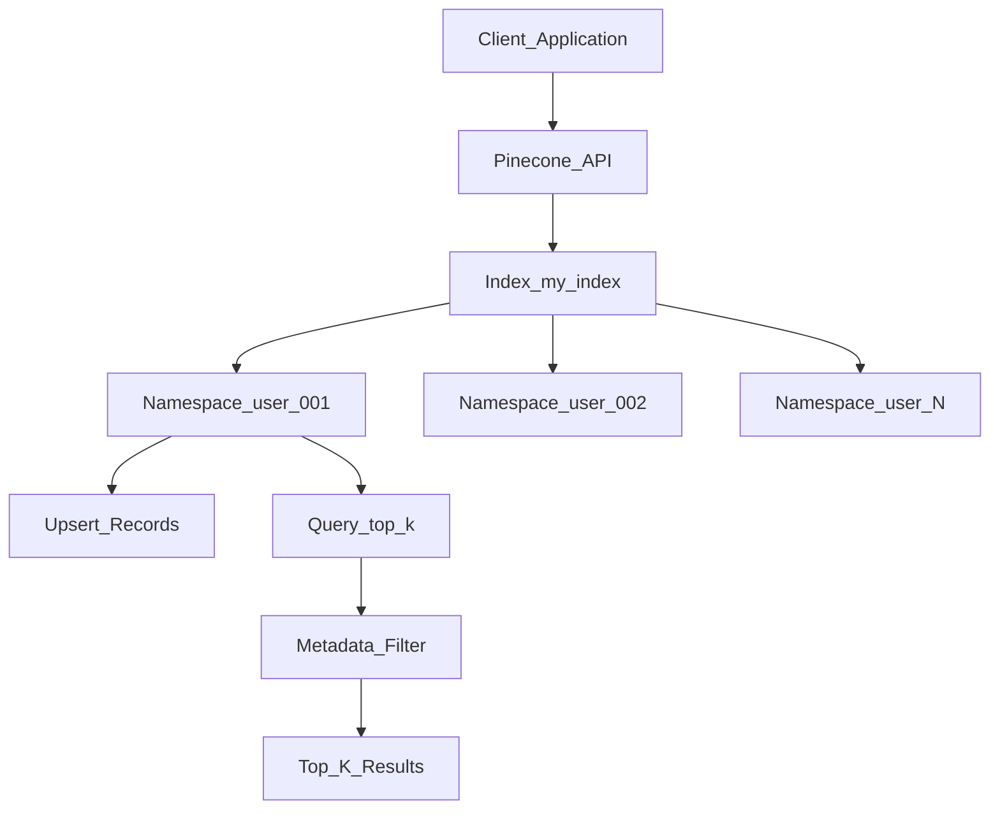

# 🌲 Pinecone

> [!abstract] TL;DR
> Pinecone is a fully managed vector database — no infrastructure to configure, no indexing to tune. You get an API endpoint, upsert vectors, and query. It supports namespaces (logical separation), metadata filtering, and hybrid sparse+dense search out of the box. It's the gold standard for production RAG systems where you want maximum reliability with minimum ops burden.

## Intuition — Analogy First

Pinecone is the **fully managed apartment for your vectors** — you just move in.

In a traditional setup: you rent raw land (a VM), build the building (install FAISS), manage the plumbing (HNSW tuning), hire security (auth), handle garbage collection (memory management), and deal with flooding (auto-scaling). You spend more time on the building than living.

Pinecone gives you a finished apartment: HVAC works, internet is connected, building security is managed. You carry in your vectors (furniture), and start searching (living). The landlord (Pinecone) handles everything else.

The trade-off: you pay rent (Pinecone pricing), you don't own the building (vendor lock-in), and you can't knock down walls (limited customization).

## How It Works — Mechanics

### Core Concepts

| Concept | Description |
|---------|-------------|
| **Index** | The core storage unit — one vector space. Tied to a specific dimension and metric. |
| **Namespace** | Logical partition within an index. Queries are namespace-scoped. Use for multi-tenancy. |
| **Record** | (id, vector, metadata) — the unit of storage |
| **Upsert** | Insert if new ID, update if existing ID |
| **Query** | Return top-K most similar vectors to a query vector |
| **Metadata** | JSON fields stored with each vector, filterable at query time |

### Architecture



### Deployment Modes

**Serverless** (2024+): Pay per query/storage. No pod sizing. Best for variable/unpredictable traffic. Scales to zero. Maximum simplicity.

**Pod-based** (legacy): Choose pod type (s1, p1, p2) and count. Better for predictable high-throughput workloads. More control over performance.

### Hybrid Search

Pinecone supports **sparse + dense hybrid search** — combining traditional keyword (BM25/sparse) with semantic (dense) search:

$$\text{score} = \alpha \cdot \text{dense\_score} + (1 - \alpha) \cdot \text{sparse\_score}$$

Where $\alpha$ is a tunable weighting parameter. Useful when exact keyword matches matter (product codes, names) alongside semantic similarity.

## The Math

**Cosine similarity** (default Pinecone metric for text):
$$\text{sim}(q, x) = \frac{q \cdot x}{\|q\| \|x\|}$$

Pinecone indexes are HNSW-based under the hood. See [[ANN_Algorithms]] for the search complexity.

**Storage cost** estimation:
$$\text{cost} \approx n_{\text{vectors}} \times d_{\text{dims}} \times 4 \text{ bytes} \times 1.5 \text{ (HNSW overhead)}$$

**Namespace isolation**: queries to namespace $N_i$ only search vectors in $N_i$. Perfect for multi-tenant applications where users must not see each other's data.

## Code Demo

```python
# ── Pinecone setup and basic operations ─────────────────────────────────────
from pinecone import Pinecone, ServerlessSpec
from openai import OpenAI
import time

# Initialize clients
pc = Pinecone(api_key="your-pinecone-api-key")
openai_client = OpenAI(api_key="your-openai-api-key")

# ── 1. Create a serverless index ──────────────────────────────────────────
INDEX_NAME = "knowledge-base"
DIMENSION = 1536           # text-embedding-3-small dimension
METRIC = "cosine"

if INDEX_NAME not in [idx.name for idx in pc.list_indexes()]:
    pc.create_index(
        name=INDEX_NAME,
        dimension=DIMENSION,
        metric=METRIC,
        spec=ServerlessSpec(cloud="aws", region="us-east-1"),
    )
    # Wait for index to be ready
    while not pc.describe_index(INDEX_NAME).status["ready"]:
        time.sleep(1)
    print(f"Index '{INDEX_NAME}' created")

index = pc.Index(INDEX_NAME)

# ── 2. Embed and upsert documents ─────────────────────────────────────────
documents = [
    {"id": "doc1", "text": "Pinecone is a managed vector database", "category": "databases"},
    {"id": "doc2", "text": "RAG combines retrieval with generation", "category": "ai"},
    {"id": "doc3", "text": "HNSW is the algorithm behind fast ANN search", "category": "algorithms"},
    {"id": "doc4", "text": "OpenAI embeddings map text to vectors", "category": "ai"},
]

def get_embeddings(texts: list[str]) -> list[list[float]]:
    """Batch-embed texts with OpenAI."""
    response = openai_client.embeddings.create(
        input=texts,
        model="text-embedding-3-small",
    )
    return [item.embedding for item in response.data]

# Embed in batch
texts = [doc["text"] for doc in documents]
embeddings = get_embeddings(texts)

# Upsert to Pinecone (namespace separates tenants)
vectors_to_upsert = [
    {
        "id": doc["id"],
        "values": emb,
        "metadata": {"text": doc["text"], "category": doc["category"]},
    }
    for doc, emb in zip(documents, embeddings)
]

index.upsert(vectors=vectors_to_upsert, namespace="tenant-001")
print("Upserted", len(vectors_to_upsert), "vectors")

# ── 3. Query with metadata filter ─────────────────────────────────────────
query_text = "how does semantic search work?"
query_embedding = get_embeddings([query_text])[0]

results = index.query(
    vector=query_embedding,
    top_k=3,
    namespace="tenant-001",
    filter={"category": {"$in": ["ai", "algorithms"]}},  # metadata filter
    include_metadata=True,
    include_values=False,  # don't return vectors (save bandwidth)
)

print(f"\nQuery: {query_text}")
for match in results["matches"]:
    print(f"  Score: {match['score']:.4f} | {match['metadata']['text']}")

# ── 4. Hybrid search (sparse + dense) ─────────────────────────────────────
from pinecone_text.sparse import BM25Encoder

# Fit BM25 on corpus (for sparse encoding)
bm25 = BM25Encoder()
bm25.fit([doc["text"] for doc in documents])

# Hybrid index requires sparse vectors too
hybrid_index = pc.Index("hybrid-index")  # created with metric="dotproduct" for hybrid

sparse_vectors = bm25.encode_documents([doc["text"] for doc in documents])

hybrid_vectors = [
    {
        "id": doc["id"],
        "values": dense,
        "sparse_values": sparse,
        "metadata": {"text": doc["text"]},
    }
    for doc, dense, sparse in zip(documents, embeddings, sparse_vectors)
]

# Query hybrid
query_sparse = bm25.encode_queries([query_text])[0]
hybrid_index.query(
    vector=query_embedding,
    sparse_vector=query_sparse,
    top_k=3,
    include_metadata=True,
)

# ── 5. Index statistics ────────────────────────────────────────────────────
stats = index.describe_index_stats()
print(f"\nIndex stats:")
print(f"  Total vectors: {stats['total_vector_count']}")
print(f"  Dimension: {stats['dimension']}")
print(f"  Namespaces: {list(stats['namespaces'].keys())}")
```

## Real-World Example

**Shopify** uses Pinecone for product search across millions of merchant catalogs. Customer queries like "birthday gift for a 5-year-old" retrieve semantically relevant products even when no keywords match exactly. Pinecone's managed scaling handles Black Friday traffic spikes without operator intervention.

**Zapier AI** powers its "Ask Zapier" feature with Pinecone: all Zapier documentation and app integrations are embedded and stored in Pinecone. User questions retrieve the most relevant documentation, which is then synthesized by an LLM.

## Trade-offs

| Dimension | Pro | Con |
|-----------|-----|-----|
| **Operations** | Zero infrastructure management | Vendor lock-in |
| **Scaling** | Auto-scales, no capacity planning | Expensive at very high scale |
| **Reliability** | Enterprise SLA, 99.9% uptime | Outage = no vector search |
| **Features** | Namespaces, hybrid, metadata | Less customizable than self-hosted |
| **Simplicity** | 5 minutes to first query | Less control than Weaviate/Qdrant |

## When to Use vs Avoid

**Use Pinecone when:**
- You want to ship fast without owning infra
- Production RAG with < ~100M vectors
- Team lacks ML infra expertise
- Enterprise SLA is required

**Avoid Pinecone when:**
- Data cannot leave your infrastructure (use pgvector or self-hosted Weaviate)
- Billion-scale vectors (cost becomes prohibitive)
- Need GraphQL / graph queries (use Weaviate)
- Already running Postgres (use pgvector)

## Common Pitfalls

1. **Wrong dimension at creation** — Pinecone index dimension is immutable. Fix: double-check embedding model dimension before `create_index()`.
2. **Querying wrong namespace** — vectors upserted to "namespace-A" are invisible in "namespace-B". Fix: always specify namespace consistently.
3. **Upsert batching** — single-record upserts are slow. Fix: batch up to 100 records per upsert call.
4. **Not storing text in metadata** — retrieving vectors without the original text. Fix: always store the source text in `metadata["text"]`.
5. **Stale index after document update** — source documents change but vectors are not re-upserted. Fix: trigger re-embedding on document update; use the document ID as the Pinecone vector ID for easy overwrite.

## Related Concepts

- [[_MOC_Generative_AI|↑ Section MOC]]

- [[Vector_Databases_Overview]] — comparison of all vector DB options
- [[Weaviate]] — open-source alternative with more features
- [[Chroma]] — free local alternative for development
- [[ANN_Algorithms]] — HNSW indexing under the hood
- [[RAG_Overview]] — Pinecone as the retrieval backbone

## Review Questions

1. What is a Pinecone namespace and when would you use it? Give a concrete multi-tenant example and explain what would go wrong without namespace isolation.
2. Explain hybrid search in Pinecone: what are the dense and sparse components, when does each contribute more, and how would you choose the $\alpha$ mixing parameter?
3. You need to update 50,000 documents in your Pinecone index after a content refresh. Describe the most efficient approach (API calls, batching strategy, handling updates vs new documents).

## Sources

- Pinecone Documentation. https://docs.pinecone.io/
- Pinecone: What is a Vector Database? https://www.pinecone.io/learn/vector-database/
- Pinecone: Hybrid Search. https://docs.pinecone.io/docs/hybrid-search
- Pinecone: Serverless Architecture. https://www.pinecone.io/blog/serverless/

#pinecone #vector-database #managed-cloud #rag #semantic-search #production #hybrid-search
