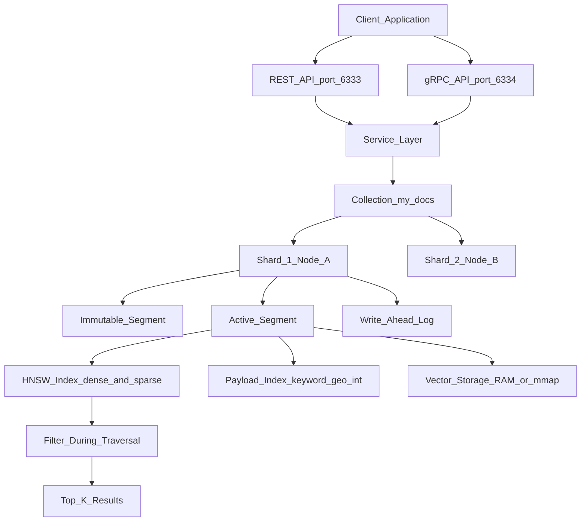

# 🦀 Qdrant

> [!abstract] TL;DR
> Qdrant is an open-source, production-grade vector database written in Rust. Its defining innovations are **filtered HNSW** (applying metadata filters during graph traversal — not after — so recall never degrades with strict filters), **named vectors** (multiple vector spaces per document), and **native sparse vectors** (enabling hybrid dense+sparse search without a separate BM25 service). Available self-hosted or on Qdrant Cloud.

---

## Intuition — Analogy First

**Analogy:** Imagine searching for the best pizza restaurant near you that also has outdoor seating and accepts reservations.

A naive approach: find the 500 geographically nearest restaurants, then filter out those missing outdoor seating or reservations. If the filter is strict, you might be left with mediocre options from the outer edges of your search radius — the truly best matching restaurants were discarded early.

Qdrant's approach: the navigator *knows your requirements while walking the map*. As it traverses the restaurant graph, it only steps toward candidates that could satisfy your constraints. You explore the same number of hops but arrive at the actual best qualifying options — precision without recall sacrifice.

In vector database terms: Qdrant applies payload filter predicates **during HNSW graph traversal**, not after. This is the core architectural innovation that makes Qdrant stand apart from most competitors.

---

## How It Works — Mechanics

### Core Data Model

| Concept | Description |
|---------|-------------|
| **Collection** | Top-level container — analogous to a database table. Defines vector config, distance metric, quantization, and sharding. |
| **Point** | The unit of storage: `{ id, vector(s), payload }`. A point can hold multiple named vectors. |
| **Vector** | A dense or sparse numerical representation. One point may have several named vectors (e.g., `"title"`, `"body"`, `"image"`). |
| **Payload** | Arbitrary JSON metadata attached to a point. Can be indexed for fast filtering. |
| **Segment** | Internal storage unit inside a shard — contains an HNSW graph, vector storage, and payload index. |
| **Shard** | Horizontal partition of a collection. Multiple shards enable distributed deployment. |

---

### Filtered HNSW — The Key Innovation

Standard filtered search in most vector DBs is a two-step process:

1. Run HNSW search → retrieve top-1000 candidates
2. Apply metadata filter → keep only matches

**Problem:** If only 1% of your collection matches the filter, nearly all 1000 candidates get discarded. To get 10 final results you'd need to over-fetch massively — and recall still degrades.

**Qdrant's solution:** Payload indexes are integrated into HNSW traversal. During graph navigation, the traversal skips nodes that don't satisfy the filter *before* spending time evaluating their distance. The search budget (candidates explored) is spent entirely on qualifying nodes, maintaining recall@10 ≥ 0.95 even with filters that match 0.1% of the collection.

> [!important] Requirement
> This only works when the filtered field has a **payload index** (`create_payload_index`). Without an index, Qdrant falls back to a slower full-payload scan. Always index fields used in production filters.

---

### Named Vectors

Each point can store multiple independent vector representations under distinct names:

```
Point {
  id: 42,
  vector: {
    "title":  [0.1, 0.2, ..., 0.9],   # 384-dim title embedding
    "body":   [0.3, 0.1, ..., 0.6],   # 384-dim body embedding
    "image":  [0.5, 0.8, ..., 0.2],   # 512-dim CLIP embedding
    "bm25":   { indices: [3, 17, 99], values: [0.8, 0.4, 0.2] }  # sparse
  },
  payload: { "category": "tech", "year": 2025 }
}
```

At query time you specify `using="body"` to search that vector space, or combine multiple spaces with `prefetch`. This enables multi-representation retrieval (ColBERT-style, multi-modal) without duplicating points.

---

### Sparse Vectors and Hybrid Search

Qdrant natively stores sparse vectors (SPLADE, BM25 outputs) alongside dense vectors — no separate keyword index service needed.

**Hybrid search flow:**

1. **Prefetch dense** — run ANN over `"body"` to get top-50 by semantic similarity
2. **Prefetch sparse** — run ANN over `"bm25"` to get top-50 by keyword relevance
3. **Fuse** — combine both ranked lists using **Reciprocal Rank Fusion (RRF)** or **Distribution-Based Score Fusion (DBSF)**
4. **Return** — final top-K across both signals

**RRF formula:**

$$\text{RRF}(d) = \sum_{r \in \text{rankers}} \frac{1}{k + \text{rank}_r(d)}, \quad k = 60 \text{ (default)}$$

RRF is rank-based, so dense and sparse scores (which live on incomparable scales) can be fused directly without normalization.

---

### Quantization

Qdrant has three built-in quantization modes — all fully managed by the server with no client-side changes needed:

| Mode | Compression | Recall Impact | Best For |
|------|-------------|---------------|----------|
| **Scalar (INT8)** | 4x (32-bit → 8-bit) | Minimal (~1%) | Default choice; balance of savings and quality |
| **Product (PQ)** | 8x–64x | Moderate (3-10%) | Large collections where memory is the bottleneck |
| **Binary** | 32x | High alone; recovered with rescoring | Maximum throughput; pair with asymmetric rescoring |

**Asymmetric rescoring (Binary):** stored vectors are binary-quantized for fast SIMD popcount distance; query vector stays at full float32. Search retrieves a coarse top-K using binary, then re-ranks against the original float vectors. This recovers most of the recall loss while keeping the speed gain.

---

### Payload Indexing

Without a payload index, filtering requires scanning all payloads in a segment — fine for small collections, fatal at scale.

Supported index types:

| Type | Use case |
|------|----------|
| `keyword` | Exact string match (category, status, tenant_id) |
| `integer` | Range queries (year ≥ 2023) |
| `float` | Numerical range (price < 50.0) |
| `geo` | Bounding box / radius geographic search |
| `datetime` | ISO 8601 time range filtering |
| `text` | Full-text search (token-level, not semantic) |
| `bool` | True/false flags |

---

### On-Disk Storage (mmap)

By default, vectors are stored in RAM. For collections too large to fit in memory, Qdrant supports **memory-mapped file (mmap)** storage:

- Raw vector data lives on disk; the OS page cache manages hot data
- HNSW graph structure still resides in RAM (graph pointer size is much smaller than raw vectors)
- Typical RAM requirement drops from `n × d × 4 bytes` to `n × M × 4 bytes` (graph edges only)
- Query latency increases slightly on cache-cold reads; production workloads with decent page cache stay near in-RAM performance

---

### Distributed Deployment

```
Collection
├── Shard 0 (Node A)  ← Replica on Node B
├── Shard 1 (Node B)  ← Replica on Node C
└── Shard 2 (Node C)  ← Replica on Node A
```

- **Sharding**: auto-sharding distributes points uniformly; custom shard keys enable tenant-aware routing
- **Replication factor**: set per-collection; `replication_factor=2` means each shard lives on 2 nodes
- **Read consistency**: configurable (`weak`, `quorum`, `all`)
- **WAL (Write-Ahead Log)**: every write is durably logged before acknowledgment

---

## Architecture Diagram



---

## Code Demo

```python
# Qdrant: collection setup, named vectors, filtered search, hybrid search
from qdrant_client import QdrantClient
from qdrant_client.models import (
    Distance, VectorParams, SparseVectorParams, SparseIndexParams,
    PointStruct, SparseVector,
    Filter, FieldCondition, MatchValue,
    Prefetch, FusionQuery, Fusion,
    PayloadSchemaType,
)
import numpy as np

# ── 1. Connect ─────────────────────────────────────────────────────────────
client = QdrantClient("localhost", port=6333)
# Qdrant Cloud: QdrantClient(url="https://xyz.qdrant.io:6333", api_key="your-key")

COLLECTION = "articles"
DIM = 384  # e.g., all-MiniLM-L6-v2

# ── 2. Create collection: two dense named vectors + one sparse ─────────────
if not client.collection_exists(COLLECTION):
    client.create_collection(
        collection_name=COLLECTION,
        vectors_config={
            # Named vectors — stored independently, queried by name
            "title": VectorParams(size=DIM, distance=Distance.COSINE),
            "body":  VectorParams(size=DIM, distance=Distance.COSINE),
        },
        sparse_vectors_config={
            # BM25 / SPLADE outputs stored natively
            "bm25": SparseVectorParams(
                index=SparseIndexParams(on_disk=False)
            )
        },
    )
    print(f"Collection '{COLLECTION}' created")

# ── 3. Index payload field for fast filtered search ────────────────────────
# Without this, filtering scans all payloads — devastating at scale
client.create_payload_index(
    collection_name=COLLECTION,
    field_name="category",
    field_schema=PayloadSchemaType.KEYWORD,
)

# ── 4. Upsert points with named vectors + payload ─────────────────────────
rng = np.random.default_rng(42)

points = [
    PointStruct(
        id=1,
        vector={
            "title": rng.random(DIM).tolist(),
            "body":  rng.random(DIM).tolist(),
            "bm25":  SparseVector(indices=[3, 17, 42], values=[0.8, 0.6, 0.4]),
        },
        payload={"title": "Vector Databases in Production", "category": "technology", "year": 2024},
    ),
    PointStruct(
        id=2,
        vector={
            "title": rng.random(DIM).tolist(),
            "body":  rng.random(DIM).tolist(),
            "bm25":  SparseVector(indices=[5, 22, 78], values=[0.9, 0.5, 0.2]),
        },
        payload={"title": "HNSW Graph Algorithm Deep Dive", "category": "algorithms", "year": 2023},
    ),
    PointStruct(
        id=3,
        vector={
            "title": rng.random(DIM).tolist(),
            "body":  rng.random(DIM).tolist(),
            "bm25":  SparseVector(indices=[1, 9, 55], values=[0.7, 0.4, 0.3]),
        },
        payload={"title": "RAG Pipeline Design Patterns", "category": "technology", "year": 2025},
    ),
]

client.upsert(collection_name=COLLECTION, points=points)
print(f"Upserted {len(points)} points")

# ── 5. Filtered similarity search — filter applied DURING HNSW traversal ──
query_vec = rng.random(DIM).tolist()

results = client.search(
    collection_name=COLLECTION,
    query_vector=("body", query_vec),    # ("vector_name", values)
    query_filter=Filter(
        must=[
            FieldCondition(key="category", match=MatchValue(value="technology"))
        ]
    ),
    limit=5,
    with_payload=True,
)

print("\nFiltered search (category=technology):")
for r in results:
    print(f"  id={r.id}  score={r.score:.4f}  title={r.payload['title']}")

# ── 6. Hybrid search: dense body + sparse BM25, fused with RRF ────────────
query_sparse = SparseVector(indices=[3, 42], values=[0.7, 0.5])

hybrid_results = client.query_points(
    collection_name=COLLECTION,
    prefetch=[
        # Prefetch from each vector space independently
        Prefetch(query=query_vec,     using="body", limit=20),
        Prefetch(query=query_sparse,  using="bm25", limit=20),
    ],
    # Reciprocal Rank Fusion merges rank lists — no score normalization needed
    query=FusionQuery(fusion=Fusion.RRF),
    limit=5,
    with_payload=True,
)

print("\nHybrid search results (RRF):")
for r in hybrid_results.points:
    print(f"  id={r.id}  title={r.payload['title']}")

# ── 7. Collection stats ────────────────────────────────────────────────────
info = client.get_collection(COLLECTION)
print(f"\nPoints count: {info.points_count}")
print(f"Segments: {info.segments_count}")
print(f"Status: {info.status}")
```

---

## Real-World Example

> **Example — Mistral AI's RAG infrastructure:** Qdrant is used in production RAG systems where strict tenant isolation (payload filter: `tenant_id = "acme"`) is combined with semantic search. Without filtered HNSW, a system serving 10,000 tenants would need either separate collections per tenant (operational nightmare) or accept recall degradation from post-filtering. Qdrant's traversal-time filtering makes single-collection multi-tenancy viable at recall@10 ≥ 0.97.

> **Example — E-commerce hybrid search:** A product catalog with 50M items uses Qdrant's hybrid search: a SPLADE sparse model captures exact product codes and brand names (where semantic search fails), while a dense model captures conceptual similarity ("running shoes for flat feet"). RRF fusion combines both signals. A single Qdrant query replaces a dense index + Elasticsearch BM25 index combination.

---

## Qdrant vs Competitors

| Dimension | Qdrant | Pinecone | Weaviate | pgvector |
|-----------|--------|----------|----------|----------|
| **Infrastructure** | Self-hosted or Qdrant Cloud | Fully managed | Self-hosted or Weaviate Cloud | Postgres extension |
| **Language** | Rust (no GC pauses) | Proprietary | Go | C (Postgres extension) |
| **Filtered search recall** | Best-in-class (traversal-time) | Good (post-filter) | Good (pre-filter) | Depends on index type |
| **Hybrid search** | Native sparse vectors + RRF | Native sparse | BM25 via `text2vec` modules | `tsvector` + pgvector (manual) |
| **Named vectors** | Yes (multiple per point) | No | No | No |
| **Quantization** | Scalar, PQ, Binary (built-in) | Limited | None built-in | None |
| **On-disk vectors** | Yes (mmap) | Managed | Managed | Tablespace (Postgres) |
| **Best for** | Filtered/hybrid search at scale | Production simplicity | GraphQL + knowledge graphs | Existing Postgres stack |

---

## Trade-offs

| Aspect | Pro | Con |
|--------|-----|-----|
| **Performance** | Rust: predictable latency, no GC pauses; SIMD-optimized distance | Self-hosted infra ownership |
| **Filtered search** | Traversal-time filtering preserves recall with strict filters | Requires payload indexes to be configured upfront |
| **Hybrid search** | Native sparse + dense in one query; no separate BM25 service | Sparse vector encoding (SPLADE/BM25) must be done client-side |
| **Quantization** | 4-32x memory savings; asymmetric rescoring restores recall | Binary quantization requires tuning rescoring parameters |
| **Scalability** | Horizontal sharding + replication for HA | Distributed mode adds operational complexity |
| **Ecosystem** | Python, Rust, Go, TypeScript clients; LangChain/LlamaIndex integration | Smaller community than Weaviate or Pinecone |

---

## When to Use vs Avoid

**Use Qdrant when:**
- Filtered search is critical — strict metadata filters that reduce candidates to <10% of the collection (competitors degrade; Qdrant maintains recall)
- Hybrid search is needed without running a separate Elasticsearch/OpenSearch cluster
- Multiple vector representations per document (named vectors for multi-modal or ColBERT-style retrieval)
- Data sovereignty / on-prem deployment is required
- Memory is constrained — quantization + mmap on-disk storage needed
- High throughput: Rust's zero-GC runtime eliminates tail latency spikes

**Avoid Qdrant when:**
- You want zero infrastructure ownership (use Pinecone Serverless)
- You are already on Postgres and adding a new service is undesirable (use pgvector)
- You need GraphQL API, cross-references, or graph-style object relationships (use Weaviate)
- Your team is prototype-phase and wants the simplest possible setup (use Chroma)

---

## Common Pitfalls

- **No payload index on filtered fields** — filtering without `create_payload_index` triggers a full payload scan per segment; at 10M+ points this is 10-100x slower. Always index every field that appears in `must`, `should`, or `must_not` filters before going to production.
- **Wrong named vector in query** — specifying `using="body"` when the vector is stored as `"body_text"` fails silently or raises an error with an unhelpful message. Fix: always verify vector names match the collection config via `get_collection()`.
- **Binary quantization without rescoring** — enabling binary quantization without `rescore=True` in search parameters cuts recall@10 significantly (often to 0.70-0.80). Fix: always pair binary quantization with asymmetric rescoring; the speed advantage is still 10-20x over plain float32 search.
- **Upsert one point at a time** — single-point upserts are 50-100x slower than batch operations due to per-request WAL flushing overhead. Fix: batch upsert 100–1000 points per call; Qdrant's `upsert` accepts a list.
- **Confusing mmap with full on-disk indexing** — mmap stores raw vectors on disk but the HNSW graph (which is smaller) still lives in RAM. Sizing RAM only for the HNSW graph (not raw vectors) is the correct mental model.
- **Not setting `on_disk=True` for the HNSW graph at creation** — once a collection is created, switching HNSW to on-disk requires recreation. Decide memory layout at collection creation time.

---

## Related Concepts

- [[_MOC_Generative_AI|↑ Section MOC]]

- [[Vector_Databases_Overview]] — full landscape comparison; Qdrant positioned as high-performance filtered-search leader
- [[ANN_Algorithms]] — HNSW mechanics that Qdrant extends with integrated payload filtering
- [[Pinecone]] — managed alternative: simpler ops, weaker filtered recall, no named vectors
- [[Weaviate]] — open-source alternative: GraphQL strength, module-based vectorization
- [[Chroma]] — developer-friendly embeddable DB; best for prototyping, not production filtered search
- [[pgvector]] — Postgres extension; right choice when relational + vector queries must coexist in one database
- [[Embedding_Models]] — the dense vector representations stored in Qdrant collections
- [[RAG_Fundamentals]] — Qdrant as the retrieval backbone; filtered search enables per-tenant RAG isolation

---

## Review Questions

1. Qdrant's filtered HNSW maintains recall even when a filter matches only 0.1% of the collection. Explain the mechanism — why does post-filtering on a standard HNSW graph degrade recall, and what specific change does Qdrant make during graph traversal to preserve it? What must be true about the payload field for this to work?
2. You are building a multi-tenant RAG system for 5,000 enterprise customers. Each customer has ~2,000 documents. Describe a Qdrant architecture that keeps tenants isolated, handles filtered similarity search efficiently, and scales to adding new tenants without collection migration. Consider: single collection vs multiple collections, shard keys, and payload filtering.
3. Your Qdrant collection holds 50M vectors at 768 dimensions in float32 (total: ~150GB). Your server has 32GB RAM. Design a quantization + on-disk storage strategy to make this fit while maintaining recall@10 ≥ 0.95. Justify your quantization choice and explain how asymmetric rescoring recovers recall.

---

## Sources

- [Qdrant Documentation — Overview](https://qdrant.tech/documentation/overview/)
- [Qdrant — Hybrid Search with the Query API](https://qdrant.tech/articles/hybrid-search/)
- [Qdrant — Vector Search Resource Optimization](https://qdrant.tech/articles/vector-search-resource-optimization/)
- [Qdrant — Distributed Deployment](https://qdrant.tech/documentation/distributed_deployment/)
- [Qdrant GitHub Repository](https://github.com/qdrant/qdrant)
- [Qdrant — Collections Documentation](https://qdrant.tech/documentation/manage-data/collections/)
- [Qdrant — Points Documentation](https://qdrant.tech/documentation/manage-data/points/)

---

#qdrant #vector-database #rust #hybrid-search #filtered-search #hnsw #sparse-vectors #named-vectors #quantization #rag #open-source #production
