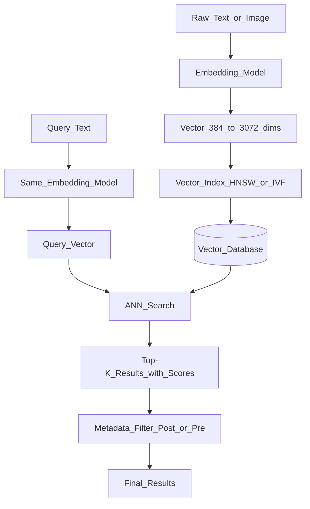

# 📦 Vector Databases Overview

> [!abstract] TL;DR
> A vector database stores high-dimensional embedding vectors and enables fast similarity search — finding the most semantically similar items to a query. Unlike traditional databases that match exact values, vector DBs find items by meaning. They are the storage backbone of every RAG system, semantic search engine, and recommendation system.

## Intuition — Analogy First

Imagine a **library organized by meaning** rather than alphabetically or by Dewey Decimal:

- In a traditional library: "Dog Care" is in the D section. "Canine Health" is in the C section. They're far apart, even though they're about the same thing.
- In a vector library: "Dog Care," "Canine Health," "Puppy Training," and "Veterinary Medicine" are all shelved near each other — because they're semantically related. "Quantum Physics" is on the other side of the building.

When you ask "find me books about dogs," the vector library doesn't look for the word "dog" — it understands the concept and returns nearby shelves. That's semantic search via vector similarity.

A vector database is the infrastructure that makes this library work at scale — indexing millions of vectors and finding the nearest neighbors in milliseconds.

## How It Works — Mechanics

### The Pipeline



### Core Operations

| Operation | Description |
|-----------|-------------|
| **Upsert** | Insert or update a vector (id, vector, metadata) |
| **Query** | Find top-K most similar vectors to a query vector |
| **Delete** | Remove vectors by id |
| **Filter** | Combine vector similarity with metadata conditions |
| **Fetch** | Retrieve a vector by its exact id |

### Vector Similarity Metrics

| Metric | Formula | Best for |
|--------|---------|----------|
| **Cosine similarity** | $\cos(\theta) = \frac{a \cdot b}{\|a\|\|b\|}$ | Text embeddings (normalized) |
| **Dot product** | $a \cdot b$ | Unnormalized embeddings, fast |
| **Euclidean (L2)** | $\|a - b\|_2$ | Image embeddings, spatial data |

### ANN vs Exact Search

Exact K-nearest-neighbor is $O(n \cdot d)$ per query — too slow for millions of vectors. Approximate Nearest Neighbor (ANN) trades a small amount of accuracy for orders-of-magnitude speed improvement. Most vector DBs use HNSW for ANN.

### Vector DB Landscape

| DB | Type | Strength |
|----|------|---------|
| **Pinecone** | Managed cloud | Production-ready, fully managed |
| **Weaviate** | OSS + cloud | Hybrid search, GraphQL |
| **Chroma** | OSS embeddable | Dev-friendly, no infra |
| **Qdrant** | OSS + cloud | High performance, Rust-based |
| **Milvus** | OSS + cloud | Billion-scale, cloud-native |
| **pgvector** | Postgres extension | SQL + vectors, no new service |
| **FAISS** | Library (not DB) | Research, CPU/GPU ANN library |
| **Redis VSS** | Add-on | If you already run Redis |

### Vector DB vs Traditional DB

| Aspect | Traditional DB | Vector DB |
|--------|---------------|-----------|
| Match type | Exact (equality, range) | Approximate (similarity) |
| Query | SQL WHERE col = value | "Find vectors nearest to this query vector" |
| Schema | Rigid schema | Schema-less or flexible metadata |
| Scalability | Vertical + horizontal | Horizontal (sharded indexes) |
| Use case | CRUD, transactions | Semantic search, RAG, recommendations |

## The Math

**Embedding**: map text/image to a dense vector in $\mathbb{R}^d$ where $d$ typically ranges from 384 to 3072.

**Cosine similarity** (most common for text):
$$\text{sim}(q, x_i) = \frac{q \cdot x_i}{\|q\| \cdot \|x_i\|}$$

**Top-K retrieval**:
$$\text{results} = \underset{i \in \mathcal{V}}{\arg\text{top-}k} \text{ sim}(q, x_i)$$

**With metadata filter** (pre-filter: reduces search space):
$$\text{results} = \underset{i \in \{j : \text{metadata}_j \text{ matches filter}\}}{\arg\text{top-}k} \text{ sim}(q, x_i)$$

**Storage cost**:
$$\text{memory} = n_{\text{vectors}} \times d_{\text{dims}} \times \text{bytes\_per\_float}$$

Example: 1M vectors × 1536 dims × 4 bytes = 6 GB

## Code Demo

```python
# ── Chroma (easiest for getting started) ─────────────────────────────────
import chromadb
from chromadb.utils import embedding_functions

# In-memory (dev) or persistent
client = chromadb.PersistentClient(path="./chroma_db")

# Use OpenAI embeddings or local sentence-transformers
openai_ef = embedding_functions.OpenAIEmbeddingFunction(
    api_key="your-key",
    model_name="text-embedding-3-small",
)

collection = client.get_or_create_collection(
    name="knowledge_base",
    embedding_function=openai_ef,
    metadata={"hnsw:space": "cosine"},
)

# Add documents (Chroma handles embedding)
collection.add(
    documents=[
        "Python is a high-level programming language",
        "Machine learning models learn from data",
        "Vector databases store embeddings for similarity search",
        "Dogs are domesticated descendants of wolves",
    ],
    ids=["doc1", "doc2", "doc3", "doc4"],
    metadatas=[
        {"source": "programming", "year": 2024},
        {"source": "ml", "year": 2024},
        {"source": "databases", "year": 2024},
        {"source": "biology", "year": 2024},
    ],
)

# Query: semantic search
results = collection.query(
    query_texts=["what are vector stores used for?"],
    n_results=2,
    where={"source": {"$in": ["databases", "ml"]}},  # metadata filter
)

for doc, dist, meta in zip(
    results["documents"][0],
    results["distances"][0],
    results["metadatas"][0],
):
    print(f"Distance: {dist:.4f} | {doc} | Source: {meta['source']}")

# ── Compare vector DB options ─────────────────────────────────────────────
"""
Use Chroma:   prototyping, development, small-scale production (<1M vectors)
Use Pinecone: production with <100M vectors, no infra team, need SLA
Use Weaviate: hybrid search (vector + keyword), need GraphQL, enterprise features
Use Qdrant:   high-performance needs, on-prem, Rust-level reliability
Use Milvus:   billion-scale, cloud-native Kubernetes deployment
Use pgvector: already on Postgres, mixed relational + vector queries
"""
```

## Real-World Example

**Notion AI** uses a vector database to let users ask questions across their entire workspace. Each Notion page is chunked, embedded, and stored in a vector DB. When you ask "What did we decide about the API design?", it retrieves the most relevant pages and feeds them to an LLM.

**Perplexity.ai** stores crawled web pages as vectors. Every search query is embedded, the top relevant passages are retrieved from the vector index, and the LLM synthesizes them into an answer with citations.

**Netflix** uses vector similarity for recommendation: user behavior embeddings and content embeddings are stored in a vector index. "Users like you also watched..." is a top-K retrieval in embedding space.

## Trade-offs

| Dimension | Pro | Con |
|-----------|-----|-----|
| **Semantic search** | Finds relevant items even without exact keywords | Requires embedding at write time |
| **Scalability** | Handles billions of vectors (Milvus, Pinecone) | Memory-intensive (6 GB per 1M × 1536-dim vectors) |
| **Latency** | Sub-10ms for ANN with HNSW | Cold start on unindexed data |
| **Flexibility** | Works for text, images, code, audio | Embeddings are model-specific |
| **Managed cost** | Pinecone handles everything | $100-1000s/month at scale |

## When to Use vs Avoid

**Use a vector DB when:**
- Building RAG (retrieval-augmented generation)
- Semantic search ("find similar documents")
- Recommendations ("find items like this one")
- Deduplication ("find near-duplicate content")

**Avoid (use traditional DB) when:**
- You need exact match queries only
- Your dataset is small (< 10K items — just embed + numpy works)
- You need full ACID transactions
- Budget is very constrained (pgvector is free if you have Postgres)

## Common Pitfalls

1. **Wrong similarity metric** — using L2 for normalized text embeddings instead of cosine. Fix: check embedding model docs; most text models expect cosine.
2. **Inconsistent embedding model** — indexing with model A, querying with model B. Fix: always use the same model for index and query.
3. **No metadata filtering** — returns results from wrong tenant/namespace. Fix: always add metadata filters for multi-tenant systems.
4. **Embedding stale documents** — source documents updated but vectors not re-indexed. Fix: trigger re-embedding on document update.
5. **Too many results** — fetching top-50 to be safe, then dumping all 50 into LLM context. Fix: tune n_results to what the LLM can actually use (typically 5-10).

## Related Concepts

- [[_MOC_Generative_AI|↑ Section MOC]]

- [[Embedding_Models]] — how text/images become vectors
- [[ANN_Algorithms]] — how fast similarity search works (HNSW, IVF)
- [[RAG_Overview]] — vector DB as the retrieval backbone
- [[Pinecone]] — managed production vector DB
- [[Weaviate]] — hybrid search vector DB
- [[Chroma]] — developer-friendly embeddable vector DB
- [[pgvector]] — vectors inside PostgreSQL

## Review Questions

1. Why can't you use a traditional SQL `WHERE` clause to find semantically similar documents, and what does a vector DB provide that bridges this gap?
2. Calculate the RAM required to hold 5 million vectors of dimension 768 in float32. If you switch to float16, what is the new size?
3. Your vector search is returning results from multiple customers mixed together. Describe the architectural fix using metadata filtering, and explain why pre-filtering is preferable to post-filtering for this use case.

## Sources

- Douze, M. et al. (2024). *The Faiss Library*. https://arxiv.org/abs/2401.08281
- Pinecone (2023). *What is a Vector Database?* https://www.pinecone.io/learn/vector-database/
- Pan, J. et al. (2024). *Survey of Vector Database Management Systems*. https://arxiv.org/abs/2310.14021
- Lewis, P. et al. (2020). *Retrieval-Augmented Generation for Knowledge-Intensive NLP Tasks*. NeurIPS 2020.

#vector-database #embeddings #semantic-search #rag #pinecone #chroma #weaviate #ann
