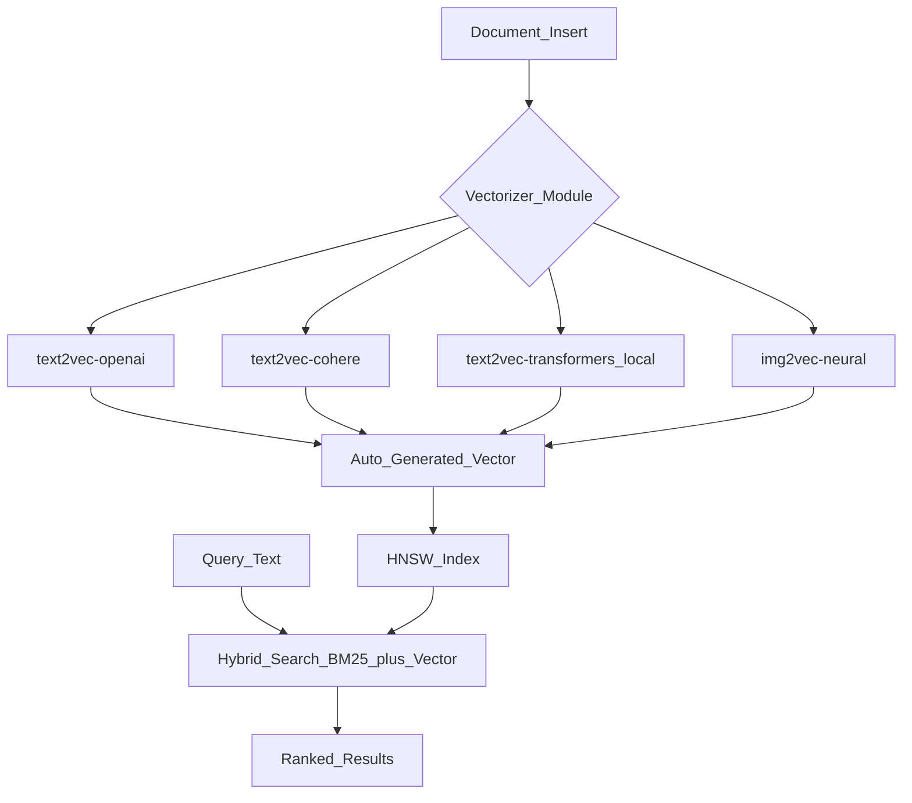

# 🕸️ Weaviate

> [!abstract] TL;DR
> Weaviate is an open-source vector database with built-in vectorizer modules, hybrid search (vector + BM25), multi-tenancy, and a GraphQL API. It goes beyond raw vector storage by supporting knowledge graph-style cross-references between objects, making it excellent for structured RAG systems where relationships between documents matter.

## Intuition — Analogy First

Weaviate is a **smart filing cabinet that understands both categories and meaning**:

A traditional filing cabinet organizes by labels (categories, dates) — you must know the exact label to find anything. A full-text search engine finds files by keywords — "find everything mentioning 'database'."

Weaviate does both simultaneously: it can filter by label *and* find semantically similar files — "find documents about databases from Q3 that are similar in meaning to this query." It's like a filing cabinet that reads your files, understands them, and can answer questions like "show me similar contracts from the same client."

The extra superpower: Weaviate objects can reference each other (like a knowledge graph) — an `Article` object can reference its `Author` object, and you can navigate these relationships in queries.

## How It Works — Mechanics

### Key Concepts

| Concept | Description |
|---------|-------------|
| **Collection** (was Class) | Schema definition — like a database table for a type of object |
| **Object** | A stored record with properties + a vector |
| **Vectorizer Module** | Weaviate calls an embedding API automatically on insert |
| **Hybrid Search** | Combines dense (vector) + sparse (BM25) search results |
| **Cross-references** | Links between objects of different collections (graph-like) |
| **Multi-tenancy** | Isolated tenant partitions within a collection |

### Module System

Weaviate's vectorizer modules let it auto-embed on insert:



**Bring Your Own Vectors**: set `vectorizer: "none"` and supply your own embeddings — useful when you want to use a custom or local model.

### Hybrid Search in Weaviate

Weaviate implements hybrid search with **Reciprocal Rank Fusion (RRF)**:

$$\text{RRF score} = \frac{\alpha}{k + r_{\text{BM25}}} + \frac{1-\alpha}{k + r_{\text{vector}}}$$

Where $r$ is rank position (1 = top result) and $k$ is a smoothing constant (default 60). This is more robust than linear score combination.

`alpha` parameter: 0.0 = pure keyword, 1.0 = pure vector, 0.5 = balanced hybrid.

## The Math

Weaviate uses HNSW for vector indexing. See [[ANN_Algorithms]] for the full treatment.

**BM25 score** for keyword component:
$$\text{BM25}(q, D) = \sum_{t \in q} \text{IDF}(t) \cdot \frac{f(t,D) \cdot (k_1 + 1)}{f(t,D) + k_1 \cdot (1 - b + b \cdot |D|/\text{avgdl})}$$

**Hybrid RRF combination**:

$$\text{score}(d) = \sum_{r \in \text{rankings}} \frac{1}{k + r(d)}$$

Each retrieval method contributes a ranking; RRF fuses them robustly.

**Collection memory**: Weaviate loads HNSW index into RAM. For large collections, ensure RAM ≥ index size.

## Code Demo

```python
# ── Weaviate Python Client v4 ─────────────────────────────────────────────
import weaviate
import weaviate.classes as wvc
from weaviate.classes.config import Configure, Property, DataType, VectorDistances

# ── 1. Connect to Weaviate (local Docker or Weaviate Cloud) ───────────────
# Local: docker run -p 8080:8080 -p 50051:50051 cr.weaviate.io/semitechnologies/weaviate:latest

client = weaviate.connect_to_local()

# Or Weaviate Cloud:
# client = weaviate.connect_to_weaviate_cloud(
#     cluster_url="https://your-cluster.weaviate.network",
#     auth_credentials=wvc.init.Auth.api_key("your-weaviate-api-key"),
#     headers={"X-OpenAI-Api-Key": "your-openai-key"},
# )

# ── 2. Create a collection with vectorizer ────────────────────────────────
if not client.collections.exists("Article"):
    client.collections.create(
        name="Article",
        vectorizer_config=Configure.Vectorizer.text2vec_openai(
            model="text-embedding-3-small",
        ),
        generative_config=Configure.Generative.openai(
            model="gpt-4o-mini",
        ),
        properties=[
            Property(name="title", data_type=DataType.TEXT),
            Property(name="content", data_type=DataType.TEXT),
            Property(name="category", data_type=DataType.TEXT),
            Property(name="published_year", data_type=DataType.INT),
        ],
        vector_index_config=Configure.VectorIndex.hnsw(
            distance_metric=VectorDistances.COSINE,
            ef_construction=128,
            max_connections=16,
        ),
    )
    print("Collection 'Article' created")

articles = client.collections.get("Article")

# ── 3. Insert objects (Weaviate auto-embeds via module) ───────────────────
with articles.batch.dynamic() as batch:
    batch.add_object({
        "title": "Introduction to Vector Databases",
        "content": "Vector databases store embeddings and enable semantic search...",
        "category": "technology",
        "published_year": 2024,
    })
    batch.add_object({
        "title": "Machine Learning Fundamentals",
        "content": "Machine learning is a subset of AI that learns from data...",
        "category": "ai",
        "published_year": 2023,
    })
    batch.add_object({
        "title": "PostgreSQL Performance Tuning",
        "content": "Indexing strategies and query optimization for PostgreSQL...",
        "category": "databases",
        "published_year": 2024,
    })

# ── 4. Vector search ──────────────────────────────────────────────────────
response = articles.query.near_text(
    query="semantic similarity search",
    limit=2,
    return_metadata=wvc.query.MetadataQuery(distance=True),
    filters=wvc.query.Filter.by_property("published_year").greater_than(2022),
)

print("\nVector Search Results:")
for obj in response.objects:
    print(f"  Distance: {obj.metadata.distance:.4f} | {obj.properties['title']}")

# ── 5. Hybrid search (vector + BM25) ─────────────────────────────────────
response = articles.query.hybrid(
    query="database indexing",
    alpha=0.5,           # 0=BM25 only, 1=vector only, 0.5=balanced
    limit=3,
    return_metadata=wvc.query.MetadataQuery(score=True, explain_score=True),
)

print("\nHybrid Search Results:")
for obj in response.objects:
    print(f"  Score: {obj.metadata.score:.4f} | {obj.properties['title']}")
    if obj.metadata.explain_score:
        print(f"    Explanation: {obj.metadata.explain_score[:100]}...")

# ── 6. Generative search (RAG built-in) ───────────────────────────────────
response = articles.generate.near_text(
    query="how to improve database performance",
    limit=2,
    single_prompt="Summarize this article in one sentence: {content}",
    grouped_task="Based on these articles, what are the top 3 tips for improving database performance?",
)

print("\nGenerative Search (RAG):")
print("Group response:", response.generated)
for obj in response.objects:
    print(f"  Per-object: {obj.generated}")

# ── 7. Cross-references (knowledge graph) ─────────────────────────────────
# Create Author collection and cross-reference from Article to Author
if not client.collections.exists("Author"):
    client.collections.create(
        name="Author",
        properties=[
            Property(name="name", data_type=DataType.TEXT),
            Property(name="expertise", data_type=DataType.TEXT),
        ],
    )

authors = client.collections.get("Author")
author_uuid = authors.data.insert({"name": "Jane Smith", "expertise": "databases"})

# Add cross-reference to article (navigate graph: Article → Author)
articles.data.reference_add(
    from_uuid="your-article-uuid",
    from_property="hasAuthor",
    to=author_uuid,
)

client.close()
```

## Real-World Example

**Enterprise healthcare** deployments use Weaviate for medical record search: clinical notes (text), lab results (structured), and radiology reports (text + image) are stored as different collections with cross-references. A query like "find similar patient cases to this diagnosis" does hybrid search across text and structured fields simultaneously.

**Financial services** use Weaviate's multi-tenancy for compliance: each financial advisor has their own tenant partition. Searches are automatically scoped — an advisor's queries cannot access another's clients, enforced at the database level, not the application layer.

## Trade-offs

| Dimension | Pro | Con |
|-----------|-----|-----|
| **Features** | Hybrid search, graph refs, built-in RAG | More complex than Chroma/Pinecone |
| **Self-hosted** | Data sovereignty, no vendor lock-in | You manage infrastructure |
| **Cloud option** | Weaviate Cloud removes ops burden | More expensive than Pinecone for some workloads |
| **GraphQL API** | Powerful query language | Learning curve vs simple REST |
| **Vectorizer modules** | Auto-embed on insert | Module config adds complexity |

## When to Use vs Avoid

**Use Weaviate when:**
- Need hybrid search (vector + keyword) out of the box
- Objects have relationships to each other (knowledge graph)
- Enterprise multi-tenancy required
- Want built-in generative search (RAG API)
- Need to run on-premises

**Avoid when:**
- Prototyping (Chroma is simpler)
- Team unfamiliar with GraphQL
- Pure vector search with no keyword needs (Pinecone is simpler)

## Common Pitfalls

1. **Vectorizer module mismatch** — changing the module after data is indexed re-embeds nothing. Fix: choose the vectorizer before inserting data; re-ingest to change.
2. **Schema migration** — Weaviate has limited schema evolution (can add properties, can't change types). Fix: plan schema carefully upfront.
3. **Memory exhaustion** — HNSW index loaded fully in RAM. Fix: monitor `weaviate_memory_allocations_bytes` metric; size RAM ≥ 2x index size.
4. **Hybrid alpha tuning** — default alpha=0.5 may not be optimal. Fix: A/B test on your data; use 0.75 for semantic-heavy queries, 0.25 for keyword-heavy.
5. **Not using multi-tenancy for SaaS** — all tenant data in one namespace is a data isolation risk. Fix: enable multi-tenancy from day one.

## Related Concepts

- [[_MOC_Generative_AI|↑ Section MOC]]

- [[Vector_Databases_Overview]] — comparison of all options
- [[Pinecone]] — managed alternative, simpler but less featured
- [[ANN_Algorithms]] — HNSW indexing internals
- [[Embedding_Models]] — works with any embedding model via bring-your-own or modules

## Review Questions

1. Compare Weaviate's Reciprocal Rank Fusion (RRF) hybrid search with a simple linear combination of BM25 and vector scores. What is RRF's advantage, especially when scores from the two methods are on different scales?
2. Weaviate's vectorizer module means you don't provide embeddings explicitly — what are two situations where you would disable the module and bring your own vectors instead?
3. Design a Weaviate schema for a research paper repository where papers can cite other papers and have associated authors. Which collections would you create, and what cross-references?

## Sources

- Weaviate Documentation. https://weaviate.io/developers/weaviate
- Weaviate Hybrid Search. https://weaviate.io/blog/hybrid-search-explained
- Weaviate Multi-tenancy. https://weaviate.io/developers/weaviate/manage-data/multi-tenancy
- Cormack, G. et al. (2009). *Reciprocal Rank Fusion outperforms Condorcet and individual Rank Learning Methods*. SIGIR 2009.

#weaviate #vector-database #hybrid-search #graphql #open-source #rag #knowledge-graph
