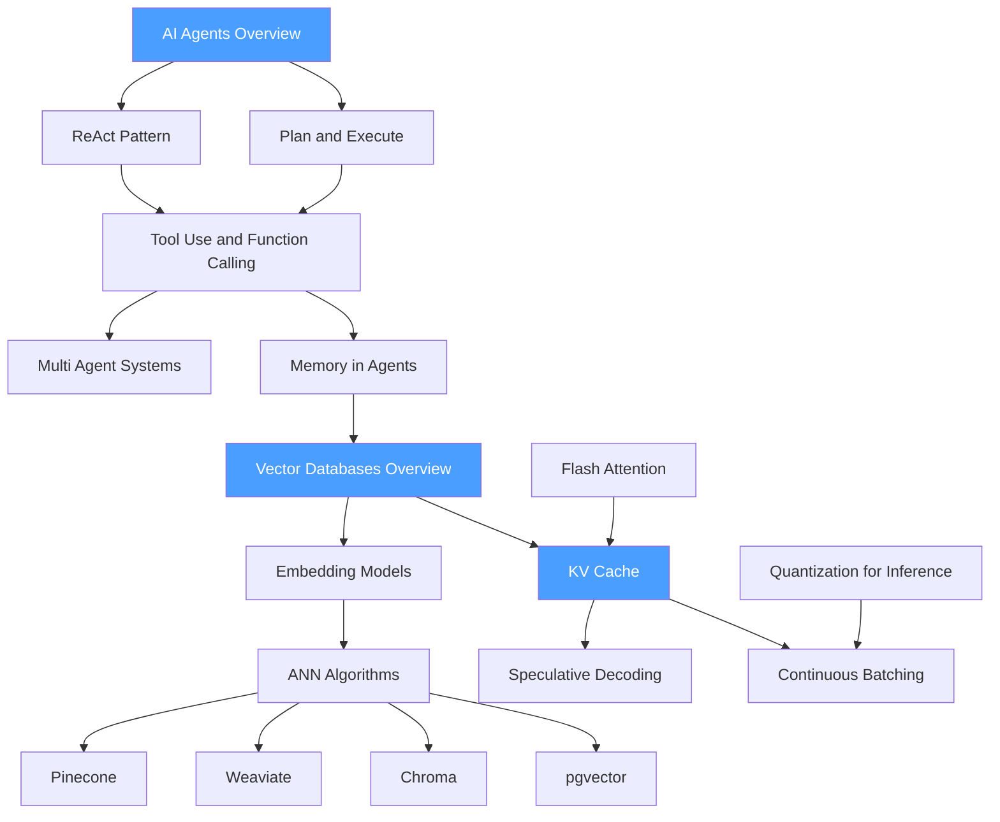

# 🗺️ Generative AI — Map of Content

> [!info] How to use this map
> Start with Fundamentals, follow the arrows, and use the Learning Path below as your guide.

---

## Concept Map

---

## Learning Path

1. [[AI_Agents_Overview]] — establishes what an agent is, the agent loop, and how LLMs serve as reasoning engines; essential framing for everything that follows
2. [[ReAct_Pattern]] — the foundational thought-action-observation loop; the most widely deployed agentic reasoning pattern
3. [[Tool_Use_and_Function_Calling]] — how LLMs invoke external tools via structured outputs; the primitive that makes agents useful in practice
4. [[Memory_in_Agents]] — episodic, semantic, and procedural memory mechanisms; connects directly into vector database use
5. [[Plan_and_Execute]] — separates planning from execution for more complex, multi-step tasks
6. [[Multi_Agent_Systems]] — orchestrator/worker architectures, debate, and collaborative agent patterns
7. [[Vector_Databases_Overview]] — the infrastructure layer for semantic search and long-term agent memory
8. [[Embedding_Models]] — how text and other modalities are mapped to dense vector spaces
9. [[ANN_Algorithms]] — approximate nearest-neighbor methods (HNSW, IVF, PQ) that make vector search fast at scale
10. [[Pinecone]] — managed vector DB; serverless index management and metadata filtering
11. [[Weaviate]] — open-source vector DB with schema, hybrid search, and module ecosystem
12. [[Chroma]] — lightweight embedded vector DB popular for local and notebook-based RAG
13. [[pgvector]] — vector extension for PostgreSQL; co-locates semantic and relational data
14. [[KV_Cache]] — key-value attention cache that eliminates redundant computation during autoregressive generation
15. [[Flash_Attention]] — IO-aware exact attention; dramatically reduces memory bandwidth for long contexts
16. [[Speculative_Decoding]] — draft-then-verify paradigm for latency reduction without quality loss
17. [[Continuous_Batching]] — iteration-level scheduling that maximizes GPU utilization in serving systems
18. [[Quantization_for_Inference]] — INT8/INT4/NF4 weight and activation quantization for reduced memory and faster decode

---

## All Notes in This Section

| Note | Core Idea | Difficulty |
|------|-----------|------------|
| [[AI_Agents_Overview]] | Agent loop, perception-reasoning-action cycle, and LLM-as-agent framing | Beginner |
| [[ReAct_Pattern]] | Interleaved reasoning traces and tool actions in a single prompt loop | Intermediate |
| [[Plan_and_Execute]] | Decoupled planning and execution phases for long-horizon tasks | Intermediate |
| [[Tool_Use_and_Function_Calling]] | JSON-schema tool definitions, parallel function calls, and result handling | Intermediate |
| [[Multi_Agent_Systems]] | Orchestrator patterns, message passing, and agent specialization | Advanced |
| [[Memory_in_Agents]] | Working memory, episodic recall, semantic memory, and memory consolidation | Intermediate |
| [[Vector_Databases_Overview]] | Dense vector storage, CRUD for embeddings, and hybrid search concepts | Beginner |
| [[Embedding_Models]] | Sentence transformers, dense retrieval, and embedding dimensionality trade-offs | Intermediate |
| [[ANN_Algorithms]] | HNSW, IVF-PQ, LSH, and recall vs. latency trade-offs | Intermediate |
| [[Pinecone]] | Serverless managed index, namespaces, sparse-dense hybrid | Intermediate |
| [[Weaviate]] | Schema-based vector DB, BM25 hybrid, HNSW with ACORN | Intermediate |
| [[Chroma]] | Embedded SQLite-backed vector store for local RAG | Beginner |
| [[pgvector]] | PostgreSQL extension for vector similarity with SQL joins | Intermediate |
| [[KV_Cache]] | Past key/value tensor caching for token re-use in autoregressive models | Advanced |
| [[Speculative_Decoding]] | Small draft model proposes tokens; large model verifies in parallel | Advanced |
| [[Continuous_Batching]] | Dynamic batching at each decode step to maximize GPU utilization | Advanced |
| [[Flash_Attention]] | Tiled SRAM-resident attention computation; linear memory in sequence length | Advanced |
| [[Quantization_for_Inference]] | Post-training quantization, GPTQ, AWQ, and bitsandbytes | Advanced |

---

## Key Questions This Section Answers

- What distinguishes an AI agent from a standard LLM call?
- How does the ReAct loop differ from chain-of-thought prompting?
- What types of memory do production agents use, and where do vector databases fit?
- How do approximate nearest-neighbor algorithms make billion-scale semantic search practical?
- Why is the KV cache the most important optimization for autoregressive decoding?
- How does Flash Attention reduce memory from O(n²) to O(n) in sequence length?
- What is speculative decoding and under what conditions does it improve latency?
- Which vector database is the right choice for a given scale and deployment model?

---

## Connections to Other Sections

- [[_MOC_NLP]] — large language models, transformer architecture, and fine-tuning are the foundation on which all agentic and generative patterns are built
- [[_MOC_MLOps]] — deploying agents and LLM inference systems requires serving infrastructure, monitoring for drift, and pipeline orchestration
- [[_MOC_Infrastructure]] — GPU memory management, quantization, and distributed serving are direct prerequisites for efficient LLM inference
