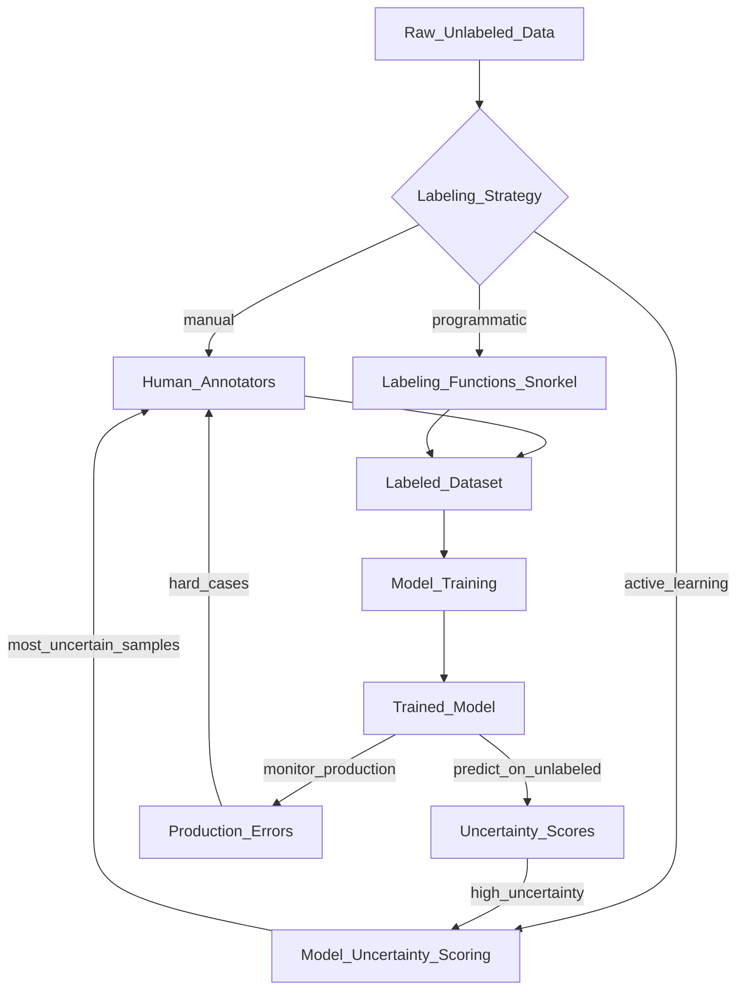

# 🏷️ Data Labeling

> [!abstract] TL;DR
> Data labeling is the process of assigning ground-truth annotations to raw data. Label quality sets the ceiling for model performance — a model can never be more accurate than its labels. Key strategies include active learning (label the most uncertain samples first), programmatic labeling with weak supervision (Snorkel), and human-in-the-loop workflows. Inter-annotator agreement (Cohen's kappa) measures label quality.

## Intuition — analogy FIRST

Teaching a child to recognize dogs by example. If you show 1,000 pictures and label every one "dog" or "not dog," the child learns from your labels. If your labels are wrong — you mislabel cats as dogs — the child learns the wrong pattern, no matter how smart they are.

The quality of labels is the **ceiling** for model quality. A perfect model can only achieve what its labels describe.

Active learning is the smart tutor: instead of quizzing the student on random questions, the tutor identifies *exactly* the questions the student is most confused about and focuses there. You get the same learning in 20% of the time.

Weak supervision is crowd-sourcing an initial answer: instead of one expert labeling everything perfectly, you ask 10 non-experts and combine their imperfect signals. Individual answers are noisy, but in aggregate they're surprisingly good.

## How It Works — mechanics + valid mermaid

**Labeling strategies:**

1. **Manual labeling:** Human annotators label data. High quality, high cost (~$0.05–$1.00 per label for complex tasks).

2. **Active learning:** Train a model on a small labeled set. Use it to score unlabeled data. Send the *most uncertain* samples (high entropy, low confidence, query by committee) to human annotators. Iterate. Dramatically reduces labeling cost.

3. **Programmatic labeling (Weak Supervision):** Write labeling functions (LFs) — Python functions that return a label or ABSTAIN. LFs can be: heuristics, keyword patterns, external knowledge bases, distant supervision, crowdsourced labels. Snorkel combines LFs probabilistically into noisy labels.

4. **Semi-supervised labeling:** Use a model trained on labeled data to pseudo-label unlabeled data. Review high-confidence pseudo-labels. Iterative.

5. **Data programming:** Instead of labeling individual examples, label the *process* (labeling functions). Scale to millions of examples.

**Label quality metrics:**
- **Inter-annotator agreement (IAA):** Do multiple annotators agree? Cohen's kappa κ = (P_observed - P_expected) / (1 - P_expected). κ > 0.8 = excellent, 0.6–0.8 = good, < 0.6 = poor.
- **Label confidence:** Annotators mark how certain they are.
- **Review queues:** Disagreements are flagged for senior review.



## Code Demo

```python
# ── LABEL STUDIO SETUP ─────────────────────────────────────────────────────
# pip install label-studio
# label-studio start    # opens UI at localhost:8080

# ── PROGRAMMATIC LABELING WITH SNORKEL ─────────────────────────────────────
# pip install snorkel

import pandas as pd
from snorkel.labeling import labeling_function, PandasLFApplier, LFAnalysis
from snorkel.labeling.model import LabelModel

# Labels
NEGATIVE = 0
POSITIVE = 1
ABSTAIN = -1

# Sample data
df = pd.DataFrame({
    "text": [
        "This product is amazing and works perfectly!",
        "Terrible quality, broke after one day",
        "It arrived on time",
        "Love it! Best purchase ever!",
        "Waste of money",
        "The color is blue",
    ]
})

# ── LABELING FUNCTIONS ──────────────────────────────────────────────────────
# Each LF looks at one signal; none are perfect; combined they're powerful

@labeling_function()
def lf_positive_keywords(x):
    """Label positive if contains strong positive words."""
    keywords = ["amazing", "love", "best", "excellent", "perfect"]
    return POSITIVE if any(w in x.text.lower() for w in keywords) else ABSTAIN

@labeling_function()
def lf_negative_keywords(x):
    """Label negative if contains strong negative words."""
    keywords = ["terrible", "broke", "waste", "awful", "horrible"]
    return NEGATIVE if any(w in x.text.lower() for w in keywords) else ABSTAIN

@labeling_function()
def lf_exclamation_positive(x):
    """Exclamation with positive words is likely positive."""
    if "!" in x.text and any(w in x.text.lower() for w in ["love", "best", "great"]):
        return POSITIVE
    return ABSTAIN

@labeling_function()
def lf_short_neutral(x):
    """Very short texts about delivery/specs are neutral."""
    neutral_words = ["arrived", "color", "size", "weight"]
    if any(w in x.text.lower() for w in neutral_words) and len(x.text) < 50:
        return ABSTAIN  # can't determine sentiment
    return ABSTAIN

# ── APPLY LABELING FUNCTIONS ───────────────────────────────────────────────
lfs = [lf_positive_keywords, lf_negative_keywords,
       lf_exclamation_positive, lf_short_neutral]

applier = PandasLFApplier(lfs=lfs)
L_train = applier.apply(df=df)

# Analyze LF coverage, conflicts, and overlaps
print(LFAnalysis(L=L_train, lfs=lfs).lf_summary())
# Coverage: fraction of data each LF labels (not ABSTAIN)
# Conflicts: fraction where this LF disagrees with another

# ── TRAIN LABEL MODEL ──────────────────────────────────────────────────────
# LabelModel learns weights for each LF based on agreement patterns
label_model = LabelModel(cardinality=2, verbose=True)
label_model.fit(L_train=L_train, n_epochs=500, lr=0.001)

# Generate probabilistic labels
probs = label_model.predict_proba(L=L_train)
labels = label_model.predict(L=L_train, tie_break_policy="abstain")

df["weak_label"] = labels
df["confidence"] = probs.max(axis=1)

# ── ACTIVE LEARNING WITH UNCERTAINTY SAMPLING ─────────────────────────────
from sklearn.linear_model import LogisticRegression
from sklearn.pipeline import Pipeline
from sklearn.feature_extraction.text import TfidfVectorizer
import numpy as np

# Train initial model on small labeled set
small_labeled = df[df["weak_label"] != -1].copy()

pipeline = Pipeline([
    ("tfidf", TfidfVectorizer(max_features=1000)),
    ("clf", LogisticRegression()),
])
pipeline.fit(small_labeled["text"], small_labeled["weak_label"])

# Score unlabeled data by uncertainty (entropy)
unlabeled = df[df["weak_label"] == -1].copy()
if len(unlabeled) > 0:
    probs_unlabeled = pipeline.predict_proba(unlabeled["text"])
    entropy = -np.sum(probs_unlabeled * np.log(probs_unlabeled + 1e-9), axis=1)
    # Sort by highest entropy = most uncertain = most valuable to label
    uncertainty_order = unlabeled.iloc[np.argsort(-entropy)]
    print("Most uncertain samples to send for human labeling:")
    print(uncertainty_order[["text"]].head())

# ── COHEN'S KAPPA ─────────────────────────────────────────────────────────
from sklearn.metrics import cohen_kappa_score

annotator_1 = [1, 0, 1, 1, 0, 1, 0, 0, 1, 1]
annotator_2 = [1, 0, 1, 0, 0, 1, 0, 1, 1, 1]

kappa = cohen_kappa_score(annotator_1, annotator_2)
print(f"Inter-annotator agreement (Cohen's kappa): {kappa:.3f}")
# > 0.8 = excellent, 0.6-0.8 = good, 0.4-0.6 = moderate
```

## Real-World Example

**Tesla — FSD Internal Labeling Pipeline**

Tesla's Autopilot team processes petabytes of dashcam footage for Full Self-Driving (FSD). Manual labeling of every frame at this scale would cost billions. Their solution uses multiple strategies:

1. **Fleet learning:** When the car detects an edge case (rare scenario), it flags that clip for labeling priority — active learning at fleet scale.
2. **Programmatic labeling:** For common objects (lane lines, traffic signs), Tesla uses computer vision rules + simulated ground truth to auto-label most frames.
3. **Human-in-the-loop:** Human annotators focus on ambiguous edge cases (partially occluded objects, unusual weather) — exactly where the model is most uncertain.
4. **Label quality:** Tesla uses redundant annotation (3 annotators per clip) with adjudication for disagreements. Inter-annotator agreement targets κ > 0.9 for safety-critical labels.

**Scale AI** (now Scale) provides human labeling infrastructure to many self-driving companies. Their key insight: the interface design dramatically affects label quality — well-designed annotation UIs with clear guidelines improve kappa by 0.1–0.2.

**Labelbox** (used by Procter & Gamble for product defect detection) allows iterative active learning loops: train a model, find uncertain predictions, send to annotators, retrain.

## Trade-offs

| Strategy | Quality | Cost | Scale | Speed |
|---|---|---|---|---|
| Manual (expert) | Very high | Very high | Low | Slow |
| Manual (crowdsource) | Medium | Medium | High | Medium |
| Active learning | High | Low | High | Fast |
| Weak supervision | Medium-High | Low | Very high | Fast |
| Semi-supervised | Variable | Low | High | Fast |
| Synthetic data | Controlled | Low | Unlimited | Fast |

## When to Use vs Avoid

**Active learning — use when:**
- You have a large unlabeled pool and limited annotation budget
- Model uncertainty is meaningful (well-calibrated model)
- Labeling is expensive (medical imaging, legal documents)

**Weak supervision — use when:**
- Expert labeling is prohibitively expensive
- You have domain heuristics that are "mostly right"
- You need to label millions of examples quickly
- You want to iterate on label definitions without re-labeling

**Manual labeling — use when:**
- Label quality is critical and mistakes are costly (medical diagnosis, safety systems)
- Subjectivity is high (sentiment, toxicity) — humans needed for nuance
- You have a small high-value dataset

## Common Pitfalls

1. **Label leakage:** If annotators see metadata (file timestamps, user IDs) that correlates with the label, they use it. Blind annotators to everything except the content being labeled.

2. **Annotation guideline drift:** Guidelines evolve over time. Labels from month 1 and month 6 may be inconsistent. Version your annotation guidelines alongside your data.

3. **Active learning cold start:** Active learning assumes you have a trained model to score uncertainty. With zero labels, start with random sampling or diversity-based selection.

4. **Low kappa = ambiguous task definition:** If annotators disagree frequently, the label taxonomy is unclear. Fix the guidelines before labeling more data.

5. **Weak supervision label noise:** Snorkel's label model handles noise, but if your labeling functions are systematically biased (not just noisy), the model will be biased too.

6. **Ignoring label cost variability:** Some labels are cheap (binary classification) and some are expensive (bounding box + segmentation). Budget accordingly.

## Related Concepts

- [[_MOC_MLOps|↑ Section MOC]]

- [[Data_Quality_Validation]] — validate label distributions and catch systematic annotation errors
- [[Handling_Imbalanced_Data]] — label imbalance is often discovered during labeling; strategies to handle it
- [[Experiment_Tracking_Overview]] — track labeling experiments (which LF set, which active learning strategy) alongside model experiments
- [[Data_Versioning_DVC]] — version labeled datasets; know which label version trained which model

## Review Questions

1. You have 100,000 unlabeled customer support tickets and a budget for 5,000 manual labels. Compare uncertainty-based active learning vs random sampling — what are the conditions under which active learning provides the most benefit?

2. Write two Snorkel labeling functions for a medical symptom classifier. What does Cohen's kappa measure, and what would a kappa of 0.45 tell you about your annotation task?

3. Describe the "data flywheel" pattern used by companies like Tesla and Amazon. How does production model deployment feed back into improving the training dataset?

## Sources

- [Snorkel Documentation](https://snorkel.readthedocs.io/)
- [Label Studio Documentation](https://labelstud.io/guide/)
- Ratner, A. et al. "Snorkel: Rapid Training Data Creation with Weak Supervision." VLDB, 2018.
- Settles, B. "Active Learning Literature Survey." University of Wisconsin-Madison, 2009.
- Huyen, Chip. *Designing Machine Learning Systems*. O'Reilly, 2022. Chapter 4.
- Scale AI Blog: "The Data-Centric AI Revolution" (2023)

#mlops #data-labeling #active-learning #weak-supervision #snorkel #annotation #inter-annotator-agreement
