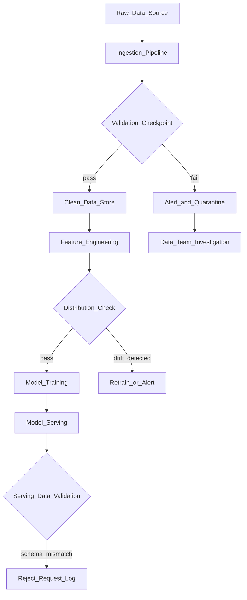

# ✅ Data Quality Validation

> [!abstract] TL;DR
> Data quality validation means writing automated assertions about your data — schema, statistics, and distributions — that run before your models train or serve. Tools like Great Expectations and TensorFlow Data Validation (TFDV) act as "unit tests for data." They catch silent data corruption early, enforce data contracts between producers and consumers, and prevent garbage-in-garbage-out model degradation.

## Intuition — analogy FIRST

Software engineers wouldn't ship code without unit tests. Yet ML teams routinely train on data with no assertions at all — silently dropped columns, unexpected nulls, distribution shifts, wrong data types. The model trains, metrics look "about right," and a subtle data bug ships to production.

Data validation is exactly like unit tests — but for data. You write expectations: "the `age` column should be between 0 and 120," "the `user_id` column should have no nulls," "the `revenue` column should follow the same distribution as last week." If any assertion fails, your pipeline stops and alerts you before corrupted data pollutes a model.

**Data contracts** extend this: they're formal agreements between the team producing data (data engineering) and the team consuming it (ML). The producing team guarantees certain properties; the consuming team can rely on them. If the producer changes the schema, they break the contract and their CI fails.

## How It Works — mechanics + valid mermaid

**Great Expectations workflow:**
1. **Profile data** → auto-generate expectations from a sample dataset
2. **Curate expectations** → review and add/remove assertions
3. **Checkpoint** → attach expectations to a data pipeline step
4. **Validate** → run checkpoint on new data batch; pass/fail
5. **Data Docs** → auto-generated HTML report of validation results

**TFDV (TensorFlow Data Validation):**
- Designed for ML pipelines
- Generates a schema from training data
- Validates serving data against the training schema
- Detects skew between training and serving distributions
- Integrates with TFX pipelines

**Key validation categories:**

| Category | Examples |
|---|---|
| Schema | Column types, required columns, allowed values |
| Completeness | No unexpected nulls, row count thresholds |
| Statistics | Mean, std within expected range |
| Distribution | KL divergence, KS test vs reference dataset |
| Referential integrity | User IDs exist in user table |
| Freshness | Data timestamp within acceptable lag |



## Code Demo

```python
# ── GREAT EXPECTATIONS ─────────────────────────────────────────────────────
# pip install great-expectations

import great_expectations as gx
import pandas as pd

# ── 1. CREATE A DATA CONTEXT ───────────────────────────────────────────────
context = gx.get_context()

# ── 2. CONNECT TO DATA ─────────────────────────────────────────────────────
df = pd.read_csv("data/train.csv")

# Create a GX DataFrame
gx_df = context.sources.pandas_default.read_dataframe(df)

# ── 3. CREATE EXPECTATION SUITE ────────────────────────────────────────────
suite = context.add_expectation_suite("training_data_suite")

# ── 4. ADD EXPECTATIONS ────────────────────────────────────────────────────
# Schema checks
gx_df.expect_table_columns_to_match_ordered_list(
    column_list=["user_id", "age", "income", "label"]
)
gx_df.expect_table_row_count_to_be_between(min_value=10_000, max_value=10_000_000)

# Completeness checks
gx_df.expect_column_values_to_not_be_null("user_id")
gx_df.expect_column_values_to_not_be_null("label")

# Type checks
gx_df.expect_column_values_to_be_of_type("age", "int64")

# Range checks
gx_df.expect_column_values_to_be_between("age", min_value=0, max_value=120)
gx_df.expect_column_values_to_be_between("income", min_value=0, max_value=10_000_000)

# Categorical checks
gx_df.expect_column_distinct_values_to_be_in_set(
    "label", value_set={0, 1}
)

# Statistical checks
gx_df.expect_column_mean_to_be_between("age", min_value=25, max_value=45)
gx_df.expect_column_stdev_to_be_between("income", min_value=10_000, max_value=100_000)

# Uniqueness
gx_df.expect_column_values_to_be_unique("user_id")

# ── 5. VALIDATE ────────────────────────────────────────────────────────────
validation_result = gx_df.validate()

if not validation_result["success"]:
    failed = [r for r in validation_result.results if not r["success"]]
    for r in failed:
        print(f"FAILED: {r['expectation_config']['expectation_type']}")
        print(f"  Details: {r['result']}")
    raise ValueError(f"Data validation failed: {len(failed)} expectations failed")

print("✓ All data validations passed")

# ── TFDV (TENSORFLOW DATA VALIDATION) ─────────────────────────────────────
# pip install tensorflow-data-validation

import tensorflow_data_validation as tfdv

# Generate statistics from training data
train_stats = tfdv.generate_statistics_from_csv("data/train.csv")

# Infer schema from training statistics
schema = tfdv.infer_schema(statistics=train_stats)
tfdv.display_schema(schema=schema)

# Validate serving/new data against training schema
serving_stats = tfdv.generate_statistics_from_csv("data/serving.csv")
anomalies = tfdv.validate_statistics(statistics=serving_stats, schema=schema)
tfdv.display_anomalies(anomalies)

# Check for training-serving skew
skew_comparator = tfdv.get_feature(schema, "income")
skew_comparator.skew_comparator.infinity_norm.threshold = 0.01

skew_anomalies = tfdv.validate_statistics(
    statistics=train_stats,
    schema=schema,
    serving_statistics=serving_stats
)
if skew_anomalies.anomaly_info:
    print("WARNING: Training-serving skew detected!")
    tfdv.display_anomalies(skew_anomalies)

# ── DATA CONTRACTS (PANDERA) ───────────────────────────────────────────────
# pip install pandera
import pandera as pa
from pandera import Column, DataFrameSchema, Check

# Define a data contract as a Python schema
user_event_schema = DataFrameSchema(
    {
        "user_id": Column(int, Check.greater_than(0), nullable=False, unique=True),
        "age": Column(int, [Check.between(0, 120)], nullable=True),
        "income": Column(float, Check.greater_than_or_equal_to(0), nullable=True),
        "label": Column(int, Check.isin([0, 1]), nullable=False),
        "timestamp": Column(pa.DateTime, nullable=False),
    },
    name="user_events",
    strict=True,          # raise error on unexpected columns
    coerce=False,         # don't silently coerce types
)

# Validate — raises SchemaError with detailed message on failure
try:
    validated_df = user_event_schema.validate(df)
    print("Data contract validated successfully")
except pa.errors.SchemaError as e:
    print(f"Data contract violation: {e}")
    # In CI pipeline: raise to fail the build
    raise
```

## Real-World Example

**Airbnb — Data Contracts at Scale**

Airbnb's data engineering team manages thousands of datasets consumed by hundreds of ML models. Before data contracts, a schema change by one team would silently break downstream ML pipelines — sometimes going undetected until a model degraded in production weeks later.

Airbnb implemented a data contract system:
- **Schema registry:** Every dataset has a formal schema versioned in their data catalog (Dataportal)
- **Contract tests in CI:** When a data producer changes a schema, contract tests run automatically; breaking changes fail the PR
- **Consumer notification:** Breaking changes trigger automated notifications to all downstream consumers
- **Backwards compatibility rules:** Additive changes (new columns) are allowed; removing or renaming columns requires a deprecation period

Results: silent data quality issues causing model degradation dropped by 70%. The team estimated that each undetected data issue cost ~$50K in engineering time to diagnose post-incident.

**LinkedIn — Great Expectations in ML Pipelines**

LinkedIn validates all ML training data with Great Expectations checkpoints embedded in their Azkaban workflow scheduler. If any validation fails, the training pipeline halts and alerts the owning team. They run ~200 validation checkpoints daily across their ML data pipelines.

## Trade-offs

| Tool | Pros | Cons |
|---|---|---|
| **Great Expectations** | Flexible, generates Data Docs UI, large community | Complex setup, YAML-heavy configuration |
| **TFDV** | TFX-native, training-serving skew detection | TensorFlow ecosystem dependency |
| **Pandera** | Pythonic, type hints, integrates with pandas | Less enterprise tooling |
| **dbt tests** | Built into dbt, familiar for data engineers | SQL-only, not ML-native |
| **Custom scripts** | Full control | No standardization, maintenance burden |

## When to Use vs Avoid

**Use data validation when:**
- You have automated ML pipelines (train, serve) — validation is a must
- Data comes from external sources you don't control
- Model quality incidents have been traced to data issues
- You operate in a regulated industry with data quality requirements

**Skip/defer when:**
- You're in early exploration on a notebook — validation overhead isn't worth it yet
- You control the entire data pipeline and it's trivially simple
- Speed of iteration is the priority; add validation once pipelines stabilize

## Common Pitfalls

1. **Testing on the same data you profiled:** Don't generate expectations on `train.csv` then validate `train.csv` — that's circular. Profile on a reference batch, validate on new batches.

2. **Overly tight statistical expectations:** If you set `expect_column_mean_to_be_between(age, 32.5, 33.5)`, any natural seasonal variation will fail. Use wider bounds or relative thresholds.

3. **Validation without action:** Running validations but ignoring failures (logging without alerting) gives false confidence. Wire failures to CI gates and alerts.

4. **Validating too late:** Validate data at ingestion, not just before training. The earlier you catch issues, the cheaper the fix.

5. **Missing freshness checks:** Schema and statistics can look fine on stale data. Add a `timestamp_field` recency check — "most recent record is within 24 hours."

## Related Concepts

- [[_MOC_MLOps|↑ Section MOC]]

- [[Data_Versioning_DVC]] — version the validated datasets; failed validations should prevent new DVC versions from being created
- [[Data_Drift]] — data validation catches schema/stats violations; data drift monitoring catches gradual distribution shifts
- [[ML_Pipelines_Overview]] — validation checkpoints are stages in your ML pipeline DAG
- [[Data_Labeling]] — validate label distributions and completeness in labeled datasets
- [[Feature_Stores]] — validate features during materialization before they reach the online store

## Review Questions

1. Explain the difference between schema validation, statistical validation, and distribution validation. Give one Great Expectations expectation for each category.

2. What is a "data contract" and how does it differ from just having internal documentation about a dataset's structure? How would you enforce a data contract in a CI/CD pipeline?

3. Your ML model starts degrading in production. You check your Great Expectations validation logs and find validations have been passing. What types of issues would validations miss, and what additional monitoring would you add?

## Sources

- [Great Expectations Documentation](https://docs.greatexpectations.io/)
- [TFDV Guide](https://www.tensorflow.org/tfx/guide/tfdv)
- [Pandera Documentation](https://pandera.readthedocs.io/)
- Airbnb Engineering Blog: "Scaling Data Quality at Airbnb" (2022)
- Shankar, S. et al. "Operationalizing Machine Learning: An Interview Study." arXiv, 2022.
- Huyen, Chip. *Designing Machine Learning Systems*. O'Reilly, 2022. Chapter 4.

#mlops #data-quality #great-expectations #tfdv #data-contracts #data-validation #testing
