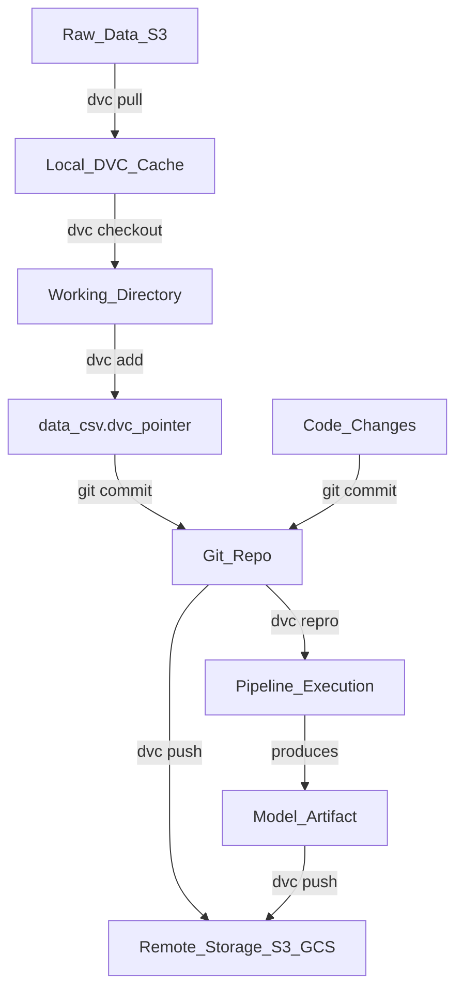

# 🗃️ Data Versioning with DVC

> [!abstract] TL;DR
> DVC (Data Version Control) is Git for large data files and ML pipelines. It stores tiny `.dvc` pointer files in Git while pushing actual data to remote storage (S3, GCS, Azure). This lets you checkout any historical dataset version, reproduce experiments exactly, and collaborate on datasets without bloating your Git repo.

## Intuition — analogy FIRST

Imagine a law firm that needs to track every revision of a 10,000-page contract. Storing the full document in every Git commit would be absurd — each commit would be gigabytes. Instead, a smart paralegal keeps a tiny index card in the filing cabinet (Git) that says "Contract v3 is in box 42 in the warehouse." The actual contract lives in a separate, organized warehouse (S3/GCS). When you need version 3, you read the index card and fetch it from the warehouse.

DVC is that paralegal. The `.dvc` file is the index card. Your remote storage is the warehouse. Git tracks the cards; DVC manages the warehouse.

## How It Works — mechanics + valid mermaid

DVC intercepts large files before they reach Git. When you run `dvc add data.csv`, DVC:
1. Computes an MD5 hash of the file
2. Moves the file to a local cache (`.dvc/cache/`)
3. Creates a `data.csv.dvc` pointer file containing the hash
4. Adds `data.csv` to `.gitignore` automatically

The `.dvc` pointer file IS tracked in Git. The actual data stays in the DVC cache and remote.

**Pipeline mechanics:** `dvc.yaml` defines stages (nodes in a DAG). Each stage has inputs (`deps`), outputs (`outs`), and a command. DVC tracks file hashes to detect what changed and only re-runs affected stages.



**Data lineage:** DVC tracks which data version produced which model. Given any Git commit, `dvc repro` reconstructs the exact experiment.

## Code Demo

```bash
# ── SETUP ──────────────────────────────────────────────────────────────────
pip install dvc dvc-s3    # or dvc-gcs, dvc-azure

# Initialize DVC in an existing Git repo
cd my-ml-project
dvc init
git commit -m "Initialize DVC"

# ── TRACK DATA ─────────────────────────────────────────────────────────────
# DVC moves data to cache, creates .dvc pointer, updates .gitignore
dvc add data/raw/train.csv
git add data/raw/train.csv.dvc data/raw/.gitignore
git commit -m "Track training data with DVC"

# ── CONFIGURE REMOTE STORAGE ───────────────────────────────────────────────
dvc remote add -d myremote s3://my-bucket/dvc-store
dvc remote modify myremote region us-east-1
git commit .dvc/config -m "Add S3 remote storage"

# Upload data to remote
dvc push

# ── TEAM COLLABORATION ─────────────────────────────────────────────────────
# Teammate clones the repo and fetches data
git clone https://github.com/org/my-ml-project
dvc pull   # downloads data from S3 using .dvc pointer files

# ── VERSIONING DATA ────────────────────────────────────────────────────────
# Update dataset
dvc add data/raw/train.csv      # recomputes hash
git add data/raw/train.csv.dvc
git commit -m "Update training data: added 10k samples"
dvc push

# Go back to old data version
git checkout HEAD~1 -- data/raw/train.csv.dvc
dvc checkout   # restores the old data file from cache/remote

# ── PIPELINES (dvc.yaml) ───────────────────────────────────────────────────
# Define a reproducible pipeline
cat > dvc.yaml << 'EOF'
stages:
  preprocess:
    cmd: python src/preprocess.py --input data/raw/train.csv --output data/processed/
    deps:
      - src/preprocess.py
      - data/raw/train.csv
    outs:
      - data/processed/train_clean.csv

  train:
    cmd: python src/train.py --data data/processed/train_clean.csv --model models/
    deps:
      - src/train.py
      - data/processed/train_clean.csv
    outs:
      - models/model.pkl
    metrics:
      - metrics/scores.json:
          cache: false
EOF

# Run the full pipeline (only re-runs changed stages)
dvc repro

# View metrics across Git commits
dvc metrics show
dvc metrics diff HEAD~3

# ── EXPERIMENTS ────────────────────────────────────────────────────────────
# Run experiment with different hyperparameters
dvc exp run --set-param train.learning_rate=0.001

# Compare experiments
dvc exp show
dvc exp diff
```

## Real-World Example

**Pfizer — Clinical Trial Dataset Versioning**

Pfizer's computational biology team uses DVC to version multi-terabyte genomics datasets for clinical trials. Before DVC, reproducing a model trained six months ago required tracking down which version of a dataset was used — often impossible. With DVC:
- Every training run has a Git commit + DVC pointer = exact data version
- Regulatory submissions include the DVC commit hash, satisfying FDA data provenance requirements
- When a data error is found in trial v2, they can instantly identify all models trained on it
- Compute teams in Boston and San Diego share the same S3 remote, so dataset updates propagate via `dvc pull`

The Iterative.ai team (DVC creators) documented that regulated industries (pharma, finance) drive ~40% of their enterprise adoption precisely because of traceable data provenance.

## Trade-offs

| Aspect | Pro | Con |
|---|---|---|
| **Git integration** | Familiar workflow; data versions tied to code versions | Learning curve for non-Git users |
| **Remote storage** | Works with any cloud (S3, GCS, Azure, SSH) | Requires cloud storage setup and access management |
| **Large files** | No Git LFS size limits; handles TBs efficiently | First `dvc pull` can be slow for large datasets |
| **Pipelines** | Automatic change detection, only re-runs needed stages | `dvc.yaml` adds configuration overhead |
| **Cache** | Local cache avoids re-downloading unchanged data | Cache can grow large; needs periodic `dvc gc` cleanup |
| **Collaboration** | Team shares remote, anyone can reproduce any version | Remote storage costs scale with data volume |

## When to Use vs Avoid

**Use DVC when:**
- You have datasets or model artifacts too large for Git (>100MB)
- Reproducibility and data lineage are requirements (regulated industries, research)
- Multiple team members collaborate on datasets
- You want to tie code versions to data versions in one Git commit
- You need to compare experiments across different data versions

**Avoid DVC when:**
- Your data fits in Git LFS and you have no pipeline orchestration needs
- You're already using a managed ML platform (Vertex AI, SageMaker) with built-in data versioning
- Your team has no Git experience — DVC adds complexity on top of Git
- You need real-time streaming data — DVC is batch-oriented

## Common Pitfalls

1. **Forgetting `dvc push` after `dvc add`** — teammates run `dvc pull` and get "file not in remote" errors. Automate `dvc push` in CI.

2. **Committing large files directly to Git** — if you forget `dvc add` before `git add`, large files go into Git history. Use pre-commit hooks: `pre-commit install` with a file size check.

3. **Cache bloat** — the `.dvc/cache` grows indefinitely. Run `dvc gc --workspace --cloud` periodically to remove cached files no longer referenced by any Git branch.

4. **Modifying tracked files without `dvc add`** — DVC won't detect changes until you re-run `dvc add`. Your pipeline may run on stale data.

5. **Circular dependencies in dvc.yaml** — DVC stages must form a DAG. A stage cannot depend on its own output. DVC will error with a cycle detection message.

6. **Remote credentials in CI** — pipelines fail in CI because DVC remote credentials aren't configured. Use `dvc remote modify myremote access_key_id $AWS_KEY` with environment variables.

## Related Concepts

- [[_MOC_MLOps|↑ Section MOC]]

- [[Experiment_Tracking_Overview]] — DVC tracks data versions; experiment trackers (MLflow, W&B) track model metrics; combine both for full reproducibility
- [[ML_Pipelines_Overview]] — DVC pipelines (`dvc repro`) handle lightweight orchestration; for complex DAGs use Kubeflow or Airflow
- [[Data_Quality_Validation]] — validate data integrity before DVC-tracked datasets are used in training
- [[Feature_Stores]] — feature stores handle real-time feature serving; DVC handles training data versioning
- [[Model_Versioning]] — DVC can version model artifacts; pair with MLflow Model Registry for lifecycle management

## Review Questions

1. What is a `.dvc` pointer file, what does it contain, and why does Git track it instead of the actual data file?

2. If a teammate runs `dvc repro` on their machine after cloning your repo, under what conditions will DVC skip re-running a pipeline stage vs. re-execute it?

3. You discover that a dataset you used 3 months ago contained labeling errors. How would you use DVC to identify every model trained on that dataset and reproduce the experiment with the corrected data?

## Sources

- [DVC Official Documentation](https://dvc.org/doc)
- [DVC Get Started Tutorial](https://dvc.org/doc/start)
- Iterative.ai Blog: "ML Reproducibility with DVC" (2024)
- [DVC GitHub Repository](https://github.com/iterative/dvc)
- Huyen, Chip. *Designing Machine Learning Systems*. O'Reilly, 2022. Chapter 7.

#mlops #data-versioning #dvc #reproducibility #data-management #git #pipelines
