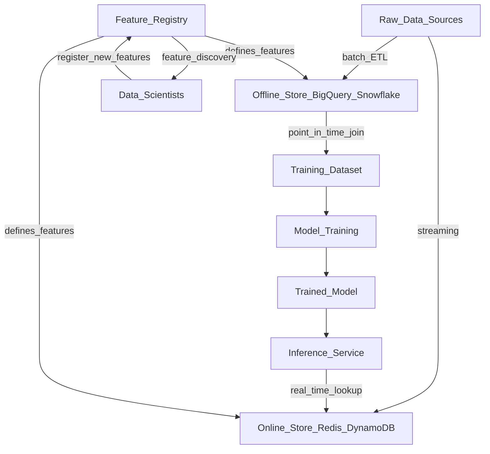

# 🏪 Feature Stores

> [!abstract] TL;DR
> A feature store is a centralized repository that lets teams compute features once and reuse them everywhere — in training pipelines (offline store, batch) and in production inference (online store, low-latency). It eliminates training-serving skew, promotes feature reuse across teams, and provides a searchable registry of what features exist and how they were computed.

## Intuition — analogy FIRST

Imagine a large restaurant chain. Without a feature store, every chef at every location independently chops onions, makes sauces, and prepares ingredients. They all do the same work, but slightly differently — one chef's "diced onion" is another's "roughly chopped." When a dish tastes different across locations, nobody can tell why.

A feature store is like a central commissary kitchen. One prep team computes the canonical "diced onion" (feature) once, to a precise specification. The batch kitchen (offline store) uses pre-made ingredients for developing new recipes (model training). The à la carte line (online store) has the same ingredients ready in real time for individual orders (inference). Every dish uses the *same* ingredient — no more variation. A recipe card catalog (feature registry) tells any chef exactly what's available and how it was made.

## How It Works — mechanics + valid mermaid

**Core components:**

- **Feature Registry:** Catalog of feature definitions (metadata, owners, lineage). Searchable — find features before building new ones.
- **Offline Store:** Historical feature values for model training. Backed by a data warehouse (BigQuery, Snowflake, Redshift). Supports time-travel queries ("give me feature X as of 2024-01-15 for these entities").
- **Online Store:** Low-latency key-value store (Redis, DynamoDB, Cassandra) for real-time serving. Only holds the *latest* feature value per entity.
- **Materialization:** The process of computing features from raw data and writing them to both stores. Usually a batch job run on a schedule.
- **Point-in-time correct joins:** When creating training datasets, the feature store joins features to labels using each label's timestamp — avoiding future leakage.



**Training-serving skew:** The #1 problem feature stores solve. Without a feature store, training code computes features one way (e.g., Python pandas), and serving code recomputes them differently (e.g., Java). Even tiny differences accumulate into silent model degradation.

**Time-travel queries:** When training, you must retrieve feature values *as they existed at the time of the label*, not current values. Feature stores handle this automatically — critical for preventing data leakage.

## Code Demo

```python
# ── FEAST FEATURE STORE SETUP ──────────────────────────────────────────────
# pip install feast

# 1. Initialize feature store
# feast init my_feature_store
# cd my_feature_store

# feature_repo/driver_features.py
from datetime import timedelta
import pandas as pd
from feast import (
    Entity, Feature, FeatureView, FileSource, ValueType, FeatureStore
)
from feast.types import Float32, Int64, String

# Define the entity (what we're describing features about)
driver = Entity(
    name="driver_id",
    value_type=ValueType.INT64,
    description="Driver identifier",
)

# Define the data source (offline store source)
driver_stats_source = FileSource(
    path="data/driver_stats.parquet",
    timestamp_field="event_timestamp",
    created_timestamp_column="created",
)

# Define a FeatureView (set of features computed from a source)
driver_stats_fv = FeatureView(
    name="driver_hourly_stats",
    entities=["driver_id"],
    ttl=timedelta(hours=1),          # how long online store values are fresh
    features=[
        Feature(name="conv_rate", dtype=Float32),
        Feature(name="acc_rate", dtype=Float32),
        Feature(name="avg_daily_trips", dtype=Int64),
    ],
    source=driver_stats_source,
)

# 2. Apply feature definitions to the registry
# feast apply   (run in CLI)

# ── MATERIALIZATION ─────────────────────────────────────────────────────────
# Push historical data to online store (Redis) for real-time serving
store = FeatureStore(repo_path=".")
store.materialize_incremental(end_date=pd.Timestamp.now(tz="UTC"))

# ── TRAINING: RETRIEVE HISTORICAL FEATURES ──────────────────────────────────
# Entity dataframe: who we want features for + at what timestamp
entity_df = pd.DataFrame({
    "driver_id": [1001, 1002, 1003],
    "event_timestamp": pd.to_datetime([
        "2024-01-15 10:00:00",
        "2024-01-15 11:00:00",
        "2024-01-15 09:30:00",
    ], utc=True),
})

# Point-in-time correct join — features as they existed at event_timestamp
training_df = store.get_historical_features(
    entity_df=entity_df,
    features=["driver_hourly_stats:conv_rate",
              "driver_hourly_stats:acc_rate",
              "driver_hourly_stats:avg_daily_trips"],
).to_df()

print(training_df)

# ── SERVING: RETRIEVE ONLINE FEATURES (LOW-LATENCY) ─────────────────────────
# In production inference service, fetch latest features for current entity
feature_vector = store.get_online_features(
    features=["driver_hourly_stats:conv_rate",
              "driver_hourly_stats:acc_rate",
              "driver_hourly_stats:avg_daily_trips"],
    entity_rows=[{"driver_id": 1001}],
).to_dict()

print(feature_vector)
# {'driver_id': [1001], 'conv_rate': [0.87], 'acc_rate': [0.92], ...}

# ── FEATURE DISCOVERY ───────────────────────────────────────────────────────
# List all available feature views in the registry
for fv in store.list_feature_views():
    print(f"  {fv.name}: {[f.name for f in fv.features]}")
```

## Real-World Example

**Uber Michelangelo — The Feature Store That Started It All**

Uber built Michelangelo, one of the first large-scale feature stores, in 2017. The trigger: multiple ML teams were computing "driver acceptance rate" independently — each with subtly different logic (different time windows, different null handling). Models trained on one team's features broke when another team's features were used in production.

Michelangelo's feature store allowed:
- **Shared features:** "Driver acceptance rate (7-day)" defined once, used by 50+ models across fraud, pricing, and ETA
- **Sub-millisecond online serving:** Redis-backed, served <2ms p99 for real-time pricing models
- **Time-travel training:** Historical feature values with point-in-time joins prevented data leakage
- **Feature catalog:** Engineers could search 10,000+ features before building new ones

**DoorDash ML Platform:** DoorDash built a similar system. Before their feature store, a "restaurant prep time" feature was computed 14 different ways across different models. After centralizing, they eliminated an entire class of prediction errors and reduced feature development time by 60%.

## Trade-offs

| Aspect | Pro | Con |
|---|---|---|
| **Consistency** | Eliminates training-serving skew completely | Requires discipline — teams must use the store, not bypass it |
| **Reuse** | Features computed once, shared across 50+ models | Organizational cost: who owns feature definitions? |
| **Latency** | Online store (Redis) achieves <5ms feature retrieval | Online store is eventually consistent with offline store |
| **Point-in-time joins** | Prevents data leakage automatically | More complex than simple table joins |
| **Operational cost** | Reduces duplicate computation | New infrastructure to operate (Redis, Kafka, Spark jobs) |
| **Managed options** | Tecton, Hopsworks, Vertex Feature Store reduce ops burden | Vendor lock-in, cost |

## When to Use vs Avoid

**Use a feature store when:**
- Multiple ML models share the same features (e.g., "user lifetime value" used by 5+ models)
- You have both batch training and real-time serving requirements
- Training-serving skew is causing unexplained production degradation
- Your organization has >5 data scientists working on >10 models
- Regulatory/audit requirements demand feature lineage

**Avoid a feature store when:**
- You have <3 models in production — overhead is not justified
- All inference is batch (no real-time serving) — offline store alone may suffice
- Features are model-specific and unlikely to be shared
- Team is small and moving fast — start with simple Pandas/SQL, add feature store later

## Common Pitfalls

1. **Online-offline inconsistency:** Features in the online store are "as of the last materialization." If materialization runs every hour, your online features can be up to 1 hour stale. Design around this — know your freshness requirements.

2. **Ignoring point-in-time correctness:** If you build training datasets with a simple SQL join (not point-in-time), you'll inadvertently use future feature values, causing optimistic offline metrics that collapse in production.

3. **Over-centralizing everything:** Not every feature needs to be in the store. Request-time features (e.g., the user's current search query) don't belong there — they're passed directly at inference time.

4. **Feature explosion:** Teams add features liberally but never deprecate them. After 2 years, you have 50,000 features, most unused. Implement feature deprecation workflows from the start.

5. **Missing freshness monitoring:** The online store silently serves stale features if the materialization job fails. Alert on materialization lag, not just job success/failure.

## Related Concepts

- [[_MOC_MLOps|↑ Section MOC]]

- [[Data_Versioning_DVC]] — DVC versions training datasets; feature stores version and serve features
- [[Model_Serving_Overview]] — the online store is part of your serving infrastructure; latency SLAs flow back to the feature store
- [[Data_Drift]] — monitor feature distributions in the online store; drift in input features signals model degradation
- [[ML_Pipelines_Overview]] — feature materialization jobs are pipeline stages
- [[Data_Quality_Validation]] — validate feature distributions during materialization

## Review Questions

1. What is training-serving skew, and explain precisely how a feature store's offline/online architecture prevents it?

2. Why do feature stores need to support "point-in-time correct" joins when constructing training datasets? What goes wrong without it?

3. You're at a company with 3 ML teams: recommendations, fraud detection, and pricing. The fraud team wants to use a feature "user_recent_failed_payments_7d" that the pricing team already computes. Walk through how a feature store enables safe feature reuse without introducing tight team coupling.

## Sources

- [Feast Documentation](https://docs.feast.dev/)
- Uber Engineering Blog: "Meet Michelangelo: Uber's Machine Learning Platform" (2017)
- DoorDash Engineering Blog: "Building a Gigascale ML Feature Store with Redis" (2021)
- Huyen, Chip. *Designing Machine Learning Systems*. O'Reilly, 2022. Chapter 7.
- [Tecton Feature Store Overview](https://www.tecton.ai/blog/what-is-a-feature-store/)

#mlops #feature-store #feature-engineering #serving #training-serving-skew #feast #tecton
