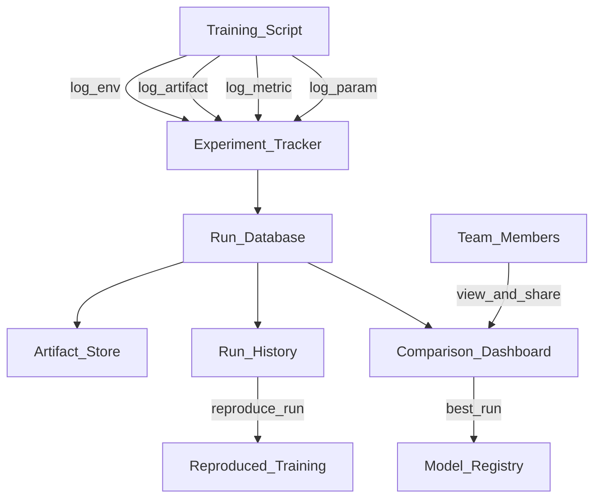

# 🔬 Experiment Tracking Overview

> [!abstract] TL;DR
> Experiment tracking is the practice of systematically logging everything about each ML training run — hyperparameters, metrics, code version, data version, and artifacts. It enables reproducibility (recreate any past result), comparison (which run performed best, and why), and collaboration (share findings with your team). Every serious ML team uses experiment tracking; without it, ML development becomes archaeology.

## Intuition — analogy FIRST

Imagine a pharmaceutical research lab where scientists run hundreds of drug trials. Without a lab notebook, you'd have no idea which compound concentration produced the best result, whether two identical experiments gave different outcomes (and why), or which batch of reagents was used in the successful trial.

ML training runs are experiments. A **lab notebook for ML** records:
- **Parameters (experimental conditions):** learning rate, batch size, model architecture
- **Metrics (results):** loss curves, accuracy, AUC, F1
- **Artifacts (samples):** saved model weights, confusion matrices, example predictions
- **Environment (lab conditions):** Python version, library versions, hardware
- **Data version (reagent batch):** exactly which dataset was used

When you have a systematic lab notebook (experiment tracker), you can answer: "Six months ago, we got 94.2% accuracy on this task. What was different about that experiment?"

## How It Works — mechanics + valid mermaid

**Hierarchy:**
- **Project/Workspace:** top-level container (e.g., "customer-churn-prediction")
- **Experiment:** a logical grouping of related runs (e.g., "bert-fine-tuning")
- **Run:** one execution of training code with specific parameters
- **Artifact:** file stored alongside a run (model weights, plots, datasets)

**What to track:**

| Category | Examples |
|---|---|
| Hyperparameters | learning_rate=0.001, batch_size=32, epochs=10 |
| Metrics | train_loss, val_accuracy, AUC (per step + final) |
| Artifacts | model.pkl, confusion_matrix.png, feature_importance.csv |
| Code | git commit hash, diff |
| Environment | Python version, requirements.txt, conda env |
| Data | dataset path, DVC hash, row count |
| System | GPU type, memory usage, training duration |

**Key capabilities:**
- **Compare runs:** side-by-side parameter/metric table, metric curves
- **Search/filter:** find all runs where val_accuracy > 0.9 and batch_size == 32
- **Reproduce:** given a run ID, retrieve all parameters and recreate the experiment
- **Visualize:** loss curves, learning rate schedules, confusion matrices over time



## Code Demo

```python
# ── MINIMAL MLFLOW TRACKING ────────────────────────────────────────────────
# pip install mlflow

import mlflow
import mlflow.sklearn
from sklearn.ensemble import RandomForestClassifier
from sklearn.datasets import load_breast_cancer
from sklearn.model_selection import train_test_split
from sklearn.metrics import accuracy_score, roc_auc_score, f1_score

# Load data
X, y = load_breast_cancer(return_X_y=True)
X_train, X_test, y_train, y_test = train_test_split(X, y, test_size=0.2, random_state=42)

# Set experiment (creates if doesn't exist)
mlflow.set_experiment("breast-cancer-classification")

# Start a run
with mlflow.start_run(run_name="rf-baseline"):

    # ── LOG HYPERPARAMETERS ────────────────────────────────────────────────
    params = {
        "n_estimators": 100,
        "max_depth": 5,
        "min_samples_split": 2,
        "random_state": 42,
    }
    mlflow.log_params(params)

    # ── TRAIN MODEL ────────────────────────────────────────────────────────
    model = RandomForestClassifier(**params)
    model.fit(X_train, y_train)

    # ── LOG METRICS ────────────────────────────────────────────────────────
    y_pred = model.predict(X_test)
    y_prob = model.predict_proba(X_test)[:, 1]

    metrics = {
        "accuracy": accuracy_score(y_test, y_pred),
        "auc": roc_auc_score(y_test, y_prob),
        "f1": f1_score(y_test, y_pred),
    }
    mlflow.log_metrics(metrics)

    # Log metrics per epoch (for neural networks, log per step)
    for epoch in range(10):
        mlflow.log_metric("train_loss", 1.0 / (epoch + 1), step=epoch)

    # ── LOG ARTIFACTS ──────────────────────────────────────────────────────
    import matplotlib.pyplot as plt
    from sklearn.metrics import ConfusionMatrixDisplay

    fig, ax = plt.subplots()
    ConfusionMatrixDisplay.from_estimator(model, X_test, y_test, ax=ax)
    fig.savefig("confusion_matrix.png")
    mlflow.log_artifact("confusion_matrix.png")

    # Log the model itself (MLflow creates a standard MLmodel format)
    mlflow.sklearn.log_model(model, "random_forest_model")

    # Log tags (free-form metadata)
    mlflow.set_tag("team", "data-science")
    mlflow.set_tag("dataset_version", "v3.2")

    print(f"Run ID: {mlflow.active_run().info.run_id}")
    print(f"Metrics: {metrics}")

# ── QUERY PAST RUNS ────────────────────────────────────────────────────────
client = mlflow.MlflowClient()

# Get all runs for an experiment, sorted by AUC
runs = client.search_runs(
    experiment_ids=["1"],
    filter_string="metrics.auc > 0.95",
    order_by=["metrics.auc DESC"],
    max_results=10,
)

for run in runs:
    print(f"Run {run.info.run_id}: AUC={run.data.metrics['auc']:.4f}, "
          f"n_estimators={run.data.params['n_estimators']}")

# ── LAUNCH MLFLOW UI ───────────────────────────────────────────────────────
# mlflow ui    # opens http://localhost:5000
# Or with remote tracking server:
# mlflow.set_tracking_uri("http://mlflow-server:5000")
```

## Real-World Example

**Weights & Biases at Research Labs**

W&B has become the de facto standard at major ML research labs. A typical research workflow at a company like Hugging Face:

1. Every training run automatically logs to W&B with `wandb.init()`
2. Researchers share "Reports" — annotated experiment summaries with embedded charts — instead of emailing CSV files
3. When a model achieves a new SOTA result, the W&B run is the source of truth for the exact hyperparameters, data version, and code commit
4. Sweeps run hyperparameter search with Bayesian optimization — W&B schedules 200 runs and identifies the optimal configuration

**Enterprise case — Booking.com:**
Booking runs 1,000+ ML experiments daily across their recommendations and pricing teams. Before centralizing experiment tracking in MLflow, two teams independently discovered the same model improvement — duplicating 3 weeks of compute. With a shared MLflow server, researchers can see what others have tried before starting new experiments.

The ROI estimate: avoiding duplicate experiments saves $2M/year in compute at their scale.

## Trade-offs

| Tool | Open Source | UI Quality | Scalability | Ecosystem |
|---|---|---|---|---|
| **MLflow** | Yes (self-host) | Good | High | Strong (Databricks) |
| **Weights & Biases** | No (SaaS) | Excellent | Very high | Very strong |
| **Comet ML** | No (SaaS) | Good | High | Medium |
| **Neptune.ai** | No (SaaS) | Good | High | Medium |
| **Aim** | Yes (self-host) | Good | Medium | Small |
| **DVC Experiments** | Yes | Basic | Medium | DVC ecosystem |

## When to Use vs Avoid

**Always use experiment tracking when:**
- Running more than ~5 training experiments
- Working on a team (sharing results)
- Iterating on a production model
- Reproducing a result matters (research, regulated ML)

**You can defer when:**
- Truly exploratory, one-off notebook analysis
- No iteration expected — single-shot training

## Common Pitfalls

1. **Logging too much:** Logging every possible metric slows down training and clutters dashboards. Log what you actually compare runs on.

2. **Not logging data versions:** "Which dataset was this trained on?" is the most common unanswerable question. Always log the DVC hash or dataset path.

3. **Forgetting to log in nested loops:** If you forget `mlflow.log_metric` inside your training loop, you get only the final metric, losing the loss curve.

4. **Not naming runs meaningfully:** Runs named "Run 1", "Run 2", "Run 3" are useless. Use `run_name="rf-depth5-lr001"` to make comparison tables readable.

5. **Local tracking only:** If you track to a local `mlruns/` directory, results are lost when the machine is recycled. Set a central tracking server from day one.

## Related Concepts

- [[_MOC_MLOps|↑ Section MOC]]

- [[MLflow]] — deep dive on MLflow's tracking, projects, models, and registry
- [[Weights_and_Biases]] — deep dive on W&B sweeps, artifacts, and reports
- [[Data_Versioning_DVC]] — track data versions alongside experiment params and metrics
- [[Hyperparameter_Tuning]] — systematic hyperparameter search generates many runs; tracking is essential
- [[Model_Registry]] — experiment tracking feeds into model registry for production promotion

## Review Questions

1. A colleague says "I just save my model weights and a config.yaml after each run — what do I need experiment tracking for?" What would you tell them, using a concrete scenario where their approach fails?

2. What is the difference between a "parameter," a "metric," and an "artifact" in experiment tracking? Give two examples of each.

3. You ran 300 hyperparameter experiments last month but didn't log the data version. Three months later, you need to reproduce the best result. What information is missing, and what systematic practices would prevent this in future?

## Sources

- [MLflow Documentation](https://mlflow.org/docs/latest/)
- [Weights & Biases Documentation](https://docs.wandb.ai/)
- Huyen, Chip. *Designing Machine Learning Systems*. O'Reilly, 2022.
- Sculley, D. et al. "Hidden Technical Debt in Machine Learning Systems." NeurIPS, 2015.
- [Evidently AI: ML Experiment Tracking Guide](https://www.evidentlyai.com/ml-in-production/experiment-tracking)

#mlops #experiment-tracking #reproducibility #mlflow #wandb #logging #metrics
