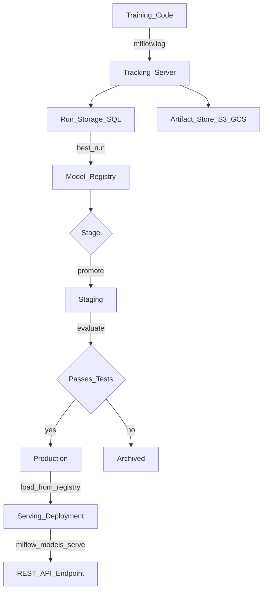

# 📊 MLflow

> [!abstract] TL;DR
> MLflow is an open-source ML lifecycle platform with four components: **Tracking** (log params/metrics/artifacts), **Projects** (reproducible code packaging), **Models** (standard model format + flavors), and **Registry** (staging → production lifecycle). Created by Databricks, it's the most widely-adopted self-hostable ML experiment tracker. The MLflow UI runs locally or against a remote tracking server.

## Intuition — analogy FIRST

Think of MLflow as a scientific laboratory management system for ML teams.

- **Tracking** is the lab notebook — every experiment logs exactly what was done and what the results were
- **Projects** are SOPs (Standard Operating Procedures) — anyone can run your experiment exactly as written
- **Models** are the sample repository — every model is stored in a standard format, callable the same way regardless of framework
- **Registry** is the sample release process — models go through QA (Staging) before they're certified for production

A scientist wouldn't publish results without a lab notebook or release a drug without QA. MLflow enforces the same discipline for ML models.

## How It Works — mechanics + valid mermaid

**Component details:**

**1. Tracking:**
- `mlflow.start_run()` — creates a run context
- `mlflow.log_param(key, val)` — one-time hyperparameter
- `mlflow.log_metric(key, val, step=n)` — can be called in a loop for curves
- `mlflow.log_artifact(path)` — stores files (plots, datasets, configs)
- `mlflow.autolog()` — auto-captures sklearn, PyTorch, TF/Keras params and metrics

**2. Projects:**
- `MLproject` YAML file defines entry points and dependencies
- `mlflow run .` executes with conda/docker environment isolation
- Pinned environments guarantee anyone can reproduce any experiment

**3. Models:**
- `MLmodel` format stores model + metadata
- **Flavors:** standard APIs for each framework (sklearn, pyfunc, tensorflow, pytorch, onnx)
- `mlflow.pyfunc.load_model()` loads any framework through a unified Python interface

**4. Registry:**
- `mlflow.register_model()` adds model to registry
- Stages: `None → Staging → Production → Archived`
- Transition requires approval (can be automated or manual)
- Aliases: `champion`, `challenger` labels for A/B switching



## Code Demo

```python
# pip install mlflow scikit-learn

import mlflow
import mlflow.sklearn
from mlflow import MlflowClient
from sklearn.ensemble import GradientBoostingClassifier
from sklearn.datasets import load_breast_cancer
from sklearn.model_selection import train_test_split
from sklearn.metrics import accuracy_score, roc_auc_score

# ── CONFIGURE TRACKING SERVER ──────────────────────────────────────────────
# Local (default): stores in ./mlruns
# mlflow.set_tracking_uri("http://mlflow-server:5000")  # remote server
# mlflow.set_tracking_uri("databricks")                  # Databricks managed

mlflow.set_experiment("breast-cancer-gbt")

# ── AUTOLOG (SIMPLEST) ─────────────────────────────────────────────────────
# Automatically logs sklearn params, metrics, feature importances, model
mlflow.sklearn.autolog(log_input_examples=True, log_model_signatures=True)

X, y = load_breast_cancer(return_X_y=True)
X_train, X_test, y_train, y_test = train_test_split(X, y, test_size=0.2)

with mlflow.start_run(run_name="gbt-depth3") as run:
    model = GradientBoostingClassifier(n_estimators=200, max_depth=3, learning_rate=0.05)
    model.fit(X_train, y_train)
    # autolog handles param/metric logging automatically

    # Add custom metrics on top of autolog
    y_prob = model.predict_proba(X_test)[:, 1]
    mlflow.log_metric("custom_auc", roc_auc_score(y_test, y_prob))

    run_id = run.info.run_id
    print(f"Run ID: {run_id}")

# ── MANUAL TRACKING (FULL CONTROL) ────────────────────────────────────────
with mlflow.start_run(run_name="gbt-depth5"):
    params = {"n_estimators": 100, "max_depth": 5, "learning_rate": 0.1}
    mlflow.log_params(params)

    model2 = GradientBoostingClassifier(**params)
    model2.fit(X_train, y_train)

    # Log metrics per step
    for i, estimator in enumerate(model2.estimators_.flatten()[:10]):
        staged_preds = list(model2.staged_predict(X_test))
        if i < len(staged_preds):
            acc = accuracy_score(y_test, staged_preds[i])
            mlflow.log_metric("staged_accuracy", acc, step=i)

    # Log final metrics
    y_pred = model2.predict(X_test)
    mlflow.log_metrics({
        "accuracy": accuracy_score(y_test, y_pred),
        "auc": roc_auc_score(y_test, model2.predict_proba(X_test)[:, 1]),
    })

    # Log model with signature (input/output schema)
    from mlflow.models.signature import infer_signature
    signature = infer_signature(X_train, model2.predict(X_train))
    mlflow.sklearn.log_model(
        model2, "gbt_model",
        signature=signature,
        input_example=X_train[:5],
    )

# ── MODEL REGISTRY ─────────────────────────────────────────────────────────
client = MlflowClient()

# Register model from a run
model_uri = f"runs:/{run_id}/sklearn_model"  # autolog default artifact path
registered = mlflow.register_model(
    model_uri=model_uri,
    name="breast_cancer_classifier",
)
print(f"Model version: {registered.version}")

# Transition to Staging
client.transition_model_version_stage(
    name="breast_cancer_classifier",
    version=registered.version,
    stage="Staging",
    archive_existing_versions=False,
)

# Add description and tags
client.update_model_version(
    name="breast_cancer_classifier",
    version=registered.version,
    description="GBT model, AUC=0.98, trained on v3 dataset",
)
client.set_model_version_tag(
    name="breast_cancer_classifier",
    version=registered.version,
    key="dataset_version",
    value="v3",
)

# Promote to Production after validation
client.transition_model_version_stage(
    name="breast_cancer_classifier",
    version=registered.version,
    stage="Production",
    archive_existing_versions=True,   # archives current Production version
)

# ── LOAD FROM REGISTRY ─────────────────────────────────────────────────────
# Load the current production model (framework-agnostic)
prod_model = mlflow.pyfunc.load_model(
    "models:/breast_cancer_classifier/Production"
)
predictions = prod_model.predict(X_test)

# Or using aliases (MLflow 2.x)
# client.set_registered_model_alias("breast_cancer_classifier", "champion", "3")
# model = mlflow.pyfunc.load_model("models:/breast_cancer_classifier@champion")

# ── SERVE VIA REST API ─────────────────────────────────────────────────────
# CLI: mlflow models serve -m "models:/breast_cancer_classifier/Production" -p 5001
# Then POST to: http://localhost:5001/invocations
# with JSON body: {"inputs": [[1.2, 3.4, ...]]}

# ── SEARCH RUNS ───────────────────────────────────────────────────────────
runs = client.search_runs(
    experiment_ids=["1"],
    filter_string="metrics.auc > 0.97 AND params.max_depth = '3'",
    order_by=["metrics.auc DESC"],
)
for run in runs[:3]:
    print(f"{run.info.run_name}: AUC={run.data.metrics.get('auc', 'N/A'):.4f}")
```

## Real-World Example

**Databricks — MLflow as the Backbone**

MLflow was created at Databricks and is deeply integrated into their Lakehouse Platform. Databricks' internal ML teams use MLflow for every production model:

- **Delta Lake + MLflow:** When training data is stored in Delta Lake (Databricks' data format), MLflow automatically captures the Delta table version — full data lineage from a single run ID.
- **Unity Catalog integration:** MLflow Registry is now backed by Unity Catalog, giving enterprises fine-grained access control (who can promote to Production).
- **Scale:** Databricks reports MLflow tracking hundreds of millions of runs across their cloud customer base.

**Enterprise example — Accenture AI:** Large enterprise consulting teams use self-hosted MLflow (deployed on Azure AKS) as their standard experiment tracking infrastructure across 50+ client ML projects. The common model format (MLmodel flavors) allows models trained by different teams in different frameworks to be deployed through the same serving infrastructure.

## Trade-offs

| Feature | MLflow | W&B | Comet |
|---|---|---|---|
| **Self-hostable** | Yes (free) | Paid enterprise only | Paid enterprise |
| **Setup complexity** | Medium | Low (SaaS) | Low (SaaS) |
| **UI quality** | Good | Excellent | Good |
| **Hyperparameter sweep** | Basic (via Optuna) | Built-in Sweeps | Built-in |
| **Model registry** | Full-featured | Available | Available |
| **Databricks integration** | Native | Partial | No |

## When to Use vs Avoid

**Use MLflow when:**
- Self-hosting is required (data privacy, on-premise)
- You're in the Databricks ecosystem
- You want an open-source solution with a large community
- Model Registry lifecycle management is important

**Consider W&B instead when:**
- Research/deep learning focus with rich visualization needs
- Team prefers SaaS without infrastructure management
- Sweeps (hyperparameter search) are a primary workflow

## Common Pitfalls

1. **No remote tracking server:** Running `mlflow ui` locally means your runs are in `./mlruns` and get lost. Deploy a centralized MLflow server on day one.

2. **MLflow autolog hiding your params:** `mlflow.sklearn.autolog()` logs `estimator_class` as a param, which looks noisy. Use `mlflow.sklearn.autolog(log_estimator_class=False)` to clean it up.

3. **Forgetting `archive_existing_versions=True`:** If you promote to Production without archiving, you'll have multiple versions in Production simultaneously — the `load_model("../Production")` call returns one arbitrarily.

4. **Storing large artifacts locally:** If your tracking server stores artifacts on local disk, it will fill up fast. Configure artifact_root to S3/GCS from the start.

5. **Not logging model signatures:** Without a signature, `mlflow models serve` won't validate input types, making debugging harder.

## Related Concepts

- [[_MOC_MLOps|↑ Section MOC]]

- [[Experiment_Tracking_Overview]] — concepts underlying experiment tracking
- [[Weights_and_Biases]] — comparison with MLflow; W&B for research-heavy workflows
- [[Model_Registry]] — conceptual deep dive on model registries
- [[Kubeflow]] — Kubernetes-native pipelines that integrate with MLflow for tracking

## Review Questions

1. Describe the four components of MLflow and explain how they interact in a real training-to-production workflow. Draw the data flow.

2. What is a "model flavor" in MLflow's model format? Why does MLflow use this abstraction, and what problem does it solve for serving teams?

3. You have two model versions in the MLflow Registry: version 3 (AUC 0.94, trained on dataset v2) and version 4 (AUC 0.96, trained on dataset v3). Your production system breaks because dataset v3 had a labeling error. Walk through the MLflow Registry steps to roll back to version 3.

## Sources

- [MLflow Official Documentation](https://mlflow.org/docs/latest/)
- [MLflow GitHub](https://github.com/mlflow/mlflow)
- Zaharia, M. et al. "Accelerating the Machine Learning Lifecycle with MLflow." IEEE Data Eng. Bulletin, 2018.
- Databricks Engineering Blog: "MLflow 2.0: The Next Generation of MLflow" (2022)
- Huyen, Chip. *Designing Machine Learning Systems*. O'Reilly, 2022.

#mlops #mlflow #experiment-tracking #model-registry #databricks #reproducibility
