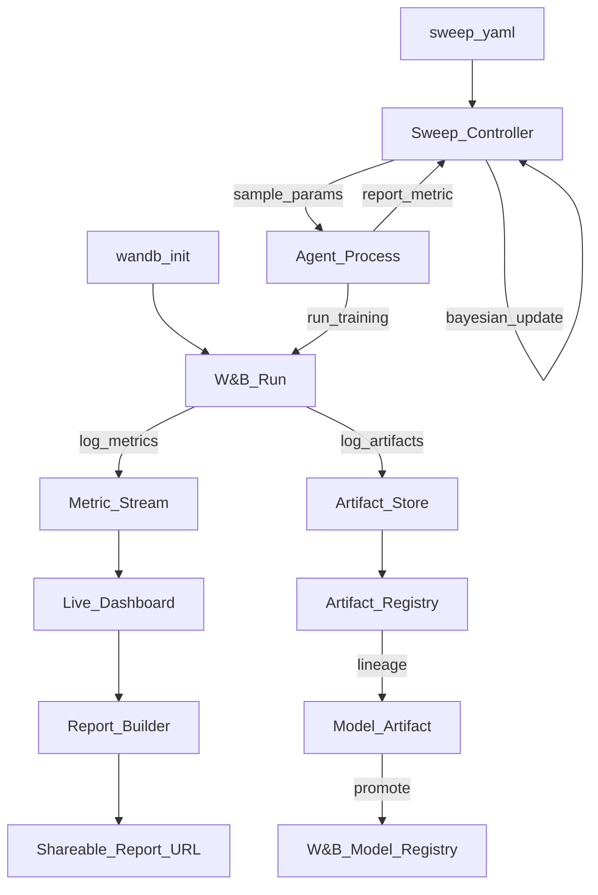

# 🏋️ Weights & Biases (W&B)

> [!abstract] TL;DR
> Weights & Biases (W&B) is the de facto experiment tracking and MLOps platform for deep learning research. Core features: `wandb.log()` for real-time metric streaming, Sweeps for Bayesian hyperparameter search, Artifacts for dataset/model versioning, Tables for interactive data visualization, and Reports for shareable experiment analysis. Used at OpenAI, Hugging Face, Stability AI, and every major research lab.

## Intuition — analogy FIRST

Imagine a Bloomberg terminal — but for ML training. Bloomberg gives traders:
- **Real-time data streams** (market prices as they move → W&B streams your loss curves in real time)
- **Historical comparison** (price history for any asset → W&B shows any previous run's full history)
- **Watchlists** (track specific assets → W&B dashboards with custom metric panels)
- **Research reports** (analyst reports with charts → W&B Reports with embedded experiment comparisons)
- **Automated trading strategies** (algorithmic execution → W&B Sweeps for automated hyperparameter search)

The trader (researcher) sets up their Bloomberg terminal once. After that, it automatically captures everything important, enables rapid comparison, and provides the analytical tools to make better decisions faster.

## How It Works — mechanics + valid mermaid

**Core workflow:**
1. `wandb.init(project=..., config={...})` — initialize a run, capture hyperparameters
2. `wandb.log({"loss": val, "acc": val}, step=n)` — stream metrics during training
3. `wandb.finish()` — mark run complete (or use context manager)

**Sweeps (hyperparameter search):**
- Define search space in YAML (parameters + search strategy)
- `wandb sweep sweep.yaml` — creates sweep, returns sweep ID
- `wandb agent <sweep_id>` — starts an agent that fetches hyperparameters and runs training
- Strategies: grid, random, Bayesian (default) — Bayesian learns from previous runs

**Artifacts:**
- Versioned files with type metadata (`dataset`, `model`, `code`, `report`)
- Lineage graph: artifact A → run → artifact B (traceable)
- `artifact.download()` — fetches to local path, cached for efficiency

**Tables:**
- Interactive data tables stored as W&B artifacts
- Log predictions with image/text/audio columns
- Compare predictions across runs side-by-side



## Code Demo

```python
# pip install wandb
# wandb login   (or set WANDB_API_KEY env var)

import wandb
import torch
import torch.nn as nn
from torch.utils.data import DataLoader, TensorDataset
import numpy as np

# ── BASIC INIT AND LOGGING ──────────────────────────────────────────────────
config = {
    "learning_rate": 3e-4,
    "batch_size": 64,
    "epochs": 20,
    "hidden_size": 256,
    "dropout": 0.3,
    "optimizer": "adam",
}

run = wandb.init(
    project="my-classification-project",
    entity="my-org",           # W&B team/org
    name="baseline-mlp",       # human-readable run name
    tags=["baseline", "mlp"],  # searchable tags
    notes="First MLP baseline with dropout",
    config=config,             # log all hyperparameters at once
)
# Access config via wandb.config.learning_rate etc.

# ── TRAINING LOOP ──────────────────────────────────────────────────────────
class SimpleMLP(nn.Module):
    def __init__(self, input_size, hidden_size, dropout):
        super().__init__()
        self.net = nn.Sequential(
            nn.Linear(input_size, hidden_size),
            nn.ReLU(),
            nn.Dropout(dropout),
            nn.Linear(hidden_size, 2),
        )
    def forward(self, x):
        return self.net(x)

X = torch.randn(1000, 20)
y = (X[:, 0] > 0).long()
dataset = TensorDataset(X, y)
loader = DataLoader(dataset, batch_size=wandb.config.batch_size, shuffle=True)

model = SimpleMLP(20, wandb.config.hidden_size, wandb.config.dropout)
optimizer = torch.optim.Adam(model.parameters(), lr=wandb.config.learning_rate)
criterion = nn.CrossEntropyLoss()

# Watch model: log gradients and parameter norms
wandb.watch(model, log="gradients", log_freq=10)

for epoch in range(wandb.config.epochs):
    total_loss, correct = 0.0, 0
    for batch_X, batch_y in loader:
        optimizer.zero_grad()
        logits = model(batch_X)
        loss = criterion(logits, batch_y)
        loss.backward()
        optimizer.step()
        total_loss += loss.item()
        correct += (logits.argmax(1) == batch_y).sum().item()

    # Stream metrics to W&B dashboard in real time
    wandb.log({
        "epoch": epoch,
        "train/loss": total_loss / len(loader),
        "train/accuracy": correct / len(dataset),
        "learning_rate": optimizer.param_groups[0]["lr"],
    })

# ── LOG ARTIFACTS ──────────────────────────────────────────────────────────
# Save and log model as an artifact
torch.save(model.state_dict(), "model.pt")

artifact = wandb.Artifact(
    name="baseline-mlp-model",
    type="model",
    description="MLP baseline, epoch 20",
    metadata={"accuracy": correct / len(dataset)},
)
artifact.add_file("model.pt")
run.log_artifact(artifact)

# Log dataset as artifact (for lineage)
data_artifact = wandb.Artifact("training-data", type="dataset")
data_artifact.add_dir("data/")
run.log_artifact(data_artifact)

# ── LOG TABLES (PREDICTIONS) ───────────────────────────────────────────────
# Visualize model predictions interactively
with torch.no_grad():
    preds = model(X[:20]).argmax(1).numpy()

table = wandb.Table(
    columns=["index", "true_label", "predicted", "correct"],
    data=[
        [i, int(y[i]), int(preds[i]), int(y[i]) == int(preds[i])]
        for i in range(20)
    ]
)
wandb.log({"predictions_sample": table})

wandb.finish()

# ── SWEEPS (HYPERPARAMETER SEARCH) ─────────────────────────────────────────
# sweep_config.yaml
SWEEP_CONFIG = {
    "program": "train.py",
    "method": "bayes",           # or "grid", "random"
    "metric": {"name": "val/accuracy", "goal": "maximize"},
    "parameters": {
        "learning_rate": {
            "distribution": "log_uniform_values",
            "min": 1e-5,
            "max": 1e-2,
        },
        "batch_size": {"values": [32, 64, 128]},
        "hidden_size": {"values": [128, 256, 512]},
        "dropout": {"distribution": "uniform", "min": 0.1, "max": 0.5},
    },
    "early_terminate": {
        "type": "hyperband",
        "min_iter": 3,
    },
}

# Create sweep
sweep_id = wandb.sweep(SWEEP_CONFIG, project="my-classification-project")
print(f"Sweep ID: {sweep_id}")

# Run agent (call from training script)
def train_for_sweep():
    with wandb.init() as run:
        cfg = wandb.config
        # Use cfg.learning_rate, cfg.batch_size, etc.
        # ... training code here ...
        wandb.log({"val/accuracy": 0.92})  # sweep optimizes this

# wandb.agent(sweep_id, function=train_for_sweep, count=50)
# Or: wandb agent <sweep_id>   (from CLI)

# ── USE ARTIFACTS IN A DOWNSTREAM RUN ──────────────────────────────────────
with wandb.init(project="my-classification-project", name="evaluation") as run:
    # Download specific model version from registry
    artifact = run.use_artifact("baseline-mlp-model:latest")
    artifact_dir = artifact.download()
    print(f"Model downloaded to: {artifact_dir}")
```

## Real-World Example

**OpenAI, Hugging Face, Stability AI — Research Standard**

W&B is the standard experiment tracker at leading AI labs:

**Hugging Face** uses W&B for all Transformers training runs. When they release a new model card, the training metrics and hyperparameter sweep results are from W&B. Their public W&B reports let the community inspect training dynamics of open-source models.

**Stability AI** used W&B to track Stable Diffusion training experiments. Training SDXL involved dozens of experiments comparing architecture choices, data mixes, and learning rate schedules across 1,000+ GPU-hours each. W&B's artifact system tracked each data blend as a versioned artifact with lineage to the model weights.

**Scale:** W&B reports tracking over 1 billion runs on their platform. Sweeps have run over 50 million hyperparameter configurations. Their dashboard handles streaming from 10,000+ parallel GPU runs simultaneously (for large distributed training).

**Research reproducibility case:** When a W&B user publishes a paper, they can share a public W&B report containing the exact hyperparameters, training curves, and model artifacts — any reader can reproduce the result by running the linked code with the W&B-tracked config.

## Trade-offs

| Feature | W&B | MLflow |
|---|---|---|
| **Dashboard UX** | Excellent (purpose-built for DL) | Good (more general) |
| **Real-time streaming** | Yes, low latency | Yes |
| **Sweeps (built-in)** | Yes, Bayesian + Hyperband | No (use Optuna separately) |
| **Artifacts** | Rich, with lineage graph | Yes, simpler |
| **Self-hostable** | W&B Server (enterprise $$$) | Yes (free) |
| **Offline mode** | Limited | Yes |
| **Data privacy** | SaaS by default | Self-host for privacy |

## When to Use vs Avoid

**Use W&B when:**
- Deep learning research focus (rich loss curve visualization)
- Hyperparameter sweeps are a primary workflow
- Team collaboration and shareable reports are important
- SaaS is acceptable for data privacy requirements

**Use MLflow instead when:**
- Self-hosting is required (on-premise, regulated data)
- Databricks ecosystem
- Model Registry lifecycle management is the priority

## Common Pitfalls

1. **Logging too frequently:** Calling `wandb.log()` inside every batch is expensive for large datasets. Log every N steps or every epoch.

2. **Not setting `entity`:** Without `entity=`, runs go to your personal workspace. For team collaboration, always set `entity="your-team"`.

3. **Forgetting `wandb.finish()`:** In notebooks, if you crash without finishing, subsequent runs may have incorrect step counts. Use `with wandb.init() as run:` context manager.

4. **Not using `wandb.config` for hyperparams:** Logging params with `wandb.log({"lr": 0.001})` instead of `wandb.init(config={"lr": 0.001})` means they won't appear in the sweep comparison table.

5. **Artifact version confusion:** W&B artifact versions are immutable. If you upload a "corrected" dataset to the same artifact name, it creates a new version — always use `artifact:latest` or specify the version explicitly.

## Related Concepts

- [[_MOC_MLOps|↑ Section MOC]]

- [[Experiment_Tracking_Overview]] — conceptual foundation of experiment tracking
- [[MLflow]] — open-source alternative, better for self-hosted/enterprise
- [[Hyperparameter_Tuning]] — W&B Sweeps is the primary hyperparameter search tool for DL
- [[Model_Registry]] — W&B has a model registry; integrate with your deployment pipeline

## Review Questions

1. Compare W&B Sweeps to running a manual grid search in a Python loop. What does Bayesian optimization gain over grid search, and when would you still prefer grid search?

2. What is a W&B Artifact and how does the artifact lineage graph work? Sketch the lineage graph for a workflow that: (1) logs a raw dataset, (2) runs a preprocessing step, (3) trains a model, (4) runs evaluation.

3. You're training a large language model across 64 GPUs and notice that W&B logs are causing training slowdowns. How would you diagnose and fix the logging bottleneck?

## Sources

- [Weights & Biases Documentation](https://docs.wandb.ai/)
- [W&B GitHub](https://github.com/wandb/wandb)
- W&B Blog: "A Survey of ML Experiment Tracking Tools" (2023)
- Bouthillier, X. et al. "Unreproducible Research is Reproducible." ICML, 2019.
- Huyen, Chip. *Designing Machine Learning Systems*. O'Reilly, 2022.

#mlops #wandb #experiment-tracking #hyperparameter-tuning #deep-learning #sweeps #artifacts
