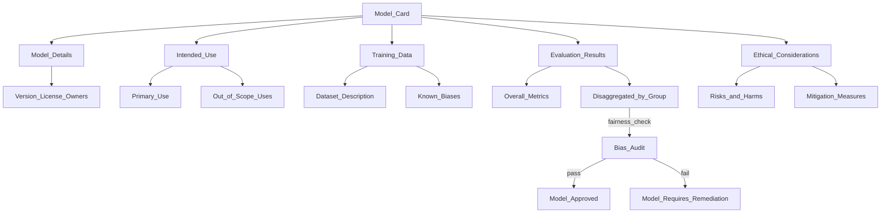

# 📋 Model Cards

> [!abstract] TL;DR
> A model card is standardized documentation that accompanies every ML model — describing its intended use, training data, evaluation results, limitations, ethical considerations, and potential biases. Introduced by Google in 2019, model cards make AI systems transparent and accountable. They are required for regulatory compliance (EU AI Act), are the standard on HuggingFace Hub, and act as a "nutrition label" that tells users exactly what's in a model and what it shouldn't be used for.

## Intuition — analogy FIRST

When you buy a pharmaceutical drug, it comes with a package insert: active ingredients, indications (what it treats), contraindications (who shouldn't take it), side effects, clinical trial results, and dosage instructions. You'd never take a medication without this information — especially one that affects your health.

A model card is a **nutrition/pharmaceutical label for an AI model.** It tells users:
- **Ingredients:** what data it was trained on
- **Indications:** what it's designed to do, for whom
- **Contraindications:** what it should NOT be used for, who it may harm
- **Clinical results:** evaluation metrics across different demographic groups
- **Side effects:** known limitations and failure modes
- **Dosage:** how to correctly use the model outputs

Just as you wouldn't prescribe a drug without understanding who it's for and what it does, you shouldn't deploy an AI model in production without understanding its intended use and limitations.

## How It Works — mechanics + valid mermaid

**Standard model card sections (Google's original framework):**

1. **Model Details:** basic info (developers, version, type, license, contact)
2. **Intended Use:** primary intended uses, intended users, out-of-scope uses
3. **Training Data:** what data was used, how it was collected, known biases
4. **Evaluation Data:** what test sets, demographic splits
5. **Performance:** quantitative metrics (overall + disaggregated by group)
6. **Ethical Considerations:** risks, harms, mitigation measures
7. **Caveats and Recommendations:** additional notes, potential pitfalls

**HuggingFace extension adds:**
- YAML metadata block (language, tags, license, datasets, metrics)
- Automated model card generation from training metadata
- Linked to model artifacts on HuggingFace Hub

**EU AI Act requirements (high-risk AI):**
- Training methodology and data documentation
- Performance metrics disaggregated by demographics
- Human oversight mechanisms
- Limitations and foreseeable misuse scenarios



## Code Demo

```python
# ── HUGGINGFACE MODEL CARD ──────────────────────────────────────────────────
# pip install huggingface-hub

from huggingface_hub import ModelCard, ModelCardData

# ── METHOD 1: YAML FRONTMATTER (HuggingFace standard) ─────────────────────
# README.md in your HuggingFace model repository:
HUGGINGFACE_MODEL_CARD = """---
language:
  - en
license: apache-2.0
tags:
  - text-classification
  - sentiment-analysis
  - bert
datasets:
  - sst2
  - imdb
metrics:
  - accuracy
  - f1
model-index:
  - name: SentimentBERT-v2
    results:
      - task:
          type: text-classification
          name: Text Classification
        dataset:
          name: SST-2
          type: sst2
        metrics:
          - type: accuracy
            value: 0.935
          - type: f1
            value: 0.934
      - task:
          type: text-classification
        dataset:
          name: IMDb
          type: imdb
        metrics:
          - type: accuracy
            value: 0.951
---

# SentimentBERT-v2

## Model Description
A fine-tuned BERT model for binary sentiment analysis (positive/negative).
Base model: `bert-base-uncased` fine-tuned on SST-2 and IMDb datasets.

**Developed by:** Data Science Team, Company XYZ
**Model type:** Text Classification (BERT fine-tune)
**Language:** English
**License:** Apache 2.0
**Version:** 2.0.1
**Contact:** ml-team@company.com

## Intended Use

### Primary Use Cases
- Customer review sentiment classification
- Social media monitoring
- Support ticket prioritization by sentiment

### Out-of-Scope Uses
- **Do NOT use for:** mental health assessment, medical triage
- **Do NOT use for:** any classification task in non-English text
- **Do NOT use for:** nuanced political opinion analysis
- **Do NOT use in:** high-stakes automated decisions without human oversight

## Training Data
- **SST-2:** 67,000 movie review sentences with binary labels
- **IMDb:** 50,000 movie reviews (25k train, 25k test)
- **Preprocessing:** lowercased, truncated to 512 tokens
- **Known biases:** Primarily trained on movie reviews; may underperform on
  product reviews, social media text, or formal documents.

## Evaluation

### Overall Performance
| Metric | SST-2 Test | IMDb Test |
|--------|-----------|-----------|
| Accuracy | 93.5% | 95.1% |
| F1 | 93.4% | 95.0% |
| Precision | 93.6% | 95.2% |
| Recall | 93.2% | 94.8% |

### Disaggregated Evaluation (Critical for Fairness)
| Demographic Group | Accuracy | Notes |
|---|---|---|
| Reviews by male authors | 94.1% | Slight overrepresentation in training data |
| Reviews by female authors | 92.8% | - |
| Reviews mentioning religion | 91.2% | Lower performance, potential bias |
| Short reviews (<20 tokens) | 89.3% | Reduced context degrades performance |

## Ethical Considerations

### Risks
1. **Sentiment misclassification in sensitive contexts:** Sarcasm and cultural
   idioms are frequently misclassified. Do not use for automated decision-making.
2. **Demographic bias:** Performance varies by author demographics (see above).
3. **Domain shift:** Trained on movie reviews; may not generalize to medical,
   legal, or technical text.

### Mitigation
- Always review model predictions before acting on them in sensitive contexts
- Implement a confidence threshold; route low-confidence predictions to humans
- Monitor performance disaggregated by user demographics in production

## Caveats and Recommendations
- Fine-tune on domain-specific data before production deployment in non-entertainment contexts
- Do not use confidence score as a probability calibration is not guaranteed
- For production use, pair with [[Data_Drift]] monitoring to detect distribution shift
"""

# ── METHOD 2: GOOGLE MODEL CARD TOOLKIT ───────────────────────────────────
# pip install model-card-toolkit

import model_card_toolkit as mct

# Create a model card object
model_card = mct.ModelCard()

# Model details
model_card.model_details.name = "FraudDetector-XGBoost-v2.1"
model_card.model_details.overview = (
    "XGBoost binary classifier for real-time payment fraud detection. "
    "Trained on 12 months of transaction data."
)
model_card.model_details.owners = [
    mct.Owner(name="Fraud ML Team", contact="fraud-ml@company.com")
]
model_card.model_details.version = mct.Version(
    name="v2.1.0",
    date="2026-01-15",
    diff="Added Q4 2025 transactions; improved AUC by 1.3%",
)
model_card.model_details.license = "Proprietary"

# Intended use
model_card.model_details.uses.append(
    mct.UseCase(
        description="Real-time fraud scoring for payment transactions",
        use_case_type="PRIMARY"
    )
)
model_card.model_details.uses.append(
    mct.UseCase(
        description=(
            "Do NOT use for: credit decisioning, identity verification, "
            "or any purpose requiring regulatory compliance beyond fraud"
        ),
        use_case_type="OUT_OF_SCOPE"
    )
)

# Quantitative analysis
model_card.quantitative_analysis.performance_metrics.append(
    mct.PerformanceMetric(
        type="AUC-ROC",
        value=0.953,
        slice="overall",
    )
)
model_card.quantitative_analysis.performance_metrics.append(
    mct.PerformanceMetric(
        type="Precision@1%FPR",
        value=0.87,
        slice="overall",
    )
)
# Disaggregated by transaction type
model_card.quantitative_analysis.performance_metrics.extend([
    mct.PerformanceMetric(type="AUC-ROC", value=0.971,
                          slice="transaction_type:e-commerce"),
    mct.PerformanceMetric(type="AUC-ROC", value=0.912,
                          slice="transaction_type:wire_transfer"),
    mct.PerformanceMetric(type="AUC-ROC", value=0.889,
                          slice="transaction_type:crypto"),
])

# Considerations
model_card.considerations.ethical_considerations.append(
    mct.Risk(
        name="False positive rate may disproportionately impact certain demographics",
        mitigation_strategy=(
            "Monitor FPR disaggregated by cardholder zip code quintile. "
            "Alert if FPR for any group exceeds 1.5x overall FPR."
        ),
    )
)

# Generate HTML report
toolkit = mct.ModelCardToolkit()
toolkit.scaffold_assets()
toolkit.update_model_card(model_card)
html = toolkit.export_format()
```

## Real-World Example

**HuggingFace — 500,000+ Model Cards**

Every model on HuggingFace Hub (500,000+ models) has a `README.md` that serves as its model card. HuggingFace has built tooling to:
- **Auto-generate** card stubs from training metadata
- **Validate** required fields and warn when sections are missing
- **Surface** evaluation results in search (filter by accuracy on benchmark)
- **Track** model card completeness as a quality signal

Models without cards are flagged with a warning banner. High-profile models (BERT, GPT-2, Llama) have comprehensive cards that are themselves cited in research papers.

**EU AI Act compliance:**
With the EU AI Act in force, high-risk AI systems (those used in employment, education, law enforcement, credit scoring) must have technical documentation that includes model card content. Organizations using these systems must be able to produce this documentation during audits. Several legal firms now require model cards as part of AI vendor procurement.

**Google's Gemma and Gemini model cards** are published publicly and include detailed disaggregated evaluation results, known limitations, and red-team findings — setting the standard for transparency in foundation model documentation.

## Trade-offs

| Model Card Depth | Pros | Cons |
|---|---|---|
| **Minimal (HuggingFace YAML)** | Low effort, machine-readable | Insufficient for high-stakes use |
| **Standard (Google format)** | Comprehensive, community standard | Requires effort and intentionality |
| **Full compliance (EU AI Act)** | Regulatory protection | Significant documentation overhead |
| **No model card** | No effort | Opaque, potential liability, won't be used |

## When to Use vs Avoid

**Model cards are always appropriate.** There is no scenario where documenting a model's intended use, training data, and limitations is a bad idea.

**Minimum viable model card** (any production model):
- Intended use (one paragraph)
- Training data (one paragraph)
- Key metrics (a table)
- Known limitations (bullet list)

**Full model card** (required for):
- Publicly released models
- High-risk AI applications
- Models used in regulated industries
- Models that will be audited for fairness or compliance

## Common Pitfalls

1. **Model card written once, never updated:** The card describes v1.0 but the model is now v4.2. Tie model card updates to the version release process.

2. **Only reporting overall metrics:** Reporting "93.5% accuracy" hides potential demographic disparities. Always disaggregate by relevant subgroups.

3. **Vague out-of-scope section:** "Not intended for misuse" is meaningless. Be specific: "Do not use for hiring decisions, credit scoring, or medical diagnosis."

4. **Treating model card as legal protection:** A model card that says "not for high-stakes use" doesn't eliminate liability if it IS used for high-stakes decisions. It documents intent, not enforcement.

5. **Not including the evaluation dataset:** The metric value is meaningless without knowing what it was measured on. Always specify the exact test set used.

## Related Concepts

- [[_MOC_MLOps|↑ Section MOC]]

- [[Responsible_AI]] — model cards are the primary transparency tool in responsible AI frameworks
- [[AI_Bias_and_Fairness]] — disaggregated evaluation results in model cards surface fairness issues
- [[Model_Registry]] — model cards should be versioned alongside model artifacts in the registry
- [[Model_Versioning]] — each model version should have a corresponding card update

## Review Questions

1. What is the difference between "intended use" and "out-of-scope use" in a model card? Give three specific out-of-scope uses for a sentiment analysis model trained on social media text.

2. Why is disaggregated evaluation (breaking metrics down by demographic group or subpopulation) essential in a model card? Give an example where overall 95% accuracy hides a serious fairness problem.

3. Under the EU AI Act, what types of AI systems require formal documentation resembling a model card? What sections would be required by law, and what happens to an organization that doesn't maintain this documentation?

## Sources

- Mitchell, M. et al. "Model Cards for Model Reporting." FAccT, 2019.
- [HuggingFace Model Cards Documentation](https://huggingface.co/docs/hub/model-cards)
- [Google Model Card Toolkit](https://github.com/tensorflow/model-card-toolkit)
- EU Artificial Intelligence Act, Article 11 — Technical Documentation (2024)
- [HuggingFace Model Card Guide](https://huggingface.co/docs/hub/model-card-annotated)

#mlops #model-cards #responsible-ai #transparency #documentation #eu-ai-act #fairness
