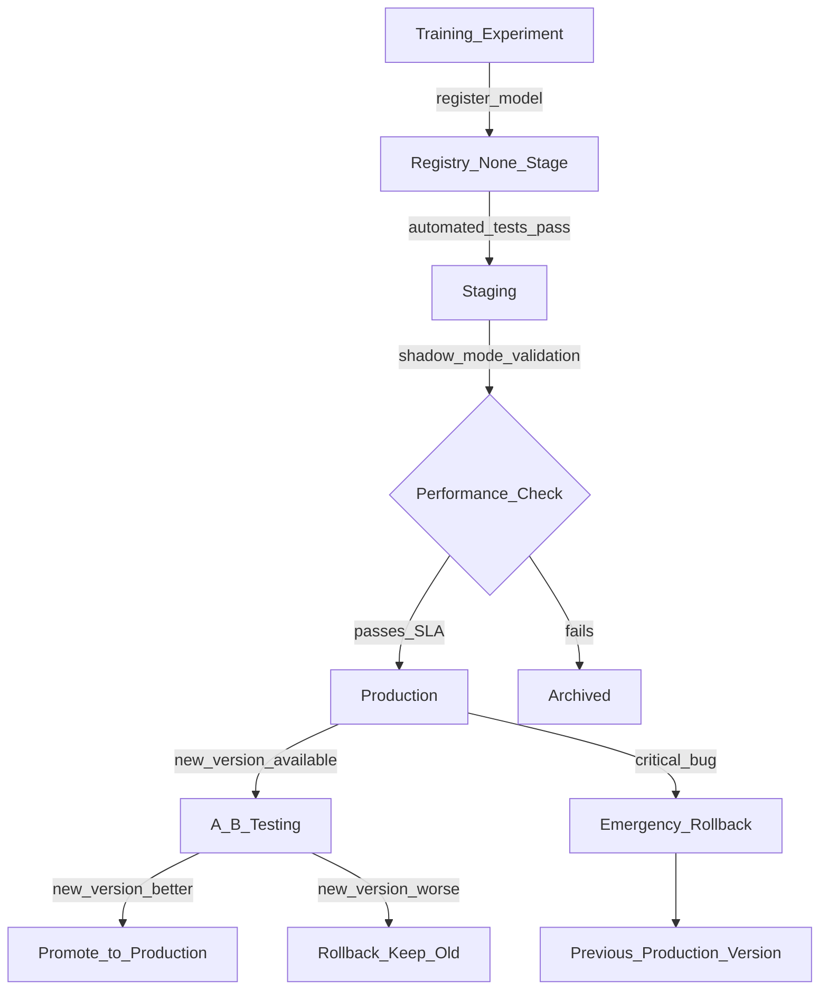

# 📦 Model Registry

> [!abstract] TL;DR
> A model registry is a centralized catalog that manages the full lifecycle of ML models — from experiment to production. It stores versioned model artifacts with metadata (training metrics, data lineage, owner), enforces lifecycle stages (Staging → Production → Archived), and provides approval workflows. Think of it as an app store for ML models: only reviewed, tested models get promoted to production.

## Intuition — analogy FIRST

Imagine an app store (Google Play or Apple App Store) for your company's ML models.

- **Developers** (data scientists) submit model builds — version 1.0, 1.1, 2.0
- **QA review** (validation pipeline) tests the build in a sandbox environment (Staging)
- **App Store review** (ML ops/product approval) gates promotion to the production store
- **Users** (serving infrastructure) install the approved version
- **Version history** lets you instantly rollback to 1.0 if 2.0 has bugs
- **Metadata** on each app — ratings, description, what changed — is the model card and metrics

Without an app store, developers would push arbitrary code directly to user devices (deploying untested models directly to production). With the app store, there's a controlled, auditable process.

## How It Works — mechanics + valid mermaid

**Lifecycle stages:**
- `None/Experiment` → model created from a training run
- `Staging` → deployed to shadow/shadow mode for validation; not serving production traffic
- `Production` → serving production traffic; at most 1–2 versions simultaneously
- `Archived` → retired, kept for audit trail

**Key metadata stored per version:**
- Training metrics (accuracy, AUC, RMSE, etc.)
- Source experiment run ID (links to parameters, code, data version)
- Training dataset version (DVC hash or dataset name/version)
- Model signature (input/output schema)
- Creator and approval chain
- Deployment targets (which services use this version)

**A/B deployment pattern:**
- Version 3 = Production (100% traffic)
- Version 4 = Staging (shadow mode, logs predictions but doesn't affect users)
- Validate version 4 on shadow traffic
- Promote version 4 to Production, archive version 3



## Code Demo

```python
# pip install mlflow

import mlflow
from mlflow import MlflowClient
from mlflow.tracking import MlflowClient
import time

client = MlflowClient(tracking_uri="http://mlflow-server:5000")

# ── REGISTER A MODEL ───────────────────────────────────────────────────────
# After training, log the model and register it
with mlflow.start_run() as run:
    # ... training code ...
    mlflow.sklearn.log_model(
        sk_model=trained_model,        # your trained model object
        artifact_path="model",
        registered_model_name="fraud_detector",   # creates registry entry
        # Optional: model signature for input validation
    )
    run_id = run.info.run_id

# OR: register from an existing run's artifact
model_uri = f"runs:/{run_id}/model"
registered = mlflow.register_model(
    model_uri=model_uri,
    name="fraud_detector",
)
version = registered.version
print(f"Registered model version: {version}")

# ── ADD METADATA ───────────────────────────────────────────────────────────
# Add description with training details
client.update_model_version(
    name="fraud_detector",
    version=version,
    description=(
        "XGBoost fraud detector v2.1. "
        "Trained on 2024-Q4 transactions. "
        "Precision@1%FPR=0.87, AUC=0.95. "
        "Replaces logistic regression baseline."
    ),
)

# Add searchable tags
client.set_model_version_tag(name="fraud_detector", version=version,
                              key="dataset_version", value="2024-Q4-v3")
client.set_model_version_tag(name="fraud_detector", version=version,
                              key="framework", value="xgboost")
client.set_model_version_tag(name="fraud_detector", version=version,
                              key="owner", value="alice@company.com")

# ── LIFECYCLE TRANSITIONS ──────────────────────────────────────────────────
# Move to Staging for validation
client.transition_model_version_stage(
    name="fraud_detector",
    version=version,
    stage="Staging",
    archive_existing_versions=False,
)
print(f"Model v{version} is now in Staging")

# Simulate running validation tests
print("Running shadow mode evaluation...")
time.sleep(1)  # In reality: run your validation pipeline
validation_passed = True

if validation_passed:
    # Promote to Production, automatically archive old Production version
    client.transition_model_version_stage(
        name="fraud_detector",
        version=version,
        stage="Production",
        archive_existing_versions=True,  # archives current Production
    )
    print(f"Model v{version} promoted to Production")
else:
    client.transition_model_version_stage(
        name="fraud_detector",
        version=version,
        stage="Archived",
    )
    print(f"Model v{version} validation failed, archived")

# ── LOAD FROM REGISTRY ─────────────────────────────────────────────────────
# Load production model (used by serving service)
model = mlflow.pyfunc.load_model("models:/fraud_detector/Production")
# prediction = model.predict(features_df)

# Load specific version (for reproducibility/rollback)
model_v2 = mlflow.pyfunc.load_model("models:/fraud_detector/2")

# Load using aliases (MLflow 2.x — preferred for A/B testing)
# client.set_registered_model_alias("fraud_detector", "champion", "5")
# client.set_registered_model_alias("fraud_detector", "challenger", "6")
# champion_model = mlflow.pyfunc.load_model("models:/fraud_detector@champion")

# ── QUERY REGISTRY ─────────────────────────────────────────────────────────
# List all registered models
for rm in client.search_registered_models():
    print(f"Model: {rm.name}, Tags: {rm.tags}")

# Get all versions with their stages
versions = client.search_model_versions("name='fraud_detector'")
for v in versions:
    print(f"  v{v.version}: {v.current_stage} "
          f"| {v.description[:50] if v.description else 'no description'}")

# Find all models tagged with a specific dataset version
results = client.search_model_versions(
    "tags.dataset_version = '2024-Q4-v3'"
)
print([f"v{v.version}" for v in results])

# ── EMERGENCY ROLLBACK ─────────────────────────────────────────────────────
def rollback_production(model_name: str, rollback_to_version: str):
    """Rollback production to a previous version."""
    current_prod = [
        v for v in client.search_model_versions(f"name='{model_name}'")
        if v.current_stage == "Production"
    ]
    if current_prod:
        # Archive the broken current production version
        client.transition_model_version_stage(
            name=model_name,
            version=current_prod[0].version,
            stage="Archived",
        )

    # Restore the rollback version to Production
    client.transition_model_version_stage(
        name=model_name,
        version=rollback_to_version,
        stage="Production",
        archive_existing_versions=False,
    )
    print(f"Rolled back {model_name} to version {rollback_to_version}")

# rollback_production("fraud_detector", "4")
```

## Real-World Example

**Spotify — Hendrix Model Platform**

Spotify manages 300+ production ML models across recommendations, personalization, and ad targeting. Their internal platform "Hendrix" includes a model registry that:

- **Enforces quality gates:** Every model must pass automated evaluations (offline metrics, bias checks, serving latency benchmarks) before Staging transition — humans only approve Production promotion
- **Tracks full lineage:** Each registry version links to: training job ID → experiment run → dataset version (stored in their GCS-backed data warehouse)
- **Powers instant rollback:** When a recommendations model degrades, on-call engineers roll back in <5 minutes by transitioning the previous Production version back — no redeployment required
- **Supports A/B allocation:** The registry stores traffic split metadata — 90% to version 12, 10% to version 13 (challenger) — which the serving infrastructure reads at runtime

**Netflix Metaflow:**
Netflix uses Metaflow with a custom model registry. Every Metaflow run that produces a model artifact is automatically registered. Their registry enforces that production models always have: a data card (what data was used), a model card (evaluation results), and an approval signature.

## Trade-offs

| Registry | Pros | Cons |
|---|---|---|
| **MLflow Registry** | Self-hosted, mature, Databricks-integrated | Limited built-in approval workflows |
| **W&B Registry** | Beautiful UI, W&B-native | SaaS, expensive at scale |
| **Vertex AI Registry** | GCP-native, managed | GCP lock-in |
| **SageMaker Registry** | AWS-native, integrated with SageMaker Pipelines | AWS lock-in |
| **Custom** | Full control, exactly what you need | High maintenance burden |

## When to Use vs Avoid

**Always use a model registry when:**
- Any model is in production (even one!)
- Multiple people on the team can deploy models
- You need audit trail for compliance (GDPR, HIPAA, SOX)
- Rollback capability is required (it always is)

**You can simplify when:**
- Pure research, no production models
- Single-model project with one engineer

## Common Pitfalls

1. **Promoting without automated gates:** Manually clicking "Promote to Production" without running validation tests is equivalent to skipping QA. Automate: CI pipeline runs validation, only then allows promotion.

2. **No rollback plan:** Plan your rollback procedure *before* it's an emergency. Document: which version do you roll back to? How long does rollback take? Who can approve it at 2am?

3. **Registry ≠ serving:** Registering a model doesn't deploy it. You need a separate serving pipeline that reads from the registry and updates the serving endpoint.

4. **Not tracking which services use which version:** If 5 services use `models:/fraud_detector/Production`, you need to know this before archiving. Track "consumers" per model version.

5. **Stale Staging versions:** A model can sit in Staging for months. Implement TTL policies — if a Staging model isn't promoted in 30 days, it's automatically archived.

## Related Concepts

- [[_MOC_MLOps|↑ Section MOC]]

- [[MLflow]] — MLflow Registry is the most common implementation
- [[Model_Versioning]] — version strategy and semantic versioning for models
- [[Model_Serving_Overview]] — registry feeds into serving infrastructure
- [[Experiment_Tracking_Overview]] — tracking produces the run that gets registered
- [[AB_Testing_for_ML]] — registry stages enable champion/challenger A/B testing

## Review Questions

1. What is the difference between a model registry and an artifact store? What does the registry provide that just saving model files to S3 doesn't?

2. A company has three production models in their registry that all use the same training dataset, which was later found to contain PII data that should never have been used. How does the registry help with the remediation process?

3. Design an automated promotion gate for moving a fraud detection model from Staging to Production. What checks would you require to pass, and what metrics would you compare against the current production version?

## Sources

- [MLflow Model Registry Documentation](https://mlflow.org/docs/latest/model-registry.html)
- Sculley, D. et al. "Hidden Technical Debt in Machine Learning Systems." NeurIPS, 2015.
- Spotify Engineering Blog: "Introducing Hendrix: Spotify's Model Registry" (2021)
- Netflix Technology Blog: "Supporting Diverse ML Systems at Netflix" (2022)
- Huyen, Chip. *Designing Machine Learning Systems*. O'Reilly, 2022. Chapter 7.

#mlops #model-registry #model-management #lifecycle #deployment #versioning
