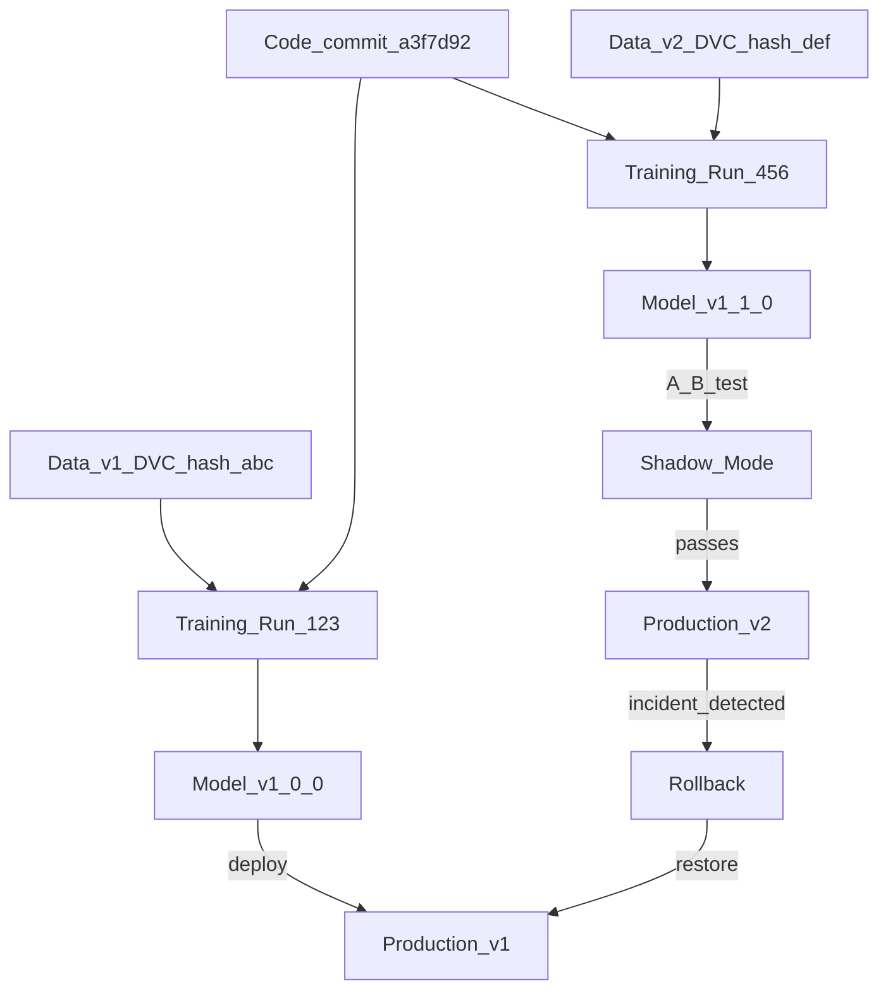

# 🏷️ Model Versioning

> [!abstract] TL;DR
> Model versioning is the discipline of treating every trained model as a uniquely identified, traceable artifact — like a Git tag for a software release. A version captures not just the weights, but the exact code commit, dataset version, and hyperparameters that produced it. Full lineage enables rollback, root-cause analysis, and regulatory audit. The three triggers for a new version are: data change, code change, and hyperparameter change.

## Intuition — analogy FIRST

Software teams use Git tags to mark releases: `v1.2.3`. When `v1.2.4` introduces a regression, they roll back to `v1.2.3` in minutes. The tag points to a specific commit, which includes every file that went into that build.

Model versioning is Git tags for ML models — but the "commit" is richer. A model `v2.1.0` should trace back to:
- **Code commit:** `a3f7d92` in `github.com/company/ml-models` (which architecture, which preprocessing)
- **Data version:** `dataset:v2024-Q4-v3` (DVC hash `abc123def456`)
- **Hyperparameters:** `lr=0.001, n_estimators=200` (logged in MLflow run `run_id_xyz`)
- **Training environment:** `Python 3.11, XGBoost 2.0.3, CUDA 12.1`

Without any one of these, you cannot reproduce the model. Without reproduction, you cannot audit, debug, or confidently roll back.

## How It Works — mechanics + valid mermaid

**Semantic versioning for models:** MAJOR.MINOR.PATCH

- **MAJOR (breaking):** Model output schema changed, model purpose changed, new architecture that's not backwards compatible
- **MINOR (feature):** Significant performance improvement, new training data, architecture improvement
- **PATCH (maintenance):** Bug fix in preprocessing, minor data update, retraining same architecture on refreshed data

**What triggers a new version:**

| Trigger | Example | Version bump |
|---|---|---|
| New training data | Added Q4 2024 transactions | MINOR |
| Model architecture change | CNN → Transformer | MAJOR |
| Hyperparameter tuning | Increased n_estimators | PATCH |
| Preprocessing fix | Fixed normalization bug | PATCH |
| Output schema change | Added new class label | MAJOR |
| Periodic retraining | Monthly data refresh | PATCH |

**Lineage components:**
- `data_version` → exactly which data produced this model
- `code_version` → git commit hash of training code
- `experiment_run_id` → MLflow/W&B run with all params and metrics
- `parent_model_version` → if fine-tuned from a base model



## Code Demo

```python
# ── MODEL VERSIONING WITH MLFLOW ──────────────────────────────────────────
import mlflow
from mlflow import MlflowClient
import json
from datetime import datetime

client = MlflowClient()

# ── 1. TRACK FULL LINEAGE AT TRAINING TIME ─────────────────────────────────
import subprocess

def get_git_commit() -> str:
    """Get current git commit hash."""
    result = subprocess.run(
        ["git", "rev-parse", "HEAD"],
        capture_output=True, text=True
    )
    return result.stdout.strip()

def get_git_branch() -> str:
    result = subprocess.run(
        ["git", "branch", "--show-current"],
        capture_output=True, text=True
    )
    return result.stdout.strip()

# Training run with full lineage
with mlflow.start_run(run_name="fraud_detector_v2.1.0") as run:
    # Log hyperparameters
    mlflow.log_params({
        "n_estimators": 200,
        "max_depth": 6,
        "learning_rate": 0.05,
    })

    # Log lineage metadata — critical for reproducibility
    mlflow.set_tags({
        "code_commit": get_git_commit(),
        "code_branch": get_git_branch(),
        "dataset_version": "2024-Q4-v3",
        "dataset_dvc_hash": "abc123def456789",     # from dvc status
        "dataset_row_count": "2847362",
        "environment": "Python 3.11 / XGBoost 2.0.3",
        "model_version": "2.1.0",
        "trigger": "quarterly_data_refresh",
        "owner": "alice@company.com",
    })

    # ... training code ...
    mlflow.log_metrics({
        "train_auc": 0.9712,
        "val_auc": 0.9534,
        "precision_at_1pct_fpr": 0.87,
    })

    # Register the model with version info in its name
    mlflow.sklearn.log_model(
        sk_model=None,      # your actual model here
        artifact_path="model",
        registered_model_name="fraud_detector",
    )

# ── 2. VERSION TAGGING IN REGISTRY ────────────────────────────────────────
# After registration, add semantic version as a tag
latest_version = client.get_latest_versions("fraud_detector", stages=["None"])[0]

client.set_model_version_tag(
    name="fraud_detector",
    version=latest_version.version,
    key="semantic_version",
    value="2.1.0",
)
client.set_model_version_tag(
    name="fraud_detector",
    version=latest_version.version,
    key="changelog",
    value="Added Q4 2024 transactions; improved AUC by 1.3% vs v2.0.0",
)

# ── 3. ROLLBACK PROCEDURE ──────────────────────────────────────────────────
def find_version_by_semantic(model_name: str, semantic_version: str) -> str:
    """Find MLflow registry version number for a semantic version."""
    versions = client.search_model_versions(
        f"name='{model_name}' AND tags.semantic_version = '{semantic_version}'"
    )
    if not versions:
        raise ValueError(f"No model with semantic version {semantic_version}")
    return versions[0].version

def rollback_to_version(model_name: str, target_semantic_version: str):
    """Rollback production to a specific semantic version."""
    # Get the registry version number for the semantic version
    target_registry_version = find_version_by_semantic(
        model_name, target_semantic_version
    )

    # Archive current production
    current_prod = [
        v for v in client.search_model_versions(f"name='{model_name}'")
        if v.current_stage == "Production"
    ]
    for v in current_prod:
        client.transition_model_version_stage(
            name=model_name, version=v.version, stage="Archived"
        )
        print(f"Archived v{v.version} (was Production)")

    # Restore rollback target
    client.transition_model_version_stage(
        name=model_name,
        version=target_registry_version,
        stage="Production",
        archive_existing_versions=False,
    )
    print(f"Rolled back {model_name} to semantic v{target_semantic_version} "
          f"(registry v{target_registry_version})")

# In an incident: rollback_to_version("fraud_detector", "2.0.1")

# ── 4. LINEAGE QUERY — WHICH MODELS USED THIS DATASET? ────────────────────
def find_models_using_dataset(dataset_version: str):
    """Find all model versions trained on a specific dataset version."""
    results = client.search_model_versions(
        f"tags.dataset_version = '{dataset_version}'"
    )
    models = [(v.name, v.version, v.current_stage) for v in results]
    print(f"Models trained on dataset {dataset_version}:")
    for name, version, stage in models:
        print(f"  {name} v{version} [{stage}]")
    return models

# Identify blast radius when a dataset is found to have errors
find_models_using_dataset("2024-Q4-v3")

# ── 5. MODEL VERSION CHANGELOG TRACKING ──────────────────────────────────
# Generate a human-readable version history
def model_changelog(model_name: str) -> str:
    versions = sorted(
        client.search_model_versions(f"name='{model_name}'"),
        key=lambda v: int(v.version)
    )
    lines = [f"Changelog for {model_name}", "=" * 40]
    for v in versions:
        lines.append(
            f"v{v.version} ({v.tags.get('semantic_version', 'N/A')})"
            f" [{v.current_stage}]"
        )
        lines.append(f"  Created: {v.creation_timestamp}")
        lines.append(f"  Change: {v.tags.get('changelog', 'No changelog')}")
        lines.append(f"  Dataset: {v.tags.get('dataset_version', 'Unknown')}")
        lines.append(f"  Commit: {v.tags.get('code_commit', 'Unknown')[:8]}")
        lines.append("")
    return "\n".join(lines)

print(model_changelog("fraud_detector"))
```

## Real-World Example

**Airbnb — Full Model Lineage for Production Models**

Airbnb's ML platform requires full lineage for every model promoted to production. Their system automatically:

1. **Links code:** Every model artifact stores the GitHub commit SHA. Clicking the commit in their internal portal opens the exact code state used.
2. **Links data:** Training jobs read data from Hive tables with partition-level versioning. The partition timestamp is stored as model metadata.
3. **Enables blast-radius analysis:** When a data pipeline bug is found, engineers query "which production models were trained on partitions produced by this job?" and immediately identify affected models.
4. **Facilitates root-cause analysis:** When a model degrades, engineers compare the current production version's lineage vs the previous good version — often revealing the causative data change.

Airbnb estimates that full lineage reduced the mean-time-to-investigate (MTTI) for model degradation incidents from ~6 hours to ~45 minutes.

## Trade-offs

| Strategy | Pros | Cons |
|---|---|---|
| **Semantic versioning** | Human-readable, communicates impact | Requires discipline to apply consistently |
| **Auto-incrementing** (MLflow default) | No human effort, always unique | No semantic signal about change magnitude |
| **Date-based** (model-YYYYMMDD) | Easy to find "recent" model | Hard to communicate breaking vs patch changes |
| **Git-hash-based** | Exact code traceability | Not human-friendly |

**Best practice:** Use auto-increment for registry version numbers (MLflow handles this), use semantic versioning as a tag, and always store git commit + dataset version as tags.

## When to Use vs Avoid

**Always version with full lineage:**
- Production models in regulated industries
- Any model that serves paying customers
- Models where a rollback might be needed

**Lightweight versioning acceptable:**
- Internal analytics tools with low stakes
- Research experiments not meant for production

## Common Pitfalls

1. **Versioning only the weights:** Model weights without the code and data that produced them are not reproducible. Always version the entire training recipe.

2. **No semantic versioning:** Auto-increment registry versions (1, 2, 3, ...) don't communicate whether version 47 is a hotfix or a major rewrite. Add semantic version tags.

3. **Not documenting what changed:** Every new version should have a changelog. "Updated model" is not a changelog. "Added Q4 data, improved AUC by 1.3%, fixed preprocessing bug for null income values" is.

4. **Implicit dataset version:** "We used the production database snapshot from January" is not a version. Assign an explicit version ID, store it in the registry.

5. **Forgetting the training environment:** A model trained in Python 3.8 may behave differently if loaded in Python 3.11. Store `requirements.txt` or Docker image tag.

## Related Concepts

- [[_MOC_MLOps|↑ Section MOC]]

- [[Model_Registry]] — the infrastructure that stores and manages model versions
- [[Data_Versioning_DVC]] — DVC provides the data version half of model lineage
- [[Experiment_Tracking_Overview]] — experiment tracking provides the run ID and metrics for each version
- [[Model_Cards]] — model cards document the purpose and evaluation of each version

## Review Questions

1. You discover that a production model was trained on data that contained a privacy violation. Describe the steps you'd take using model versioning and lineage to (a) identify all affected models, (b) determine which users were impacted, and (c) ensure the retrained models are clean.

2. What are the three components of full model lineage? Why is it insufficient to only store the model weights and training metrics?

3. Your company uses auto-incrementing version numbers (1, 2, 3...) in MLflow. A stakeholder asks: "Is version 47 safe to roll back to if version 48 breaks?" What information from the registry would you use to answer this question?

## Sources

- Huyen, Chip. *Designing Machine Learning Systems*. O'Reilly, 2022.
- Airbnb Engineering Blog: "Scaling Knowledge Access and Retrieval at Airbnb" (2022)
- [MLflow Model Registry Documentation](https://mlflow.org/docs/latest/model-registry.html)
- Sculley, D. et al. "Hidden Technical Debt in Machine Learning Systems." NeurIPS, 2015.

#mlops #model-versioning #model-lineage #rollback #reproducibility #semantic-versioning
