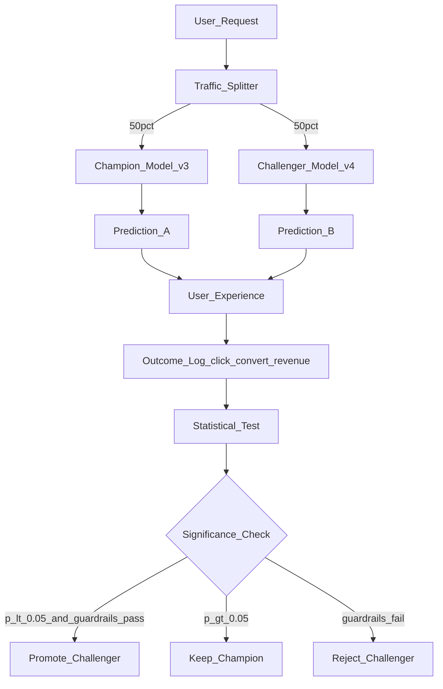

# 🎯 A/B Testing for ML Models

> [!abstract] TL;DR
> ML A/B testing splits production traffic between two model versions — the champion (current production) and challenger (new version) — to measure the real-world impact of a model change before full rollout. Key components: random traffic allocation, statistical significance testing (t-test, chi-squared), power analysis (how many samples needed), guardrail metrics, and decision criteria. Multi-armed bandit is a dynamic alternative that explores and exploits simultaneously. All major tech companies run hundreds of simultaneous ML A/B tests.

## Intuition — analogy FIRST

Drug trials use a control group (placebo) and treatment group (drug) to measure the drug's real effect. The same person can't take both — so you randomly assign patients. After enough data, statistics tell you if the difference is real or just chance.

ML A/B testing is exactly a drug trial for model changes. You can't show the same user both the old and new recommendation simultaneously. So you randomly assign users:
- **Group A (50%):** sees predictions from current production model (champion/control)
- **Group B (50%):** sees predictions from new model (challenger/treatment)

After 2 weeks and statistical significance is confirmed, you "administer the treatment" to everyone (promote challenger to production) or "reject the drug" (archive the challenger).

The key questions match clinical trials:
- Is the sample large enough to detect meaningful differences? (Power analysis)
- Could the result be due to chance? (p-value)
- Are there side effects? (Guardrail metrics)
- Is the benefit big enough to matter? (Effect size, minimum detectable effect)

## How It Works — mechanics + valid mermaid

**A/B testing components:**

1. **Traffic splitting:** Route X% of users to champion, (100-X)% to challenger. Use a hash of user ID for consistent assignment (same user always gets same model).

2. **Primary metric:** The main metric you're trying to improve (click-through rate, conversion rate, RMSE).

3. **Guardrail metrics:** Secondary metrics that must NOT degrade (latency p99, revenue per user, safety metrics). A model that improves CTR but increases latency by 2x fails its guardrails.

4. **Sample size (power analysis):** Determines how long to run the test.

   n = 2(z_{α/2} + z_β)² × σ² / δ²

   Where:
   - z_{α/2} = 1.96 for α=0.05 (two-tailed)
   - z_β = 0.84 for 80% power
   - σ = standard deviation of the metric
   - δ = minimum detectable effect (MDE) — the smallest difference worth caring about

5. **Statistical significance:** p-value < α (usually 0.05) — the probability of seeing this result by chance if there's no real difference.

**Shadow mode (before A/B test):**
Deploy challenger to receive full production traffic but don't use its predictions (just log them). Compare prediction distributions offline. Fix obvious bugs before live traffic split.

**Multi-armed bandit (alternative):**
Instead of fixed 50/50 split, adaptively allocate more traffic to the better-performing model. Best for: maximizing short-term outcomes, when exploration cost is high, when you want to avoid running a "bad" variant for too long.



## Code Demo

```python
# pip install scipy statsmodels numpy pandas

import numpy as np
import pandas as pd
from scipy import stats
import statsmodels.stats.api as sms
from statsmodels.stats.power import TTestIndPower

# ── POWER ANALYSIS (how many samples needed?) ──────────────────────────────
print("=" * 55)
print("Power Analysis")
print("=" * 55)

def calculate_sample_size(
    baseline_rate: float,
    minimum_detectable_effect: float,
    alpha: float = 0.05,
    power: float = 0.80,
) -> int:
    """
    Calculate required sample size per group for proportion test.

    baseline_rate: current conversion rate (e.g., 0.10 = 10%)
    minimum_detectable_effect: absolute improvement to detect (e.g., 0.01 = 1%)
    """
    p1 = baseline_rate
    p2 = baseline_rate + minimum_detectable_effect

    # Use statsmodels
    effect_size = sms.proportion_effectsize(p1, p2)
    analysis = sms.NormalIndPower()
    n = analysis.solve_power(
        effect_size=effect_size,
        alpha=alpha,
        power=power,
        ratio=1.0,   # equal group sizes
    )
    return int(np.ceil(n))

# Example: testing a recommendation model
# Current click-through rate: 5%
# Minimum detectable improvement: 0.5% (absolute)
n_per_group = calculate_sample_size(
    baseline_rate=0.05,
    minimum_detectable_effect=0.005,
    alpha=0.05,
    power=0.80,
)
print(f"Required sample size per group: {n_per_group:,}")
print(f"Total sample size: {n_per_group * 2:,}")

# ── SIMULATE A/B TEST ─────────────────────────────────────────────────────
np.random.seed(42)
n_per_group_actual = 5000

# Champion: 5% click-through rate
champion_outcomes = np.random.binomial(1, 0.050, n_per_group_actual)

# Challenger: 5.6% click-through rate (0.6% improvement)
challenger_outcomes = np.random.binomial(1, 0.056, n_per_group_actual)

print(f"\nObserved CTR — Champion: {champion_outcomes.mean():.4f} "
      f"({champion_outcomes.sum()} clicks)")
print(f"Observed CTR — Challenger: {challenger_outcomes.mean():.4f} "
      f"({challenger_outcomes.sum()} clicks)")

# ── STATISTICAL SIGNIFICANCE TESTING ──────────────────────────────────────
print("\n" + "=" * 55)
print("Statistical Tests")
print("=" * 55)

# ── Test 1: Two-proportion z-test (for conversion rates) ──────────────────
from statsmodels.stats.proportion import proportions_ztest

count = np.array([challenger_outcomes.sum(), champion_outcomes.sum()])
nobs = np.array([n_per_group_actual, n_per_group_actual])

z_stat, p_value = proportions_ztest(count, nobs, alternative="larger")
print(f"Two-proportion z-test: z={z_stat:.4f}, p={p_value:.4f}")
print(f"Result: {'SIGNIFICANT — promote challenger' if p_value < 0.05 else 'NOT significant'}")

# ── Test 2: t-test (for continuous metrics like revenue) ─────────────────
# Simulate revenue per user (continuous)
champion_revenue = np.random.lognormal(mean=2.5, sigma=1.5, size=n_per_group_actual)
challenger_revenue = np.random.lognormal(mean=2.6, sigma=1.5, size=n_per_group_actual)

t_stat, t_pvalue = stats.ttest_ind(challenger_revenue, champion_revenue,
                                    alternative="greater")
print(f"\nT-test (revenue): t={t_stat:.4f}, p={t_pvalue:.4f}")
print(f"Champion mean: ${champion_revenue.mean():.2f}")
print(f"Challenger mean: ${challenger_revenue.mean():.2f}")

# ── Test 3: Mann-Whitney U (non-parametric, for non-normal distributions) ─
u_stat, u_pvalue = stats.mannwhitneyu(challenger_revenue, champion_revenue,
                                       alternative="greater")
print(f"\nMann-Whitney U (robust): U={u_stat:.0f}, p={u_pvalue:.4f}")

# ── CONFIDENCE INTERVAL FOR EFFECT SIZE ──────────────────────────────────
diff = challenger_outcomes.mean() - champion_outcomes.mean()
se = np.sqrt(
    champion_outcomes.mean() * (1 - champion_outcomes.mean()) / n_per_group_actual +
    challenger_outcomes.mean() * (1 - challenger_outcomes.mean()) / n_per_group_actual
)
ci_low, ci_high = diff - 1.96 * se, diff + 1.96 * se
print(f"\nEffect size: {diff:+.4f} ({diff/champion_outcomes.mean():+.1%} relative)")
print(f"95% CI: [{ci_low:+.4f}, {ci_high:+.4f}]")

# ── SEQUENTIAL TESTING (STOP EARLY IF EFFECT IS CLEAR) ───────────────────
def sequential_test(champion: np.ndarray, challenger: np.ndarray,
                    check_every: int = 100, alpha: float = 0.05) -> dict:
    """
    Sequential A/B test: check significance periodically, stop early if possible.
    Uses alpha spending (Bonferroni correction across interim looks).
    """
    n_checks = len(champion) // check_every
    alpha_adjusted = alpha / n_checks  # Bonferroni correction for multiple looks

    for i in range(1, n_checks + 1):
        n = i * check_every
        champ_slice = champion[:n]
        chall_slice = challenger[:n]

        _, p = stats.ttest_ind(chall_slice, champ_slice, alternative="greater")

        if p < alpha_adjusted:
            return {"stopped_early": True, "at_n": n,
                    "p_value": p, "decision": "promote_challenger"}

    final_p = stats.ttest_ind(challenger, champion, alternative="greater")[1]
    return {"stopped_early": False, "at_n": len(champion),
            "p_value": final_p,
            "decision": "promote_challenger" if final_p < alpha else "keep_champion"}

result = sequential_test(champion_revenue, challenger_revenue)
print(f"\nSequential test: {result}")

# ── MULTI-ARMED BANDIT (EPSILON-GREEDY) ──────────────────────────────────
class EpsilonGreedyBandit:
    """
    Multi-armed bandit: epsilon-greedy strategy.
    Exploration (epsilon fraction) vs exploitation (best known arm).
    """

    def __init__(self, n_arms: int = 2, epsilon: float = 0.1):
        self.n_arms = n_arms
        self.epsilon = epsilon
        self.counts = np.zeros(n_arms)      # pulls per arm
        self.values = np.zeros(n_arms)      # estimated reward per arm

    def select_arm(self) -> int:
        if np.random.random() < self.epsilon:
            return np.random.randint(self.n_arms)  # explore
        return np.argmax(self.values)               # exploit best arm

    def update(self, arm: int, reward: float):
        self.counts[arm] += 1
        n = self.counts[arm]
        # Incremental mean update
        self.values[arm] = ((n - 1) / n) * self.values[arm] + (1 / n) * reward

# Simulate: arm 0 = champion (5% CTR), arm 1 = challenger (5.6% CTR)
bandit = EpsilonGreedyBandit(n_arms=2, epsilon=0.1)
rewards = {0: 0.050, 1: 0.056}

for _ in range(10000):
    arm = bandit.select_arm()
    reward = np.random.binomial(1, rewards[arm])
    bandit.update(arm, reward)

print(f"\nBandit after 10,000 rounds:")
print(f"  Traffic to champion: {bandit.counts[0]:.0f} ({bandit.counts[0]/10000:.1%})")
print(f"  Traffic to challenger: {bandit.counts[1]:.0f} ({bandit.counts[1]/10000:.1%})")
print(f"  Estimated CTR — champion: {bandit.values[0]:.4f}")
print(f"  Estimated CTR — challenger: {bandit.values[1]:.4f}")
```

## Real-World Example

**Netflix, Booking.com, Airbnb — Hundreds of Simultaneous Tests**

These companies run 100–1,000 simultaneous ML A/B tests at any given moment. Their experimentation infrastructure is central to their competitive advantage:

**Booking.com:**
- Runs ~1,000 concurrent A/B tests (not all ML, but many are)
- Every new model/algorithm change goes through an A/B test
- Minimum 2-week test duration to capture weekly seasonality
- Automated decision: if p<0.05 and no guardrail violations after 2 weeks, promote automatically
- They published research: "Unethical and unprofessional behaviors in online experimentation" on common mistakes

**Airbnb — Experimentation Platform:**
- Built an internal platform "ERF" (Experimentation Reporting Framework)
- New search ranking models run as A/B tests with booking rate as primary metric and host cancellations as a guardrail
- Discovered that A/B tests must be randomized by listing or by user, not both simultaneously (interaction effects)

**Netflix:**
- Tests UI changes and algorithm changes simultaneously
- Primary metric: "percentage of members who watch X hours within 28 days"
- Run tests for minimum 2 weeks (capture weekly seasonality in viewing patterns)
- Patented "Interference-aware A/B testing" to handle the fact that users influence each other's content (social sharing)

## Trade-offs

| Approach | Exploration Cost | Statistical Rigor | Complexity |
|---|---|---|---|
| **Fixed A/B (50/50)** | High (50% suboptimal traffic) | Highest | Low |
| **A/B with early stopping** | Medium | High | Medium |
| **Epsilon-greedy bandit** | Low (10% explore) | Lower | Medium |
| **Thompson sampling** | Very low (adaptive) | Medium | High |
| **Shadow mode only** | None (no live exposure) | Indirect | Low |

## When to Use vs Avoid

**Use A/B testing when:**
- Changes affect user-facing predictions (recommendations, pricing, content)
- Business impact measurement is required before full rollout
- Model change is significant (new architecture, major feature set change)

**Use shadow mode (no user impact):**
- Testing model correctness before any user exposure
- Debugging, checking for obvious errors

**Use multi-armed bandit when:**
- Maximizing short-term reward (e.g., marketing campaigns)
- Many variants to test simultaneously (exploration is expensive)
- You can't afford long fixed-split periods

**Skip A/B test when:**
- Pure infrastructure change with no prediction change
- Rollback fix — urgent, can't wait for test
- Internal-only model not serving end users

## Common Pitfalls

1. **Stopping early without Bonferroni correction:** Checking p-value daily and stopping when p<0.05 inflates Type I error to ~30%. Use sequential testing or pre-commit to a fixed sample size.

2. **No guardrail metrics:** A challenger that improves CTR but slows p99 latency by 200ms will still "win" the A/B test. Always define and check guardrails before deciding.

3. **Not accounting for network effects:** If users interact (social networks, marketplaces), users in the control group may be influenced by users in the treatment group. Standard A/B testing assumptions are violated.

4. **Ignoring novelty effects:** Users may engage more with the challenger simply because it's different (new/changed UI). Run tests for at least 2 weeks to let novelty wear off.

5. **Week-based seasonality:** If you test for only 5 days (Mon-Fri), you miss weekend behavior. Always run for complete weeks (7-day multiples).

## Related Concepts

- [[_MOC_MLOps|↑ Section MOC]]

- [[ML_Monitoring_Overview]] — A/B testing as part of the deployment validation pipeline
- [[Model_Registry]] — champion model is the Production stage; challenger is in Staging
- [[Data_Drift]] — data drift is one reason to trigger a champion-challenger test
- [[Concept_Drift]] — retrained model after concept drift becomes the challenger in an A/B test

## Review Questions

1. Your team wants to test a new recommendation model. The current CTR is 5%. You want to detect a 0.5% improvement with 80% power at α=0.05. Calculate the required sample size per group. How does this change if you increase the MDE to 1%?

2. Explain why "peeking" (checking the p-value multiple times and stopping when significant) inflates the Type I error rate. What is sequential testing and how does it address this?

3. Compare A/B testing with a multi-armed bandit for testing 5 new recommendation algorithms simultaneously. Under what business conditions would you choose each approach? What do you give up with the bandit approach?

## Sources

- Kohavi, R., Tang, D., Xu, Y. *Trustworthy Online Controlled Experiments.* Cambridge, 2020.
- Booking.com Engineering: "A Practical Exploration of A/B Testing at Booking.com" (2019)
- Netflix Technology Blog: "It's All A/Bout Testing: The Netflix Experimentation Platform" (2016)
- [statsmodels: Statistical Tests](https://www.statsmodels.org/stable/stats.html)
- Sutton, R., Barto, A. *Reinforcement Learning: An Introduction.* Chapter 2 (MAB).

#mlops #ab-testing #statistics #experimentation #champion-challenger #power-analysis #multi-armed-bandit
