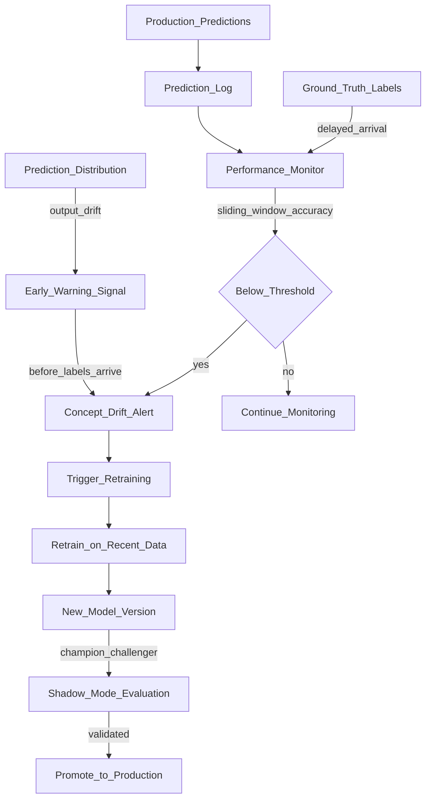

# 🔄 Concept Drift

> [!abstract] TL;DR
> Concept drift occurs when the relationship between input features and target labels changes over time — P(Y|X) shifts. Unlike data drift (the inputs change), concept drift means the same inputs now map to different outputs. It cannot be detected without ground truth labels, making it the harder monitoring problem. Mitigation: champion-challenger testing, periodic retraining pipelines, performance monitoring with sliding windows. Classic example: a price prediction model trained before inflation — same house, but now higher price.

## Intuition — analogy FIRST

Imagine a doctor trained in 2019 who learned that "fever + dry cough = probably flu." In 2020, the same symptoms suddenly map to "probably COVID-19." The symptoms (inputs X) are the same. The correct diagnosis (output Y) has changed. The doctor's knowledge (model) is now wrong — not because patients changed, but because the *meaning* of those symptoms changed.

This is concept drift: **the world's rules have changed, but the model hasn't.**

Contrast with data drift: if suddenly patients had completely different symptom profiles (inputs change), that's data drift. With concept drift, the inputs look normal but the correct answers have shifted.

**The hard part:** You can't detect concept drift without knowing the correct answers. You need ground truth labels from production. If labels arrive with a 30-day delay (e.g., "did this customer actually churn?"), you have a 30-day blind spot.

## How It Works — mechanics + valid mermaid

**Types of concept drift:**

| Type | Pattern | Example |
|---|---|---|
| **Sudden** | Abrupt change in P(Y\|X) | COVID lockdowns, policy change |
| **Gradual** | Slow shift over months/years | Inflation, technology adoption |
| **Recurring** | Periodic pattern returns | Seasonal patterns (Black Friday) |
| **Incremental** | Small, continuous changes | User preferences evolving |

**Detection approaches:**

1. **Performance monitoring** (requires labels): Track accuracy/AUC on a rolling window of labeled samples. A drop below threshold triggers an alert.

2. **Prediction distribution monitoring** (no labels needed): Track the distribution of model *outputs* (predicted probabilities). A shift in output distribution may signal concept drift even before labels arrive.

3. **Error rate monitoring**: Track the rate of model errors on samples where ground truth is available quickly (e.g., items returned within 24 hours of purchase).

4. **Statistical drift detectors**: ADWIN (Adaptive Windowing), Page-Hinkley test, DDM (Drift Detection Method) — algorithms that detect a statistically significant change in an error stream.

**Mitigation strategies:**

- **Periodic retraining:** Retrain on a sliding window of recent data (e.g., last 90 days). Most effective for gradual drift.
- **Continuous retraining:** Retrain on every new batch of labeled data (expensive but current).
- **Champion-challenger:** Always have a recently-retrained challenger model in shadow mode, ready to promote.
- **Online learning:** Update model weights continuously as new labeled samples arrive (suited for simpler models like logistic regression).



## Code Demo

```python
# pip install scikit-learn numpy pandas river

import numpy as np
import pandas as pd
from sklearn.linear_model import LogisticRegression
from sklearn.metrics import accuracy_score, roc_auc_score
from collections import deque
import warnings
warnings.filterwarnings("ignore")

# ── SIMULATE CONCEPT DRIFT ─────────────────────────────────────────────────
def generate_data(n: int, drift: bool = False, seed: int = 42) -> pd.DataFrame:
    """
    Generate classification data where drift changes the decision boundary.
    Pre-drift: feature1 > 0 → positive class
    Post-drift: feature2 > 0 → positive class (concept changes)
    """
    rng = np.random.RandomState(seed)
    feature1 = rng.randn(n)
    feature2 = rng.randn(n)

    if not drift:
        # Pre-drift: feature1 determines label
        label = (feature1 + rng.randn(n) * 0.5 > 0).astype(int)
    else:
        # Post-drift: feature2 determines label (concept changed!)
        label = (feature2 + rng.randn(n) * 0.5 > 0).astype(int)

    return pd.DataFrame({"feature1": feature1, "feature2": feature2, "label": label})

# ── TRAIN INITIAL MODEL ────────────────────────────────────────────────────
train_df = generate_data(5000, drift=False, seed=0)
X_train = train_df[["feature1", "feature2"]].values
y_train = train_df["label"].values

model = LogisticRegression()
model.fit(X_train, y_train)

# Evaluate on pre-drift data (should be good)
val_pre = generate_data(1000, drift=False, seed=1)
acc_pre = accuracy_score(val_pre["label"], model.predict(val_pre[["feature1", "feature2"]]))
print(f"Pre-drift accuracy: {acc_pre:.3f}")

# Evaluate on post-drift data (should degrade)
val_post = generate_data(1000, drift=True, seed=2)
acc_post = accuracy_score(val_post["label"], model.predict(val_post[["feature1", "feature2"]]))
print(f"Post-drift accuracy: {acc_post:.3f}")

# ── SLIDING WINDOW PERFORMANCE MONITOR ────────────────────────────────────
class ConceptDriftMonitor:
    """
    Detects concept drift via performance degradation on a sliding window.
    Requires ground truth labels (can be delayed).
    """

    def __init__(self, window_size: int = 500, alert_threshold: float = 0.10,
                 min_samples: int = 100):
        """
        window_size: number of samples in the sliding window
        alert_threshold: relative performance drop that triggers alert
        min_samples: minimum window fill before alerting
        """
        self.window = deque(maxlen=window_size)
        self.alert_threshold = alert_threshold
        self.min_samples = min_samples
        self.baseline_accuracy = None

    def log_sample(self, prediction: int, ground_truth: int):
        self.window.append(int(prediction == ground_truth))  # 1=correct, 0=wrong

    def set_baseline(self, accuracy: float):
        self.baseline_accuracy = accuracy
        print(f"Baseline accuracy set: {accuracy:.3f}")

    def current_accuracy(self) -> float:
        if len(self.window) < self.min_samples:
            return None
        return sum(self.window) / len(self.window)

    def check_drift(self) -> dict:
        if self.baseline_accuracy is None:
            raise ValueError("Set baseline accuracy first via set_baseline()")

        current = self.current_accuracy()
        if current is None:
            return {"status": "insufficient_data", "window_size": len(self.window)}

        relative_drop = (self.baseline_accuracy - current) / self.baseline_accuracy
        drift_detected = relative_drop > self.alert_threshold

        return {
            "status": "drift" if drift_detected else "stable",
            "baseline_accuracy": self.baseline_accuracy,
            "current_accuracy": current,
            "relative_drop": relative_drop,
            "window_size": len(self.window),
            "drift_detected": drift_detected,
        }

# Simulate monitoring over time (labels arrive with delay)
monitor = ConceptDriftMonitor(window_size=500, alert_threshold=0.1)
monitor.set_baseline(acc_pre)

# Simulate streaming predictions + delayed labels
print("\nStreaming monitoring simulation:")
for i in range(1500):
    # Generate a production sample
    # First 750: no drift; last 750: concept drift
    is_drifted = i >= 750
    sample_df = generate_data(1, drift=is_drifted, seed=i)
    features = sample_df[["feature1", "feature2"]].values

    pred = model.predict(features)[0]
    true_label = int(sample_df["label"].iloc[0])
    monitor.log_sample(pred, true_label)

    # Check drift every 50 samples
    if (i + 1) % 50 == 0:
        result = monitor.check_drift()
        status = result.get("status", "N/A")
        acc = result.get("current_accuracy", 0)
        drop = result.get("relative_drop", 0)
        marker = " <<< DRIFT ALERT" if result.get("drift_detected") else ""
        print(f"  Step {i+1:4d}: acc={acc:.3f}, drop={drop:.1%}{marker}")

# ── PREDICTION DISTRIBUTION MONITORING (No labels needed) ────────────────
# Even without labels, a shift in predicted probabilities is an early warning
from scipy.stats import ks_2samp

# Get predicted probabilities from model
pre_drift_data = generate_data(1000, drift=False, seed=10)
post_drift_data = generate_data(1000, drift=True, seed=11)

pre_probs = model.predict_proba(pre_drift_data[["feature1", "feature2"]])[:, 1]
post_probs = model.predict_proba(post_drift_data[["feature1", "feature2"]])[:, 1]

ks_stat, p_value = ks_2samp(pre_probs, post_probs)
print(f"\nPrediction distribution KS test: D={ks_stat:.4f}, p={p_value:.4f}")
print(f"Output drift detected: {p_value < 0.05}")

# ── ONLINE DRIFT DETECTION WITH RIVER (ADWIN) ─────────────────────────────
# pip install river
from river.drift import ADWIN

adwin = ADWIN(delta=0.002)   # sensitivity: smaller delta = less sensitive

errors = []
for i in range(1500):
    is_drifted = i >= 750
    sample_df = generate_data(1, drift=is_drifted, seed=i)
    features = sample_df[["feature1", "feature2"]].values

    pred = model.predict(features)[0]
    true_label = int(sample_df["label"].iloc[0])
    error = int(pred != true_label)

    adwin.update(error)
    if adwin.drift_detected:
        print(f"ADWIN detected drift at step {i}!")
        # In production: trigger retraining pipeline
```

## Real-World Example

**COVID and Every Recommendation/Pricing Model**

March 2020 was the most dramatic real-world concept drift event in ML history. Virtually every consumer-facing ML model was affected simultaneously:

- **E-commerce recommendations** (Amazon, Walmart): User buying patterns changed overnight. Hand sanitizer suddenly correlated with "normal" purchasing; gym equipment recommendations became irrelevant. Models trained on 2019 behavior mapped the same user signals (browsing patterns, cart behavior) to completely wrong products.

- **Pricing models** (Airbnb, Booking.com): Location premium features stopped predicting booking likelihood. "Near tourist attractions" went from positive to irrelevant. Models continued to predict high-demand prices for empty city-center properties.

- **Travel fraud detection** (Stripe, Adyen): "International transaction" went from a fraud signal to the norm for remote workers. Models trained on this feature had drastically increased false positive rates.

**Airbnb's response:** They detected concept drift via performance monitoring within 2 weeks. Their fix: retrain on only the last 30 days of data (instead of 2 years), accepting less statistical power in exchange for recency. They explicitly documented "COVID windows" in their data versioning so future retraining could exclude or downweight that anomalous period.

**The lesson:** Concept drift can be sudden and massive. Having a retraining pipeline and champion-challenger system already in place allows response in days. Without it, model degradation can persist for months.

## Trade-offs

| Detection Method | Requires Labels | Timeliness | Sensitivity |
|---|---|---|---|
| **Performance monitoring** | Yes | Delayed | High (direct measure) |
| **Prediction distribution monitoring** | No | Immediate | Indirect signal |
| **ADWIN / Page-Hinkley** | Yes (error stream) | Fast (online) | Configurable |
| **Champion-challenger** | Yes | Delayed | Indirect |
| **Manual inspection** | Yes | On-demand | Expert-dependent |

## When to Use vs Avoid

**Invest heavily in concept drift detection when:**
- Model predictions drive high-stakes decisions
- Business environment is volatile (finance, economics, consumer behavior)
- Ground truth labels arrive quickly (fraud: hours; churn: months)

**Lighter monitoring is acceptable when:**
- Model is retrained daily or weekly (drift has little time to accumulate)
- Domain is stable (physical constants don't drift)
- Model is a rule-based fallback with limited autonomy

## Common Pitfalls

1. **Confusing prediction drift with concept drift:** If your model's output distribution shifts, it could be data drift (new inputs) or concept drift (world changed). Don't call it concept drift without checking both.

2. **Long label delays obscure drift:** If labels take 60 days (e.g., default on a loan), your monitoring has a 60-day blind spot. Use proxy signals (early repayment behavior, customer service contacts) as leading indicators.

3. **Retraining on drifted data without verification:** After detecting drift, retrain and deploy without A/B testing. The new model may overfit to the drifted period. Always run shadow validation first.

4. **Fixed retraining windows ignoring drift speed:** Retraining monthly works for slow drift but fails for sudden drift (COVID). Build trigger-based retraining alongside scheduled retraining.

5. **Not archiving pre-drift and post-drift datasets separately:** When drift is declared and you retrain, preserve the pre-drift dataset. Future analysis may need to compare pre/post drift model behavior.

## Related Concepts

- [[_MOC_MLOps|↑ Section MOC]]

- [[Data_Drift]] — input distribution shift (detectable without labels); compare and contrast
- [[ML_Monitoring_Overview]] — concept drift in the full monitoring context
- [[AB_Testing_for_ML]] — validate the retrained model handles the new concept before full deployment
- [[Experiment_Tracking_Overview]] — track retraining experiments triggered by drift detection
- [[Data_Versioning_DVC]] — version the "post-drift" dataset for reproducible retraining

## Review Questions

1. A house price prediction model was trained in 2021. In 2023, it starts systematically underpredicting prices. Is this concept drift, data drift, or both? Explain what changed and how you would detect it with and without ground truth labels.

2. Explain why concept drift detection is fundamentally harder than data drift detection. What is the "label delay problem" and how do prediction distribution monitoring and proxy signals help?

3. Design a concept drift monitoring and response system for a credit card fraud detection model. What signals would you monitor, at what frequency, and what automated actions would you trigger? Consider that fraud labels arrive within 48 hours.

## Sources

- Gama, J. et al. "A survey on concept drift adaptation." ACM Computing Surveys, 2014.
- Huyen, Chip. *Designing Machine Learning Systems*. O'Reilly, 2022. Chapter 8.
- Bifet, A. & Gavalda, R. "Learning from Time-Changing Data with Adaptive Windowing." SDM, 2007.
- [River ML: Drift Detection](https://riverml.xyz/0.21.0/api/drift/)
- Airbnb Engineering Blog: "How Airbnb Adapted its Algorithms to COVID-19" (2021)

#mlops #concept-drift #model-staleness #monitoring #retraining #adwin #performance-monitoring
