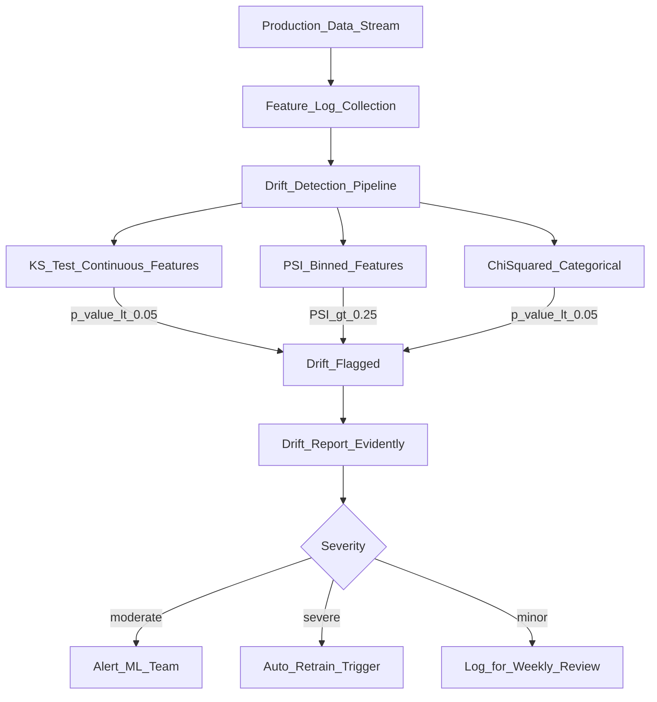

# 📉 Data Drift

> [!abstract] TL;DR
> Data drift (covariate shift) occurs when the distribution of input features in production shifts away from the training distribution. The model wasn't trained on this new input space and may make worse predictions. Detection uses statistical tests: KS test for continuous features, chi-squared/PSI for categorical. Evidently AI automates drift reporting. Unlike concept drift, data drift is detectable without ground truth labels — making it the primary early-warning signal.

## Intuition — analogy FIRST

You train a weather model on summer climate data in California. Then you deploy it in December. The input features (temperature, humidity, pressure) have completely different distributions than what the model trained on. The model was never told what -5°C looks like. Its predictions will degrade even though the underlying physics of weather is unchanged.

This is data drift: **the inputs have changed, but the model hasn't.** The model is like a doctor trained to diagnose patients from one region suddenly seeing patients from a completely different demographic — the symptoms, ranges, and presentations are different.

**Key insight:** Data drift is detectable *without ground truth labels*. You can compare input distributions between training and production today, before you know if predictions are wrong. This makes it the earliest warning signal for model degradation.

## How It Works — mechanics + valid mermaid

**Types of distribution shift:**

| Type | Definition | Example |
|---|---|---|
| **Data drift** (covariate shift) | P(X) changes, P(Y\|X) unchanged | Customer demographics shift |
| **Concept drift** | P(Y\|X) changes, P(X) unchanged | Prices change due to inflation |
| **Label drift** | P(Y) changes, P(X) unchanged | Class balance shifts |
| **Dataset shift** | Both P(X) and P(Y\|X) change | COVID affecting everything |

**Statistical tests for drift detection:**

**Kolmogorov-Smirnov (KS) test** — for continuous features:
- Measures the maximum absolute difference between two CDFs
- KS statistic D = max|F₁(x) - F₂(x)|
- p-value < 0.05 → statistically significant drift
- Works well with 100–10,000 samples

**Population Stability Index (PSI)** — for continuous features (bins):
- PSI = Σ (actual_i% - expected_i%) × ln(actual_i% / expected_i%)
- PSI < 0.1: no significant change
- 0.1 ≤ PSI < 0.25: moderate shift, investigate
- PSI ≥ 0.25: significant shift, action required

**Chi-squared test** — for categorical features:
- Tests if observed vs expected frequencies are statistically different

**Jensen-Shannon (JS) divergence** — symmetric alternative to KL divergence:
- JS = (KL(P||M) + KL(Q||M)) / 2 where M = (P+Q)/2
- Bounded [0, 1], stable even when distributions don't overlap



## Code Demo

```python
# pip install evidently scipy numpy pandas

import numpy as np
import pandas as pd
from scipy import stats
from evidently.report import Report
from evidently.metrics import (
    ColumnDriftMetric,
    DatasetDriftMetric,
    ColumnDistributionMetric,
)
from evidently.metric_preset import DataDriftPreset
import warnings
warnings.filterwarnings("ignore")

# ── SYNTHETIC DATA ─────────────────────────────────────────────────────────
np.random.seed(42)
n = 2000

# Training distribution (reference)
reference = pd.DataFrame({
    "age": np.random.normal(35, 10, n).clip(18, 80),
    "income": np.random.lognormal(10.5, 0.8, n),
    "tenure": np.random.exponential(24, n).clip(0, 120),
    "product_type": np.random.choice(["A", "B", "C"], n, p=[0.5, 0.3, 0.2]),
    "label": np.random.binomial(1, 0.2, n),
})

# Production distribution (drifted — COVID-like scenario)
current = pd.DataFrame({
    "age": np.random.normal(40, 15, n).clip(18, 80),    # older customers
    "income": np.random.lognormal(10.0, 1.2, n),         # lower, more variable
    "tenure": np.random.exponential(12, n).clip(0, 120), # newer customers
    "product_type": np.random.choice(["A", "B", "C"], n, p=[0.2, 0.5, 0.3]),  # shifted
    "label": np.random.binomial(1, 0.2, n),
})

# ── MANUAL KS TEST ─────────────────────────────────────────────────────────
print("=" * 50)
print("KS Test Results")
print("=" * 50)

for col in ["age", "income", "tenure"]:
    stat, p_value = stats.ks_2samp(reference[col], current[col])
    drift = "DRIFT" if p_value < 0.05 else "OK"
    print(f"{col:12s}: KS={stat:.4f}, p={p_value:.4f} [{drift}]")

# ── MANUAL PSI CALCULATION ─────────────────────────────────────────────────
def calculate_psi(reference: np.ndarray, current: np.ndarray,
                  n_bins: int = 10) -> float:
    """
    Calculate Population Stability Index (PSI).
    PSI = Σ (actual% - expected%) × ln(actual% / expected%)
    <0.1: stable; 0.1-0.25: minor; >0.25: major shift
    """
    # Create bins from reference distribution
    breakpoints = np.percentile(reference, np.linspace(0, 100, n_bins + 1))
    breakpoints = np.unique(breakpoints)  # remove duplicates

    # Count observations per bin
    ref_counts, _ = np.histogram(reference, bins=breakpoints)
    cur_counts, _ = np.histogram(current, bins=breakpoints)

    # Convert to proportions, add epsilon to avoid log(0)
    eps = 1e-6
    ref_pcts = (ref_counts / len(reference)) + eps
    cur_pcts = (cur_counts / len(current)) + eps

    # PSI formula
    psi = np.sum((cur_pcts - ref_pcts) * np.log(cur_pcts / ref_pcts))
    return float(psi)

print("\n" + "=" * 50)
print("PSI Results")
print("=" * 50)
PSI_THRESHOLDS = {"stable": 0.1, "minor": 0.25}

for col in ["age", "income", "tenure"]:
    psi = calculate_psi(reference[col].values, current[col].values)
    if psi < PSI_THRESHOLDS["stable"]:
        severity = "STABLE"
    elif psi < PSI_THRESHOLDS["minor"]:
        severity = "MINOR DRIFT"
    else:
        severity = "MAJOR DRIFT"
    print(f"{col:12s}: PSI={psi:.4f} [{severity}]")

# ── CHI-SQUARED FOR CATEGORICAL ────────────────────────────────────────────
ref_counts = reference["product_type"].value_counts().sort_index()
cur_counts = current["product_type"].value_counts().sort_index()

# Align indices
all_cats = sorted(set(ref_counts.index) | set(cur_counts.index))
ref_counts = ref_counts.reindex(all_cats, fill_value=0)
cur_counts = cur_counts.reindex(all_cats, fill_value=0)

chi2, p_value = stats.chisquare(cur_counts.values, f_exp=ref_counts.values *
                                  (len(current) / len(reference)))
print(f"\nproduct_type: chi2={chi2:.4f}, p={p_value:.4f} "
      f"[{'DRIFT' if p_value < 0.05 else 'OK'}]")

# ── EVIDENTLY FULL DRIFT REPORT ────────────────────────────────────────────
report = Report(metrics=[DataDriftPreset()])
report.run(reference_data=reference, current_data=current)

# Save HTML report
report.save_html("drift_report.html")
print("\nFull drift report saved to drift_report.html")

# Programmatic access to results
results = report.as_dict()
n_drifted = results["metrics"][0]["result"]["number_of_drifted_columns"]
n_total = results["metrics"][0]["result"]["number_of_columns"]
drift_share = results["metrics"][0]["result"]["share_of_drifted_columns"]

print(f"\nDrift Summary: {n_drifted}/{n_total} features drifted ({drift_share:.1%})")

# Per-column drift details
for col_result in results["metrics"][0]["result"]["drift_by_columns"].values():
    col = col_result["column_name"]
    drifted = col_result["drift_detected"]
    statistic_name = col_result["statistic_name"]
    stat = col_result["statistic"]
    print(f"  {col}: {statistic_name}={stat:.4f}, drift={drifted}")

# ── SCHEDULED MONITORING JOB PATTERN ─────────────────────────────────────
import datetime

def run_daily_drift_check(reference_path: str, current_path: str,
                           alert_threshold: float = 0.3):
    """
    Daily drift monitoring job. Run via cron or Airflow.
    """
    ref_df = pd.read_parquet(reference_path)
    cur_df = pd.read_parquet(current_path)

    report = Report(metrics=[DataDriftPreset()])
    report.run(reference_data=ref_df, current_data=cur_df)

    results = report.as_dict()
    drift_share = results["metrics"][0]["result"]["share_of_drifted_columns"]

    date_str = datetime.date.today().isoformat()
    report.save_html(f"reports/drift_{date_str}.html")

    if drift_share > alert_threshold:
        message = (f"DRIFT ALERT {date_str}: {drift_share:.1%} of features drifted. "
                   f"Report: reports/drift_{date_str}.html")
        print(message)
        # send_slack_alert(message)
        # trigger_retraining_pipeline()

    return drift_share
```

## Real-World Example

**Uber — COVID Fraud Model Drift**

In March 2020, Uber's fraud detection models experienced a severe breakdown. Their models had been trained on normal ride-sharing patterns: specific ride lengths, departure times, route patterns, and payment behaviors.

When COVID lockdowns began overnight:
- **Ride length distribution** shifted dramatically (no short urban trips)
- **Payment patterns** changed (fewer cash payments, more card)
- **Trip timing** shifted (no rush hour patterns)
- **Geographic distribution** changed completely (no airport/hotel rides)

PSI for several key features exceeded 0.5 — far above the 0.25 threshold. The fraud model was flagging legitimate rides as fraudulent (because they looked "unusual" compared to training data) while missing actual fraud that exploited the new patterns.

Uber's ML team detected the drift via their automated PSI monitoring within 48 hours of lockdowns beginning. They retrained on just 2 weeks of post-lockdown data and restored model performance — using the drift detection system to guide the retraining data window.

**Lesson:** Having PSI monitoring with automated alerts allowed Uber to act in days instead of weeks. Without it, the model degradation would have been discovered only through customer complaints and financial losses.

## Trade-offs

| Test | Best For | Limitation |
|---|---|---|
| **KS test** | Continuous features, small samples | Sensitive to sample size (large N → always significant) |
| **PSI** | Business-friendly interpretation | Requires binning decision |
| **Chi-squared** | Categorical features | Sensitive to rare categories |
| **JS divergence** | Probabilistic, symmetric | Less interpretable than PSI |
| **MMD** | High-dimensional features | Computationally expensive |

## When to Use vs Avoid

**Monitor data drift when:**
- Model has been in production >1 month
- Input data comes from external sources (user behavior, market data)
- Business environment can change rapidly (seasonal, economic, viral)
- Model retraining cadence is monthly or less frequent

**Don't rely on drift detection alone when:**
- Drift is subtle and slow (detect only via performance monitoring)
- High-cardinality features where statistical tests are expensive
- You already retrain daily on fresh data (drift matters less)

## Common Pitfalls

1. **Using current week's data as reference:** Use your training set as the reference, not recent production data. If production has already drifted, you'll get false negatives.

2. **Not stratifying by time:** PSI computed on a monthly window hides intra-month drift. Use rolling windows (hourly, daily) for early detection.

3. **Treating drift as binary:** PSI = 0.26 (just above threshold) vs PSI = 2.0 (catastrophic) both trigger the same alert. Include severity levels and escalation rules.

4. **Missing multivariate drift:** Features A and B individually look fine, but their *joint distribution* has shifted. Univariate tests miss this. Use correlation tracking alongside univariate drift.

5. **Alerting on every feature:** A model with 100 features will have ~5 false-positive drift alerts per day at α=0.05. Apply Bonferroni correction or only monitor important features.

## Related Concepts

- [[_MOC_MLOps|↑ Section MOC]]

- [[Concept_Drift]] — when the Y|X relationship changes (not just X distribution)
- [[ML_Monitoring_Overview]] — data drift in the broader monitoring context
- [[Data_Quality_Validation]] — validate data before training and before drift comparison
- [[AB_Testing_for_ML]] — when drift is detected, A/B test the retrained model before full rollout

## Review Questions

1. Explain the difference between data drift and concept drift. Can you have concept drift without data drift? Give a real-world example of each.

2. Calculate PSI for a feature with the following reference and current bin proportions: ref=[0.10, 0.30, 0.40, 0.15, 0.05], current=[0.05, 0.20, 0.45, 0.20, 0.10]. Interpret the result.

3. You run a KS test on a feature with 1 million production samples vs 10,000 training samples and get p=0.0001. Is this evidence of meaningful drift? What are the limitations of the KS test at large sample sizes, and how would you complement it?

## Sources

- Huyen, Chip. *Designing Machine Learning Systems*. O'Reilly, 2022. Chapter 8.
- [Evidently AI Documentation](https://docs.evidentlyai.com/)
- Uber Engineering Blog: "Under the Hood: The Uber Platform" (2020)
- Kleppmann, M. *Designing Data-Intensive Applications*. O'Reilly, 2017.
- Gama, J. et al. "A survey on concept drift adaptation." ACM Computing Surveys, 2014.

#mlops #data-drift #covariate-shift #psi #ks-test #monitoring #evidently
