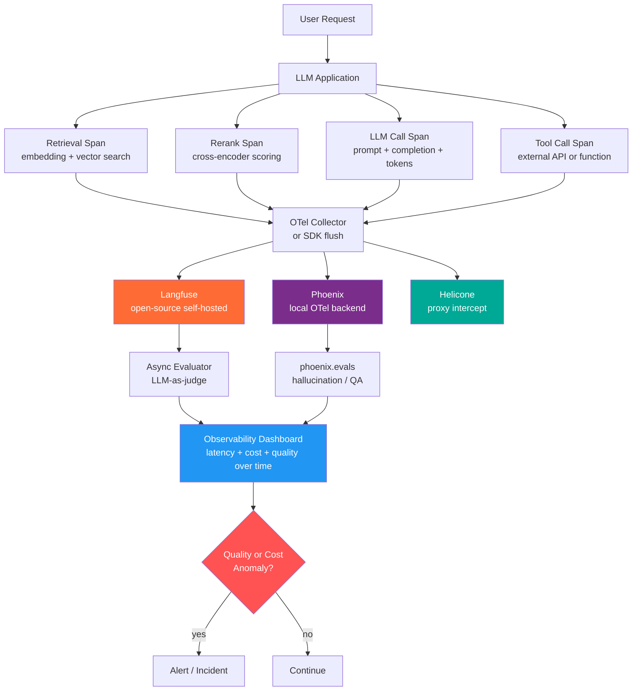

# LLM Observability Tools — LangFuse, Helicone, and Phoenix

> [!abstract] TL;DR
> LLM observability is the discipline of recording, measuring, and evaluating every step of an LLM application's execution — from raw prompt to final response — so you can debug failures, track costs, detect quality regressions, and optimize performance in production. The ecosystem has converged on three pillars: distributed traces (what happened and in what order), metrics (latency, tokens, cost, error rate), and automated evaluations (quality scores via LLM-as-judge or heuristics).

---

## Intuition

**Analogy:** Running an LLM application without observability is like operating a call center where you can hear that a call ended, and whether the customer hung up angry, but you have no recording of the conversation, no script the agent followed, no timer per step, and no way to tell if your agents are reading from an outdated knowledge base.

Classical application monitoring watches your code. LLM observability must watch your *conversations* — the exact prompts, the context retrieved, the model's chain of reasoning, the tools invoked, and the final text generated. When the answer is wrong or costs spike, you need the full transcript, not just an HTTP status code.

---

## Why LLM Observability Is Different from Classical ML Monitoring

Classical ML monitoring watches a trained model's *predictions* against known ground truth. LLMs break every assumption:

| Challenge | Classical ML | LLM Applications |
|-----------|-------------|-----------------|
| **Determinism** | Same input always gives same prediction | Non-deterministic — same prompt yields different outputs |
| **Ground truth** | Label exists (spam / not spam) | No binary label — "good answer" is subjective |
| **Failure mode** | Prediction accuracy drops | Quality degrades silently; model still returns 200 OK |
| **Unit of analysis** | Single model inference | Multi-step chain: retrieval + reranking + LLM + tool calls |
| **Cost signal** | Inference compute (predictable) | Token-level billing — one large context window = 50x cost |
| **Versioning** | Model version | Model version × prompt version × retrieval config |
| **Evaluation** | Metric on held-out test set | LLM-as-judge, human labeling, or reference-free heuristics |

The core problem: **an LLM app can be functionally correct (no errors) and economically viable (latency within SLA) while silently producing wrong, harmful, or irrelevant answers.**

---

## The Three Pillars of LLM Observability

### Pillar 1: Traces (Full Chain Visibility)

A **trace** is a tree structure where the root node is one user-facing request and each child node is a step in the pipeline. Every node records:

- **Inputs and outputs** — the exact text sent and received at each step
- **Latency** — wall-clock time consumed by that step
- **Token usage** — prompt tokens and completion tokens per LLM call
- **Cost** — estimated USD per node (calculated from model pricing × tokens)
- **Metadata** — model name, temperature, tags, user ID, session ID
- **Errors** — exception type and message if the step failed

A RAG chain trace typically has four to six child spans:

```
Root Trace: "user_question"
  ├── Span: retrieval          (500ms, 0 tokens, returns 5 docs)
  ├── Span: reranking          (80ms, 0 tokens, scores docs)
  ├── Span: prompt_assembly    (2ms)
  ├── Span: llm_call           (1200ms, 1840 tokens, $0.0031)
  └── Span: output_parser      (1ms)
```

### Pillar 2: Metrics (Quantitative Health Signals)

Key metrics to track per LLM application:

| Metric | What It Measures | Why It Matters |
|--------|-----------------|----------------|
| **TTFT** | Time to first token — latency until first character appears | Perceived responsiveness for streaming UIs |
| **Total latency** | End-to-end wall-clock time per request | SLA compliance and user experience |
| **Input tokens** | Prompt + context length in tokens | Main cost driver; signals context bloat |
| **Output tokens** | Generation length in tokens | Secondary cost driver; signals verbosity |
| **Cost per request** | USD billed to the LLM provider | Budget tracking and anomaly detection |
| **Cache hit rate** | Fraction of requests served from semantic cache | Measures cost optimization effectiveness |
| **Error rate** | Fraction of requests that raised exceptions | Application reliability |
| **Quality score** | Automated evaluator score (0–1) per request | The only signal that catches silent degradation |
| **Token efficiency** | Output quality per token spent | Measures prompt compression effectiveness |

### Pillar 3: Evaluations (Automated Quality Scoring)

Evaluations answer "was this response any good?" without requiring a human label on every request. The main patterns:

- **LLM-as-judge** — a capable model (GPT-4o, Claude 3.5 Sonnet) scores another model's output against a rubric. Criteria include correctness, faithfulness to context, harmlessness, and relevance.
- **Heuristic evaluators** — deterministic Python functions (regex, JSON schema validation, keyword overlap, length constraints).
- **Embedding similarity** — cosine distance between the generated answer and a reference answer in embedding space.
- **RAGAS metrics** — retrieval-aware metrics: faithfulness (answer grounded in context?), context precision (retrieved docs relevant?), answer relevance (answer relevant to question?).

---

## Tool Overview

### LangFuse — Open-Source LLM Engineering Platform

LangFuse is an open-source observability, evaluation, and prompt management platform. It is self-hosted (Docker Compose or Kubernetes) or available as a managed cloud service. Acquired by ClickHouse in 2026; feature-set matches LangSmith but with zero vendor lock-in.

**Key capabilities:**

| Feature | Detail |
|---------|--------|
| **Tracing** | SDK-based (`langfuse-python`, `langfuse-js`) or proxy-based; integrates with LangChain, LlamaIndex, OpenAI SDK, Anthropic SDK, LiteLLM, and any OpenTelemetry-compatible emitter |
| **Prompt management** | Version-controlled prompt registry with A/B testing; prompts fetched at runtime with strong client-side caching to avoid added latency |
| **Datasets** | Curate test cases from production traces; run batch evaluations across model × prompt version combinations |
| **Evaluations** | LLM-as-judge (any model), custom Python scorers, user feedback collection (thumbs up/down, star ratings) |
| **Scores API** | Attach arbitrary numeric or categorical scores to any trace or span; stream scores from async evaluator jobs |
| **Self-hosted** | Full feature parity between cloud and self-hosted; no telemetry sent to Langfuse cloud if self-hosted |
| **OTel support** | Accepts OpenTelemetry spans natively; works with OpenLLMetry and the GenAI semantic conventions |

**Integration pattern:** Import the SDK, initialize with your project key, and wrap LLM calls. For LangChain, a single `CallbackHandler` sends all chain events automatically.

---

### Helicone — Proxy-First LLM Observability

Helicone routes your LLM requests through its own gateway endpoint. You change one URL in your client; Helicone logs everything in transit without modifying your application code.

> [!warning] Maintenance Mode
> Helicone was acquired by Mintlify in March 2026 and is no longer receiving new features. Existing deployments continue to work, but new projects should evaluate alternatives.

**Key capabilities:**

| Feature | Detail |
|---------|--------|
| **One-line integration** | Change `api.openai.com` to `oai.helicone.ai` — no SDK import, no decorator, no code change |
| **Cost tracking** | Per-request and per-user cost breakdown using a registry of 300+ model price points |
| **Caching** | Semantic or exact-match response caching; reduces cost and latency for repeated queries |
| **Rate limiting** | Per-user, per-organization token rate limits enforced at proxy layer |
| **Request logs** | Searchable log of every request/response with latency, cost, model, and status |
| **Prompt templates** | Define parameterized prompt templates; track which template version generated each response |
| **Multi-provider** | Works with any OpenAI-compatible API endpoint (Azure, Together.ai, Groq, Anthropic via adapter) |
| **User tracking** | Attach user IDs to requests via headers; segment cost and quality metrics per user |

**Integration pattern:** Set a custom base URL. No SDK changes required.

---

### Arize Phoenix — Open-Source, OTel-Native

Phoenix (by Arize AI) is a fully open-source, locally runnable observability tool built on OpenTelemetry and the OpenInference semantic conventions. It excels at RAG debugging, embedding drift visualization, and running structured LLM evaluations.

**Key capabilities:**

| Feature | Detail |
|---------|--------|
| **OTel-native tracing** | Captures traces via standard OpenTelemetry instrumentation; no proprietary SDK lock-in |
| **Span tree visualization** | Interactive UI showing full parent-child span trees with latency waterfall and token breakdown |
| **Embedding drift** | Projects retrieval embeddings into 2D/3D space; shows clusters shifting over time — catches dataset drift before it hits quality |
| **LLM evaluations** | `phoenix.evals` library with built-in evaluators: hallucination, QA correctness, toxicity, relevance, SQL correctness |
| **Datasets** | Collect traces into labeled datasets for batch evaluation and fine-tuning |
| **Integrations** | LangChain, LlamaIndex, OpenAI, Anthropic, Mistral, DSPy, AWS Bedrock — via auto-instrumentors |
| **Deployment** | Runs as a local Python process, Docker container, or Kubernetes pod; no internet required |
| **No cloud dependency** | Fully air-gapped; all data stays local |

**Integration pattern:** Install `openinference-instrumentation-<framework>` and register the tracer. Traces are sent to a local or remote Phoenix server via OTel's OTLP protocol.

---

### OpenTelemetry for LLMs: OpenLLMetry

OpenLLMetry (by Traceloop) is a set of OpenTelemetry-based instrumentation libraries for LLM frameworks. Its semantic conventions were merged into the official OpenTelemetry GenAI Semantic Conventions in 2025, standardizing how LLM spans are named and attributed.

**Standard span types for LLM applications:**

| Span Kind | OTel Semantic Convention | What It Captures |
|-----------|-------------------------|-----------------|
| `gen_ai.client` | `gen_ai.request.*` | Model name, temperature, max tokens, provider |
| `gen_ai.server` | `gen_ai.response.*` | Output tokens, finish reason, model response |
| `retriever` | `db.vector.*` | Query, top-k docs, similarity scores |
| `tool_call` | `gen_ai.tool.*` | Tool name, input arguments, return value |
| `reranker` | `reranker.*` | Input docs, output ranking, model used |

Any backend that accepts OTel — Phoenix, Langfuse, Grafana Tempo, Jaeger — can ingest these spans without modification.

---

## How a Trace Flows from Request to Dashboard

### Flow / Architecture



---

## Spans to Capture in a RAG Pipeline

When instrumenting a RAG chain, capture these span types at minimum:

```
1. retrieval       — query text, top-k docs returned, retriever latency, similarity scores
2. reranking       — input docs, reranked output, reranker model, latency
3. llm_call        — full prompt (system + user), model parameters, response text, token counts, cost
4. tool_call       — tool name, input args, output, latency (for agent/function-calling apps)
5. output_parser   — raw model output, parsed result, parse errors if any
```

Span metadata to always attach: `user_id`, `session_id`, `environment` (dev/staging/prod), `app_version`, `prompt_version`.

---

## Code Demo

```python
# pip install langfuse langchain langchain-openai openai faiss-cpu

# ── SETUP: set these in environment variables ─────────────────────────────────
# LANGFUSE_PUBLIC_KEY=pk-lf-...
# LANGFUSE_SECRET_KEY=sk-lf-...
# LANGFUSE_HOST=https://cloud.langfuse.com   # or http://localhost:3000 if self-hosted
# OPENAI_API_KEY=sk-...

import os
from langfuse import Langfuse
from langfuse.callback import CallbackHandler as LangfuseCallback
from langchain_openai import ChatOpenAI, OpenAIEmbeddings
from langchain_core.prompts import ChatPromptTemplate
from langchain_core.output_parsers import StrOutputParser
from langchain_core.runnables import RunnablePassthrough
from langchain_community.vectorstores import FAISS


# ── PART 1: AUTOMATIC TRACING FOR A LANGCHAIN RAG CHAIN ──────────────────────
# LangfuseCallback instruments every LangChain component automatically.
# The trace tree (retrieval + LLM call) appears in the Langfuse UI immediately.

langfuse_handler = LangfuseCallback()

docs = [
    "Langfuse is open-source and can be self-hosted on any cloud provider.",
    "Traces in Langfuse capture inputs, outputs, latency, tokens, and cost per span.",
    "Prompt management in Langfuse supports versioning and A/B rollout.",
    "Scores in Langfuse can be attached to any trace or span via the Scores API.",
]

embeddings = OpenAIEmbeddings()
vectorstore = FAISS.from_texts(docs, embeddings)
retriever = vectorstore.as_retriever(search_kwargs={"k": 2})

llm = ChatOpenAI(model="gpt-4o-mini", temperature=0)
prompt = ChatPromptTemplate.from_template(
    "Answer using only the context below.\n\nContext: {context}\n\nQuestion: {question}"
)

rag_chain = (
    {
        "context": retriever | (lambda docs: "\n".join(d.page_content for d in docs)),
        "question": RunnablePassthrough(),
    }
    | prompt
    | llm
    | StrOutputParser()
)

# Pass the Langfuse callback — this single line is the entire instrumentation
answer = rag_chain.invoke(
    "Can Langfuse be self-hosted?",
    config={"callbacks": [langfuse_handler]},
)
print("Answer:", answer)


# ── PART 2: MANUAL TRACING WITH LANGFUSE SDK (non-LangChain code) ─────────────
# Use langfuse.trace() and span() context managers to instrument any code.

langfuse = Langfuse()

def retrieve_documents(query: str) -> list[str]:
    docs = retriever.invoke(query)
    return [d.page_content for d in docs]

def call_llm(prompt_text: str) -> str:
    response = llm.invoke(prompt_text)
    return response.content

def run_rag_pipeline(user_question: str) -> str:
    # Create a root trace for this user request
    trace = langfuse.trace(
        name="rag_pipeline",
        input={"question": user_question},
        metadata={"environment": "production", "app_version": "1.2.0"},
        user_id="user_42",
        session_id="session_abc123",
    )

    # Span 1: retrieval
    retrieval_span = trace.span(
        name="retrieval",
        input={"query": user_question},
    )
    retrieved_docs = retrieve_documents(user_question)
    retrieval_span.end(output={"docs": retrieved_docs, "count": len(retrieved_docs)})

    # Span 2: LLM call (use generation for LLM calls — enables token/cost tracking)
    context = "\n".join(retrieved_docs)
    prompt_text = f"Context: {context}\n\nQuestion: {user_question}\n\nAnswer:"

    generation = trace.generation(
        name="llm_call",
        model="gpt-4o-mini",
        input=prompt_text,
        model_parameters={"temperature": 0, "max_tokens": 512},
    )
    raw_answer = call_llm(prompt_text)
    generation.end(
        output=raw_answer,
        usage={"input": 150, "output": 80},  # replace with actual token counts
    )

    # Finalize trace with the overall output
    trace.update(output={"answer": raw_answer})
    langfuse.flush()  # ensure all spans are sent before function returns
    return raw_answer

result = run_rag_pipeline("What does Langfuse store per span?")
print("Manual trace result:", result)


# ── PART 3: ATTACHING AN EVALUATION SCORE TO A TRACE ─────────────────────────
# After async evaluation (e.g., LLM-as-judge), post scores back to the trace.

def llm_judge_faithfulness(question: str, context: str, answer: str) -> float:
    """Minimal LLM-as-judge: scores whether the answer is faithful to the context."""
    judge_prompt = f"""
You are evaluating whether an AI answer is faithful to the provided context.
Score 1.0 if the answer only uses information from the context.
Score 0.0 if the answer contains information NOT in the context (hallucination).
Score 0.5 if partially faithful.

Context: {context}
Question: {question}
Answer: {answer}

Return only the numeric score (0.0, 0.5, or 1.0):"""
    response = llm.invoke(judge_prompt)
    try:
        return float(response.content.strip())
    except ValueError:
        return 0.5

# Post a score to an existing trace by trace_id
def score_existing_trace(trace_id: str, question: str, context: str, answer: str):
    score = llm_judge_faithfulness(question, context, answer)
    langfuse.score(
        trace_id=trace_id,
        name="faithfulness",
        value=score,
        comment=f"LLM judge score for faithfulness. question='{question[:50]}'",
    )
    print(f"Posted faithfulness score: {score} to trace {trace_id}")


# ── PART 4: HELICONE PROXY (minimal integration, works with raw OpenAI client) ─
import openai

# The only change: swap the base_url to route through Helicone's proxy
helicone_client = openai.OpenAI(
    api_key=os.environ.get("OPENAI_API_KEY"),
    base_url="https://oai.helicone.ai/v1",
    default_headers={
        "Helicone-Auth": f"Bearer {os.environ.get('HELICONE_API_KEY', 'hc-...')}",
        "Helicone-User-Id": "user_42",       # enables per-user cost tracking
        "Helicone-Cache-Enabled": "true",     # enables response caching
    },
)

helicone_response = helicone_client.chat.completions.create(
    model="gpt-4o-mini",
    messages=[
        {"role": "system", "content": "You are a concise assistant."},
        {"role": "user", "content": "What is LLM observability?"},
    ],
    temperature=0,
)
print("Helicone proxied response:", helicone_response.choices[0].message.content)


# ── PART 5: ARIZE PHOENIX (local OTel tracing for RAG) ───────────────────────
# pip install arize-phoenix openinference-instrumentation-langchain

import phoenix as px
from openinference.instrumentation.langchain import LangChainInstrumentor

# Launch Phoenix UI locally at http://localhost:6006
px.launch_app()

# Instrument LangChain — every chain run is now a Phoenix trace
LangChainInstrumentor().instrument()

# Subsequent rag_chain.invoke() calls are automatically traced in Phoenix
phoenix_answer = rag_chain.invoke("How does prompt versioning work in Langfuse?")
print("Phoenix-traced answer:", phoenix_answer)

# Phoenix UI shows the full span tree, embedding clusters, and eval scores
```

---

## Real-World Example

> **Example:** Notion's AI Q&A feature processes millions of daily requests over a RAG pipeline that searches each user's workspace. The team uses Langfuse (self-hosted) because Notion cannot send user note content to a third-party cloud. Every trace captures: the search query embedding call, the vector store retrieval (with top-k scores), the reranking step, and the final GPT-4o generation. Async LLM-as-judge evaluators score faithfulness on a 5% sample of production traces each hour. A quality regression alert fires if the hourly faithfulness score drops more than 0.08 points below the 7-day rolling average — this caught a retrieval bug where a chunking change caused 40% of retrieved chunks to be partial sentences, degrading answer quality before any user complaints arrived.

---

## Tool Comparison

| Dimension | LangSmith | Langfuse | Arize Phoenix | Helicone | Braintrust |
|-----------|-----------|----------|---------------|----------|------------|
| **Open source** | No (proprietary) | Yes (Apache 2.0) | Yes (Apache 2.0) | Yes (OSS core) | No |
| **Self-hosted** | Enterprise only | Free, full feature parity | Free local or server | Partial | No |
| **Integration style** | SDK + LangChain native | SDK + OTel + proxy | OTel auto-instrument | Proxy URL swap | SDK |
| **LangChain integration** | Zero-config (native) | Single callback handler | Auto-instrumentor | Proxy-level | Manual |
| **LlamaIndex integration** | Manual | SDK + auto-instrumentor | Auto-instrumentor | Proxy-level | Manual |
| **Prompt management** | Prompt Hub (versioned) | Versioned + A/B test | Limited | Template tracking | Prompt playground |
| **Evaluation framework** | LLM-judge + heuristic | LLM-judge + custom scorers | `phoenix.evals` library | None (external) | Strong, CI-first |
| **Cost tracking** | Per-trace | Per-trace and per-span | Per-span | Per-request (best-in-class) | Per-experiment |
| **Embedding drift** | No | No | Yes (2D/3D visualization) | No | No |
| **Caching** | No | No | No | Yes (semantic cache) | No |
| **Data residency** | Configurable | Full control (self-host) | Full control (local) | US-hosted (Mintlify) | Cloud |
| **Best for** | LangChain teams | Self-host, multi-framework | OTel-native, RAG debugging | Cost control (legacy) | Eval-driven CI |
| **Pricing** | Usage-based SaaS | Free OSS + cloud | Free OSS + cloud | Maintenance mode | Free tier + usage |

---

## Trade-offs

| Aspect | Pro | Con |
|--------|-----|-----|
| **Trace completeness** | Full visibility into every intermediate step, exact prompts, token counts, and costs | Traces contain raw prompt text — PII must be scrubbed before tracing or use self-hosted deployment |
| **Async evaluation** | LLM-as-judge runs off the critical path; no added latency to user-facing requests | Judge itself costs tokens (GPT-4o judge adds ~$0.002/eval); known biases (verbosity, positional) |
| **Proxy-based (Helicone)** | Zero code change; works with any OpenAI-compatible SDK | Cannot trace application-level logic (retrieval, tool calls); limited to LLM API boundary |
| **SDK-based (Langfuse)** | Captures full application trace tree including non-LLM spans | Requires explicit SDK instrumentation; adds code coupling to the observability tool |
| **OTel-based (Phoenix)** | Vendor-neutral; traces portable to any OTel backend | More setup overhead; instrumentation libraries maintained separately per framework |
| **Self-hosted** | Data stays on-premises; no usage-based billing; full control | Operational burden: database, storage, upgrades, and scaling are your responsibility |
| **Quality scoring** | Enables automated regression detection without human labels | Score definitions drift — the judge's rubric must be versioned alongside the model |

---

## When to Use vs Avoid

**Use Langfuse when:**
- You need self-hosted LLM observability with no data leaving your infrastructure
- Your stack mixes LangChain, LlamaIndex, raw OpenAI, and custom Python (multi-SDK environment)
- You want open-source with a production-grade UI, prompt management, and evaluation datasets
- You are on a budget — the self-hosted version is completely free

**Use Arize Phoenix when:**
- You are building on OpenTelemetry and want vendor-neutral, portable traces
- You need embedding drift visualization to catch retrieval degradation early
- You want structured LLM evaluations (hallucination, QA correctness) out of the box
- You need fully local, air-gapped operation (no internet connection to a trace backend)

**Use Helicone when (legacy):**
- You have an existing deployment that already uses Helicone and changing is not worth the effort
- You need the simplest possible cost tracking with zero code changes (proxy URL only)
- Note: do not start new projects on Helicone given its maintenance-mode status

**Use LangSmith when:**
- Your application is built on LangChain or LangGraph (zero-config is a genuine advantage)
- You want the tightest integration with LangChain's Prompt Hub and Dataset tooling
- You accept vendor lock-in in exchange for the best LangChain-native developer experience

**Avoid any tracing when:**
- Request payloads contain PII and you have not implemented scrubbing middleware (privacy risk)
- Trace volume is so high that async flush overhead affects p99 latency at the SDK level

---

## Production Alerting Patterns

Three alert classes cover the critical failure modes:

**1. Quality regression detection**
- Compute hourly rolling average of your LLM-as-judge score
- Alert if score drops more than a threshold (e.g., 0.1 points) below the 7-day baseline
- Use a z-score test if traffic volume is high enough to smooth noise

**2. Cost anomalies**
- Alert if cost per request exceeds 2× the 7-day p95
- Alert if hourly total cost exceeds a fixed budget threshold
- Common cause: a prompt change that dramatically increased context window size

**3. Latency spikes**
- Alert on p95 TTFT and p95 total latency
- Separate latency alerts per span type to pinpoint whether the slowdown is in retrieval, reranking, or the LLM call itself

---

## Common Pitfalls

- **Sending PII in traces** — raw traces contain the exact prompt text, which may include user-submitted sensitive data. Always implement a scrubbing middleware or deploy self-hosted where data does not leave your network.
- **Logging too much** — storing full document chunks in every retrieval span at high QPS creates enormous storage costs. Log document IDs and scores; retrieve the content on demand when debugging.
- **Trusting LLM judge scores without calibration** — LLM judges have well-documented verbosity bias (longer answers score higher) and positional bias. Calibrate judge scores against 100–200 human ratings before using them as automated gates.
- **Single prompt version in production** — without prompt versioning, a prompt change is invisible in traces. Always tag traces with the prompt version hash or name so quality changes are attributable.
- **Evaluating only the final output** — intermediate span quality matters. A RAG pipeline can produce a correct answer even when retrieval is poor (the LLM hallucinated correctly by luck). Score retrieval quality separately using context precision and recall metrics.
- **Ignoring cache hit rate** — for applications with repetitive queries, a semantic cache can cut costs by 40–70%. If cache hit rate is near zero, investigate whether query paraphrasing is preventing cache hits.
- **Not separating environments** — dev and prod traces mixed in one project make dashboards noisy and alerts unreliable. Use separate Langfuse projects or trace tags per environment.

---

## Related Concepts

- [[LangSmith]] — LangChain's native observability platform; covers the same three pillars (traces, metrics, evals) but is proprietary and LangChain-centric; compare directly to Langfuse for open-source vs SaaS trade-offs
- [[ML_Monitoring_Overview]] — the parent discipline; LLM observability is the generative-AI-specific slice of ML monitoring with fundamentally different failure modes and metrics
- [[Experiment_Tracking_Overview]] — LLM observability platforms (LangSmith, Langfuse) play the same role for prompt experiments that MLflow/W&B play for training experiments: tracking runs, comparing outcomes, and storing artifacts
- [[RAG_Fundamentals]] — RAG pipelines are the primary target for LLM observability; retrieval span tracing and faithfulness evaluation are specifically designed to debug RAG failures
- [[AI_Agents_Overview]] — multi-step agent trajectories produce deep trace trees spanning 10–50 spans; agent debugging is where LLM observability provides the most unique value over classical logging
- [[LangChain]] — LangFuse's `CallbackHandler` and LangSmith's zero-config integration both instrument LangChain components; choose your observability layer based on your LangChain usage pattern
- [[LlamaIndex]] — Phoenix and Langfuse both provide auto-instrumentors for LlamaIndex pipelines; especially useful for LlamaIndex's complex query engine span trees
- [[Evaluation_Frameworks]] — covers RAGAS, DeepEval, and the broader landscape of LLM evaluation methodologies that feed into the evaluation pillar of observability platforms

---

## Review Questions

1. A five-step RAG agent (query expansion → retrieval → reranking → LLM synthesis → citation check) produces a hallucinated answer on 8% of requests. Walk through which spans you would examine first, what metrics you would sort by to find the root cause, and how you would set up an automated evaluator to detect this regression going forward.

2. Your team is choosing between Langfuse (self-hosted) and LangSmith (cloud SaaS) for a healthcare application that processes patient intake forms. What specific factors would drive your decision, and what additional technical controls would you need regardless of which platform you pick?

3. Explain why a proxy-based approach (Helicone) cannot replace an SDK-based approach (Langfuse) for a RAG application, and describe a scenario where the proxy approach is genuinely sufficient and preferable.

---

## Sources

- [Langfuse Observability Overview](https://langfuse.com/docs/observability/overview)
- [Langfuse GitHub Repository](https://github.com/langfuse/langfuse)
- [Arize Phoenix GitHub — AI Observability and Evaluation](https://github.com/arize-ai/phoenix)
- [Arize Phoenix Observability Guide 2026 — Statsig](https://www.statsig.com/perspectives/arize-phoenix-ai-observability)
- [Helicone Cost Tracking and Optimization](https://docs.helicone.ai/guides/cookbooks/cost-tracking)
- [OpenTelemetry for GenAI and OpenLLMetry — Dotan Horovits](https://horovits.medium.com/opentelemetry-for-genai-and-the-openllmetry-project-81b9cea6a771)
- [OpenLLMetry GitHub — Traceloop](https://github.com/traceloop/openllmetry)
- [OpenTelemetry GenAI Semantic Conventions — Greptime](https://greptime.com/blogs/2026-05-09-opentelemetry-genai-semantic-conventions)
- [LLMOps Observability Comparison — Agenta](https://agenta.ai/blog/top-llm-observability-platforms)
- [Langfuse Guide 2025 — Prismix](https://prismix.dev/guides/langfuse-guide)

---

#mlops #observability #llm #tracing #evaluation #langfuse #helicone #phoenix #opentelemetry #llm-as-judge #rag #ai-ml #intermediate
