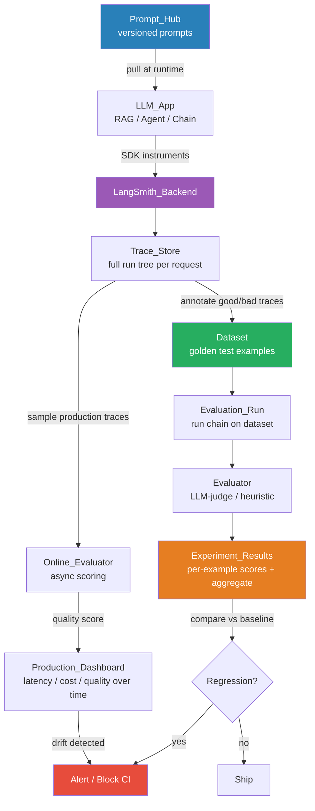

# LangSmith

> [!abstract] TL;DR
> LangSmith is LangChain's observability, evaluation, and testing platform for LLM applications: it records full execution traces of every chain and agent run, lets you build golden datasets from real traffic, run automated evaluators (including LLM-as-judge) for regression testing, and monitor production quality continuously — solving the "my LLM app gave a wrong answer and I have no idea why" problem.

---

## Intuition

**Analogy:** Imagine a flight recorder (black box) combined with a wind-tunnel testing facility for aircraft. The flight recorder captures everything that happened during a flight — altitude, speed, control inputs, engine state at each second. The wind tunnel lets you replay specific flight conditions in a controlled environment to see how the plane behaves. LangSmith is both: it records every step of your LLM application's "flight" (the trace), and gives you a facility to replay inputs against curated test cases and measure outcomes systematically.

Traditional software debugging works because you can add a breakpoint and inspect state at any line. An LLM chain running five steps — retrieval, summarization, reasoning, formatting, validation — fails silently: the final output is wrong, but you don't know which step introduced the error, what the exact prompt was, how many tokens it consumed, or whether a retriever returned the wrong document. LangSmith's trace view makes every intermediate step inspectable.

---

## How It Works

### The LLM Observability Problem

LLM applications have three properties that break conventional monitoring:

1. **Non-determinism:** The same input can produce different outputs across runs, making "is this a bug?" ambiguous.
2. **Multi-step chains:** A RAG pipeline might have 6+ steps; failure can originate anywhere and propagate invisibly.
3. **Subjective quality:** There is no binary pass/fail for "was this answer good?" — quality requires a scoring function (human or LLM judge).

### Core Feature Set

| Feature | What It Does |
|---------|-------------|
| **Tracing** | Records every run as a tree of steps with inputs, outputs, latency, token count, and cost |
| **Datasets** | Curated input/output pairs used as golden test sets; built from traced runs or uploaded manually |
| **Evaluators** | Automated scoring functions (LLM-as-judge or Python) that score outputs against expected results |
| **Prompt Hub** | Version-controlled prompt registry; pull specific prompt versions programmatically at runtime |
| **Online Evaluation** | Sample live production traces and run evaluators asynchronously; detect quality drift |
| **Annotation Queues** | Route traces to human reviewers for labeling; feed labels back into datasets |

### Tracing in Depth

A **trace** is a tree where the root is one user-facing request and each node is a step (LLM call, retriever, tool, chain). Each node stores:
- Raw input and output (exact prompt text sent, exact model response received)
- Latency (wall-clock time for that step)
- Token usage and estimated cost (per LLM call)
- Error if the step threw an exception

**Automatic tracing with LangChain** requires only two environment variables — LangChain instruments its components and sends traces automatically.

**Manual tracing** for non-LangChain code uses two patterns:
- `@traceable` decorator — wraps any Python function as a traced step
- `wrap_openai(client)` — wraps a raw OpenAI client so every `chat.completions.create` call becomes a traced node

### Datasets and Regression Testing

A **dataset** is a collection of `(input, expected_output)` pairs. You can create datasets by:
1. Filtering and saving real production traces (mine your failures)
2. Uploading CSV/JSON manually
3. Programmatically adding examples via the SDK

An **evaluation run** applies a dataset against a target function (your chain or model), then runs one or more evaluators on each output. Results are stored as an experiment — you can compare experiment A vs experiment B (e.g., GPT-4o vs Claude 3.5 Sonnet on the same dataset) side by side.

### Evaluator Types

| Evaluator | Mechanism | Example Use Case |
|-----------|-----------|-----------------|
| **LLM-as-judge** | Sends output + criteria to a capable LLM (GPT-4o) for scoring | Correctness, helpfulness, harmlessness |
| **Heuristic** | Python function with deterministic logic | Checks output matches regex, contains required fields |
| **Embedding similarity** | Cosine similarity to a reference embedding | Semantic closeness to expected answer |
| **RAGAS metrics** | Faithfulness, context precision, answer relevance | RAG-specific quality |

Built-in LLM-judge criteria available out of the box: `correctness`, `relevance`, `conciseness`, `harmfulness`, `misogyny`, `criminality`.

### Flow / Architecture



---

## Code Demo

```python
# pip install langsmith langchain langchain-openai openai

# ── SETUP (set these in .env, not in code) ────────────────────────────────────
# LANGCHAIN_API_KEY=lsv2_pt_<your_key>
# LANGCHAIN_TRACING_V2=true
# LANGCHAIN_PROJECT=rag-production
# OPENAI_API_KEY=sk-...

import os
from langsmith import Client
from langsmith.wrappers import wrap_openai
from langsmith import traceable
import openai


# ── PART 1: AUTOMATIC TRACING WITH LANGCHAIN ─────────────────────────────────
# Zero extra code needed — set env vars above and all LangChain runs are traced.

from langchain_openai import ChatOpenAI, OpenAIEmbeddings
from langchain_core.prompts import ChatPromptTemplate
from langchain_core.output_parsers import StrOutputParser
from langchain_core.runnables import RunnablePassthrough
from langchain_community.vectorstores import FAISS

docs = [
    "LangSmith traces every step of an LLM chain, including inputs, outputs, latency, and tokens.",
    "Datasets in LangSmith are golden test sets used for regression evaluation.",
    "Online evaluation samples production traces and runs evaluators asynchronously.",
    "The Prompt Hub stores versioned prompts that can be pulled programmatically.",
]

embeddings = OpenAIEmbeddings()
vectorstore = FAISS.from_texts(docs, embeddings)
retriever = vectorstore.as_retriever(search_kwargs={"k": 2})

llm = ChatOpenAI(model="gpt-4o-mini", temperature=0)

prompt = ChatPromptTemplate.from_template(
    "Answer concisely using only the context below.\n\nContext: {context}\n\nQuestion: {question}"
)

rag_chain = (
    {"context": retriever | (lambda docs: "\n".join(d.page_content for d in docs)),
     "question": RunnablePassthrough()}
    | prompt
    | llm
    | StrOutputParser()
)

# This call is automatically traced in LangSmith — full tree: retriever + LLM call
answer = rag_chain.invoke("What is online evaluation in LangSmith?")
print("RAG answer:", answer)


# ── PART 2: MANUAL TRACING WITH @traceable ────────────────────────────────────
# Use this for non-LangChain code (raw API calls, custom logic, etc.)

raw_client = openai.OpenAI()
traced_client = wrap_openai(raw_client)   # every call is now a traced node

@traceable(name="classify_intent")        # shows as a named step in the trace tree
def classify_intent(user_message: str) -> str:
    response = traced_client.chat.completions.create(
        model="gpt-4o-mini",
        messages=[
            {"role": "system", "content": "Classify the user intent as: question / complaint / feedback. Reply with one word."},
            {"role": "user", "content": user_message},
        ],
        temperature=0,
    )
    return response.choices[0].message.content.strip()

@traceable(name="full_support_pipeline")  # parent span — wraps child spans
def support_pipeline(user_message: str) -> dict:
    intent = classify_intent(user_message)
    rag_answer = rag_chain.invoke(user_message)
    return {"intent": intent, "answer": rag_answer}

result = support_pipeline("How does online evaluation work?")
print("Pipeline result:", result)


# ── PART 3: CREATING A DATASET AND RUNNING AN EVALUATION ─────────────────────

client = Client()

# Create a dataset (or get an existing one by name)
dataset_name = "langsmith-rag-golden-set"

if not client.has_dataset(dataset_name=dataset_name):
    dataset = client.create_dataset(
        dataset_name=dataset_name,
        description="Golden test set for the LangSmith RAG chain",
    )
    # Add examples: (input, expected_output) pairs
    client.create_examples(
        inputs=[
            {"question": "What does LangSmith trace?"},
            {"question": "What are datasets used for in LangSmith?"},
            {"question": "How are production traces evaluated online?"},
        ],
        outputs=[
            {"answer": "Every step of an LLM chain including inputs, outputs, latency, and tokens."},
            {"answer": "Datasets are golden test sets used for regression evaluation."},
            {"answer": "Production traces are sampled and evaluators run asynchronously."},
        ],
        dataset_id=dataset.id,
    )


# ── PART 4: DEFINE A CUSTOM EVALUATOR ────────────────────────────────────────

def keyword_coverage_evaluator(run, example) -> dict:
    """
    Heuristic evaluator: checks if key terms from the expected answer
    appear in the actual output. Returns a score between 0 and 1.
    """
    expected_words = set(example.outputs["answer"].lower().split())
    actual_words = set(run.outputs["output"].lower().split())
    # Ignore stopwords
    stopwords = {"the", "a", "an", "is", "are", "in", "and", "of", "for", "to"}
    expected_keywords = expected_words - stopwords
    if not expected_keywords:
        return {"key": "keyword_coverage", "score": 1.0}
    overlap = len(expected_keywords & actual_words) / len(expected_keywords)
    return {"key": "keyword_coverage", "score": overlap}


# ── PART 5: RUN EVALUATION AGAINST DATASET ───────────────────────────────────

from langsmith.evaluation import evaluate as ls_evaluate

def predict(inputs: dict) -> dict:
    """Target function evaluated against each dataset example."""
    output = rag_chain.invoke(inputs["question"])
    return {"output": output}

# Run evaluation — creates a named experiment in LangSmith UI
experiment_results = ls_evaluate(
    predict,
    data=dataset_name,
    evaluators=[keyword_coverage_evaluator],
    experiment_prefix="gpt4o-mini-baseline",
    metadata={"model": "gpt-4o-mini", "chunk_size": 200},
)

print("Evaluation complete. View results in the LangSmith UI.")


# ── PART 6: PULL A VERSIONED PROMPT FROM PROMPT HUB ─────────────────────────

from langchain import hub

# Pull a specific commit of a prompt — deterministic, reproducible
prompt_from_hub = hub.pull("my-team/rag-answer-prompt:abc123f")

# Or pull the latest version of a prompt
latest_prompt = hub.pull("my-team/rag-answer-prompt")
```

---

## Real-World Example

> **Example:** Replit's AI coding assistant (Replit Agent) uses LangSmith to monitor a multi-step agent that interprets natural language coding tasks, writes code, runs it in a sandbox, inspects errors, and retries. Each agent trajectory is a LangSmith trace spanning 10–30 steps. The team filters traces where the agent failed (tool error or user thumbs-down) into a failure dataset, runs nightly evaluation experiments against this dataset after each model or prompt change, and uses the LLM-as-judge `correctness` evaluator to detect regressions before shipping. Without trace-level visibility, diagnosing why the agent looped or called the wrong tool would require manually reconstructing the run from scattered logs.

---

## Tool Comparison

| Dimension | LangSmith | Langfuse | Arize Phoenix | Braintrust |
|-----------|-----------|----------|---------------|------------|
| **Best for** | LangChain / LangGraph stacks | Self-hosted, open-source | OTel-native infra teams | Eval-driven dev + CI gates |
| **Open source** | No (proprietary SaaS) | Yes (acquired by ClickHouse 2026) | Yes (Apache 2.0) | No (SaaS, free tier) |
| **LangChain integration** | Zero-config (native) | Manual SDK | Manual SDK | Manual SDK |
| **Agent tracing** | Excellent (full tree) | Good | Good (OTEL spans) | Good |
| **Eval framework** | Built-in LLM-judge + heuristic | Built-in + custom | RAGAS-native | Strong, CI-first |
| **Prompt management** | Prompt Hub (versioned) | Prompt management | Limited | Prompt playground |
| **Vendor lock-in** | High (LangChain ecosystem) | Low (open, portable) | Low | Medium |
| **Self-host option** | Yes (BYOC / enterprise) | Yes (free) | Yes (free) | No |
| **Pricing model** | Usage-based SaaS | Free OSS + cloud | Free OSS + cloud | Free tier + usage |

---

## Trade-offs

| Aspect | Pro | Con |
|--------|-----|-----|
| **Tracing** | Full tree visibility into every intermediate step; latency and cost per node | Adds ~10–50ms network overhead per trace; sensitive data is sent to LangSmith servers |
| **Integration** | Zero-config with LangChain; `@traceable` for any Python code | Tighter coupling to LangChain ecosystem increases switching cost |
| **Evaluation** | LLM-as-judge enables quality measurement without ground-truth labels | LLM judge itself costs tokens and has known biases (verbosity, positional) |
| **Datasets** | Mine failures directly from production traces | Dataset can become stale if traffic distribution shifts significantly |
| **Prompt Hub** | Versioned prompts = reproducible experiments; no prompt hardcoding | Adds a network call at startup to pull prompts; requires discipline to maintain |

---

## When to Use vs Avoid

**Use LangSmith when:**
- Your application uses LangChain or LangGraph (zero-config tracing is a genuine time saver)
- You need to debug multi-step chain or agent failures systematically
- You want to build a regression test suite from real production failures
- Your team is iterating on prompts and needs version control and A/B comparison

**Avoid or consider alternatives when:**
- You have strict data residency requirements that preclude sending traces to LangSmith servers (use Langfuse self-hosted or Arize Phoenix instead)
- You are not using LangChain and want a vendor-neutral OpenTelemetry-native solution (Arize Phoenix is a better fit)
- Budget is constrained and you need fully open-source with no usage-based billing (Langfuse)
- Your primary focus is CI/CD-gated evaluation rather than production monitoring (Braintrust)

---

## Common Pitfalls

- **Sending PII in traces** — LangSmith traces contain the raw prompt and model output. If users submit sensitive data, it is transmitted to LangSmith's servers. Scrub PII before it enters the chain or use the self-hosted deployment option.
- **Evaluating on the dataset you mined from** — If your golden dataset is built entirely from recent production traces, it reflects your current model's distribution. It may miss systematic blind spots. Supplement with manually crafted adversarial examples.
- **Over-relying on LLM judge scores** — LLM judges have well-documented verbosity bias (longer answers score higher) and positional bias (first answer wins). Always calibrate judge scores against a sample of human ratings before trusting them for automated gates.
- **Forgetting to set `LANGCHAIN_PROJECT`** — Without a project name, all traces land in a default project and quickly become unsearchable. Set a meaningful project name per application or environment.
- **Ignoring cost visibility** — LangSmith shows cost per LLM call in the trace. Teams often discover that a small fraction of traces (edge cases triggering large context windows) account for 40%+ of inference cost. Use this to optimize prompt templates.
- **Stale datasets after model upgrade** — After switching base models, re-evaluate your entire dataset and update expected outputs that the new model legitimately answers differently. Otherwise, correct new behavior is flagged as a regression.

---

## Related Concepts

- [[_MOC_MLOps|Section MOC]]

- [[LangChain]] — LangSmith is LangChain's native observability layer; LangChain apps are traced automatically with two env vars
- [[ML_Monitoring_Overview]] — LangSmith is the LLM-specific slice of ML monitoring; for traditional model drift, see this note
- [[Evaluation_Frameworks]] — covers the broader landscape of LLM evaluation methodologies including RAGAS and DeepEval that LangSmith integrates
- [[RAG_Fundamentals]] — RAG pipelines are the primary target for LangSmith's retrieval-step tracing and faithfulness evaluation
- [[RAG_Evaluation]] — deep dive on metrics (faithfulness, context precision, recall) that LangSmith evaluators can measure
- [[AI_Agents_Overview]] — multi-step agent trajectories are LangSmith's most valuable debugging use case
- [[Experiment_Tracking_Overview]] — LangSmith plays the same role for LLM apps that MLflow/W&B play for classical ML: tracking experiment runs and comparing outcomes
- [[LLM_Benchmarks]] — offline benchmark suites complement LangSmith's online/golden-set evaluation for model selection

---

## Review Questions

1. A three-step RAG chain (retriever → reranker → LLM) produces a hallucinated answer. Walk through how you would use LangSmith to identify which step introduced the failure, what specific fields in the trace you would inspect, and how you would prevent the same failure from regressing in future releases.

2. Your team wants to switch from GPT-4o-mini to Claude 3.5 Haiku to cut inference costs. Design an evaluation experiment in LangSmith: what dataset would you use, which evaluators would you run, and what criteria would qualify the new model for production?

3. Compare LangSmith's role in an LLM application stack to MLflow's role in a classical ML pipeline. What is structurally similar (what problem each solves), and where do they fundamentally differ due to the non-deterministic, generative nature of LLMs?

---

## Sources

- [LangSmith Platform Overview](https://www.langchain.com/langsmith-platform)
- [LangSmith Observability Documentation](https://www.langchain.com/langsmith/observability)
- [LangSmith Evaluation Docs — Analytics Vidhya](https://www.analyticsvidhya.com/blog/2025/11/evaluating-llms-with-langsmith/)
- [LLMOps Observability: LangSmith vs Arize vs Langfuse vs W&B — Medium](https://medium.com/@kanerika/llmops-observability-langsmith-vs-arize-vs-langfuse-vs-w-b-f1baeabd1bbf)
- [Top LLM Observability Platforms 2025 — Agenta](https://agenta.ai/blog/top-llm-observability-platforms)
- [Best LLM Observability Tools for AI Agents — Latitude](https://latitude.so/blog/best-llm-observability-tools-agents-latitude-vs-langfuse-langsmith)
- [LangSmith Alternatives Compared — Confident AI](https://www.confident-ai.com/knowledge-base/compare/top-langsmith-alternatives-and-competitors-compared)

---

#mlops #observability #llm #tracing #evaluation #langchain #llm-as-judge #rag #ai-ml #intermediate
