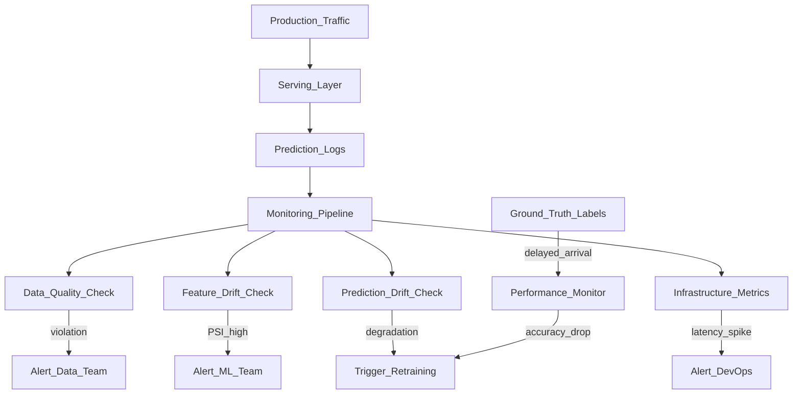

# 📡 ML Monitoring Overview

> [!abstract] TL;DR
> ML monitoring watches four signals in production: data quality (schema/stats), data drift (input distribution changes), concept drift (relationship between inputs and outputs changes), and model performance (accuracy metrics). Unlike software monitoring which alerts on errors and latency, ML monitoring must detect *silent* degradation — a model that still responds in 50ms but is silently making worse predictions. Monitoring requires observability (logs, metrics, traces) plus ML-specific drift detection.

## Intuition — analogy FIRST

Traditional software monitoring is like monitoring a calculator — you know if it crashes (error) or runs slow (latency), but a calculation of 2+2=5 would pass all standard monitoring checks. The calculator still "works."

ML models are more like doctors diagnosing patients. Standard server monitoring tells you if the doctor is available (uptime) and how fast they respond (latency). But it doesn't tell you if their diagnoses are becoming less accurate because:
- **Patients are changing** (data drift: different demographics, new symptoms)
- **The relationship between symptoms and diseases has changed** (concept drift: COVID changed typical pneumonia presentation)
- **The doctor's knowledge is outdated** (model staleness)

ML monitoring is like continuous medical peer review — independent assessment of whether the diagnoses are still good, using statistical methods to detect degradation before patients start reporting bad outcomes.

## How It Works — mechanics + valid mermaid

**The four pillars of ML monitoring:**

| Pillar | What it monitors | Detection method | Tool |
|---|---|---|---|
| **Data quality** | Schema violations, nulls, type errors | Rule checks, Great Expectations | GE, custom |
| **Data drift** | Input feature distribution shifts | KS test, PSI, chi-squared | Evidently, WhyLabs |
| **Concept drift** | Model accuracy degradation | Performance on labeled windows | Evidently, custom |
| **Infrastructure** | Latency, errors, GPU utilization | Standard APM | Prometheus, Datadog |

**Monitoring approaches:**

- **Real-time monitoring:** Check every prediction (high cost, catches issues immediately)
- **Windowed monitoring:** Check batches of predictions hourly/daily (cost-efficient, slight delay)
- **Scheduled reports:** Daily/weekly drift report via Evidently (simple, good for stable models)

**Shadow mode:** Deploy the new model to receive production traffic but don't use its predictions. Log predictions alongside the production model. Compare distributions. Only use shadow mode results to validate before going live.

**Canary deployment:** Route 5% of traffic to new model. Monitor metrics. If no degradation in 24 hours, increase to 25%, then 100%. Rollback if metrics degrade.

**SLOs for ML models:**
- Prediction latency p99 < 100ms
- Data quality check pass rate > 99.9%
- Data drift alert if PSI > 0.25
- Model performance: accuracy > 90% (requires ground truth)



## Code Demo

```python
# pip install evidently prometheus_client

# ── EVIDENTLY AI — DRIFT MONITORING ───────────────────────────────────────
import pandas as pd
import numpy as np
from evidently.report import Report
from evidently.metric_preset import DataDriftPreset, DataQualityPreset
from evidently.metrics import (
    DatasetDriftMetric,
    DatasetMissingValuesMetric,
    ColumnDriftMetric,
)

# Reference dataset (training data distribution)
reference_df = pd.read_csv("data/train_reference.csv")

# Current production data (last 24 hours of predictions)
current_df = pd.read_csv("data/production_2026_01_15.csv")

# ── COMPREHENSIVE MONITORING REPORT ───────────────────────────────────────
report = Report(metrics=[
    DataDriftPreset(),          # checks drift on all features
    DataQualityPreset(),        # checks nulls, types, stats
])

report.run(reference_data=reference_df, current_data=current_df)
report.save_html("monitoring_report_2026_01_15.html")

# ── PROGRAMMATIC DRIFT DETECTION ─────────────────────────────────────────
# Get drift results as a dictionary for alerting
result = report.as_dict()

dataset_drift = result["metrics"][0]["result"]["dataset_drift"]
drift_share = result["metrics"][0]["result"]["share_of_drifted_columns"]

print(f"Dataset drift detected: {dataset_drift}")
print(f"Fraction of drifted columns: {drift_share:.1%}")

# Alert if more than 20% of features have drifted
if drift_share > 0.2:
    print("ALERT: Significant data drift detected! Consider retraining.")
    # send_alert_to_slack(f"Data drift: {drift_share:.1%} of features drifted")

# ── INDIVIDUAL COLUMN DRIFT ────────────────────────────────────────────────
column_report = Report(metrics=[
    ColumnDriftMetric(column_name="age"),
    ColumnDriftMetric(column_name="income"),
    ColumnDriftMetric(column_name="tenure"),
])
column_report.run(reference_data=reference_df, current_data=current_df)

column_results = column_report.as_dict()
for metric in column_results["metrics"]:
    col_name = metric["result"]["column_name"]
    drift_detected = metric["result"]["drift_detected"]
    statistic = metric["result"]["statistic"]
    print(f"  {col_name}: drift={drift_detected}, test={statistic:.4f}")

# ── PROMETHEUS METRICS FOR INFRASTRUCTURE MONITORING ──────────────────────
from prometheus_client import Counter, Histogram, Gauge, start_http_server
import time

# Define metrics
prediction_requests = Counter(
    "ml_prediction_requests_total",
    "Total number of prediction requests",
    ["model_version", "status"],
)
prediction_latency = Histogram(
    "ml_prediction_latency_seconds",
    "Prediction latency in seconds",
    buckets=[0.005, 0.01, 0.025, 0.05, 0.1, 0.25, 0.5, 1.0],
)
model_score = Gauge(
    "ml_model_accuracy_gauge",
    "Rolling accuracy on labeled predictions",
    ["model_version"],
)

# Use in serving code
def predict_with_monitoring(features, model_version="2.1.0"):
    with prediction_latency.time():
        try:
            prediction = model.predict(features)
            prediction_requests.labels(
                model_version=model_version, status="success"
            ).inc()
            return prediction
        except Exception as e:
            prediction_requests.labels(
                model_version=model_version, status="error"
            ).inc()
            raise

# Start Prometheus metrics server
start_http_server(8002)   # scrape at :8002/metrics

# ── SLIDING WINDOW PERFORMANCE MONITORING ─────────────────────────────────
from collections import deque
from sklearn.metrics import accuracy_score
import threading

class PerformanceMonitor:
    """Monitor model accuracy on labeled ground truth using a sliding window."""

    def __init__(self, window_size=1000, alert_threshold=0.85):
        self.window = deque(maxlen=window_size)
        self.alert_threshold = alert_threshold

    def log_prediction(self, prediction, ground_truth):
        self.window.append((prediction, ground_truth))

    def get_accuracy(self) -> float:
        if len(self.window) < 100:
            return None   # not enough data
        preds, truths = zip(*self.window)
        return accuracy_score(truths, preds)

    def check_alert(self) -> bool:
        acc = self.get_accuracy()
        if acc is not None and acc < self.alert_threshold:
            print(f"ALERT: Model accuracy {acc:.3f} below threshold {self.alert_threshold}")
            return True
        return False
```

## Real-World Example

**Netflix — Dedicated ML Monitoring Infrastructure**

Netflix's data platform team built a comprehensive ML monitoring system called "Metaflow Monitor":

- **Automated drift reports:** Every production model has a scheduled job that generates Evidently-style drift reports on incoming prediction inputs daily. If drift is detected, the owning team gets a Jira ticket automatically.
- **Performance monitoring via feedback signals:** Netflix uses implicit feedback (did the user watch the recommended show?) as a proxy ground truth for their recommendation models. A drop in watch-through rate from recommended content triggers a model review.
- **Canary deployments:** All model updates go through a canary pipeline — 1% → 5% → 25% → 100% traffic, with automatic rollback if recommendation engagement drops >2% relative.
- **SLOs per model tier:** Tier 1 models (homepage recommendations) have p99 <50ms SLOs enforced by automated circuit breakers. Tier 3 models (email recommendations) can have p99 <2s.

**Airbnb ML Monitoring:**
Airbnb's trust and safety models (fraud, spam detection) have zero tolerance for silent degradation. They use:
1. **Real-time prediction logging** → BigQuery
2. **Hourly PSI check** on all features against a 30-day rolling baseline
3. **Daily accuracy check** once labels arrive (fraud labels come within 24 hours via chargebacks)
4. **Auto-retraining trigger** if PSI > 0.3 or accuracy drops >5%

## Trade-offs

| Approach | Cost | Timeliness | Coverage |
|---|---|---|---|
| **Real-time per-prediction** | High | Immediate | Full |
| **Hourly batch windows** | Medium | 1-hour lag | High |
| **Daily reports** | Low | 24-hour lag | Moderate |
| **On-demand** | Very low | Manual only | Spot-check |

## When to Use vs Avoid

**Always monitor when:**
- Model is in production affecting business decisions
- There's a risk of silent degradation (most ML models)

**Invest more in monitoring when:**
- Model affects safety-critical or high-stakes decisions
- Input data comes from sources outside your control
- Long time between retraining (model staleness risk)

**You can simplify monitoring when:**
- Model is retrained daily/weekly on fresh data (drift matters less)
- Predictions are logged and manually reviewed regularly

## Common Pitfalls

1. **Monitoring infrastructure but not the model:** Having Prometheus track latency and error rates is necessary but insufficient. Add ML-specific drift checks.

2. **No ground truth strategy:** Accuracy monitoring requires ground truth labels. Plan how labels arrive (user feedback, delayed outcomes, expert review) before launching.

3. **Alert fatigue:** Overly sensitive thresholds trigger too many alerts; teams start ignoring them. Start with loose thresholds, tighten based on real incident data.

4. **Monitoring training metrics, not production metrics:** Val AUC from training is not what matters in production. Monitor production performance, not training metrics.

5. **Not logging enough data for debugging:** When a model degrades, you need feature distributions, prediction distributions, and ground truth to diagnose why. Log everything you might need for post-mortem analysis.

## Related Concepts

- [[_MOC_MLOps|↑ Section MOC]]

- [[Data_Drift]] — deep dive on input distribution shifts and detection methods
- [[Concept_Drift]] — deep dive on relationship drift (X→Y changes)
- [[AB_Testing_for_ML]] — controlled experiments to validate model improvements
- [[Model_Serving_Overview]] — infrastructure monitoring integrates with serving metrics

## Review Questions

1. Explain the difference between data drift, concept drift, and model degradation. Is it possible to have concept drift without data drift? Give an example.

2. Your model has no ground truth labels in real time (predictions are about outcomes that take months to confirm). What monitoring strategies can you still use, and what are their limitations?

3. You set a PSI threshold of 0.2 for drift alerting. After deploying, you receive 50 alerts per day and the team is ignoring them. What went wrong in your monitoring design, and how do you fix it?

## Sources

- Huyen, Chip. *Designing Machine Learning Systems*. O'Reilly, 2022. Chapter 8.
- [Evidently AI Documentation](https://docs.evidentlyai.com/)
- Netflix Technology Blog: "ML Monitoring at Netflix" (2022)
- Airbnb Engineering: "Using Machine Learning at Scale" (2020)
- [WhyLabs ML Observability](https://whylabs.ai/)

#mlops #monitoring #observability #data-drift #concept-drift #evidently #prometheus
