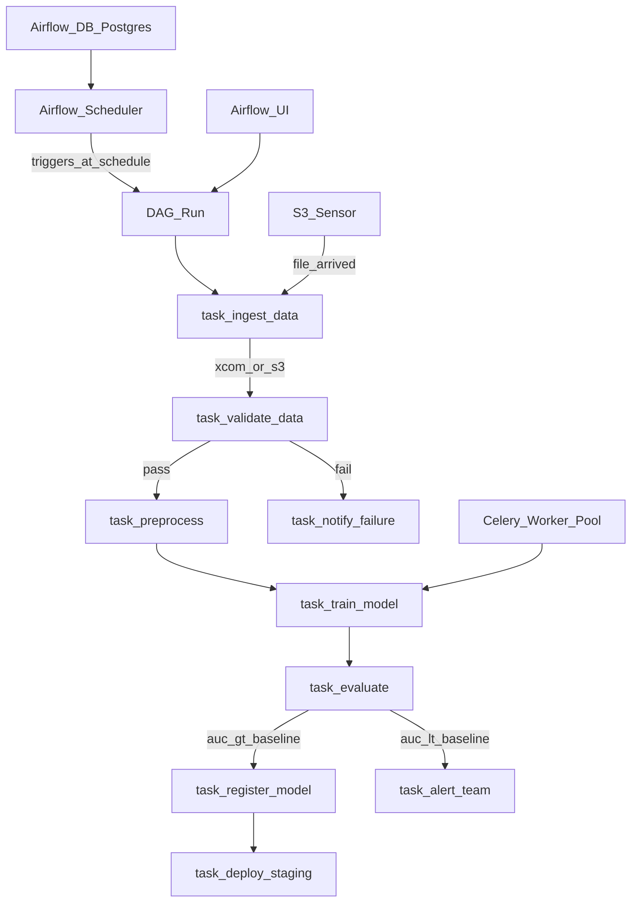

# 🌀 Apache Airflow for ML

> [!abstract] TL;DR
> Apache Airflow is the industry's most battle-tested workflow orchestration tool. You define workflows as Python DAGs (Directed Acyclic Graphs) with operators (PythonOperator, KubernetesPodOperator, BashOperator). Airflow is **general-purpose** — it was built for data pipelines but is widely used for ML workflows. Its key strengths: mature ecosystem, rich scheduling (cron + sensors), backfill capability, and huge community. Key limitation vs Kubeflow: not ML-native (no built-in model registry, hyperparameter search, or model serving integration).

## Intuition — analogy FIRST

Think of Airflow as a **factory shift manager for your data and ML workflows.** The manager:
- Has a **schedule board** (Airflow scheduler) that knows which tasks to run when
- Assigns tasks to **workers** (Celery workers, Kubernetes pods)
- Has a **quality checklist** — if task A fails, task B doesn't start
- Maintains a **history log** of every task ever run (Airflow database)
- Can **backfill** — if the factory was idle last Tuesday, the manager can run all Tuesday's tasks retroactively

Unlike Kubeflow (built for ML specifically), Airflow is a general factory manager. It can coordinate ML training, data ETL, reports, emails, API calls, and infrastructure jobs — all in the same DAG. This generality is both its strength (one tool for everything) and weakness (no ML-specific features built in).

## How It Works — mechanics + valid mermaid

**Core concepts:**

- **DAG (Directed Acyclic Graph):** A Python file in `$AIRFLOW_HOME/dags/`. Each file defines one DAG. Tasks are nodes; dependencies are edges.
- **Operator:** Pre-built task type. `PythonOperator` (run a Python function), `BashOperator` (run shell command), `KubernetesPodOperator` (run in a K8s pod), `DockerOperator` (run in Docker).
- **Task Instance:** One execution of an operator. Has states: `queued`, `running`, `success`, `failed`, `skipped`, `upstream_failed`.
- **XCom (Cross-Communication):** Pass small values (strings, dicts, numbers) between tasks. NOT for large data — use shared storage (S3, GCS) instead.
- **Sensor:** Waits for an external condition (e.g., `S3KeySensor` waits until a file appears in S3 before starting the training task).
- **Backfill:** Re-run all historical DAG runs for a date range. Critical for: fixing bugs in past pipelines, processing late-arriving data.

**Scheduling patterns:**
```
@daily          = 0 0 * * *    (midnight every day)
@weekly         = 0 0 * * 0    (midnight every Sunday)
0 6 * * 1-5     (6am every weekday)
*/15 * * * *    (every 15 minutes)
@once           (run once when deployed)
```

**Airflow vs Kubeflow (when to use which):**

| Use case | Airflow | Kubeflow |
|---|---|---|
| Mixed ML + ETL DAGs | Better | Poor |
| ML-only workflows | OK | Better |
| Hyperparameter tuning | Manual | Built-in (Katib) |
| Complex scheduling (sensors, crons) | Native | Limited |
| K8s pod isolation per task | Via KubernetesPodOperator | Native |
| ML artifact lineage | Manual | Native (MLMD) |



## Code Demo

```python
# pip install apache-airflow apache-airflow-providers-amazon

# ── dags/ml_training_pipeline.py ──────────────────────────────────────────
from datetime import datetime, timedelta
from airflow import DAG
from airflow.operators.python import PythonOperator, BranchPythonOperator
from airflow.operators.bash import BashOperator
from airflow.operators.empty import EmptyOperator
from airflow.providers.amazon.aws.sensors.s3 import S3KeySensor
from airflow.providers.cncf.kubernetes.operators.pod import KubernetesPodOperator
from airflow.utils.dates import days_ago
from kubernetes.client import models as k8s

# ── DEFAULT ARGS (applied to all tasks unless overridden) ──────────────────
default_args = {
    "owner": "ml-team",
    "depends_on_past": False,         # don't depend on previous day's success
    "start_date": days_ago(1),
    "email_on_failure": True,
    "email": ["ml-alerts@company.com"],
    "retries": 2,
    "retry_delay": timedelta(minutes=5),
    "execution_timeout": timedelta(hours=6),
}

# ── DAG DEFINITION ─────────────────────────────────────────────────────────
with DAG(
    dag_id="churn_model_retraining",
    default_args=default_args,
    description="Weekly churn model retraining pipeline",
    schedule_interval="0 2 * * 1",    # Every Monday at 2am
    catchup=False,                    # Don't backfill missed runs
    max_active_runs=1,                # Only one run at a time
    tags=["ml", "churn", "weekly"],
) as dag:

    # ── TASK 1: WAIT FOR DATA ──────────────────────────────────────────────
    wait_for_data = S3KeySensor(
        task_id="wait_for_weekly_data",
        bucket_key="data/raw/customers_{{ ds }}.csv",   # {{ ds }} = execution date
        bucket_name="my-ml-bucket",
        aws_conn_id="aws_default",
        timeout=60 * 60 * 4,          # wait up to 4 hours
        poke_interval=60 * 5,         # check every 5 minutes
        mode="reschedule",            # release worker slot while waiting
    )

    # ── TASK 2: VALIDATE DATA ─────────────────────────────────────────────
    def validate_data_fn(**context):
        """Run Great Expectations validation on the new data file."""
        import great_expectations as gx
        import pandas as pd

        execution_date = context["ds"]
        s3_path = f"s3://my-ml-bucket/data/raw/customers_{execution_date}.csv"

        df = pd.read_csv(s3_path)

        # Basic validations
        assert df.shape[0] > 10_000, f"Too few rows: {df.shape[0]}"
        assert "label" in df.columns, "Missing label column"
        assert df["label"].notna().all(), "Nulls in label column"

        # Push row count to XCom for downstream tasks
        context["task_instance"].xcom_push(key="row_count", value=df.shape[0])
        print(f"Validation passed: {df.shape[0]:,} rows")

    validate_data = PythonOperator(
        task_id="validate_data",
        python_callable=validate_data_fn,
    )

    # ── TASK 3: PREPROCESS (in a K8s pod for isolation) ───────────────────
    preprocess = KubernetesPodOperator(
        task_id="preprocess_features",
        name="preprocess-pod",
        namespace="airflow",
        image="my-registry/ml-preprocessing:v2.1",
        cmds=["python"],
        arguments=[
            "preprocess.py",
            "--input", "s3://my-ml-bucket/data/raw/customers_{{ ds }}.csv",
            "--output", "s3://my-ml-bucket/data/processed/customers_{{ ds }}.parquet",
        ],
        env_vars={
            "AWS_REGION": "us-east-1",
            "EXECUTION_DATE": "{{ ds }}",
        },
        resources=k8s.V1ResourceRequirements(
            requests={"memory": "4Gi", "cpu": "2"},
            limits={"memory": "8Gi", "cpu": "4"},
        ),
        is_delete_operator_pod=True,   # clean up pod after completion
        get_logs=True,
    )

    # ── TASK 4: TRAIN MODEL ────────────────────────────────────────────────
    def train_model_fn(**context):
        """Train model and log to MLflow."""
        import mlflow
        import pandas as pd
        from sklearn.ensemble import GradientBoostingClassifier
        from sklearn.model_selection import train_test_split
        from sklearn.metrics import roc_auc_score

        execution_date = context["ds"]
        data_path = f"s3://my-ml-bucket/data/processed/customers_{execution_date}.parquet"

        df = pd.read_parquet(data_path)
        feature_cols = [c for c in df.columns if c != "label"]
        X, y = df[feature_cols].values, df["label"].values
        X_train, X_test, y_train, y_test = train_test_split(X, y, test_size=0.2)

        mlflow.set_tracking_uri("http://mlflow-server:5000")
        mlflow.set_experiment("churn-weekly-retraining")

        with mlflow.start_run(run_name=f"churn-{execution_date}") as run:
            model = GradientBoostingClassifier(n_estimators=200, max_depth=4)
            model.fit(X_train, y_train)

            auc = roc_auc_score(y_test, model.predict_proba(X_test)[:, 1])
            mlflow.log_metric("val_auc", auc)
            mlflow.log_param("execution_date", execution_date)
            mlflow.sklearn.log_model(model, "model")

            # Push AUC and run ID to XCom for evaluation task
            context["task_instance"].xcom_push(key="val_auc", value=auc)
            context["task_instance"].xcom_push(key="mlflow_run_id", value=run.info.run_id)
            print(f"Training complete. AUC: {auc:.4f}, Run: {run.info.run_id}")

    train_model = PythonOperator(
        task_id="train_model",
        python_callable=train_model_fn,
        execution_timeout=timedelta(hours=4),
    )

    # ── TASK 5: BRANCH ON EVALUATION ──────────────────────────────────────
    def evaluate_and_branch(**context):
        """Branch to 'promote' or 'reject' based on AUC vs baseline."""
        val_auc = context["task_instance"].xcom_pull(
            task_ids="train_model", key="val_auc"
        )
        BASELINE_AUC = 0.88

        if val_auc >= BASELINE_AUC:
            print(f"AUC {val_auc:.4f} >= baseline {BASELINE_AUC}. Promoting model.")
            return "register_and_deploy"
        else:
            print(f"AUC {val_auc:.4f} < baseline {BASELINE_AUC}. Rejecting model.")
            return "alert_model_regression"

    branch_evaluate = BranchPythonOperator(
        task_id="evaluate_model",
        python_callable=evaluate_and_branch,
    )

    # ── TASK 6a: PROMOTE PATH ─────────────────────────────────────────────
    def register_and_deploy_fn(**context):
        """Register model in MLflow Registry and deploy to staging."""
        import mlflow
        mlflow_run_id = context["task_instance"].xcom_pull(
            task_ids="train_model", key="mlflow_run_id"
        )
        client = mlflow.MlflowClient("http://mlflow-server:5000")
        model_uri = f"runs:/{mlflow_run_id}/model"
        registered = mlflow.register_model(model_uri, "churn_detector")
        client.transition_model_version_stage(
            "churn_detector", registered.version, "Staging"
        )
        print(f"Registered model v{registered.version} to Staging")

    register_and_deploy = PythonOperator(
        task_id="register_and_deploy",
        python_callable=register_and_deploy_fn,
    )

    # ── TASK 6b: REJECTION PATH ───────────────────────────────────────────
    alert_model_regression = BashOperator(
        task_id="alert_model_regression",
        bash_command=(
            "curl -X POST $SLACK_WEBHOOK "
            '-d \'{"text": "Churn model retraining failed evaluation gate!"}\''
        ),
        env={"SLACK_WEBHOOK": "{{ var.value.slack_webhook_ml }}"},
    )

    end = EmptyOperator(task_id="end", trigger_rule="none_failed_min_one_success")

    # ── SET TASK DEPENDENCIES ──────────────────────────────────────────────
    wait_for_data >> validate_data >> preprocess >> train_model
    train_model >> branch_evaluate
    branch_evaluate >> [register_and_deploy, alert_model_regression]
    [register_and_deploy, alert_model_regression] >> end
```

```bash
# ── AIRFLOW CLI COMMANDS ────────────────────────────────────────────────────

# List DAGs
airflow dags list

# Test a single task without dependencies
airflow tasks test churn_model_retraining validate_data 2026-01-15

# Trigger DAG manually
airflow dags trigger churn_model_retraining

# Backfill missed runs from Jan 1 to Jan 15
airflow dags backfill churn_model_retraining \
    --start-date 2026-01-01 \
    --end-date 2026-01-15

# View task logs
airflow tasks logs churn_model_retraining train_model 2026-01-15

# Start Airflow standalone (development)
airflow standalone
```

## Real-World Example

**Spotify — Nightly Model Retraining with Airflow**

Spotify uses Airflow to orchestrate 50+ ML model retraining pipelines that run nightly. Their DAGs mix ML training tasks (Python operators) with data preparation tasks (Spark jobs via `DataprocOperator`, `BigQueryOperator`) — a perfect fit for Airflow's generalist design.

Key patterns:
- **Sensor-driven triggers:** When the user interaction data from the previous day finishes processing in BigQuery (detected by `BigQueryTablePartitionExistenceSensor`), the recommendation model retraining pipeline starts automatically
- **Backfill for A/B experiments:** When testing a new feature engineering approach, they backfill 30 days of training runs to generate historical model versions for comparison
- **Failure isolation:** Task retries prevent one flaky external API call from failing the entire 4-hour pipeline

**LinkedIn ML Pipelines:**
LinkedIn's ML teams use Airflow alongside their own internal orchestration. Their `KubernetesPodOperator`-heavy pipelines run each training step in isolated containers with precise resource allocation — similar to Kubeflow but using Airflow's scheduling capabilities they were already familiar with.

## Trade-offs

| Feature | Airflow | Kubeflow | Prefect |
|---|---|---|---|
| **Maturity** | Very high (2014) | Medium (2018) | Medium (2018) |
| **ML-specific features** | Low | Very high | Medium |
| **Scheduling flexibility** | Excellent | Limited | Good |
| **Backfill** | Native, excellent | Limited | Available |
| **Learning curve** | Medium | High | Low |
| **Complexity at scale** | High (distributed setup) | High (K8s ops) | Low (SaaS) |

## When to Use vs Avoid

**Use Airflow when:**
- Already using Airflow for data engineering
- Mixed ML + ETL workflows in same DAG
- Complex scheduling requirements (sensors, dependencies across data sources)
- Large existing Airflow provider ecosystem (AWS, GCP, Spark, etc.)

**Use Kubeflow instead when:**
- ML-only workflows on Kubernetes
- Need built-in hyperparameter tuning and model serving integration

**Use Prefect instead when:**
- Simpler setup is a priority
- Team dislikes Airflow's complexity

## Common Pitfalls

1. **Putting ML training code directly in PythonOperator:** This runs in the Airflow worker process, which may not have GPU access, the right Python environment, or enough memory. Use `KubernetesPodOperator` or `DockerOperator` for isolated training environments.

2. **XCom for large data:** XComs are stored in the Airflow metadata database (Postgres/MySQL). Storing a 1GB DataFrame in XCom will fill the database. Only XCom small values (IDs, paths, metrics). Store actual data in S3/GCS.

3. **`catchup=True` in production:** If `catchup=True` (the default) and your DAG has been paused for 30 days, Airflow will try to run 30 daily DAG runs simultaneously when unpaused. Always set `catchup=False` for ML pipelines unless you explicitly want backfill behavior.

4. **No task timeout:** A training task stuck in an infinite loop will hold a worker slot indefinitely. Always set `execution_timeout=timedelta(hours=N)`.

5. **DAG import errors silently failing:** If your DAG file has a syntax error or import error, Airflow silently marks it as "broken" in the UI. Always check the "Import Errors" section in the Airflow UI after deploying DAG changes.

## Related Concepts

- [[_MOC_MLOps|↑ Section MOC]]

- [[ML_Pipelines_Overview]] — conceptual overview and tool comparison
- [[Kubeflow]] — K8s-native alternative with more ML-specific features
- [[Prefect]] — modern Pythonic alternative with better developer experience
- [[Data_Versioning_DVC]] — DVC handles data versioning; Airflow orchestrates the workflow that uses the data

## Review Questions

1. What is the difference between an Airflow Operator, a Task, and a Task Instance? Give an example of each for a model training workflow.

2. Explain XCom limitations for ML pipelines. Your training task produces a 5GB feature matrix that needs to be used by the evaluation task. How would you pass this data correctly?

3. Your daily retraining DAG has been paused for 2 weeks due to a maintenance window. When you unpause it, what happens with `catchup=True` vs `catchup=False`? Which is correct for a model retraining pipeline and why?

## Sources

- [Apache Airflow Documentation](https://airflow.apache.org/docs/)
- [Airflow GitHub](https://github.com/apache/airflow)
- Spotify Engineering Blog: "Achieving Better Insight with Apache Airflow" (2022)
- [KubernetesPodOperator Guide](https://airflow.apache.org/docs/apache-airflow-providers-cncf-kubernetes/stable/operators.html)
- Harenslak, B. & de Ruiter, J. *Data Pipelines with Apache Airflow.* Manning, 2021.

#mlops #airflow #pipelines #orchestration #dag #workflow #scheduling
