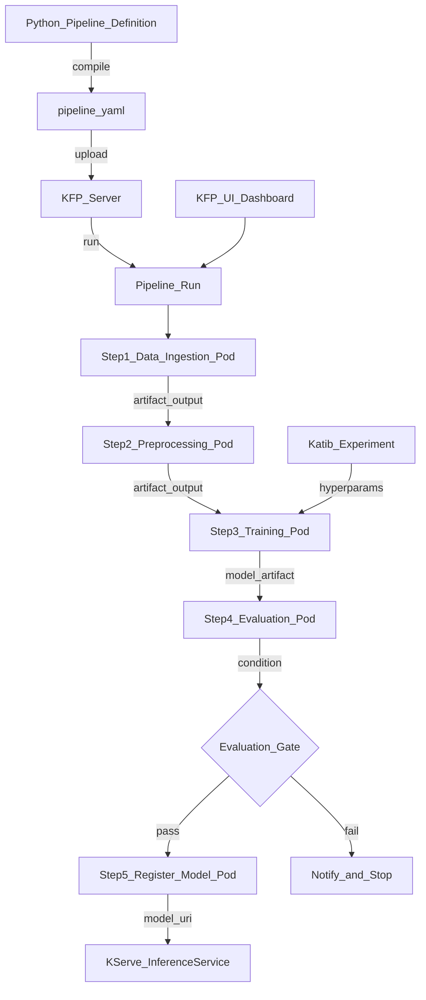

# ☸️ Kubeflow

> [!abstract] TL;DR
> Kubeflow is a Kubernetes-native open-source platform for ML workflows. Its core components: **Pipelines** (DAG-based ML workflow orchestration with Python DSL), **KServe** (standardized model serving on K8s), **Katib** (hyperparameter tuning with Bayesian/grid/random search), and **Training Operators** (distributed TF/PyTorch/MXNet training jobs). Best for organizations already running Kubernetes who need a full MLOps platform. Steeper learning curve than Airflow or Prefect but deeper K8s integration and ML-native features.

## Intuition — analogy FIRST

Kubernetes is the operating system for containerized applications — it orchestrates containers, manages resources, handles failures, and scales workloads across a cluster. Kubeflow is a **ML application layer** built on top of Kubernetes.

Think of it like this: Kubernetes is the postal system (routing, delivery, fleet management). Kubeflow is a specialized courier service for ML workloads built on that postal system. The courier service adds:
- Specialized packaging for ML experiments (pipeline components)
- Quality inspection stations (evaluation steps)
- Automated reordering when experiments run out of supplies (autoscaling, retries)
- A central dispatch board (Kubeflow Pipelines UI)

If you're already running Kubernetes in production (most large companies are), Kubeflow plugs into your existing infrastructure instead of requiring separate orchestration infrastructure.

## How It Works — mechanics + valid mermaid

**Kubeflow component overview:**

| Component | Purpose |
|---|---|
| **Kubeflow Pipelines (KFP)** | ML workflow orchestration, Python DSL |
| **KServe** | Model serving on Kubernetes (InferenceService) |
| **Katib** | Hyperparameter tuning (AutoML) |
| **Training Operators** | TFJob, PyTorchJob, MXNetJob for distributed training |
| **Notebooks** | JupyterHub-based managed notebooks |
| **Central Dashboard** | Unified UI for all components |

**KFP Pipeline structure:**
- **Component:** A containerized function. Input: typed parameters or artifacts. Output: typed parameters or artifacts. Each component runs as a Kubernetes Pod.
- **Pipeline:** A Python function decorated with `@pipeline` that assembles components into a DAG.
- **Run:** One execution of a pipeline with specific input parameters.
- **Experiment:** A grouping of related pipeline runs.

**KFP v2 differences from v1:**
- `kfp.v2.dsl` (v2) uses `Artifact` and `Dataset` types for typed artifacts
- MLMD (ML Metadata) tracks all artifact lineage automatically
- Compatible with Vertex AI Pipelines (GCP) without code changes



## Code Demo

```python
# pip install kfp==2.7.0

import kfp
from kfp import dsl
from kfp.dsl import (
    component, pipeline, Input, Output,
    Dataset, Model, Metrics, Artifact,
)

# ── DEFINE COMPONENTS ──────────────────────────────────────────────────────
# Each @component becomes a containerized function (runs in a K8s Pod)

@component(
    base_image="python:3.11-slim",
    packages_to_install=["pandas", "scikit-learn"],
)
def ingest_data(
    data_uri: str,
    output_dataset: Output[Dataset],
):
    """Ingest raw data and output as a Dataset artifact."""
    import pandas as pd
    df = pd.read_csv(data_uri)
    df.to_csv(output_dataset.path, index=False)
    output_dataset.metadata["n_rows"] = len(df)
    output_dataset.metadata["columns"] = list(df.columns)

@component(
    base_image="python:3.11-slim",
    packages_to_install=["pandas", "scikit-learn"],
)
def preprocess(
    input_dataset: Input[Dataset],
    output_dataset: Output[Dataset],
    test_size: float = 0.2,
):
    """Clean and split data."""
    import pandas as pd
    from sklearn.model_selection import train_test_split

    df = pd.read_csv(input_dataset.path)
    # Feature engineering
    df = df.dropna()
    train, test = train_test_split(df, test_size=test_size, random_state=42)

    # Save both to single CSV (simple approach)
    train.to_csv(output_dataset.path + "_train.csv", index=False)
    test.to_csv(output_dataset.path + "_test.csv", index=False)
    # Note: In production use separate Output[Dataset] for train/test

@component(
    base_image="python:3.11-slim",
    packages_to_install=["pandas", "scikit-learn", "mlflow"],
)
def train_model(
    input_dataset: Input[Dataset],
    n_estimators: int,
    max_depth: int,
    output_model: Output[Model],
    output_metrics: Output[Metrics],
):
    """Train a model and log metrics."""
    import pandas as pd
    import joblib
    from sklearn.ensemble import RandomForestClassifier
    from sklearn.model_selection import train_test_split
    from sklearn.metrics import roc_auc_score

    df = pd.read_csv(input_dataset.path)
    feature_cols = [c for c in df.columns if c != "label"]
    X, y = df[feature_cols].values, df["label"].values
    X_train, X_test, y_train, y_test = train_test_split(X, y, test_size=0.2)

    model = RandomForestClassifier(
        n_estimators=n_estimators,
        max_depth=max_depth,
        random_state=42,
    )
    model.fit(X_train, y_train)

    auc = roc_auc_score(y_test, model.predict_proba(X_test)[:, 1])

    # Log metrics to KFP UI
    output_metrics.log_metric("auc", auc)
    output_metrics.log_metric("n_estimators", n_estimators)
    output_metrics.log_metric("max_depth", max_depth)

    # Save model
    joblib.dump(model, output_model.path + "/model.pkl")
    output_model.metadata["auc"] = auc
    output_model.metadata["framework"] = "scikit-learn"

@component(
    base_image="python:3.11-slim",
    packages_to_install=["pandas", "scikit-learn"],
)
def evaluate_model(
    model: Input[Model],
    test_dataset: Input[Dataset],
    baseline_auc: float,
) -> bool:
    """Return True if model passes the evaluation gate."""
    import pandas as pd
    import joblib

    model_obj = joblib.load(model.path + "/model.pkl")
    df = pd.read_csv(test_dataset.path)
    X, y = df.drop("label", axis=1).values, df["label"].values

    from sklearn.metrics import roc_auc_score
    auc = roc_auc_score(y, model_obj.predict_proba(X)[:, 1])

    print(f"Model AUC: {auc:.4f}, Baseline: {baseline_auc:.4f}")
    return auc >= baseline_auc

# ── DEFINE THE PIPELINE ────────────────────────────────────────────────────
@pipeline(
    name="churn-prediction-pipeline",
    description="End-to-end churn prediction: ingest → preprocess → train → evaluate",
)
def churn_pipeline(
    data_uri: str = "gs://my-bucket/data/customers.csv",
    n_estimators: int = 100,
    max_depth: int = 5,
    baseline_auc: float = 0.85,
):
    # Step 1: Ingest
    ingest_task = ingest_data(data_uri=data_uri)

    # Step 2: Preprocess (depends on ingest output)
    preprocess_task = preprocess(input_dataset=ingest_task.outputs["output_dataset"])

    # Step 3: Train (depends on preprocessing)
    train_task = train_model(
        input_dataset=preprocess_task.outputs["output_dataset"],
        n_estimators=n_estimators,
        max_depth=max_depth,
    )
    # Set resource requirements for training pod
    train_task.set_memory_request("4G").set_cpu_request("2")
    train_task.set_gpu_limit("1")  # request 1 GPU for training

    # Step 4: Evaluate with conditional gate
    eval_task = evaluate_model(
        model=train_task.outputs["output_model"],
        test_dataset=preprocess_task.outputs["output_dataset"],
        baseline_auc=baseline_auc,
    )

    # Conditional: only run registration if evaluation passes
    with dsl.If(eval_task.output == True):
        # Register model in MLflow (would be a separate component)
        print("Model passes gate — would register to Model Registry here")

# ── COMPILE THE PIPELINE ───────────────────────────────────────────────────
kfp.compiler.Compiler().compile(
    pipeline_func=churn_pipeline,
    package_path="churn_pipeline.yaml",
)
print("Pipeline compiled to churn_pipeline.yaml")

# ── SUBMIT VIA PYTHON CLIENT ───────────────────────────────────────────────
# client = kfp.Client(host="http://kubeflow.example.com")
# run = client.create_run_from_pipeline_func(
#     churn_pipeline,
#     arguments={
#         "data_uri": "gs://my-bucket/data/customers_2026_01.csv",
#         "n_estimators": 200,
#         "max_depth": 6,
#     },
#     experiment_name="churn-experiments",
#     run_name="churn-jan-2026",
# )
```

```yaml
# ── KSERVE INFERENCE SERVICE ───────────────────────────────────────────────
# Apply after model is registered: kubectl apply -f inference_service.yaml

apiVersion: serving.kserve.io/v1beta1
kind: InferenceService
metadata:
  name: churn-classifier
  namespace: kubeflow
spec:
  predictor:
    sklearn:
      storageUri: "gs://my-bucket/models/churn/v2.1.0"
      resources:
        requests:
          memory: "1Gi"
          cpu: "100m"
        limits:
          memory: "2Gi"
          cpu: "500m"
```

```bash
# ── KUBECTL COMMANDS ───────────────────────────────────────────────────────
# Check pipeline runs
kubectl get workflows -n kubeflow

# View KServe service
kubectl get inferenceservice -n kubeflow

# Get serving endpoint
kubectl get inferenceservice churn-classifier -n kubeflow -o jsonpath='{.status.url}'
```

## Real-World Example

**Google — Kubeflow as the Foundation of Vertex AI**

Google's Vertex AI Pipelines is built on Kubeflow Pipelines v2. When you use `kfp.v2.dsl` and compile to a Vertex-compatible YAML, you're writing Kubeflow — just deployed on GCP's managed infrastructure instead of your own K8s cluster.

Google's internal ML teams (Search, Maps, YouTube) use Kubeflow-based pipelines for production model training. The ML Metadata (MLMD) store tracks every artifact — dataset, model, evaluation result — with full lineage. This lineage is queryable: "show me all models trained on datasets produced after January 1st" is a MLMD query.

**Enterprise adoption:** Companies running on-premise ML platforms (banks, healthcare) often choose Kubeflow because:
1. It runs on their existing K8s clusters (no new infrastructure)
2. It keeps all data on-premise (compliance with data residency requirements)
3. It's open-source (no vendor lock-in)

## Trade-offs

| Aspect | Kubeflow | Airflow | Prefect |
|---|---|---|---|
| **ML-native** | Very high | Low | Medium |
| **K8s integration** | Native | Via operator | Via K8s block |
| **Setup complexity** | Very high | Medium | Low |
| **Serving integration** | KServe built-in | Manual | Manual |
| **Hyperparameter tuning** | Katib built-in | Manual | Manual |
| **General-purpose** | ML-only | General | General |

## When to Use vs Avoid

**Use Kubeflow when:**
- Organization already operates Kubernetes clusters
- Want a full MLOps platform (pipelines + serving + hyperparameter tuning + notebooks)
- On-premise deployment with data residency requirements
- Need KServe for standardized model serving on K8s

**Use Airflow or Prefect instead when:**
- Team doesn't want to operate Kubernetes
- Pipeline steps are mixed (ML + ETL + reporting)
- Simpler orchestration is acceptable

## Common Pitfalls

1. **Treating KFP as a Jupyter notebook:** KFP components must be self-contained. Importing a local module from your notebook won't work inside a container. All dependencies must be in `packages_to_install` or the `base_image`.

2. **Not pinning component base images:** `base_image="python:3.11"` will pull the latest Python 3.11 patch. Pin to `python:3.11.7` for reproducibility.

3. **Passing large data as parameters:** KFP parameters are strings/ints/floats (serialized to pipeline YAML). Large data must be passed as `Input[Dataset]` artifacts (stored in GCS/MinIO). Passing a DataFrame as a JSON string parameter will break.

4. **Ignoring resource requests:** Without `.set_memory_request("8G")`, training steps get the cluster's default memory (often 512MB). OOM kills will occur silently — the pod just gets killed.

5. **Not using the KFP UI for debugging:** Pipeline failures show up as failed pods. Use `kubectl logs <pod-name> -n kubeflow` and the KFP UI's "View Logs" button to debug component failures.

## Related Concepts

- [[_MOC_MLOps|↑ Section MOC]]

- [[ML_Pipelines_Overview]] — conceptual overview of ML pipeline orchestration
- [[Airflow_for_ML]] — simpler alternative for general ML workflows
- [[Model_Serving_Overview]] — KServe provides K8s-native model serving
- [[Experiment_Tracking_Overview]] — Kubeflow's MLMD tracks artifact lineage; can integrate with MLflow

## Review Questions

1. What is the difference between a KFP `component` and a `pipeline`? How does KFP translate a Python pipeline definition into Kubernetes Pods?

2. Compare Kubeflow's evaluation gate pattern (conditional step with `dsl.If`) to a simpler approach where you just check a metric in a script. What does the pipeline approach give you that the script doesn't?

3. You have a KFP training step that keeps failing with OOM errors. The model trains fine on your laptop with 16GB RAM. Walk through the debugging steps and how you would fix it.

## Sources

- [Kubeflow Documentation](https://www.kubeflow.org/docs/)
- [KFP Python SDK v2](https://www.kubeflow.org/docs/components/pipelines/v2/introduction/)
- [KServe Documentation](https://kserve.github.io/website/)
- [Katib Documentation](https://www.kubeflow.org/docs/components/katib/)
- Google Cloud Blog: "Vertex AI Pipelines: An MLOps workflow built on Kubeflow" (2022)

#mlops #kubeflow #kubernetes #pipelines #kfp #kserve #katib #orchestration
