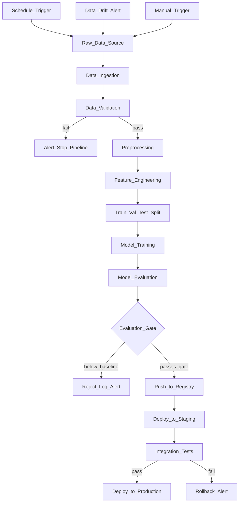

# 🔧 ML Pipelines Overview

> [!abstract] TL;DR
> An ML pipeline is an automated DAG (directed acyclic graph) that takes raw data through every step — data ingestion, validation, feature engineering, training, evaluation, and deployment — without manual intervention. Pipelines enable reproducibility (same code, same results), continuous training (automated retraining on new data), and team collaboration (shared, version-controlled workflows). Key tools: Kubeflow (Kubernetes-native), Airflow (general-purpose, battle-tested), Prefect (modern Pythonic), Vertex Pipelines (GCP-managed), Metaflow (ML-focused).

## Intuition — analogy FIRST

Before automated manufacturing, each car was hand-assembled one at a time. Expert craftsmen built each component individually. The result: inconsistency, high cost, and no ability to scale. Henry Ford's assembly line changed this — a defined sequence of steps, each reliable, reproducible, and scalable.

An ML pipeline is an assembly line for AI:
- Each **station** (pipeline step) does one thing well: data preprocessing, feature engineering, training, evaluation
- The **conveyor belt** (orchestrator) moves outputs from one step to the next automatically
- **Quality control** (validation steps) rejects defective components before they become part of the final product
- **Scheduling** runs the line automatically on a cadence or when triggered by new parts arriving (new data)

Manual ML development is like hand-assembling each car. A pipeline is the assembly line: consistent, scalable, auditable, and able to run overnight without supervision.

## How It Works — mechanics + valid mermaid

**Pipeline anatomy:**

A pipeline is a DAG where:
- **Nodes** = steps (each a containerized unit of work)
- **Edges** = data dependencies (output of step A is input to step B)
- **Orchestrator** = the engine that schedules and runs the DAG

**Step types in a typical ML pipeline:**

1. **Data ingestion** — pull raw data from sources
2. **Data validation** — check schema, stats, distributions (Great Expectations/TFDV)
3. **Preprocessing** — clean, transform, encode
4. **Feature engineering** — compute features
5. **Data split** — train/val/test
6. **Training** — fit model with hyperparameters
7. **Evaluation** — compute metrics on held-out test set
8. **Model validation** — compare against baseline/production model
9. **Push to registry** — if metrics pass gates, register the model
10. **Deployment** — update serving endpoint

**Trigger types:**
- **Scheduled:** Run every day at 2am (Airflow `schedule_interval`)
- **Event-driven:** New data arrived in S3 → trigger pipeline
- **Manual:** `curl -X POST /api/v1/runs` or button in UI
- **Threshold-based:** Data drift detected → trigger retraining

**Pipeline tools comparison:**

| Tool | Paradigm | Infra | ML-specific | Learning curve |
|---|---|---|---|---|
| **Kubeflow Pipelines** | Kubernetes-native | Self-managed K8s | High | High |
| **Apache Airflow** | General workflow | Self-managed | Low-medium | Medium |
| **Prefect** | Pythonic modern | Cloud or self | Medium | Low |
| **Vertex Pipelines** | GCP-managed | Managed | High | Medium |
| **Metaflow** | Python-native | Self or AWS | Very high | Low |
| **SageMaker Pipelines** | AWS-native | Managed | High | Medium |



## Code Demo

```python
# ── MINIMAL PIPELINE PATTERN (framework-agnostic illustration) ─────────────

from dataclasses import dataclass
from typing import Any, Dict
import logging

logger = logging.getLogger(__name__)

@dataclass
class PipelineContext:
    """Shared state passed between pipeline steps."""
    run_id: str
    config: Dict[str, Any]
    artifacts: Dict[str, Any] = None

    def __post_init__(self):
        if self.artifacts is None:
            self.artifacts = {}

def step(name: str):
    """Decorator that logs step execution and handles errors."""
    def decorator(fn):
        def wrapper(ctx: PipelineContext, *args, **kwargs):
            logger.info(f"Starting step: {name}")
            try:
                result = fn(ctx, *args, **kwargs)
                logger.info(f"Completed step: {name}")
                return result
            except Exception as e:
                logger.error(f"Step failed: {name} — {e}")
                raise
        return wrapper
    return decorator

@step("data_ingestion")
def ingest_data(ctx: PipelineContext):
    """Pull data from configured source."""
    import pandas as pd
    df = pd.read_csv(ctx.config["data_path"])
    ctx.artifacts["raw_df"] = df
    logger.info(f"Ingested {len(df):,} rows")

@step("data_validation")
def validate_data(ctx: PipelineContext):
    """Assert data meets quality expectations."""
    df = ctx.artifacts["raw_df"]
    assert df["label"].notna().all(), "Labels contain nulls!"
    assert len(df) > ctx.config.get("min_rows", 1000), "Too few rows"
    logger.info("Data validation passed")

@step("feature_engineering")
def engineer_features(ctx: PipelineContext):
    """Transform raw data into model features."""
    df = ctx.artifacts["raw_df"].copy()
    # Feature engineering logic here
    ctx.artifacts["features_df"] = df

@step("model_training")
def train_model(ctx: PipelineContext):
    """Train model and log to experiment tracker."""
    import mlflow
    from sklearn.ensemble import RandomForestClassifier
    from sklearn.model_selection import train_test_split

    df = ctx.artifacts["features_df"]
    feature_cols = ctx.config["feature_cols"]
    X, y = df[feature_cols].values, df["label"].values
    X_train, X_test, y_train, y_test = train_test_split(X, y, test_size=0.2)

    with mlflow.start_run(run_name=ctx.run_id):
        mlflow.log_params(ctx.config.get("model_params", {}))
        model = RandomForestClassifier(**ctx.config.get("model_params", {}))
        model.fit(X_train, y_train)

        from sklearn.metrics import roc_auc_score
        auc = roc_auc_score(y_test, model.predict_proba(X_test)[:, 1])
        mlflow.log_metric("auc", auc)

        ctx.artifacts["model"] = model
        ctx.artifacts["metrics"] = {"auc": auc}
        ctx.artifacts["run_id"] = mlflow.active_run().info.run_id

@step("evaluation_gate")
def evaluation_gate(ctx: PipelineContext):
    """Only proceed if model beats baseline."""
    baseline_auc = ctx.config.get("baseline_auc", 0.80)
    model_auc = ctx.artifacts["metrics"]["auc"]

    if model_auc < baseline_auc:
        raise ValueError(
            f"Model AUC {model_auc:.4f} below baseline {baseline_auc:.4f}. "
            f"Pipeline stopped."
        )
    logger.info(f"Evaluation gate passed: AUC {model_auc:.4f} >= {baseline_auc:.4f}")

def run_pipeline(config: Dict[str, Any]) -> PipelineContext:
    """Run the full ML pipeline."""
    import uuid
    ctx = PipelineContext(run_id=str(uuid.uuid4()), config=config)

    steps = [
        ingest_data,
        validate_data,
        engineer_features,
        train_model,
        evaluation_gate,
    ]

    for pipeline_step in steps:
        pipeline_step(ctx)

    return ctx

# ── PIPELINE COMPARISON: WHICH TOOL FOR WHICH SCENARIO? ───────────────────
PIPELINE_DECISION_GUIDE = """
Use KUBEFLOW when:
  - Full MLOps platform on Kubernetes
  - Need KFServing for serving integration
  - Team already operates K8s clusters
  - Want Katib for hyperparameter tuning built-in

Use AIRFLOW when:
  - Already using Airflow for data pipelines
  - Complex scheduling requirements (custom crons, sensors)
  - Mix of ML and non-ML workflow steps
  - Large existing Airflow ecosystem (operators, hooks)

Use PREFECT when:
  - Prefer Pythonic code with @flow/@task decorators
  - Small-to-medium team, prioritize developer experience
  - Want SaaS (Prefect Cloud) without K8s setup
  - Need good local → cloud parity

Use VERTEX PIPELINES when:
  - GCP ecosystem (BigQuery, Vertex AI, Cloud Storage)
  - Want fully managed (no infrastructure to operate)
  - GDPR compliance with GCP data residency

Use METAFLOW when:
  - AWS-native, Netflix-style workflow patterns
  - R&D workflows that promote to production
  - Want to run same code locally and on AWS Batch/Step Functions
"""
print(PIPELINE_DECISION_GUIDE)
```

## Real-World Example

**Google — Vertex Pipelines for Production ML**

Google's internal ML teams use Vertex Pipelines (KFP under the hood) for every production model. A YouTube recommendations retraining pipeline:
1. **Data ingestion:** Pull 7 days of watch history from BigQuery (~100TB)
2. **Feature computation:** Run Dataflow job to compute user/video embeddings
3. **Training:** Distributed training on TPUs via Vertex Training
4. **Evaluation:** Compute NDCG and coverage metrics; compare against production
5. **Conditional deployment:** Only deploy if all metrics improve by at least 0.1%
6. **Monitoring:** Deploy Evidently drift checks for the new model

This pipeline runs automatically on a weekly schedule. The team doesn't manually kick off training runs — the pipeline does it, logs everything, and only notifies the team if a gate fails.

**Spotify — Nightly Retraining:**
Spotify's recommendation models retrain nightly via an internal Airflow-based orchestration system. 50+ models run in a dependency chain — some models depend on embeddings computed by earlier models. Airflow's sensor operators detect when upstream outputs are ready before triggering downstream training.

## Trade-offs

| Tool | Managed | K8s Required | Python-first | ML-native | Cost |
|---|---|---|---|---|---|
| Kubeflow | No | Yes | No | Yes | Infra ops |
| Airflow | No/Cloud | No | Partial | No | Infra ops |
| Prefect | SaaS option | No | Yes | Partial | SaaS fee |
| Vertex | Yes | No (GCP) | Yes | Yes | GCP pricing |
| Metaflow | No/AWS | No | Yes | Yes | AWS costs |

## When to Use vs Avoid

**Use full pipeline orchestration when:**
- Models retrain more than once a quarter
- Multiple steps need to share data dependencies
- Team size >3 ML engineers (coordination needed)
- Compliance requires audit trail of every training run

**Use simpler tooling (cron + scripts) when:**
- Single model, simple workflow, small team
- Retraining is infrequent (<monthly) and manual is acceptable
- Pipeline overhead exceeds the complexity of the actual ML task

## Common Pitfalls

1. **Over-engineering early:** Building a Kubeflow pipeline for a model that retrains monthly is overkill. Start with simple scripts + cron, migrate to a pipeline when complexity demands it.

2. **Not treating pipeline code as production code:** Pipelines are code. They need tests, code review, and versioning. A broken pipeline is a production incident.

3. **Ignoring step idempotency:** If a pipeline step fails halfway, can it restart without corrupting intermediate outputs? Design steps to be idempotent (same input → same output, re-runnable safely).

4. **No evaluation gates:** A pipeline that always promotes models regardless of metrics will deploy degraded models. Always compare against the current production model.

5. **Forgetting to version pipeline code:** The model is in the registry with a version. The pipeline code that trained it must also be versioned (git commit). Otherwise you can't reproduce the training.

## Related Concepts

- [[_MOC_MLOps|↑ Section MOC]]

- [[Kubeflow]] — deep dive on Kubernetes-native ML pipelines
- [[Airflow_for_ML]] — using Apache Airflow for ML orchestration
- [[Prefect]] — modern Pythonic alternative to Airflow
- [[Data_Versioning_DVC]] — DVC's `dvc.yaml` is a simple pipeline for data-centric workflows
- [[Experiment_Tracking_Overview]] — each pipeline run should log to an experiment tracker

## Review Questions

1. What is a DAG and why is it the natural representation for an ML pipeline? Can a pipeline have a cycle? What would that mean?

2. Compare event-driven pipeline triggers (new data → run pipeline) to scheduled triggers (run every Monday at 2am). What are the trade-offs, and can you use both simultaneously?

3. Your ML pipeline has 7 steps and takes 4 hours to run. Step 5 (training) fails due to an OOM error. How do you design the pipeline so that a retry doesn't have to re-run the first 4 steps?

## Sources

- Huyen, Chip. *Designing Machine Learning Systems*. O'Reilly, 2022. Chapter 10.
- [Kubeflow Pipelines Documentation](https://www.kubeflow.org/docs/components/pipelines/)
- [Apache Airflow Documentation](https://airflow.apache.org/docs/)
- [Prefect Documentation](https://docs.prefect.io/)
- Google Cloud Blog: "Vertex Pipelines: Serverless ML Pipelines on GCP" (2022)

#mlops #pipelines #orchestration #dag #automation #kubeflow #airflow #prefect
