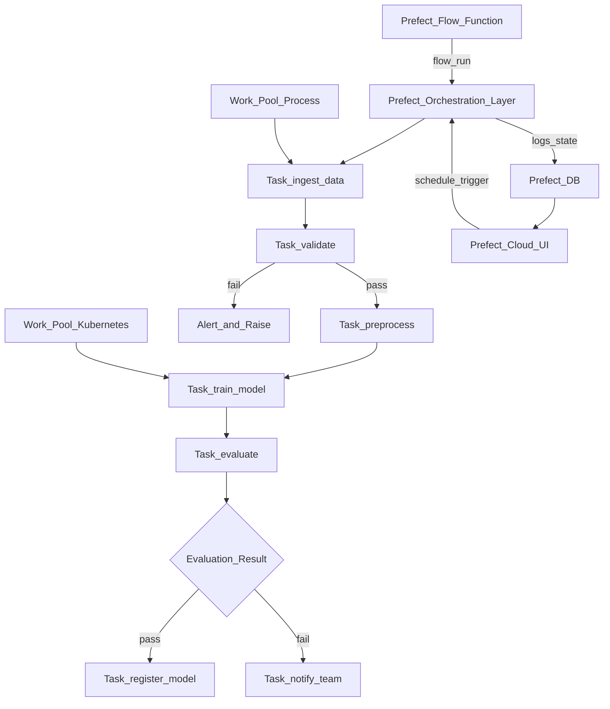

# 🌊 Prefect

> [!abstract] TL;DR
> Prefect is a modern Python-native workflow orchestration tool that fixes Airflow's developer experience pain points. Flows are plain Python functions decorated with `@flow`; tasks are `@task`. No DAG file structure, no separate scheduler process for local runs, full native async support, and first-class infrastructure management via Work Pools. Prefect Cloud is the managed SaaS option. Key strength: rapid prototyping with local execution that deploys to production unchanged — the same `@flow` function runs locally and on Kubernetes.

## Intuition — analogy FIRST

Airflow was built in 2014 when infrastructure-as-code was the paradigm: define your workflows in declarative YAML-like structures, separate the orchestration from the logic, configure everything explicitly. It's powerful but feels like filing tax returns — correct, but tedious.

Prefect is the modern rewrite. It says: **your workflow IS your Python code.** No separate DAG file structure, no boilerplate, no YAML configuration files for simple things.

Think of the difference between writing a test in pytest vs writing a test in a legacy testing framework:
- Legacy: register test class, extend BaseTestCase, register in test manifest, configure test runner separately
- pytest: `def test_something(): assert 1 + 1 == 2` — it just works

Prefect is pytest for ML workflows. Add `@flow` and `@task` decorators to your existing Python functions. Run them locally. They're automatically distributed, retried, logged, and observable in production. Your ML training code doesn't need to change to get orchestration superpowers.

## How It Works — mechanics + valid mermaid

**Core abstractions:**

- **`@flow`:** Decorates the top-level function. Manages state, retries, logging, and observability. Can call tasks and other sub-flows.
- **`@task`:** Decorates individual steps. Has: `retries`, `retry_delay_seconds`, `cache_key_fn` (memoize results), `timeout_seconds`.
- **`Flow Run`:** One execution of a flow with specific parameters.
- **`Deployment`:** A server-side configuration that links a flow to a schedule, infrastructure (Work Pool), and parameters. Created by `flow.serve()` or `prefect deploy`.
- **`Work Pool`:** Infrastructure target. Types: `process` (local), `kubernetes`, `ecs`, `cloud-run`. Workers poll the pool for scheduled flow runs.
- **`Artifact`:** Rich output logged to Prefect Cloud: tables, markdown, images, links.

**Key advantages over Airflow:**

1. **Local execution:** `python my_flow.py` runs the entire flow locally, identically to production. Airflow requires the full scheduler/worker setup even for testing.
2. **Native async:** `async def` flows and tasks work natively — better resource utilization for I/O-bound workflows.
3. **Dynamic DAGs:** Task creation inside Python loops naturally creates dynamic DAG structures. Airflow's dynamic DAGs are complex workarounds.
4. **No `execution_date` weirdness:** Airflow's `execution_date` (the start of the *previous* interval) is famously confusing. Prefect runs at the scheduled time without this abstraction.



## Code Demo

```python
# pip install prefect prefect-aws prefect-kubernetes

import prefect
from prefect import flow, task, get_run_logger
from prefect.artifacts import create_markdown_artifact, create_table_artifact
from prefect.tasks import task_input_hash
from prefect.blocks.system import Secret
from datetime import timedelta
from typing import Optional
import pandas as pd
import numpy as np

# ── TASKS ─────────────────────────────────────────────────────────────────

@task(
    name="ingest-training-data",
    retries=3,
    retry_delay_seconds=30,
    timeout_seconds=300,
    log_prints=True,
)
def ingest_data(data_uri: str) -> pd.DataFrame:
    """Pull training data from S3 or local path."""
    logger = get_run_logger()
    logger.info(f"Loading data from {data_uri}")
    df = pd.read_csv(data_uri)
    logger.info(f"Loaded {len(df):,} rows, {df.shape[1]} columns")
    return df

@task(
    name="validate-data",
    log_prints=True,
)
def validate_data(df: pd.DataFrame) -> pd.DataFrame:
    """Assert data quality before training."""
    logger = get_run_logger()

    issues = []
    if "label" not in df.columns:
        issues.append("Missing 'label' column")
    if df["label"].isna().any():
        issues.append(f"{df['label'].isna().sum()} nulls in label")
    if len(df) < 1000:
        issues.append(f"Too few rows: {len(df)}")

    if issues:
        raise ValueError(f"Data validation failed: {'; '.join(issues)}")

    logger.info(f"Validation passed: {len(df):,} rows, "
                f"{df['label'].value_counts().to_dict()}")
    return df

@task(
    name="preprocess-features",
    # Cache result for 24 hours if input hasn't changed
    cache_key_fn=task_input_hash,
    cache_expiration=timedelta(hours=24),
)
def preprocess(df: pd.DataFrame) -> tuple[np.ndarray, np.ndarray]:
    """Feature engineering and encoding."""
    from sklearn.preprocessing import StandardScaler

    feature_cols = [c for c in df.columns if c != "label"]
    X = df[feature_cols].fillna(0).values
    y = df["label"].values

    scaler = StandardScaler()
    X_scaled = scaler.fit_transform(X)
    return X_scaled, y

@task(
    name="train-model",
    retries=1,
    timeout_seconds=3600,
    log_prints=True,
)
def train_model(
    X: np.ndarray,
    y: np.ndarray,
    n_estimators: int = 100,
    max_depth: int = 5,
) -> dict:
    """Train model and return metrics + model object."""
    import mlflow
    from sklearn.ensemble import RandomForestClassifier
    from sklearn.model_selection import train_test_split
    from sklearn.metrics import roc_auc_score, accuracy_score

    logger = get_run_logger()
    X_train, X_test, y_train, y_test = train_test_split(X, y, test_size=0.2)

    mlflow.set_tracking_uri("http://mlflow-server:5000")
    with mlflow.start_run(run_name=f"rf-n{n_estimators}-d{max_depth}") as run:
        mlflow.log_params({"n_estimators": n_estimators, "max_depth": max_depth})

        model = RandomForestClassifier(n_estimators=n_estimators,
                                       max_depth=max_depth, n_jobs=-1)
        model.fit(X_train, y_train)

        metrics = {
            "val_auc": roc_auc_score(y_test, model.predict_proba(X_test)[:, 1]),
            "val_accuracy": accuracy_score(y_test, model.predict(X_test)),
        }
        mlflow.log_metrics(metrics)
        mlflow.sklearn.log_model(model, "model")

        result = {
            "metrics": metrics,
            "run_id": run.info.run_id,
            "model": model,
        }

    logger.info(f"Training complete: {metrics}")
    return result

@task(name="evaluate-and-gate")
def evaluate_and_gate(training_result: dict, baseline_auc: float) -> bool:
    """Return True if model passes evaluation gate."""
    auc = training_result["metrics"]["val_auc"]
    passed = auc >= baseline_auc
    get_run_logger().info(
        f"Evaluation: AUC={auc:.4f}, baseline={baseline_auc:.4f}, passed={passed}"
    )
    return passed

# ── FLOW ───────────────────────────────────────────────────────────────────
@flow(
    name="churn-model-retraining",
    description="Weekly churn model retraining pipeline",
    log_prints=True,
    # Send alert email on failure (requires email block configured)
    # on_failure=[send_failure_notification],
)
def churn_retraining_flow(
    data_uri: str = "s3://my-bucket/data/customers_latest.csv",
    n_estimators: int = 200,
    max_depth: int = 5,
    baseline_auc: float = 0.88,
    dry_run: bool = False,
):
    """
    End-to-end churn retraining: ingest → validate → preprocess → train → gate.
    """
    logger = get_run_logger()

    # Run tasks (dependency graph is inferred from return value passing)
    raw_df = ingest_data(data_uri)
    validated_df = validate_data(raw_df)
    X, y = preprocess(validated_df)
    training_result = train_model(X, y, n_estimators=n_estimators, max_depth=max_depth)
    passed = evaluate_and_gate(training_result, baseline_auc)

    # Create a rich artifact in Prefect Cloud UI
    metrics = training_result["metrics"]
    create_markdown_artifact(
        key="training-results",
        markdown=f"""
# Training Results

| Metric | Value |
|--------|-------|
| Val AUC | {metrics['val_auc']:.4f} |
| Val Accuracy | {metrics['val_accuracy']:.4f} |
| Baseline AUC | {baseline_auc:.4f} |
| Gate Passed | {'✓' if passed else '✗'} |
| MLflow Run | {training_result['run_id']} |
""",
        description="Churn model training results",
    )

    if passed and not dry_run:
        logger.info("Evaluation gate passed. Registering model.")
        # register_model_task(training_result["run_id"])  # add registration task
    elif not passed:
        logger.warning("Evaluation gate FAILED. Model not promoted.")
        # send_slack_alert("Churn model failed evaluation gate")

    return {"passed": passed, "metrics": metrics}

# ── RUN LOCALLY ────────────────────────────────────────────────────────────
if __name__ == "__main__":
    result = churn_retraining_flow(
        data_uri="data/sample_customers.csv",
        n_estimators=50,
        dry_run=True,
    )
    print(f"Flow completed: {result}")

# ── DEPLOY TO PREFECT CLOUD ────────────────────────────────────────────────
# Method 1: serve() for long-running deployment (development/simple)
# churn_retraining_flow.serve(
#     name="churn-weekly",
#     cron="0 2 * * 1",          # every Monday at 2am
#     parameters={"data_uri": "s3://my-bucket/data/customers_latest.csv"},
# )

# Method 2: deploy() for Kubernetes work pool (production)
# from prefect.deployments import Deployment
# from prefect.infrastructure import KubernetesJob
#
# deployment = Deployment.build_from_flow(
#     flow=churn_retraining_flow,
#     name="churn-weekly-k8s",
#     work_pool_name="kubernetes-pool",
#     cron="0 2 * * 1",
#     job_variables={
#         "image": "my-registry/ml-training:v2.1",
#         "memory": "8Gi",
#         "cpu": "2",
#     },
# )
# deployment.apply()
```

```bash
# ── PREFECT CLI ───────────────────────────────────────────────────────────
# Start Prefect server (self-hosted)
prefect server start

# Login to Prefect Cloud
prefect cloud login --key pnu_YOUR_API_KEY

# View flow runs
prefect flow-run ls

# Deploy flow (reads prefect.yaml)
prefect deploy

# Start a worker for a work pool
prefect worker start --pool "kubernetes-pool"

# Trigger a flow run manually
prefect deployment run "churn-model-retraining/churn-weekly"

# View deployment status
prefect deployment ls
```

## Real-World Example

**Modern ML Teams Choosing Prefect Over Airflow**

The typical Prefect adoption story: a team starts with Airflow, struggles with:
- Complex DAG syntax for dynamic workflows
- Long iteration cycles (deploy DAG → wait for scheduler to pick it up → test)
- Airflow's `execution_date` semantic confusion
- Difficulty testing individual tasks locally

They migrate to Prefect and find:
- `python my_flow.py` works immediately, no scheduler setup
- `@task` wraps existing functions, minimal code change
- Prefect Cloud provides a clean UI without operating a Postgres database + Redis + Celery
- Dynamic task patterns (running 10 model variants in parallel via a loop) are natural Python

**Real patterns:**
A startup with 5 data scientists and 1 ML engineer uses Prefect Cloud (SaaS). Each data scientist writes `@flow` functions for their experiments. The ML engineer creates deployments with weekly schedules. The entire infrastructure is managed by Prefect Cloud — no Kubernetes, no Redis, no database to maintain.

**Scale example (Prefect 2.x):**
A mid-size e-commerce company runs 20 ML retraining flows per day, each spawning 50-100 task runs. Prefect Cloud handles the scheduling; a small Kubernetes work pool runs the actual compute. Total infrastructure: 3 K8s pods for the worker pool + Prefect Cloud subscription.

## Trade-offs

| Feature | Prefect | Airflow | Kubeflow |
|---|---|---|---|
| **Developer experience** | Excellent | Poor-Medium | Poor-Medium |
| **Learning curve** | Low | Medium | High |
| **Local execution** | Excellent (no setup) | Complex (minikube) | Complex (K8s) |
| **Maturity** | Medium (2018) | Very high (2014) | Medium (2018) |
| **ML-native** | Medium | Low | Very high |
| **Managed SaaS** | Yes (Prefect Cloud) | Astronomer, MWAA | No (Vertex AI) |
| **Community** | Large, growing | Very large | Medium |

## When to Use vs Avoid

**Use Prefect when:**
- Team values developer experience over maximum configurability
- Rapid prototyping is important (local → cloud with no code change)
- Small-to-medium team without dedicated infrastructure engineers
- SaaS is acceptable (Prefect Cloud removes operational burden)
- Dynamic task patterns (parameter sweeps, fan-out/fan-in)

**Use Airflow when:**
- Already heavily invested in Airflow ecosystem
- Complex scheduling with sensors across many data sources
- Large team with existing Airflow expertise
- Mix of ML + data engineering + reporting in same DAGs

**Use Kubeflow when:**
- ML-only workflows on Kubernetes with native model serving integration

## Common Pitfalls

1. **Passing large DataFrames between tasks:** Like Airflow XCom, Prefect serializes task return values. A 10GB DataFrame returned from a task causes serialization overhead and memory issues. Use S3 paths instead — tasks read/write to S3, pass paths as return values.

2. **Not setting `task_runner` for parallel tasks:** By default, tasks run sequentially. For parallel execution, use `ConcurrentTaskRunner` (async) or `DaskTaskRunner` (distributed).

3. **Using `flow.serve()` in production:** `flow.serve()` runs in a single process and blocks. For production, use `flow.deploy()` with a Work Pool backed by Kubernetes or ECS.

4. **Forgetting `log_prints=True`:** Regular `print()` statements are not captured by Prefect's logger by default. Add `log_prints=True` to your `@flow` decorator to capture them.

5. **Not testing flows with `prefect.testing.utilities`:** Flows can be tested locally without Prefect infrastructure using `prefect.testing.utilities.prefect_test_harness()`. Not using this means slow integration tests.

## Related Concepts

- [[_MOC_MLOps|↑ Section MOC]]

- [[ML_Pipelines_Overview]] — Prefect in the context of the broader orchestration landscape
- [[Airflow_for_ML]] — the incumbent alternative; comparison guide
- [[Kubeflow]] — K8s-native, ML-specific alternative
- [[Experiment_Tracking_Overview]] — Prefect flows kick off training runs tracked in MLflow/W&B

## Review Questions

1. Compare how a data scientist would debug a failing task in Prefect vs Airflow. What specific developer experience advantages does Prefect offer for the iteration cycle?

2. You want to run hyperparameter search with 50 combinations (n_estimators × max_depth grid) in parallel using Prefect. Write the `@flow` function structure that spawns 50 parallel `@task` calls and collects their results.

3. Your Prefect flow needs to process 1,000 CSV files from S3, one task per file. What Work Pool type would you choose, how would you control parallelism to avoid overwhelming the downstream database, and how would you handle individual file failures without failing the entire flow?

## Sources

- [Prefect Documentation](https://docs.prefect.io/)
- [Prefect GitHub](https://github.com/PrefectHQ/prefect)
- Prefect Blog: "Why We Rebuilt Prefect from Scratch" (2021)
- Prefect Blog: "Comparing Prefect and Airflow" (2023)
- [Prefect Cloud Documentation](https://docs.prefect.io/latest/cloud/)

#mlops #prefect #pipelines #orchestration #python #workflow #prefect-cloud
