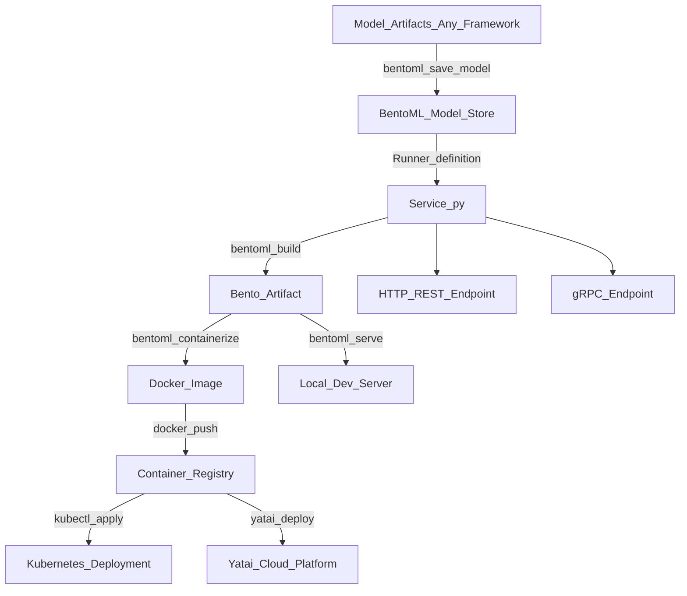

# 📦 BentoML

> [!abstract] TL;DR
> BentoML is a Python-first framework for packaging, serving, and deploying ML models. A `Service` defines your API logic; a `Runner` abstracts the model backend (framework-agnostic); `bentoml build` produces a `Bento` — a self-contained, versioned artifact with model + code + dependencies. `bentoml containerize` wraps it in Docker. Yatai is the enterprise cloud deployment layer. BentoML's killer feature: consistent serving regardless of whether the model is sklearn, PyTorch, TF, or XGBoost.

## Intuition — analogy FIRST

BentoML is Docker — but for ML models specifically.

Docker packages an application with its dependencies (OS, libraries, config) into a portable container image that runs identically everywhere. The big win: "it works on my machine" becomes "it works everywhere."

BentoML does the same thing for ML models. A `Bento` packages:
- The trained model weights (any framework)
- The Python serving code (API logic)
- All dependencies (requirements.txt, conda env)
- The API schema (input/output types)

into a single artifact that can be:
- Run locally for development
- Containerized for Kubernetes
- Deployed to Yatai (BentoML's cloud layer)
- Shared across teams

The problem BentoML solves: a data scientist packages a PyTorch model one way, an XGBoost model a different way, and a Transformer model yet another way. BentoML gives one consistent pattern for all of them. The DevOps team receives a `Bento` and doesn't need to know what framework it uses.

## How It Works — mechanics + valid mermaid

**Core abstractions:**

- **`Runner`:** Abstracts a model and its batching/concurrency configuration. You define how the model runs; BentoML manages worker processes, adaptive batching, and resource allocation.
- **`Service`:** Defines the HTTP/gRPC API. Routes incoming requests, calls Runners, returns responses. Uses Pydantic for validation.
- **`Bento`:** The build artifact. `bentoml build` creates it. Immutable, versioned.
- **`bentoml containerize`:** Wraps a Bento in a production Docker image.
- **`bentoml serve`:** Starts a development server directly from a Bento or service definition.

**Adaptive batching:** BentoML's runner automatically batches incoming requests within a configurable time window. Unlike manual batching, it adapts to incoming request rates. High traffic → larger batches. Low traffic → immediate dispatch. No code changes needed.



## Code Demo

```python
# pip install bentoml scikit-learn pandas

# ── STEP 1: SAVE MODEL TO BENTOML STORE ───────────────────────────────────
import bentoml
from sklearn.ensemble import RandomForestClassifier
from sklearn.datasets import load_iris
import numpy as np

# Train model
X, y = load_iris(return_X_y=True)
model = RandomForestClassifier(n_estimators=100, random_state=42)
model.fit(X, y)

# Save to BentoML model store (local ~/.bentoml/models/)
saved_model = bentoml.sklearn.save_model(
    "iris_classifier",
    model,
    signatures={
        "predict": {"batchable": True, "batch_dim": 0},
        "predict_proba": {"batchable": True, "batch_dim": 0},
    },
    metadata={
        "accuracy": 0.973,
        "dataset": "iris",
        "framework": "sklearn",
    },
    labels={"team": "ml-platform", "project": "iris"},
)
print(f"Model saved: {saved_model.tag}")
# iris_classifier:7d3f892a1b2c4e6f

# ── STEP 2: DEFINE THE SERVICE ────────────────────────────────────────────
# service.py

import bentoml
from bentoml.io import NumpyNdarray, JSON, PandasDataFrame
from pydantic import BaseModel
from typing import List
import numpy as np

# Load the model as a Runner
iris_runner = bentoml.sklearn.get("iris_classifier:latest").to_runner()

# Define the service with the runner
svc = bentoml.Service("iris_classifier_service", runners=[iris_runner])

# ── ENDPOINT 1: numpy input/output ────────────────────────────────────────
@svc.api(input=NumpyNdarray(shape=(-1, 4), dtype=np.float32), output=NumpyNdarray())
async def classify(input_data: np.ndarray) -> np.ndarray:
    """Classify iris species from 4-dimensional feature array."""
    return await iris_runner.predict.async_run(input_data)

# ── ENDPOINT 2: JSON with Pydantic validation ──────────────────────────────
class IrisFeatures(BaseModel):
    sepal_length: float
    sepal_width: float
    petal_length: float
    petal_width: float

class IrisPrediction(BaseModel):
    species: str
    species_id: int
    probabilities: List[float]

SPECIES_NAMES = ["setosa", "versicolor", "virginica"]

@svc.api(input=JSON(pydantic_model=IrisFeatures), output=JSON(pydantic_model=IrisPrediction))
async def classify_json(features: IrisFeatures) -> IrisPrediction:
    """Classify iris with JSON input and structured output."""
    arr = np.array([[
        features.sepal_length, features.sepal_width,
        features.petal_length, features.petal_width,
    ]], dtype=np.float32)

    species_id = int(await iris_runner.predict.async_run(arr))
    probs = (await iris_runner.predict_proba.async_run(arr))[0].tolist()

    return IrisPrediction(
        species=SPECIES_NAMES[species_id],
        species_id=species_id,
        probabilities=probs,
    )

# ── STEP 3: BUILD THE BENTO ───────────────────────────────────────────────
# bentofile.yaml (declarative build config)
BENTOFILE_YAML = """
service: "service:svc"           # module:service_variable
name: iris-classifier-bento
labels:
  owner: ml-team
  project: iris

include:
  - "service.py"

python:
  packages:
    - scikit-learn==1.4.0
    - numpy==1.26.3
    - pandas==2.1.4
"""
# Save to bentofile.yaml, then run: bentoml build

# ── STEP 4: SERVE LOCALLY ─────────────────────────────────────────────────
# bentoml serve service:svc --reload   (development)
# bentoml serve iris-classifier-bento:latest  (from built bento)

# ── STEP 5: CONTAINERIZE ─────────────────────────────────────────────────
# bentoml containerize iris-classifier-bento:latest
# docker run -p 3000:3000 iris-classifier-bento:latest

# ── CALLING THE API ────────────────────────────────────────────────────────
# Default port is 3000 (not 8080)
```

```bash
# Install and basic workflow
pip install bentoml

# Save model (from Python)
python save_model.py

# Start development server
bentoml serve service:svc --reload

# Build Bento artifact
bentoml build

# List built bentos
bentoml list

# Containerize
bentoml containerize iris-classifier-bento:latest

# Tag and push to registry
docker tag iris-classifier-bento:latest my-registry/iris:v2.1.0
docker push my-registry/iris:v2.1.0

# Test the serving endpoint
curl -X POST http://localhost:3000/classify_json \
  -H "Content-Type: application/json" \
  -d '{"sepal_length": 5.1, "sepal_width": 3.5, "petal_length": 1.4, "petal_width": 0.2}'

# View auto-generated API docs: http://localhost:3000/docs
```

## Real-World Example

**Multi-Framework ML Platform Teams**

BentoML's primary value proposition is serving diverse model types with one consistent pattern. A platform team at a mid-size tech company (10-50 data scientists) has this problem:

- Team A ships a PyTorch NLP model
- Team B ships an XGBoost tabular model
- Team C ships a TensorFlow CV model
- Team D ships a LightGBM ranking model

Without BentoML, the DevOps team has to learn 4 different serving patterns, 4 different ways to containerize, and 4 different dependency management approaches.

With BentoML, each team hands the platform team a `Bento` artifact. The deployment pipeline is identical for all of them: `bentoml containerize <bento> → docker push → kubectl apply`. The platform team doesn't need to know what's inside.

**Production pattern — e-commerce recommendation:** A company serves a two-stage recommendation pipeline: (1) candidate generation with PyTorch neural network, (2) re-ranking with LightGBM. BentoML composes them as two Runners behind one Service, with adaptive batching on the neural network Runner (GPU) and sync serving on LightGBM (CPU). One Bento contains the entire pipeline.

## Trade-offs

| Aspect | BentoML | FastAPI | Triton |
|---|---|---|---|
| **Learning curve** | Low-medium | Low | High |
| **Framework agnosticism** | Excellent | Framework-agnostic manually | Requires export |
| **Adaptive batching** | Built-in | Manual | Dynamic batching (GPU) |
| **Containerization** | One command | Dockerfile manual | Docker with Triton image |
| **Deployment** | Yatai or manual | Manual | Manual |
| **GPU optimization** | Good (Triton backend) | Poor | Excellent |
| **Community** | Growing | Very large | NVIDIA-backed |

## When to Use vs Avoid

**Use BentoML when:**
- Multiple model frameworks need consistent serving (sklearn + PyTorch + XGBoost)
- You want one-command containerization without writing Dockerfiles
- Adaptive batching is useful but you don't need TensorRT-level optimization
- Team values rapid packaging over maximum performance tuning

**Use FastAPI instead when:**
- Simple single-model service, full control desired
- Team already has FastAPI expertise

**Use Triton instead when:**
- Maximum GPU throughput is the priority
- TensorRT optimization required
- >50,000 RPS per model

## Common Pitfalls

1. **Calling runners synchronously:** `iris_runner.predict.run(data)` blocks the event loop. Use `await iris_runner.predict.async_run(data)` in async endpoints.

2. **Not setting `batchable=True` in signatures:** Without this, BentoML won't batch requests to the Runner. For GPU models, this defeats the purpose of using BentoML's batching.

3. **Model version mismatch after rebuild:** If you save a new model version to the store but the bentofile.yaml references `latest`, a `bentoml build` picks up the new model — which may surprise you. Pin to a specific model tag for reproducibility.

4. **Missing dependencies in bentofile.yaml:** The Bento is built in an isolated environment. If you forget to list a package in `python.packages`, the containerized server will fail on import.

5. **Not testing the built Bento before pushing:** Always run `bentoml serve <bento>:latest` on the built artifact (not the source service) before containerizing — it catches missing dependency errors.

## Related Concepts

- [[_MOC_MLOps|↑ Section MOC]]

- [[Model_Serving_Overview]] — when BentoML fits in the serving landscape
- [[Docker_for_ML]] — BentoML automates Dockerfile generation; understanding Docker helps debug containerization issues
- [[FastAPI_for_ML]] — BentoML uses FastAPI under the hood; good to understand
- [[Triton_Inference_Server]] — BentoML can use Triton as a backend for GPU-optimized Runner execution

## Review Questions

1. What is the difference between a BentoML `Runner` and a `Service`? Why does BentoML separate them into two abstractions?

2. A data scientist trains a PyTorch model and a LightGBM model, and needs both to work together in production. How would you structure a BentoML service that uses both models, and what happens when the service receives a request?

3. Your BentoML service works in development (`bentoml serve service:svc --reload`) but fails after `bentoml containerize` with `ModuleNotFoundError: No module named 'lightgbm'`. What caused this, and how do you fix it?

## Sources

- [BentoML Documentation](https://docs.bentoml.com/)
- [BentoML GitHub](https://github.com/bentoml/BentoML)
- BentoML Blog: "Building Production-Ready ML Services" (2023)
- [Yatai Documentation](https://yatai.io/)

#mlops #bentoml #serving #packaging #deployment #docker #model-serving
