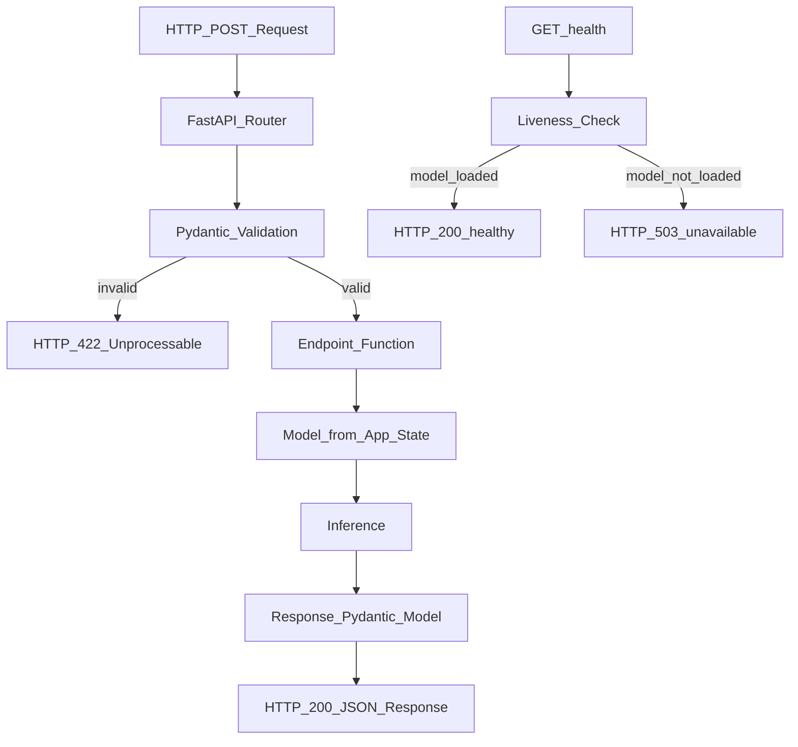

# ⚡ FastAPI for ML Serving

> [!abstract] TL;DR
> FastAPI is the simplest, most Pythonic path to putting an ML model behind an HTTP endpoint. It gives you async support, automatic OpenAPI docs, Pydantic request/response validation, and production-ready performance in ~50 lines of code. Best for small-to-medium scale serving (up to ~1,000 RPS per worker), internal services, and when you need rapid deployment. Use Triton or Ray Serve when you need GPU batching, multi-model serving, or horizontal scaling at 10,000+ RPS.

## Intuition — analogy FIRST

FastAPI is a well-designed serving counter at a coffee shop. One barista takes orders, validates them (no ordering items not on the menu — Pydantic handles this), prepares the drink (inference), and hands it back. The ordering system auto-generates a menu board (OpenAPI docs at `/docs`). It's perfect for most coffee shops (ML services) — efficient, readable, fast to set up.

Triton Inference Server is like an industrial coffee factory that fills 50,000 cups per hour with automated quality control. You don't need a factory to serve 100 cups a day. FastAPI is the right tool for the vast majority of ML serving scenarios.

## How It Works — mechanics + valid mermaid

**FastAPI key concepts for ML:**

- **`@asynccontextmanager` lifespan:** Load model once at startup, store in app state. Never load per-request.
- **Pydantic models:** Define input/output schemas with type annotations. FastAPI validates requests automatically and returns 422 errors on invalid input.
- **Async endpoints:** `async def` allows FastAPI to handle concurrent requests without blocking on I/O. For CPU-bound inference, use `asyncio.get_event_loop().run_in_executor()` or sync endpoints with multiple workers.
- **`uvicorn` with multiple workers:** `--workers 4` gives 4 Python processes, each with its own model copy — 4x throughput for CPU models.
- **Auto-docs:** Visit `/docs` for interactive Swagger UI, `/redoc` for ReDoc.

**Request lifecycle:**
1. Client sends HTTP POST with JSON body
2. FastAPI deserializes JSON → Pydantic model (validates types and constraints)
3. Endpoint function runs inference
4. Response Pydantic model serializes result → JSON
5. HTTP response sent to client



## Code Demo

```python
# pip install fastapi uvicorn pydantic scikit-learn joblib numpy

# ── serve.py — COMPLETE PRODUCTION-READY ML SERVER ──────────────────────────
from fastapi import FastAPI, HTTPException, Request
from pydantic import BaseModel, Field, field_validator
from contextlib import asynccontextmanager
from typing import List, Optional
import joblib
import numpy as np
import time
import logging
import asyncio
from concurrent.futures import ThreadPoolExecutor

logging.basicConfig(level=logging.INFO)
logger = logging.getLogger(__name__)

# Thread pool for CPU-bound inference (keeps async loop responsive)
executor = ThreadPoolExecutor(max_workers=4)

# ── LIFESPAN: LOAD MODEL ONCE AT STARTUP ─────────────────────────────────
model_store = {}

@asynccontextmanager
async def lifespan(app: FastAPI):
    """Load model artifacts at startup; release at shutdown."""
    logger.info("Starting up: loading model...")
    t0 = time.perf_counter()

    # Load model (blocking — OK here, happens before serving starts)
    model_store["classifier"] = joblib.load("models/classifier.pkl")
    model_store["scaler"] = joblib.load("models/scaler.pkl")
    model_store["version"] = "2.1.0"
    model_store["feature_names"] = ["age", "income", "tenure", "purchases"]

    load_time = time.perf_counter() - t0
    logger.info(f"Model loaded in {load_time:.3f}s — ready to serve")

    yield   # <— app serves requests here

    logger.info("Shutting down: releasing model resources")
    model_store.clear()
    executor.shutdown(wait=False)

# ── APP DEFINITION ─────────────────────────────────────────────────────────
app = FastAPI(
    title="Churn Prediction API",
    description="Real-time customer churn probability scoring",
    version="2.1.0",
    lifespan=lifespan,
)

# ── PYDANTIC SCHEMAS ───────────────────────────────────────────────────────
class Customer(BaseModel):
    age: int = Field(ge=18, le=120, description="Customer age in years")
    income: float = Field(ge=0, description="Annual income in USD")
    tenure: int = Field(ge=0, description="Months as customer")
    purchases: int = Field(ge=0, description="Number of purchases in last 90 days")

    @field_validator("income")
    @classmethod
    def income_reasonable(cls, v):
        if v > 10_000_000:
            raise ValueError("Income exceeds maximum expected value")
        return v

class PredictRequest(BaseModel):
    customer: Customer

class BatchPredictRequest(BaseModel):
    customers: List[Customer] = Field(max_length=1000)  # cap batch size

class PredictResponse(BaseModel):
    churn_probability: float = Field(ge=0.0, le=1.0)
    churn_predicted: bool
    risk_tier: str                                        # "low", "medium", "high"
    model_version: str
    inference_ms: float

class BatchPredictResponse(BaseModel):
    results: List[PredictResponse]
    batch_size: int
    total_ms: float

# ── HELPER FUNCTIONS ───────────────────────────────────────────────────────
def probability_to_tier(prob: float) -> str:
    if prob < 0.3:
        return "low"
    elif prob < 0.7:
        return "medium"
    return "high"

def run_inference(features: np.ndarray) -> np.ndarray:
    """CPU-bound inference — run in thread pool."""
    scaler = model_store["scaler"]
    model = model_store["classifier"]
    scaled = scaler.transform(features)
    return model.predict_proba(scaled)[:, 1]  # churn probability

# ── ENDPOINTS ──────────────────────────────────────────────────────────────
@app.get("/health", tags=["ops"])
async def health():
    """Kubernetes liveness/readiness probe."""
    if "classifier" not in model_store:
        raise HTTPException(status_code=503, detail="Model not initialized")
    return {
        "status": "healthy",
        "model_version": model_store.get("version"),
        "features": model_store.get("feature_names"),
    }

@app.post("/predict", response_model=PredictResponse, tags=["inference"])
async def predict(request: PredictRequest):
    """Predict churn probability for a single customer."""
    t0 = time.perf_counter()

    # Convert Pydantic → numpy
    c = request.customer
    features = np.array([[c.age, c.income, c.tenure, c.purchases]])

    # Run inference in thread pool (non-blocking)
    loop = asyncio.get_event_loop()
    probs = await loop.run_in_executor(executor, run_inference, features)
    prob = float(probs[0])

    ms = (time.perf_counter() - t0) * 1000
    return PredictResponse(
        churn_probability=round(prob, 4),
        churn_predicted=prob >= 0.5,
        risk_tier=probability_to_tier(prob),
        model_version=model_store["version"],
        inference_ms=round(ms, 2),
    )

@app.post("/predict/batch", response_model=BatchPredictResponse, tags=["inference"])
async def predict_batch(request: BatchPredictRequest):
    """Batch prediction for up to 1,000 customers."""
    t0 = time.perf_counter()
    customers = request.customers

    features = np.array([
        [c.age, c.income, c.tenure, c.purchases] for c in customers
    ])

    loop = asyncio.get_event_loop()
    probs = await loop.run_in_executor(executor, run_inference, features)

    results = [
        PredictResponse(
            churn_probability=round(float(p), 4),
            churn_predicted=float(p) >= 0.5,
            risk_tier=probability_to_tier(float(p)),
            model_version=model_store["version"],
            inference_ms=0.0,   # report aggregate below
        )
        for p in probs
    ]

    total_ms = (time.perf_counter() - t0) * 1000
    return BatchPredictResponse(
        results=results,
        batch_size=len(results),
        total_ms=round(total_ms, 2),
    )

# ── RUN ────────────────────────────────────────────────────────────────────
if __name__ == "__main__":
    import uvicorn
    uvicorn.run(
        "serve:app",
        host="0.0.0.0",
        port=8080,
        workers=4,       # one process per CPU core
        log_level="info",
        access_log=True,
    )
```

```bash
# ── RUNNING IN DOCKER ──────────────────────────────────────────────────────
# Dockerfile
# FROM python:3.11-slim
# WORKDIR /app
# COPY requirements.txt .
# RUN pip install -r requirements.txt
# COPY . .
# CMD ["uvicorn", "serve:app", "--host", "0.0.0.0", "--port", "8080", "--workers", "4"]

docker build -t churn-api:v2.1.0 .
docker run -p 8080:8080 churn-api:v2.1.0

# ── CALLING THE API ────────────────────────────────────────────────────────
curl -X POST http://localhost:8080/predict \
  -H "Content-Type: application/json" \
  -d '{"customer": {"age": 35, "income": 75000, "tenure": 24, "purchases": 12}}'

# Batch request
curl -X POST http://localhost:8080/predict/batch \
  -H "Content-Type: application/json" \
  -d '{"customers": [
        {"age": 35, "income": 75000, "tenure": 24, "purchases": 12},
        {"age": 62, "income": 120000, "tenure": 3, "purchases": 1}
      ]}'

# View auto-generated API docs
# http://localhost:8080/docs       (Swagger UI)
# http://localhost:8080/redoc      (ReDoc)
```

## Real-World Example

**Most Small-to-Medium ML Serving Deployments**

FastAPI powers a huge fraction of the industry's ML serving because it hits the right sweet spot:

A growth-stage startup with 10 ML models in production and 500 RPS peak load uses FastAPI + uvicorn + Docker + Kubernetes. The setup takes one afternoon, the team already knows Python, and the `--workers 4` flag gives enough throughput. Adding Prometheus metrics middleware takes another 2 hours. This is the dominant pattern in the industry.

**Stripe internal tooling:** Several of Stripe's internal ML scoring services started as FastAPI applications. A team can ship a working model server in a day, iterate on it, and only invest in lower-level serving (Triton, C++ inference) when profiling shows it's the bottleneck.

**FastAPI vs Flask:** FastAPI's Pydantic validation catches incorrect feature types at the API boundary — input errors that would silently produce wrong predictions in Flask. This single feature has prevented entire classes of silent model errors in production.

## Trade-offs

| Aspect | FastAPI | Flask | Triton |
|---|---|---|---|
| **Setup time** | 1 hour | 1 hour | 1 day |
| **Throughput (CPU)** | ~2,000 RPS/worker | ~1,500 RPS/worker | N/A |
| **Throughput (GPU)** | Limited | Limited | Very high |
| **Input validation** | Pydantic (automatic) | Manual | Via protobuf |
| **API docs** | Auto-generated | Manual (Flask-RESTX) | No |
| **Async support** | Native | Partial (Quart) | N/A |
| **Model batching** | Manual | Manual | Dynamic batching built-in |

## When to Use vs Avoid

**Use FastAPI when:**
- Prototype → production in days, not weeks
- Team is Python-native and doesn't want to learn Triton's model repository layout
- <10,000 RPS per endpoint
- REST API is the interface requirement
- Single model per service

**Use Triton or Ray Serve instead when:**
- GPU-optimized inference with dynamic batching is required
- Multiple models need to run on the same GPU server
- >10,000 RPS or <5ms p99 latency requirements
- Model ensemble pipeline

## Common Pitfalls

1. **Model loading per request:** Calling `joblib.load("model.pkl")` inside the endpoint function is catastrophic — 100ms per load × 1,000 RPS = 100 seconds of wasted compute per second. Always use lifespan loading.

2. **Blocking event loop:** CPU-bound inference (`model.predict()`) blocks the async event loop. Use `run_in_executor` to offload to a thread pool, or use sync workers (`--workers N` instead of async).

3. **`reload=True` in production:** `uvicorn ... --reload` watches files and restarts on every change. It's single-process and inappropriate for production. Always `--reload False` (the default) in production.

4. **No input sanitization:** Even with Pydantic, validate business rules (e.g., `age > 0`, `income not NaN`). Use `Field(ge=0)` constraints.

5. **Missing timeout handling:** If the model inference hangs (e.g., due to memory issues), the request blocks forever. Add `asyncio.wait_for()` with a timeout.

## Related Concepts

- [[_MOC_MLOps|↑ Section MOC]]

- [[Model_Serving_Overview]] — when FastAPI is the right choice vs alternatives
- [[Docker_for_ML]] — containerizing your FastAPI service for Kubernetes deployment
- [[Triton_Inference_Server]] — when you outgrow FastAPI's throughput
- [[BentoML]] — higher-level abstraction over FastAPI with built-in packaging

## Review Questions

1. What is the purpose of the `lifespan` context manager in FastAPI for ML serving? What would happen to performance if you loaded the model inside the `/predict` endpoint handler instead?

2. Why do ML serving endpoints use `async def` with `run_in_executor` rather than just `def` with synchronous inference? When would using a synchronous endpoint with multiple workers be better?

3. Your FastAPI service receives a request with `{"customer": {"age": "thirty-five", "income": -5000}}`. Walk through exactly what FastAPI/Pydantic does with this request before the endpoint function is called.

## Sources

- [FastAPI Documentation](https://fastapi.tiangolo.com/)
- [FastAPI GitHub](https://github.com/tiangolo/fastapi)
- [Pydantic Documentation](https://docs.pydantic.dev/)
- [Uvicorn Documentation](https://www.uvicorn.org/)
- FastAPI Docs: "Concurrency and async/await" — Performance section

#mlops #fastapi #serving #python #rest-api #pydantic #uvicorn #deployment
