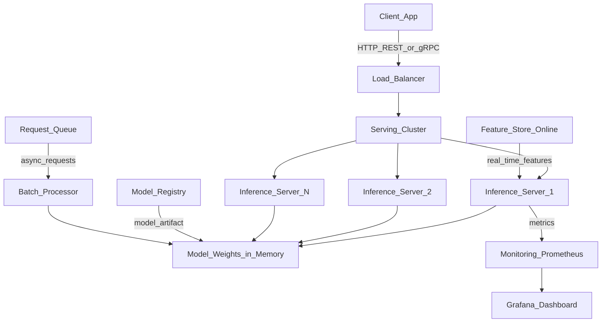

# 🚀 Model Serving Overview

> [!abstract] TL;DR
> Model serving is the infrastructure that makes trained models available to applications. Key design decisions: REST vs gRPC, synchronous vs asynchronous, batch vs real-time, GPU vs CPU. Key metrics: latency (p50/p95/p99), throughput (requests/second), cost per inference. The right serving infrastructure depends on your SLA, model size, traffic patterns, and team's operational expertise.

## Intuition — analogy FIRST

A restaurant analogy makes serving architecture concrete:

- **The model** is the chef — skilled at making a specific dish (prediction)
- **The serving infrastructure** is the front-of-house: waiter, host, expediter
- **The client** is the customer placing an order

Different restaurant types = different serving strategies:
- **Fast food (real-time serving):** Customer orders at the counter, gets a burger in 90 seconds. Low latency, standardized, high throughput.
- **Catering service (batch inference):** You order 500 lunches the night before. They're all prepared at once, packed, and delivered. High throughput, relaxed latency.
- **Fine dining (expensive model, GPU):** One chef, high-quality output, more time per order, seats limited. Like a large LLM — expensive per inference, but the quality justifies it.
- **Food court (multi-model):** Multiple specialized vendors under one roof. Like Triton running multiple models on one GPU server.

A restaurant that serves 1 customer/day doesn't need industrial kitchen equipment. A restaurant serving 10,000 orders/day does. Match your serving infrastructure to your actual load.

## How It Works — mechanics + valid mermaid

**Serving patterns:**

| Pattern | Latency | Throughput | Use Case |
|---|---|---|---|
| **Synchronous REST** | <100ms | Medium | Real-time recommendations, fraud |
| **Synchronous gRPC** | <50ms | High | Internal microservice calls |
| **Async/Queue** | Seconds-minutes | Very high | Document processing, batch scoring |
| **Batch inference** | Minutes-hours | Highest | Nightly scoring, bulk predictions |
| **Streaming** | Low, continuous | High | Real-time event processing |

**Key performance metrics:**

- **p50 latency:** median response time (50% of requests faster than this)
- **p95 latency:** 95th percentile — most users experience at most this
- **p99 latency:** 99th percentile — the "tail" — long tail causes customer dissatisfaction
- **Throughput:** requests served per second (RPS or QPS)
- **Availability:** % uptime (99.9% = 8.7 hours downtime/year; 99.99% = 52 min/year)
- **GPU utilization:** for GPU serving, target >70% utilization for cost efficiency
- **Cold start:** time to first inference after a new pod starts

**Scaling strategies:**
- **Horizontal scaling:** more server replicas (stateless models)
- **Vertical scaling:** bigger GPU/more RAM
- **Autoscaling:** scale replicas based on RPS or queue depth
- **Model optimization:** quantization, distillation, ONNX export to reduce compute



## Code Demo

```python
# ── MINIMAL FASTAPI SERVING ────────────────────────────────────────────────
# pip install fastapi uvicorn scikit-learn

from fastapi import FastAPI, HTTPException
from pydantic import BaseModel
from contextlib import asynccontextmanager
import joblib
import numpy as np
import time
import logging
from typing import List

logger = logging.getLogger(__name__)

# ── MODEL LOADING ON STARTUP ───────────────────────────────────────────────
model_store = {}

@asynccontextmanager
async def lifespan(app: FastAPI):
    """Load model on startup, clean up on shutdown."""
    logger.info("Loading model...")
    start = time.time()
    model_store["model"] = joblib.load("models/classifier.pkl")
    logger.info(f"Model loaded in {time.time() - start:.2f}s")
    yield
    model_store.clear()
    logger.info("Model unloaded")

app = FastAPI(
    title="ML Inference API",
    version="1.0.0",
    lifespan=lifespan,
)

# ── REQUEST/RESPONSE SCHEMAS ───────────────────────────────────────────────
class PredictRequest(BaseModel):
    features: List[float]           # single sample

class BatchPredictRequest(BaseModel):
    instances: List[List[float]]    # multiple samples

class PredictResponse(BaseModel):
    prediction: int
    probability: float
    model_version: str = "1.0.0"
    latency_ms: float

# ── ENDPOINTS ─────────────────────────────────────────────────────────────
@app.get("/health")
async def health():
    """Health check — load balancers call this."""
    if "model" not in model_store:
        raise HTTPException(status_code=503, detail="Model not loaded")
    return {"status": "healthy", "model_loaded": True}

@app.post("/predict", response_model=PredictResponse)
async def predict(request: PredictRequest):
    """Single sample prediction."""
    start = time.time()
    model = model_store["model"]

    X = np.array(request.features).reshape(1, -1)
    pred = model.predict(X)[0]
    prob = model.predict_proba(X)[0].max()

    latency = (time.time() - start) * 1000
    return PredictResponse(
        prediction=int(pred),
        probability=float(prob),
        latency_ms=round(latency, 2),
    )

@app.post("/predict/batch")
async def predict_batch(request: BatchPredictRequest):
    """Batch prediction for throughput."""
    start = time.time()
    model = model_store["model"]

    X = np.array(request.instances)
    preds = model.predict(X)
    probs = model.predict_proba(X).max(axis=1)

    latency = (time.time() - start) * 1000
    return {
        "predictions": preds.tolist(),
        "probabilities": probs.tolist(),
        "count": len(preds),
        "latency_ms": round(latency, 2),
    }

@app.get("/metrics")
async def metrics():
    """Basic metrics endpoint."""
    return {"model_version": "1.0.0", "status": "serving"}

# ── RUN ────────────────────────────────────────────────────────────────────
if __name__ == "__main__":
    import uvicorn
    uvicorn.run(
        "serve:app",
        host="0.0.0.0",
        port=8080,
        workers=4,           # CPU parallelism
        reload=False,        # Never True in production
    )

# Test: curl -X POST http://localhost:8080/predict \
#            -H "Content-Type: application/json" \
#            -d '{"features": [1.2, 3.4, 5.6, 7.8]}'
```

## Real-World Example

**Netflix — <50ms Recommendation Serving**

Netflix serves personalized recommendations to 260M+ subscribers in real time. Their serving constraints:
- **Latency SLA:** <50ms p99 (if the recommendations don't load before the page, they fall back to cached content)
- **Scale:** 10M+ API calls/second at peak
- **Models:** Several models in a pipeline — candidate generation → scoring → re-ranking

Architecture choices:
1. **gRPC internally:** ~40% lower latency vs REST for internal service calls
2. **Feature store (online):** Personalization features retrieved from Redis in <2ms
3. **Multi-model pipeline:** Triton Inference Server handles concurrent model execution on GPU servers
4. **Async fallbacks:** If the personalization service misses its SLA, fallback to pre-computed batch recommendations
5. **Shadow traffic:** New models first receive shadow traffic (no user impact) before live traffic is shifted

**Stripe — Fraud Detection in <100ms**

Stripe's fraud detection model evaluates every payment transaction synchronously. Requirements:
- Decision must complete within 100ms or the payment times out
- Model runs on every transaction — billions per year
- False positive (blocking legitimate transaction) = lost revenue + angry customer

They use ONNX-optimized models served on CPU (not GPU) for cost efficiency. Feature computation from transaction history is pre-computed via a feature store, leaving only <20ms for the model inference itself.

## Trade-offs

| Technology | Latency | Throughput | Complexity | Best For |
|---|---|---|---|---|
| **FastAPI** | Low | Medium | Low | Simple REST, small teams |
| **Triton** | Very low | Very high | High | GPU serving, multiple models |
| **Ray Serve** | Low | High | Medium | Python-native, pipeline |
| **BentoML** | Low | Medium-high | Medium | Portable packaging |
| **TorchServe** | Low | High | Medium | PyTorch-specific |
| **SageMaker** | Low | High | Low (managed) | AWS ecosystem |

## When to Use vs Avoid

**Real-time serving when:**
- User is waiting for the response (recommendations, fraud detection)
- Latency SLA is <1 second
- Traffic is unpredictable/variable

**Batch inference when:**
- User doesn't need immediate response (nightly email personalization)
- Cost optimization is priority (batch is 5-10x cheaper)
- Data volume is large and predictable

**Consider serverless when:**
- Traffic is very spiky (low usage most of the time, bursts occasionally)
- Cold start latency is acceptable (>1s)

## Common Pitfalls

1. **Loading the model inside the request handler:** If you load `pickle.load("model.pkl")` on every request, you pay the deserialization cost every time. Load once at startup.

2. **No health check endpoint:** Load balancers need `/health` to route traffic away from unhealthy pods. Without it, requests are sent to pods that are still loading their model.

3. **Ignoring tail latency:** p99 latency is what your slowest users experience. A p50 of 20ms and p99 of 2000ms means 1% of users wait 100x longer. Always measure and set SLAs on p99.

4. **Over-provisioning for peak without autoscaling:** Running enough capacity for peak load 24/7 is expensive. Use autoscaling and accept some cold start.

5. **Single model version in production:** Without the ability to deploy a new version alongside the old one (blue/green or canary), every deployment is a risky all-or-nothing change.

## Related Concepts

- [[_MOC_MLOps|↑ Section MOC]]

- [[FastAPI_for_ML]] — the simplest path to a production REST endpoint
- [[Triton_Inference_Server]] — NVIDIA's high-throughput GPU serving solution
- [[Ray_Serve]] — scalable Python-native serving on Ray clusters
- [[BentoML]] — portable model packaging and serving
- [[Continuous_Batching]] — GPU inference optimization technique for LLMs
- [[Feature_Stores]] — online store provides low-latency features to serving infrastructure

## Review Questions

1. What is the difference between p50, p95, and p99 latency? A model serves 1 million requests/day with p99=500ms. How many users per day experience latency above 500ms?

2. A startup asks: "Should we build our ML serving on FastAPI or Triton Inference Server?" What questions would you ask to determine the right choice?

3. Your fraud detection model needs to make decisions in <100ms. The model runs in 80ms, but the feature retrieval from your data warehouse takes 500ms. What architectural changes would you make?

## Sources

- Huyen, Chip. *Designing Machine Learning Systems*. O'Reilly, 2022. Chapter 7.
- Netflix Technology Blog: "System Architectures for Personalization and Recommendation" (2022)
- Kleppmann, M. *Designing Data-Intensive Applications*. O'Reilly, 2017. Chapter 1.
- [Triton Inference Server Documentation](https://docs.nvidia.com/deeplearning/triton-inference-server/)
- [FastAPI Documentation](https://fastapi.tiangolo.com/)

#mlops #serving #inference #deployment #latency #throughput #fastapi #triton
