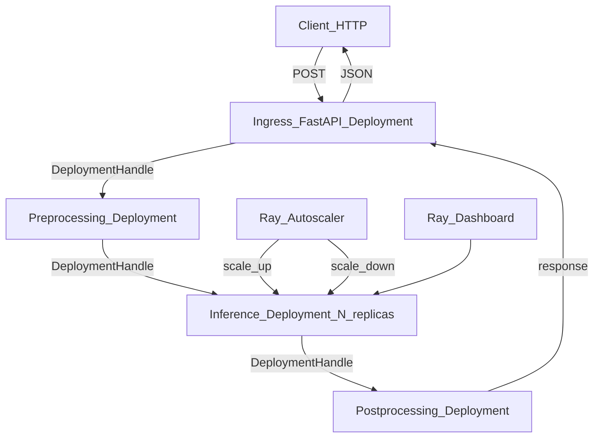

# ☀️ Ray Serve

> [!abstract] TL;DR
> Ray Serve is a scalable, Python-native model serving library built on Ray. Define `@serve.deployment` classes that scale horizontally with configurable replicas, CPU/GPU resources, and autoscaling policies. Chain deployments into pipelines (DAG routing). Integrates natively with FastAPI for HTTP handling. Key differentiator: it's Python-first and horizontally scalable without Kubernetes complexity — like having Kubernetes just for ML serving but configured in Python.

## Intuition — analogy FIRST

FastAPI is one barista at a counter — good for low-to-medium throughput.

Triton is a specialized industrial coffee machine — optimized for GPU-powered espresso shots at massive scale.

Ray Serve is **Kubernetes for Python ML serving** — a smart dispatcher system that:
- Spawns multiple barista workers (`replicas`) automatically based on demand
- Routes orders to specialized stations (different `deployments` for different models)
- Chains stations together: grinding → brewing → steaming milk form a pipeline
- Tracks worker health and respawns crashed baristas automatically
- Scales the whole thing via Python config, not YAML manifests

The key insight: Ray Serve handles the messy distributed systems work (replica management, request routing, fault tolerance) so you write Python, not infrastructure configuration.

## How It Works — mechanics + valid mermaid

**Core concepts:**

- **`@serve.deployment`:** Decorates a class or function that handles requests. One deployment = one logical service component. Can have N replicas.
- **`replicas`:** Number of parallel instances. Increase for more throughput.
- **`@serve.ingress(app)`:** Attaches a FastAPI app to a deployment for rich HTTP routing.
- **`DeploymentHandle`:** Reference to call another deployment from Python code (for pipeline composition).
- **`Autoscaling`:** Scale replicas based on request queue depth. Set `min_replicas`, `max_replicas`, `target_num_ongoing_requests_per_replica`.
- **`serve.run()`:** Start serving immediately; or use `serve.build()` for deployable YAML.

**Pipeline composition (DAG):** Deployments call each other via `DeploymentHandle`. The preprocessing deployment calls the inference deployment which calls postprocessing — all in one Python awaitable chain. No inter-service HTTP calls, no serialization overhead within the cluster.



## Code Demo

```python
# pip install "ray[serve]" fastapi

import ray
from ray import serve
from fastapi import FastAPI
from pydantic import BaseModel
import numpy as np
import time
from typing import List

# ── INITIALIZE RAY ─────────────────────────────────────────────────────────
ray.init()
serve.start(detached=True, http_options={"host": "0.0.0.0", "port": 8000})

# ── PYDANTIC SCHEMAS ───────────────────────────────────────────────────────
app = FastAPI(title="Ray Serve ML API")

class PredictRequest(BaseModel):
    features: List[float]

class PredictResponse(BaseModel):
    prediction: int
    probability: float
    latency_ms: float

# ── DEPLOYMENT 1: PREPROCESSING ───────────────────────────────────────────
@serve.deployment(
    num_replicas=2,
    ray_actor_options={"num_cpus": 0.5},  # 0.5 CPU per replica
)
class Preprocessor:
    def __init__(self):
        import joblib
        self.scaler = joblib.load("models/scaler.pkl")

    def preprocess(self, features: List[float]) -> np.ndarray:
        arr = np.array(features).reshape(1, -1)
        return self.scaler.transform(arr)

# ── DEPLOYMENT 2: INFERENCE ────────────────────────────────────────────────
@serve.deployment(
    num_replicas=4,                        # 4 parallel inference workers
    ray_actor_options={"num_cpus": 1.0},  # 1 CPU per replica
    # For GPU serving:
    # ray_actor_options={"num_gpus": 1},
    autoscaling_config={
        "min_replicas": 2,
        "max_replicas": 10,
        "target_num_ongoing_requests_per_replica": 5,
    },
)
class Classifier:
    def __init__(self):
        import joblib
        self.model = joblib.load("models/classifier.pkl")

    def predict(self, features: np.ndarray):
        pred = int(self.model.predict(features)[0])
        prob = float(self.model.predict_proba(features)[0].max())
        return pred, prob

# ── DEPLOYMENT 3: API GATEWAY (uses FastAPI + chains other deployments) ────
@serve.deployment(
    num_replicas=2,
    ray_actor_options={"num_cpus": 0.25},
)
@serve.ingress(app)
class PredictionService:
    def __init__(
        self,
        preprocessor: serve.handle.DeploymentHandle,
        classifier: serve.handle.DeploymentHandle,
    ):
        self.preprocessor = preprocessor
        self.classifier = classifier

    @app.post("/predict", response_model=PredictResponse)
    async def predict(self, request: PredictRequest):
        t0 = time.perf_counter()

        # Call preprocessor deployment asynchronously
        features = await self.preprocessor.preprocess.remote(request.features)

        # Call classifier deployment asynchronously
        pred, prob = await self.classifier.predict.remote(features)

        ms = (time.perf_counter() - t0) * 1000
        return PredictResponse(prediction=pred, probability=prob, latency_ms=round(ms, 2))

    @app.get("/health")
    async def health(self):
        return {"status": "healthy"}

# ── BIND AND DEPLOY ────────────────────────────────────────────────────────
# Bind deployments together (dependency injection)
preprocessor = Preprocessor.bind()
classifier = Classifier.bind()
service = PredictionService.bind(preprocessor, classifier)

# Deploy to Ray cluster
serve.run(service, name="churn-prediction", route_prefix="/")

print("Service deployed at http://localhost:8000")
print("Docs at http://localhost:8000/docs")

# ── SCALING OPERATIONS ─────────────────────────────────────────────────────
# Update number of replicas at runtime (no restart needed)
from ray.serve.config import AutoscalingConfig

Classifier.options(num_replicas=8).bind()    # Scale up manually

# Or update via CLI:
# serve config apply deployment_config.yaml

# ── MULTIPLE MODELS (A/B TESTING) ─────────────────────────────────────────
@serve.deployment
class ABRouter:
    """Route 10% of traffic to challenger model."""
    def __init__(
        self,
        champion: serve.handle.DeploymentHandle,
        challenger: serve.handle.DeploymentHandle,
    ):
        self.champion = champion
        self.challenger = challenger
        self.challenger_fraction = 0.1

    async def predict(self, features):
        import random
        if random.random() < self.challenger_fraction:
            return await self.challenger.predict.remote(features)
        return await self.champion.predict.remote(features)

# ── SERVE STATUS ───────────────────────────────────────────────────────────
# serve status    # in CLI
# Or:
# from ray.serve.context import get_deployment_info
```

```bash
# Start Ray cluster
ray start --head --dashboard-host 0.0.0.0

# Deploy from config YAML
serve run serve_config.yaml

# Check status
serve status

# Scale deployment
serve config apply --name churn-prediction updated_config.yaml

# Shutdown
serve shutdown
```

## Real-World Example

**Anyscale (Ray creators) and OpenAI-style Patterns**

Anyscale's own serving infrastructure is built on Ray Serve — dogfooding at scale. Their platform serves fine-tuned LLMs and CV models for enterprise customers. Key patterns:

- **LLM serving:** A Ray Serve deployment wraps vLLM for high-throughput LLM inference. The autoscaling feature scales replicas based on concurrent user sessions — from 2 replicas at night to 50 during business hours.
- **Pipeline composition:** Pre/post processing steps (tokenization, de-tokenization) are separate deployments that scale independently of the model inference step.
- **Cost efficiency:** Unlike Kubernetes with separate container pods, Ray actors share the same machine and GPU memory pool — a 4-GPU server can run multiple small model replicas sharing GPU memory, rather than wasting a full GPU per pod.

**UC Berkeley Research (Ray's origin):**
Ray started as a research project at Berkeley's RiseLab for distributed RL training. Ray Serve emerged from the need to serve the resulting models. Companies building LLM inference pipelines (retrieval-augmented generation, multi-step reasoning) use Ray Serve's DAG routing to chain embedding models → retrieval → LLM → re-ranking in a single serving topology.

## Trade-offs

| Feature | Ray Serve | Triton | FastAPI |
|---|---|---|---|
| **Horizontal scaling** | Native, autoscaling | Manual (Kubernetes) | Manual |
| **GPU optimization** | Via vLLM/TensorRT backend | Native TRT | No |
| **Pipeline composition** | Python-native DAG | Ensemble (config) | Manual HTTP |
| **Kubernetes dependency** | No (runs on Ray) | No | No |
| **Learning curve** | Medium | High | Low |
| **Community size** | Large (growing) | Large (NVIDIA) | Very large |

## When to Use vs Avoid

**Use Ray Serve when:**
- Need horizontal scaling with Python-native config (not K8s YAML)
- Multi-model pipeline (preprocessing → inference → postprocessing)
- LLM serving with autoscaling (request volumes vary widely)
- Already using Ray for training or data processing

**Use Triton instead when:**
- GPU utilization must be maximized (dynamic batching, TensorRT)
- Multi-framework models on a single GPU server
- Latency requirements are in the single-digit milliseconds

**Use FastAPI instead when:**
- Simple single-model, single-process serving
- Team prefers minimal framework overhead

## Common Pitfalls

1. **Not using `async_run` for remote calls:** `await handle.method.remote()` is non-blocking. `handle.method.remote()` returns a `ObjectRef`, not the result. Always `await` in async contexts.

2. **Shared mutable state across replicas:** Each replica is a separate Ray actor. Don't store request-specific state in `self` — each request may hit a different replica. Use stateless deployments.

3. **Over-allocating CPUs:** `ray_actor_options={"num_cpus": 4}` reserves 4 full CPUs per replica. On a 16-core machine, you can only run 4 replicas. For lightweight Python workers, use `num_cpus: 0.25`.

4. **Not setting `max_replicas`:** Without a cap, autoscaling can over-provision and exhaust cluster resources during traffic spikes.

5. **Forgetting `serve.start(detached=True)`:** Without `detached=True`, the serve instance dies when your Python process exits. In production, always start detached.

## Related Concepts

- [[_MOC_MLOps|↑ Section MOC]]

- [[Model_Serving_Overview]] — when Ray Serve fits in your serving strategy
- [[Continuous_Batching]] — Ray Serve + vLLM for LLM serving with continuous batching
- [[Kubeflow]] — Kubeflow pipelines for training; Ray Serve for serving
- [[FastAPI_for_ML]] — Ray Serve uses FastAPI as the HTTP layer; good foundation

## Review Questions

1. What is the difference between a Ray Serve `Deployment` and a replica? How does autoscaling decide when to add or remove replicas?

2. Compare Ray Serve's pipeline composition (via `DeploymentHandle`) to chaining REST API calls between FastAPI services. What are the performance and reliability differences?

3. You're running a Ray Serve deployment for an LLM with `num_replicas=4, num_gpus=1` on a 4-GPU server. Traffic suddenly spikes 3x. Walk through what `autoscaling_config` settings you'd change and what the constraints are.

## Sources

- [Ray Serve Documentation](https://docs.ray.io/en/latest/serve/)
- [Ray GitHub](https://github.com/ray-project/ray)
- Moritz, P. et al. "Ray: A Distributed Framework for Emerging AI Applications." OSDI, 2018.
- Anyscale Blog: "Scalable LLM Serving with Ray Serve" (2024)
- [Anyscale Platform Documentation](https://docs.anyscale.com/)

#mlops #ray-serve #serving #distributed #autoscaling #python #pipeline
