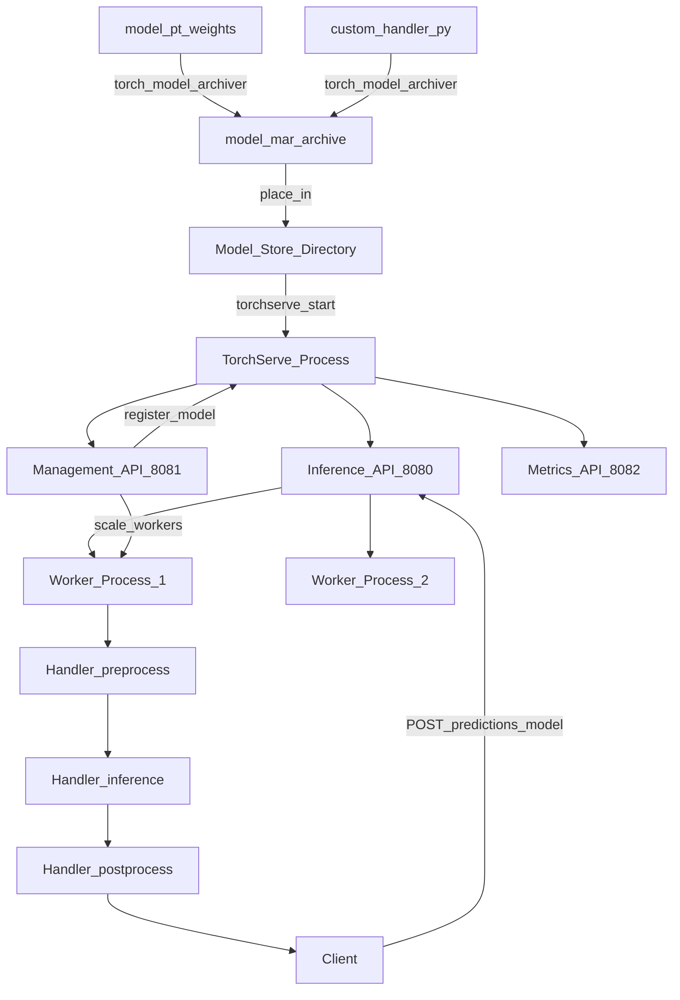

# 🔥 TorchServe

> [!abstract] TL;DR
> TorchServe is PyTorch's official model serving solution. It packages models into `.mar` (Model Archive) files containing weights + handler code. A custom Handler class defines preprocessing, inference, and postprocessing. TorchServe exposes REST and gRPC APIs, management API for hot-loading/unloading models, batch inference, and Prometheus metrics. AWS SageMaker uses TorchServe as the default PyTorch serving backend. Best when your team is PyTorch-native and wants the "official" serving path.

## Intuition — analogy FIRST

Imagine PyTorch is a car manufacturer (Toyota). They make excellent cars (models). But how do you deliver cars to customers?

Without TorchServe, you'd have to build your own delivery infrastructure: trucks, logistics, tracking — a FastAPI service with custom model loading code. Every PyTorch team reinvents this differently.

TorchServe is Toyota's **official dealership and delivery system.** It defines:
- A standard packaging format (`.mar` = car in its shipping container)
- A standard delivery protocol (REST/gRPC = the logistics network)
- A standard handler interface (preprocessing/inference/postprocessing = handling and delivery instructions)
- Fleet management (management API = track which models are loaded, update without downtime)

You don't have to build your own — just follow the standard. AWS SageMaker is the nationwide franchise that runs Toyota dealerships (TorchServe) across the country.

## How It Works — mechanics + valid mermaid

**Core components:**

1. **Model Archive (`.mar`):** Created by `torch-model-archiver`. Contains: model weights, handler code, any extra files (label files, tokenizer vocab). This is the deployable artifact.

2. **Handler:** Python class inheriting from `BaseHandler`. Override four methods:
   - `initialize(context)` — load model weights
   - `preprocess(data)` — transform raw request data → model input tensor
   - `inference(data)` — run `model(tensor)`, return output tensor
   - `postprocess(data)` — transform output tensor → response JSON

3. **Model Store:** Directory containing `.mar` files. TorchServe watches this directory.

4. **Management API (port 8081):** Register/unregister models, scale workers, check model status — without restarting TorchServe.

5. **Inference API (port 8080):** Client-facing prediction endpoint.

6. **Metrics API (port 8082):** Prometheus-compatible metrics.

**Batch inference:** TorchServe can batch requests within a time window. Configure `batch_size` and `max_batch_delay` in the management API. The handler receives a list of inputs for the batch.



## Code Demo

```python
# ── STEP 1: DEFINE CUSTOM HANDLER ──────────────────────────────────────────
# custom_handler.py

import torch
import torch.nn.functional as F
import torchvision.transforms as T
from torchserve.base_handler import BaseHandler
from PIL import Image
import io
import json
import logging

logger = logging.getLogger(__name__)

class ImageClassifierHandler(BaseHandler):
    """
    Custom handler for image classification.
    Handles preprocessing (resize/normalize), inference, and postprocessing.
    """

    def initialize(self, context):
        """Called once when the model is first loaded."""
        super().initialize(context)  # loads self.model from model.pt

        # Load class labels
        properties = context.system_properties
        model_dir = properties.get("model_dir")
        with open(f"{model_dir}/index_to_name.json") as f:
            self.class_labels = json.load(f)

        # Define transforms
        self.transform = T.Compose([
            T.Resize(256),
            T.CenterCrop(224),
            T.ToTensor(),
            T.Normalize([0.485, 0.456, 0.406], [0.229, 0.224, 0.225]),
        ])

        self.model.eval()
        logger.info(f"Model loaded with {len(self.class_labels)} classes")

    def preprocess(self, data):
        """Convert raw request bytes → batch tensor."""
        images = []
        for row in data:
            # data is a list of {"body": <bytes>} dicts
            image_bytes = row.get("body") or row.get("data")
            img = Image.open(io.BytesIO(image_bytes)).convert("RGB")
            tensor = self.transform(img)
            images.append(tensor)

        # Stack into batch tensor: (N, 3, 224, 224)
        return torch.stack(images).to(self.device)

    def inference(self, data):
        """Run model forward pass."""
        with torch.no_grad():
            return self.model(data)   # logits: (N, num_classes)

    def postprocess(self, data):
        """Convert logits → JSON-serializable predictions."""
        probs = F.softmax(data, dim=1)
        top5_probs, top5_indices = torch.topk(probs, k=5, dim=1)

        results = []
        for probs_row, idx_row in zip(top5_probs, top5_indices):
            predictions = {
                self.class_labels.get(str(idx.item()), f"class_{idx.item()}"): round(prob.item(), 4)
                for idx, prob in zip(idx_row, probs_row)
            }
            results.append(predictions)

        return results


# ── STEP 2: SAVE TORCHSCRIPT MODEL ────────────────────────────────────────
import torchvision.models as models
import torch

model = models.resnet50(pretrained=True)
model.eval()

# Save as TorchScript (required for TorchServe with default handler)
dummy_input = torch.randn(1, 3, 224, 224)
scripted_model = torch.jit.trace(model, dummy_input)
torch.jit.save(scripted_model, "resnet50.pt")
```

```bash
# ── STEP 3: CREATE MODEL ARCHIVE (.mar) ────────────────────────────────────
pip install torchserve torch-model-archiver

torch-model-archiver \
  --model-name resnet50_classifier \
  --version 1.0 \
  --serialized-file resnet50.pt \
  --handler custom_handler.py \
  --extra-files "index_to_name.json" \
  --export-path model_store \
  --archive-format default

# Produces: model_store/resnet50_classifier.mar

# ── STEP 4: START TORCHSERVE ───────────────────────────────────────────────
mkdir -p model_store logs

torchserve \
  --start \
  --model-store model_store \
  --models resnet50=resnet50_classifier.mar \
  --ts-config config.properties \
  --ncs   # no config snapshot

# config.properties:
# inference_address=http://0.0.0.0:8080
# management_address=http://0.0.0.0:8081
# metrics_address=http://0.0.0.0:8082
# default_workers_per_model=4
# enable_metrics_api=true
# metrics_format=prometheus

# ── STEP 5: CALL THE API ───────────────────────────────────────────────────
# Single prediction (image file)
curl -X POST http://localhost:8080/predictions/resnet50 \
  -T cat.jpg \
  -H "Content-Type: image/jpeg"

# Check model status
curl http://localhost:8081/models/resnet50

# ── MANAGEMENT API ─────────────────────────────────────────────────────────
# Register a new model at runtime (no restart!)
curl -X POST "http://localhost:8081/models?url=resnet50_v2.mar&model_name=resnet50_v2&initial_workers=2"

# Scale workers
curl -X PUT "http://localhost:8081/models/resnet50?min_worker=2&max_worker=8"

# Unregister model
curl -X DELETE http://localhost:8081/models/resnet50/1.0

# List all loaded models
curl http://localhost:8081/models

# ── STOP ──────────────────────────────────────────────────────────────────
torchserve --stop
```

```python
# ── BATCH INFERENCE HANDLER ────────────────────────────────────────────────
# Management API: set batch size
import requests

requests.put(
    "http://localhost:8081/models/resnet50",
    params={
        "batch_size": 16,
        "max_batch_delay": 100,   # ms — wait up to 100ms to fill a batch
        "min_worker": 2,
        "max_worker": 4,
    }
)
```

## Real-World Example

**AWS SageMaker — TorchServe Under the Hood**

AWS SageMaker automatically uses TorchServe when you deploy a PyTorch model. When a data scientist runs:

```python
from sagemaker.pytorch import PyTorchModel
model = PyTorchModel(model_data="s3://bucket/model.tar.gz",
                     role=role, framework_version="2.0")
predictor = model.deploy(instance_type="ml.g4dn.xlarge")
```

SageMaker pulls the PyTorch container, extracts the model artifacts, starts TorchServe internally, and returns an HTTPS endpoint. The customer never sees TorchServe, but it's there.

This means any custom handler written for TorchServe also works on SageMaker — you can test locally and deploy to SageMaker with zero changes.

**Industry adoption:**
TorchServe is maintained jointly by AWS and Meta (Facebook). Meta uses it internally for many inference workloads that are PyTorch-native. For teams that are all-in on PyTorch (common at research-focused companies), TorchServe provides a consistent, well-supported serving path from experimentation to production without learning a new framework.

## Trade-offs

| Feature | TorchServe | FastAPI | Triton |
|---|---|---|---|
| **PyTorch integration** | Native | Manual | Via ONNX/TorchScript |
| **Management API** | Yes | No | Yes |
| **Multi-framework** | PyTorch only | Any Python | TRT/ONNX/PyTorch/TF |
| **AWS integration** | SageMaker native | Manual | Available |
| **Batch inference** | Built-in | Manual | Dynamic batching |
| **gRPC** | Yes | Manual | Yes |
| **Learning curve** | Medium | Low | High |

## When to Use vs Avoid

**Use TorchServe when:**
- PyTorch models only — team is PyTorch-native
- AWS SageMaker deployment target
- Management API (hot-swap models) is needed
- Batch inference with configurable delay

**Use FastAPI when:**
- Need non-PyTorch models alongside PyTorch
- Small scale, rapid deployment
- Team prefers full control

**Use Triton when:**
- GPU optimization (TensorRT) is critical
- Multi-framework models on same server
- Very high throughput requirements

## Common Pitfalls

1. **TorchScript vs eager mode:** TorchServe's default handler expects TorchScript (`.pt` from `torch.jit.save`). If you save a raw `state_dict`, you need a custom handler that loads the model architecture and weights separately.

2. **Handler `initialize` not called once:** If TorchServe spawns multiple workers, each calls `initialize` independently. Expensive operations (downloading large files) should be cached externally, not done per-worker.

3. **Data encoding mismatch:** The default handler expects raw bytes. If your client sends JSON, you need to handle deserialization in `preprocess`. Check `row.get("body")` vs `row.get("data")` based on content type.

4. **Not handling batch responses correctly:** `postprocess` must return a **list** with one result per input sample. Returning a single value for a batch causes an error.

5. **Management port exposed publicly:** Port 8081 allows model registration and deletion. Never expose the management API to the internet. Keep it internal (bind to localhost or private network).

## Related Concepts

- [[_MOC_MLOps|↑ Section MOC]]

- [[Model_Serving_Overview]] — where TorchServe fits in the serving landscape
- [[PyTorch_Fundamentals]] — understanding TorchScript and model export is prerequisite
- [[AWS_SageMaker]] — SageMaker's PyTorch deployment uses TorchServe internally
- [[FastAPI_for_ML]] — lighter-weight alternative for PyTorch serving

## Review Questions

1. What is a `.mar` file and what does it contain? Why does TorchServe use this packaging format instead of just loading a `.pt` file directly?

2. Explain the four methods of a TorchServe Handler (`initialize`, `preprocess`, `inference`, `postprocess`). What is each responsible for, and which ones are called once vs once per request?

3. Your TorchServe deployment is running fine locally, but on AWS SageMaker it returns 500 errors. The logs show `RuntimeError: Expected TorchScript model but got nn.Module`. What caused this and how do you fix it?

## Sources

- [TorchServe Documentation](https://pytorch.org/serve/)
- [TorchServe GitHub](https://github.com/pytorch/serve)
- [AWS SageMaker PyTorch Inference](https://docs.aws.amazon.com/sagemaker/latest/dg/pytorch-serving-inference.html)
- Meta Engineering Blog: "TorchServe: A New Tool for Deploying PyTorch Models in Production" (2020)
- PyTorch Blog: "TorchServe 0.8.0: New Features and Improvements" (2023)

#mlops #torchserve #pytorch #serving #deployment #aws-sagemaker #inference
