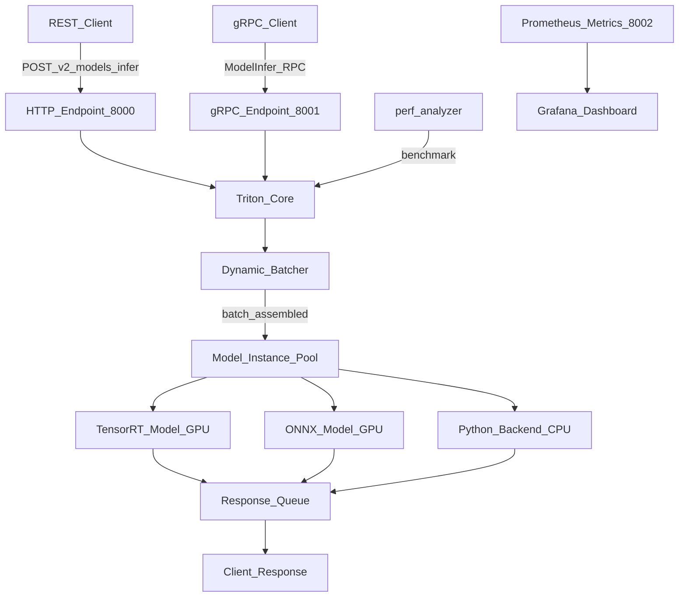

# ⚙️ Triton Inference Server

> [!abstract] TL;DR
> NVIDIA Triton is an open-source, production-grade inference server that maximizes GPU utilization through dynamic batching, concurrent model execution, and multi-framework support (TensorRT, ONNX, PyTorch, TensorFlow, Python). It serves multiple models on the same GPU server simultaneously and exposes REST and gRPC APIs. Best for high-throughput production serving where GPU efficiency is critical. The complexity overhead is justified at 10,000+ RPS or when running multiple models.

## Intuition — analogy FIRST

FastAPI is a home kitchen — a skilled cook handles one order at a time. Triton is an industrial catering facility:

- **Concurrent model execution** = multiple chefs working simultaneously on different dishes (different models sharing the same GPU)
- **Dynamic batching** = instead of cooking one steak at a time, waiting until 8 orders of steak arrive, then cooking them all simultaneously in one pan (GPU parallelism)
- **Multi-framework** = the kitchen can prepare French, Italian, and Japanese cuisine (TensorRT, ONNX, PyTorch) using the same stove (GPU)
- **Model ensemble** = a multi-course meal where the output of the first course (preprocessing model) becomes the input of the main course (inference model)
- **gRPC** = a walkie-talkie system between kitchen and waiters (faster than REST for internal calls)
- **`perf_analyzer`** = the kitchen's efficiency consultant measuring throughput and finding bottlenecks

When you're serving 100 meals a day, a home kitchen is fine. When you're serving 100,000 meals a day to corporate clients, you need industrial equipment.

## How It Works — mechanics + valid mermaid

**Core features:**

**1. Multi-framework backend:**
- `tensorrt` — fastest inference for NVIDIA GPUs (requires TRT engine export)
- `onnxruntime` — ONNX models on CPU/GPU
- `pytorch` — TorchScript models
- `tensorflow` — SavedModel / TF2 format
- `python` — arbitrary Python logic (preprocessing, postprocessing)

**2. Dynamic batching:** Triton collects requests arriving within a time window (`max_queue_delay_microseconds`) and batches them into a single GPU kernel call. A model that takes 10ms to process 1 sample may take 11ms to process 32 samples — 32x throughput for 10% more latency.

**3. Concurrent model execution:** Multiple instances of the same model run in parallel on the same GPU (configured by `instance_group`).

**4. Model ensemble:** Chain models in a pipeline. The `preprocessing` model outputs become inputs to the `inference` model. No network hop between steps.

**5. Model repository layout:**
```
model_repository/
├── my_classifier/
│   ├── config.pbtxt          # model configuration
│   ├── 1/                    # version 1
│   │   └── model.onnx        # model file
│   └── 2/                    # version 2
│       └── model.onnx
└── preprocessing/
    ├── config.pbtxt
    └── 1/
        └── model.py          # Python backend
```



## Code Demo

```bash
# ── 0. PULL TRITON DOCKER IMAGE ────────────────────────────────────────────
docker pull nvcr.io/nvidia/tritonserver:24.01-py3

# ── 1. EXPORT MODEL TO ONNX ────────────────────────────────────────────────
# (do this in Python before setting up Triton)
```

```python
# export_to_onnx.py
import torch
import torchvision.models as models

# Load a pretrained ResNet-50
model = models.resnet50(pretrained=True)
model.eval()

# Export to ONNX
dummy_input = torch.randn(1, 3, 224, 224)
torch.onnx.export(
    model,
    dummy_input,
    "model_repository/resnet50/1/model.onnx",
    input_names=["input"],
    output_names=["output"],
    dynamic_axes={
        "input": {0: "batch_size"},   # variable batch size
        "output": {0: "batch_size"},
    },
    opset_version=17,
)
print("Exported to ONNX")
```

```bash
# ── 2. CREATE config.pbtxt ─────────────────────────────────────────────────
mkdir -p model_repository/resnet50/1
```

```protobuf
# model_repository/resnet50/config.pbtxt
name: "resnet50"
backend: "onnxruntime"
max_batch_size: 64        # max batch size for dynamic batching

input [
  {
    name: "input"
    data_type: TYPE_FP32
    dims: [3, 224, 224]   # shape per sample (exclude batch dim)
  }
]
output [
  {
    name: "output"
    data_type: TYPE_FP32
    dims: [1000]          # 1000 ImageNet classes
  }
]

# ── DYNAMIC BATCHING ───────────────────────────────────────────────────────
dynamic_batching {
  max_queue_delay_microseconds: 100   # wait up to 100µs to fill a batch
  preferred_batch_size: [8, 16, 32]  # target batch sizes
}

# ── CONCURRENT MODEL INSTANCES ────────────────────────────────────────────
instance_group [
  {
    kind: KIND_GPU
    count: 2    # 2 model instances on GPU (concurrent execution)
    gpus: [0]   # on GPU device 0
  }
]

# ── VERSIONING ─────────────────────────────────────────────────────────────
version_policy {
  latest { num_versions: 2 }   # keep 2 latest versions loaded
}
```

```bash
# ── 3. START TRITON SERVER ─────────────────────────────────────────────────
docker run --gpus all --rm \
  -p 8000:8000 \       # HTTP
  -p 8001:8001 \       # gRPC
  -p 8002:8002 \       # Prometheus metrics
  -v $(pwd)/model_repository:/models \
  nvcr.io/nvidia/tritonserver:24.01-py3 \
  tritonserver --model-repository=/models

# ── 4. CHECK SERVER HEALTH ─────────────────────────────────────────────────
curl http://localhost:8000/v2/health/ready
curl http://localhost:8000/v2/models/resnet50

# ── 5. PYTHON CLIENT CALL ─────────────────────────────────────────────────
```

```python
# pip install tritonclient[http] numpy pillow

import tritonclient.http as httpclient
import numpy as np
from PIL import Image
import torchvision.transforms as T

# Preprocess image
transform = T.Compose([
    T.Resize(256), T.CenterCrop(224),
    T.ToTensor(), T.Normalize([0.485, 0.456, 0.406], [0.229, 0.224, 0.225]),
])
img = Image.open("cat.jpg")
tensor = transform(img).unsqueeze(0).numpy()  # (1, 3, 224, 224)

# Create Triton HTTP client
client = httpclient.InferenceServerClient("localhost:8000")

# Create input
inputs = [httpclient.InferInput("input", tensor.shape, "FP32")]
inputs[0].set_data_from_numpy(tensor)

# Create output
outputs = [httpclient.InferRequestedOutput("output")]

# Run inference
result = client.infer("resnet50", inputs, outputs=outputs)
logits = result.as_numpy("output")[0]
class_id = logits.argmax()
print(f"Predicted class: {class_id}, logit: {logits[class_id]:.2f}")

# ── 6. BENCHMARK WITH perf_analyzer ───────────────────────────────────────
# Shows throughput and latency at different concurrency levels
```

```bash
perf_analyzer \
  -m resnet50 \
  -u localhost:8000 \
  --shape input:1,3,224,224 \
  --concurrency-range 1:16:2 \
  --measurement-interval 10000 \
  --latency-threshold 100   # fail if p99 > 100ms
```

## Real-World Example

**Waymo — Autonomous Driving Perception**

Waymo uses Triton Inference Server for real-time perception inference in their data center simulation and validation pipeline. Their requirements:
- **Multiple models simultaneously:** LiDAR point cloud model + camera image model + fusion model must run on the same GPU for cost efficiency — Triton's concurrent model execution enables this
- **TensorRT optimization:** Their perception models are exported to TensorRT engines, achieving 5-8x speedup vs PyTorch on A100 GPUs
- **Model ensemble:** A preprocessing Python backend cleans sensor data, feeds into the TensorRT perception model, then passes to a Python postprocessing backend — all in one Triton ensemble pipeline with zero network hops between steps

**Adobe Firefly (generative AI):**
Adobe serves Stable Diffusion-based generation models via Triton with TensorRT. Dynamic batching groups multiple user requests together, dramatically improving GPU utilization. Without batching, each 512x512 image generation uses <20% of an A100. With batching 8 requests, utilization reaches >85% — 4x cost reduction.

**AWS SageMaker Triton Integration:**
AWS provides Triton as a built-in container for SageMaker real-time inference. Customers like Airbus (turbine defect detection) achieve <10ms p99 latency for CV inference at scale using SageMaker + Triton + TensorRT.

## Trade-offs

| Feature | Triton | FastAPI | TorchServe |
|---|---|---|---|
| **Setup complexity** | High (model repo, config.pbtxt) | Low (Python) | Medium |
| **Dynamic batching** | Built-in, highly optimized | Manual | Built-in |
| **Multi-framework** | TRT, ONNX, PyTorch, TF, Python | Python only | PyTorch only |
| **GPU utilization** | Excellent | Poor | Good |
| **Concurrent models** | Yes (multi-instance) | One model/service | One model/service |
| **Debugging** | Hard (C++ internals) | Easy (Python) | Medium |
| **gRPC** | Yes | Manual | Yes |

## When to Use vs Avoid

**Use Triton when:**
- GPU serving with throughput >5,000 RPS
- Multiple models need to share a GPU server
- TensorRT optimization is critical for latency
- Dynamic batching is needed (CV/NLP workloads)
- Model ensembles (chained pipelines)

**Use FastAPI instead when:**
- Team is Python-native and <10,000 RPS
- Quick prototype-to-production, no GPU
- Simple CPU-based sklearn or XGBoost models

## Common Pitfalls

1. **Forgetting `dynamic_axes` in ONNX export:** If you export with a fixed batch size of 1, Triton can't batch requests. Always export with `dynamic_axes={"input": {0: "batch_size"}}`.

2. **config.pbtxt type mismatch:** If your model expects `FP32` but config says `FP16`, you'll get silent wrong results or a crash. Always verify types match your model's actual dtype.

3. **Not setting `max_batch_size`:** If `max_batch_size: 0` (disabled), dynamic batching is off. Explicitly set it to the largest batch size your GPU can handle.

4. **No GPU memory headroom:** Running 2 model instances on a GPU that's already at 80% memory will crash. Profile memory per model instance before setting `count: 2`.

5. **Using Python backend for performance-critical inference:** The Python backend is for preprocessing/postprocessing. Never use it as the main inference backend — use TensorRT/ONNX for inference.

## Related Concepts

- [[_MOC_MLOps|↑ Section MOC]]

- [[Model_Serving_Overview]] — when Triton is the right serving choice
- [[FastAPI_for_ML]] — simpler alternative for lower-scale serving
- [[GPU_Architecture_Basics]] — understanding CUDA cores and memory helps tune Triton config
- [[BentoML]] — can use Triton as a backend for BentoML deployments

## Review Questions

1. What is dynamic batching in Triton, and why does it improve GPU utilization? Give a concrete numeric example comparing serving 32 requests one-by-one vs as a batch.

2. Explain the model ensemble feature in Triton. Draw a pipeline for: image → preprocessing Python backend → TensorRT ResNet-50 → postprocessing Python backend → classification result.

3. You're migrating a FastAPI service to Triton for a CV model at 50,000 images/second. What are the three configuration decisions you'd need to make in `config.pbtxt`, and how would you determine the right value for each?

## Sources

- [NVIDIA Triton Inference Server Documentation](https://docs.nvidia.com/deeplearning/triton-inference-server/)
- [Triton GitHub](https://github.com/triton-inference-server/server)
- NVIDIA Developer Blog: "Maximizing Deep Learning Inference Performance with NVIDIA Model Analyzer" (2022)
- Waymo Technology Blog: "Our Software Approach to Safety" (2023)
- [AWS SageMaker Triton Guide](https://docs.aws.amazon.com/sagemaker/latest/dg/triton.html)

#mlops #triton #serving #gpu #nvidia #tensorrt #onnx #inference #dynamic-batching
