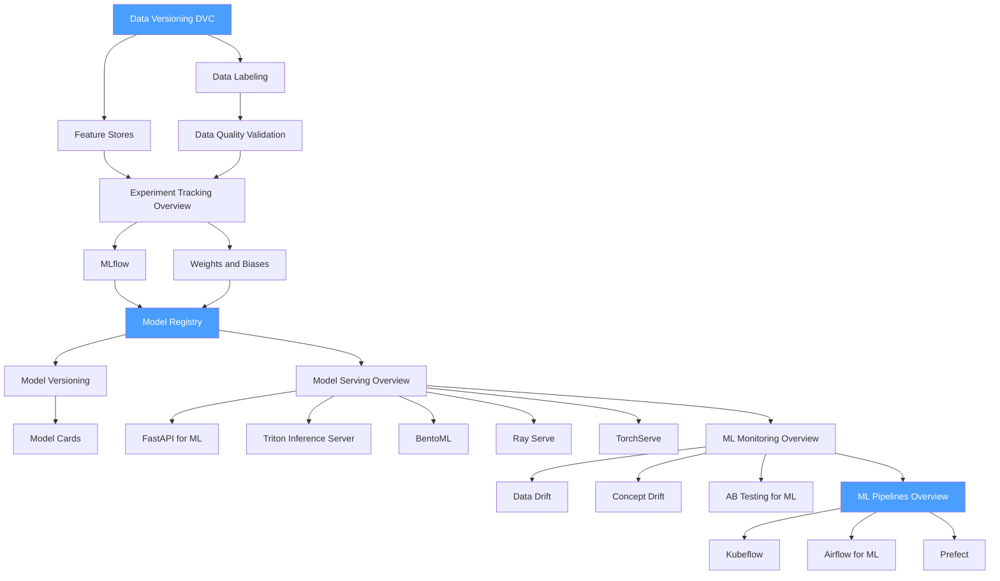

# 🗺️ MLOps — Map of Content

> [!info] How to use this map
> Start with Fundamentals, follow the arrows, and use the Learning Path below as your guide.

---

## Concept Map

---

## Learning Path

1. [[Data_Versioning_DVC]] — reproducibility starts with data; DVC establishes Git-like versioning for datasets and model artifacts
2. [[Feature_Stores]] — centralized feature computation and serving; eliminates train/serve skew in production systems
3. [[Data_Labeling]] — human annotation workflows, active learning, and label quality; data quality determines model ceiling
4. [[Data_Quality_Validation]] — schema validation, statistical checks, and great expectations patterns for pipeline safety
5. [[Experiment_Tracking_Overview]] — the why and how of logging metrics, params, and artifacts; foundational before picking a tool
6. [[MLflow]] — open-source experiment tracking, model registry, and project packaging; most widely deployed
7. [[Weights_and_Biases]] — cloud-native experiment tracking with rich visualizations, sweeps, and artifacts
8. [[Model_Registry]] — centralized catalog for model versions, staging, and promotion workflows
9. [[Model_Versioning]] — semantic versioning for models, lineage tracking, and rollback strategies
10. [[Model_Cards]] — structured documentation for model capabilities, limitations, and intended use
11. [[Model_Serving_Overview]] — REST/gRPC serving patterns, batching strategies, and latency vs. throughput trade-offs
12. [[FastAPI_for_ML]] — lightweight async Python serving with Pydantic validation; fastest path from model to endpoint
13. [[Triton_Inference_Server]] — NVIDIA's high-performance multi-framework inference server with dynamic batching
14. [[BentoML]] — framework-agnostic model packaging and serving with built-in Yatai registry
15. [[Ray_Serve]] — scalable model serving on Ray with fractional GPU and multi-model composition
16. [[TorchServe]] — PyTorch-native serving with TorchScript, handlers, and management API
17. [[ML_Monitoring_Overview]] — production monitoring strategy: what to measure, how often, and when to alert
18. [[Data_Drift]] — input distribution shift detection using PSI, KS test, and Wasserstein distance
19. [[Concept_Drift]] — label distribution and model performance degradation over time
20. [[AB_Testing_for_ML]] — shadow mode, canary, and full A/B deployment for safe model rollouts
21. [[ML_Pipelines_Overview]] — DAG-based workflow orchestration concepts; reusability, caching, and parameterization
22. [[Kubeflow]] — Kubernetes-native ML pipelines with KFP SDK, training operators, and KServe
23. [[Airflow_for_ML]] — using Apache Airflow DAGs for ML workflows; PythonOperator and sensor patterns
24. [[Prefect]] — modern Python-first workflow orchestration with dynamic task mapping and deployments

---

## All Notes in This Section

| Note | Core Idea | Difficulty |
|------|-----------|------------|
| [[Data_Versioning_DVC]] | Git extension for datasets and pipelines; remote storage integration | Beginner |
| [[Feature_Stores]] | Online/offline stores, point-in-time correct joins, and feature reuse | Intermediate |
| [[Data_Labeling]] | Annotation tooling, inter-annotator agreement, and active learning loops | Beginner |
| [[Data_Quality_Validation]] | Schema enforcement, statistical profiling, and expectation suites | Intermediate |
| [[Experiment_Tracking_Overview]] | What to log, how to structure runs, and comparison workflows | Beginner |
| [[MLflow]] | Tracking, Projects, Models, and Registry components | Intermediate |
| [[Weights_and_Biases]] | Runs, sweeps, artifacts, and tables for experiment management | Intermediate |
| [[Model_Registry]] | Staging transitions, aliases, approval gates, and CI/CD hooks | Intermediate |
| [[Model_Versioning]] | Semantic versioning, lineage graphs, and reproducibility metadata | Intermediate |
| [[Model_Cards]] | Intended use, evaluation results, ethical considerations, and caveats | Beginner |
| [[Model_Serving_Overview]] | Online vs. batch serving, SLA budgets, and serving stack components | Intermediate |
| [[FastAPI_for_ML]] | Async endpoints, Pydantic schemas, dependency injection, and background tasks | Intermediate |
| [[Triton_Inference_Server]] | Model repository, dynamic batching, ensemble pipelines, and DLIS | Advanced |
| [[BentoML]] | Runners, Services, Bentos, and Yatai deployment | Intermediate |
| [[Ray_Serve]] | Deployments, replicas, fractional GPU, and ingress routing | Advanced |
| [[TorchServe]] | MAR packaging, custom handlers, management REST API | Intermediate |
| [[ML_Monitoring_Overview]] | Logging, alerting, dashboards, and feedback loops for production models | Intermediate |
| [[Data_Drift]] | Covariate shift, PSI thresholds, and Evidently/WhyLogs integration | Intermediate |
| [[Concept_Drift]] | Label shift, performance-based alerting, and retraining triggers | Intermediate |
| [[AB_Testing_for_ML]] | Traffic splitting, statistical significance, and guardrail metrics | Advanced |
| [[ML_Pipelines_Overview]] | DAGs, steps, caching, parameters, and pipeline triggers | Intermediate |
| [[Kubeflow]] | KFP SDK, components, pipelines, training operators, and KServe | Advanced |
| [[Airflow_for_ML]] | DAG authoring, XCom, sensors, and ML-specific provider operators | Intermediate |
| [[Prefect]] | Flows, tasks, deployments, workers, and dynamic mapping | Intermediate |

---

## Key Questions This Section Answers

- How do you reproduce a model training run six months later?
- What is train/serve skew and how do feature stores prevent it?
- When should you use MLflow vs. Weights and Biases?
- What is the difference between a model registry and experiment tracking?
- How do you safely roll out a new model version to production?
- How do you detect and respond to data drift before model quality degrades?
- Which serving framework is the right fit for different deployment contexts?
- How do Kubeflow, Airflow, and Prefect differ as ML pipeline orchestrators?

---

## Connections to Other Sections

- [[_MOC_Infrastructure]] — containerization, Kubernetes, and GPU resource management underpin MLOps tooling and pipeline execution environments
- [[_MOC_Data_Engineering]] — data versioning, feature stores, and quality validation connect directly to upstream data engineering practices
- [[_MOC_AI_System_Design]] — MLOps patterns are the operational implementation of AI system design decisions around reliability, scalability, and maintainability
