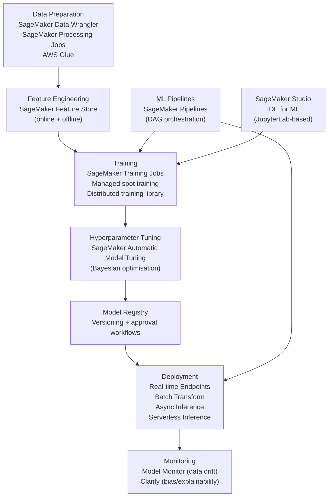

# ☁️ AWS SageMaker

> [!abstract] TL;DR
> AWS SageMaker is Amazon's fully managed ML platform. It handles the entire ML lifecycle: data prep, training (managed distributed jobs, spot instances), deployment (real-time and batch endpoints), and orchestration (Pipelines). Key advantages: deep AWS ecosystem integration (S3, ECR, IAM), managed spot training (up to 70% cost savings), and production-grade endpoint serving with autoscaling. Key tradeoffs: vendor lock-in, SageMaker's own abstractions add complexity over raw EC2, and cost management requires attention. SageMaker is the market leader for enterprise ML infrastructure on AWS.

## Intuition — Analogy First

SageMaker is like **renting a fully equipped commercial kitchen** rather than buying all the equipment yourself.

If you cook at home (DIY on EC2): you own the stove (GPU instances), buy all your own ingredients (datasets), install your own tools (pip, conda), and manage everything yourself. Full control but high operational overhead.

SageMaker is the professional kitchen rental: the stoves (GPU compute) are ready and provisioned on demand. The pantry organisation (data access from S3) is standardised. The kitchen has designated prep stations (Notebooks), cooking zones (Training Jobs), and plating areas (Endpoints for serving). The chef (you) focuses on the recipe (ML code) rather than kitchen management.

The trade-off: you must cook *their way* — standardised containers, specific APIs, SageMaker's execution model. Innovation chefs who need exotic equipment (very custom CUDA setups) may find the kitchen constraining.

## How It Works

### SageMaker Service Ecosystem



### Key Service Categories

**Training Jobs**: ephemeral compute clusters that spin up, run your training script, save artefacts to S3, and terminate. Managed networking, IAM, distributed training via SageMaker Distributed Library (SMDDP for data parallelism, SMMP for model parallelism).

**Managed Spot Training**: uses EC2 Spot Instances (spare capacity) at up to 70% discount. SageMaker handles checkpoint-based interruption recovery automatically.

**Endpoints**:
- **Real-time**: persistent endpoint with <100ms SLA; autoscales with CloudWatch metrics
- **Batch Transform**: run predictions over large S3 datasets asynchronously
- **Async Inference**: for large payloads (video, large docs); results to S3
- **Serverless**: pay-per-request, 0-to-N scaling; cold start ~1s

**SageMaker Pipelines**: MLflow-like DAG pipeline for chaining processing → training → evaluation → deployment steps. Integrates with EventBridge for scheduled or event-triggered retraining.

### Built-in Algorithms

SageMaker provides pre-built, distributed implementations of common algorithms: XGBoost, Linear Learner, K-Means, Random Cut Forest (anomaly detection), BlazingText (fastText-compatible), Object Detection, Image Classification, Seq2Seq. These require only data in S3 — no code needed.

## The Math

**Spot instance savings**:

$$\text{Effective cost} = \text{on-demand cost} \times (1 - \text{spot discount}) + \text{checkpoint overhead}$$

Typical: 70% discount. A $100 training job costs ~$30 on Spot. Checkpoint overhead: saving every N minutes adds ~5–10% to total time.

**SageMaker pricing model**:

$$\text{Training cost} = \text{instance count} \times \text{instance hours} \times \text{price per hour}$$

E.g., ml.p4d.24xlarge (8× A100) = \$32.77/hr. 100 hours of training = \$3,277. With Spot: ~\$983.

**Endpoint scaling**: SageMaker uses target tracking autoscaling. Scale out when `InvocationsPerInstance > threshold`:

$$\text{instances\_needed} = \lceil \text{RPS} / \text{threshold} \rceil$$

## Code Demo

```python
import sagemaker
from sagemaker import get_execution_role
from sagemaker.estimator import Estimator
from sagemaker.pytorch import PyTorch
import boto3

# ── Setup ─────────────────────────────────────────────────────────
session = sagemaker.Session()
role = get_execution_role()          # IAM role with S3/ECR/SageMaker access
region = boto3.session.Session().region_name
bucket = session.default_bucket()    # S3 bucket for artefacts

# ── Training Job with built-in PyTorch container ──────────────────
estimator = PyTorch(
    entry_point="train.py",          # your training script
    source_dir="./src",              # directory with train.py + requirements.txt
    role=role,
    framework_version="2.1",
    py_version="py310",
    instance_type="ml.p3.2xlarge",   # 1× V100 16GB
    instance_count=1,

    # Hyperparameters passed as CLI args to train.py: --lr 0.001 etc.
    hyperparameters={
        "epochs": 10,
        "batch-size": 64,
        "lr": 0.001,
    },

    # Spot training (70% savings)
    use_spot_instances=True,
    max_run=7200,                    # max 2 hours (including spot interruptions)
    max_wait=10800,                  # max 3 hours total wait
    checkpoint_s3_uri=f"s3://{bucket}/checkpoints/",

    output_path=f"s3://{bucket}/output/",
    environment={
        "NCCL_DEBUG": "WARN",
    },
)

# Launch training job
estimator.fit({
    "train": f"s3://{bucket}/data/train",
    "val": f"s3://{bucket}/data/val",
})

# ── Distributed Training (DDP) ────────────────────────────────────
ddp_estimator = PyTorch(
    entry_point="train_ddp.py",
    role=role,
    framework_version="2.1",
    py_version="py310",
    instance_type="ml.p4d.24xlarge",   # 8× A100 40GB per instance
    instance_count=4,                  # 32 GPUs total

    # SageMaker Distributed Data Parallel (wraps torch.distributed)
    distribution={
        "torch_distributed": {"enabled": True}
    },
    hyperparameters={"epochs": 3},
)

# ── Model Registry ────────────────────────────────────────────────
model = estimator.create_model()
model_package = model.register(
    model_package_group_name="MyModelPackageGroup",
    inference_instances=["ml.m5.xlarge", "ml.p2.xlarge"],
    transform_instances=["ml.m5.xlarge"],
    approval_status="PendingManualApproval",
    content_types=["application/json"],
    response_types=["application/json"],
)

# ── Endpoint Deployment ───────────────────────────────────────────
predictor = estimator.deploy(
    initial_instance_count=1,
    instance_type="ml.m5.xlarge",       # CPU endpoint for serving
    endpoint_name="my-model-v1",
)

# Autoscaling: scale out when >100 invocations/instance
client = boto3.client("application-autoscaling")
client.register_scalable_target(
    ServiceNamespace="sagemaker",
    ResourceId=f"endpoint/my-model-v1/variant/AllTraffic",
    ScalableDimension="sagemaker:variant:DesiredInstanceCount",
    MinCapacity=1,
    MaxCapacity=10,
)
client.put_scaling_policy(
    PolicyName="InvocationsScaling",
    ServiceNamespace="sagemaker",
    ResourceId=f"endpoint/my-model-v1/variant/AllTraffic",
    ScalableDimension="sagemaker:variant:DesiredInstanceCount",
    PolicyType="TargetTrackingScaling",
    TargetTrackingScalingPolicyConfiguration={
        "TargetValue": 100,
        "PredefinedMetricSpecification": {
            "PredefinedMetricType": "SageMakerVariantInvocationsPerInstance"
        },
    },
)

# ── Prediction ────────────────────────────────────────────────────
import json
import numpy as np

payload = json.dumps({"inputs": np.random.randn(1, 512).tolist()})
response = predictor.predict(payload)

# Cleanup
predictor.delete_endpoint()

# ── SageMaker Pipeline (end-to-end workflow) ──────────────────────
from sagemaker.workflow.pipeline import Pipeline
from sagemaker.workflow.steps import TrainingStep, ProcessingStep
from sagemaker.workflow.parameters import ParameterString

# Define pipeline parameters
model_approval_status = ParameterString(name="ModelApprovalStatus", default_value="PendingManualApproval")

# (Build processing, training, evaluation, registration steps...)
# pipeline = Pipeline(
#     name="MyMLPipeline",
#     parameters=[model_approval_status],
#     steps=[processing_step, training_step, eval_step, register_step],
#     sagemaker_session=session,
# )
# pipeline.upsert(role_arn=role)
# execution = pipeline.start()
```

## Real-World Example

**Thomson Reuters** migrated their NLP classification pipeline for legal document processing to SageMaker:

- **Before**: fixed on-premise GPU cluster, 6-week model deployment cycle, low utilisation during off-peak hours.
- **After with SageMaker**: training jobs spin up on demand; SageMaker Pipelines automate the train → evaluate → register → deploy cycle; managed endpoints auto-scale with document submission load.
- **Cost impact**: 60% reduction in infrastructure cost. Spot training for experimental models reduces R&D compute cost by 70%. Utilisation went from ~30% (fixed cluster) to ~90% (on-demand).
- **Deployment speed**: from 6 weeks to 3 days (SageMaker Pipelines with automated evaluation gates and one-click deployment via Model Registry).

**GE Healthcare** uses SageMaker for medical imaging model training:
- Multi-instance p4d.24xlarge training jobs with SageMaker DDP for 3D CT scan segmentation models.
- SageMaker Model Monitor detects data drift when scanner hardware changes cause distribution shift.
- Batch Transform for offline analysis of patient scan archives.

## Trade-offs

| Feature | Advantage | Disadvantage |
|---|---|---|
| Managed compute | Zero infrastructure management | Higher cost than raw EC2 |
| Spot training | 70% cost savings | Requires checkpoint handling |
| Endpoint serving | Autoscaling, A/B testing, monitoring | Cold start on serverless; min 1 instance for real-time |
| Pipelines | Reproducible MLOps workflows | Learning curve; AWS-specific |
| Built-in algorithms | No code needed for common tasks | Limited customisation |
| Container support | Bring your own Docker image | Image management overhead |
| Studio IDE | Integrated UI for full lifecycle | Slower than local Jupyter |
| Cost | Per-second billing | Hard to predict; can surprise |

## When to Use vs Avoid

**Use SageMaker when:**
- Already using AWS (S3, ECR, Lambda, CloudWatch) — integration is seamless
- Need managed distributed training without Kubernetes expertise
- Bursty training workloads where on-demand is cheaper than a fixed cluster
- Enterprise compliance requirements (VPC, IAM, audit trails built in)

**Use DIY EC2 when:**
- Need maximum CUDA/driver control (custom CUDA versions, specialized hardware)
- Team has strong Kubernetes/infrastructure expertise
- Cost optimisation at large scale (SageMaker markup over raw EC2 is ~20–30%)

**Avoid SageMaker when:**
- Primarily on GCP or Azure — vendor lock-in makes migration expensive
- Real-time serving with extremely tight latency (<10ms) — managed endpoints add overhead
- Very simple models — the SageMaker overhead is not worth it for trivial deployments

## Common Pitfalls

1. **Not using Spot for training**: skipping Spot training because of checkpoint complexity is expensive. SageMaker makes checkpoint recovery nearly automatic — always use Spot for jobs > 30 minutes.
2. **Large Docker images**: base PyTorch SageMaker containers are 10–20GB. Custom layers on top add pull time. Use multi-stage builds and layer caching to keep images < 5GB.
3. **Not configuring VPC**: default SageMaker training jobs use public subnets with internet access. For sensitive data, always configure private VPC with VPC-only S3 endpoints.
4. **Forgetting to delete endpoints**: idle real-time endpoints bill at the full instance rate even with zero traffic. Always delete unused endpoints; use serverless for development.
5. **Model Monitor threshold calibration**: SageMaker Model Monitor requires baseline statistics from training data. If the baseline statistics are computed from a non-representative sample, drift alarms are noisy.

## Related Concepts

- [[_MOC_Infrastructure|↑ Section MOC]]

- [[GCP_Vertex_AI]] — GCP's equivalent managed ML platform
- [[Azure_ML]] — Microsoft's managed ML platform
- [[Kubeflow]] — open-source alternative on any Kubernetes cluster
- [[MLflow]] — experiment tracking that integrates with SageMaker
- [[Docker_for_ML]] — SageMaker training uses Docker containers exclusively

## Review Questions

1. A SageMaker training job using a p3.8xlarge (4× V100) instance runs for 20 hours at \$12.24/hr. Calculate the cost with and without Spot training. What does the training script need to support for Spot to work?
2. Explain the difference between SageMaker real-time endpoints and batch transform jobs. Give an example use case where each is the correct choice.
3. Your SageMaker training job fails silently — the job shows "Completed" but model accuracy is random. List three debugging steps, specifying which SageMaker tools or AWS services you'd use for each.

## Sources

- AWS SageMaker Developer Guide: https://docs.aws.amazon.com/sagemaker/
- AWS SageMaker pricing: https://aws.amazon.com/sagemaker/pricing/
- SageMaker Distributed Training Library: https://docs.aws.amazon.com/sagemaker/latest/dg/distributed-training.html
- Thomson Reuters case study: https://aws.amazon.com/solutions/case-studies/thomson-reuters/
- SageMaker Python SDK: https://sagemaker.readthedocs.io/

#aws #sagemaker #cloud #infrastructure #mlops #managed-ml
