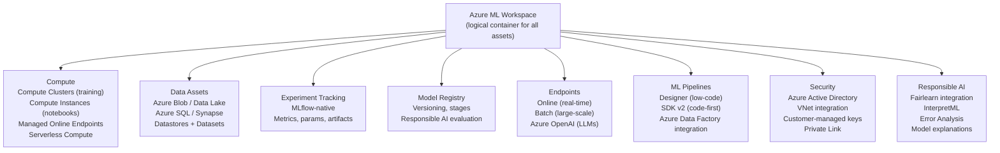

# 🔷 Azure ML

> [!abstract] TL;DR
> Azure Machine Learning is Microsoft's managed ML platform, tightly integrated with the Azure ecosystem (Azure OpenAI, Synapse Analytics, Azure Data Factory, Power BI). It provides managed compute clusters, an MLflow-native experiment tracking system, a Designer (drag-and-drop pipeline builder), a Python SDK v2 for code-first workflows, a Model Registry with responsible AI evaluation tools, and online/batch endpoints. Its differentiators: first-class Azure OpenAI integration for LLM fine-tuning, the broadest compliance portfolio (HIPAA, FedRAMP, SOC 2), and MLflow as the native tracking backend. Preferred for regulated industries and Microsoft-ecosystem organisations.

## Intuition — Analogy First

Azure ML is **Microsoft's ML cloud platform — your best choice if your organisation already lives in Azure**.

If SageMaker is Amazon's kitchen and Vertex AI is Google's research lab, then Azure ML is **Microsoft's enterprise conference centre kitchen**: it may not have the most exotic tools, but it has the best compliance paperwork (HIPAA, FedRAMP, ISO), the strongest integration with Microsoft 365 (Active Directory for access control, Teams for alerts), and now, direct plumbing to the most powerful LLM APIs available via Azure OpenAI Service.

The distinguishing feature for 2024+: Azure ML is where you go to fine-tune or deploy GPT-4, GPT-4o, and other OpenAI models in an enterprise-compliant environment. If your organisation has data sovereignty requirements or regulatory constraints that make calling the public OpenAI API impossible, Azure ML + Azure OpenAI Service is the answer.

## How It Works

### Azure ML Workspace Architecture



### Compute Options

| Type | Use Case | Notes |
|---|---|---|
| Compute Instance | Interactive development, Jupyter | Single VM; user-managed |
| Compute Cluster | Batch training, autoscaling | Scales 0-to-N, cost-efficient |
| Kubernetes Cluster | Online endpoints, custom infrastructure | Attach any AKS cluster |
| Serverless Compute | Lightweight jobs, pipelines | No cluster management |
| Managed Online Endpoint | Real-time inference | Autoscaling, A/B deployment |
| Batch Endpoint | Large-scale offline inference | Parallelised batch scoring |

### MLflow Integration

Azure ML uses MLflow as its **native experiment tracking backend** — every training run automatically logs to MLflow. This means:
- Any code that calls `mlflow.log_metric()` works out of the box
- Experiments from local dev, on-prem, and Azure are all viewable in one UI
- Models logged with `mlflow.pytorch.log_model()` are directly deployable to Azure endpoints

### Responsible AI Dashboard

Unique to Azure ML: the Responsible AI Dashboard integrates Fairlearn (bias analysis), InterpretML (feature importance), and Error Analysis (failure mode identification) into a single post-training evaluation workflow:

- **Error Analysis**: identify subpopulations where model fails disproportionately
- **Model Explanations**: SHAP values for feature importance at global and local level
- **Fairness Assessment**: demographic parity, equalized odds across protected attributes
- **Counterfactual Analysis**: "what if" feature changes needed to flip prediction

## The Math

**Azure ML compute cluster cost**:

$$\text{Cost} = \text{nodes} \times \text{hours} \times \text{price/hr (VM type)}$$

Low-priority VMs (Azure's equivalent of Spot) give up to 80% discount. Example:
- Standard_NC24s_v3 (4× V100 32GB): \$4.70/hr standard, \$0.94/hr low-priority
- Standard_ND96asr_A100_v4 (8× A100 80GB): \$28.00/hr standard, \$5.60/hr low-priority

**Pipeline scheduling**: Azure ML pipelines can be triggered by:
- Cron schedule
- Data arrival in Azure Blob (EventGrid trigger)
- Azure Data Factory pipeline completion

## Code Demo

```python
from azure.ai.ml import MLClient, command, Input, Output
from azure.ai.ml.entities import (
    AmlCompute,
    ManagedOnlineEndpoint,
    ManagedOnlineDeployment,
    Model,
    Environment,
    Data,
)
from azure.ai.ml.constants import AssetTypes
from azure.identity import DefaultAzureCredential
import mlflow

# ── Setup ─────────────────────────────────────────────────────────
credential = DefaultAzureCredential()
ml_client = MLClient(
    credential=credential,
    subscription_id="your-subscription-id",
    resource_group_name="your-resource-group",
    workspace_name="your-workspace",
)

# ── Create compute cluster ─────────────────────────────────────────
cluster = AmlCompute(
    name="gpu-cluster",
    type="amlcompute",
    size="Standard_NC6s_v3",      # 1× V100 16GB
    min_instances=0,               # scale to zero when idle
    max_instances=4,
    idle_time_before_scale_down=180,  # seconds
    tier="LowPriority",            # ~80% cheaper than Dedicated
)
ml_client.compute.begin_create_or_update(cluster).result()

# ── Define and run a training job ─────────────────────────────────
job = command(
    code="./src",                  # local directory with training code
    command="python train.py --lr ${{inputs.lr}} --epochs ${{inputs.epochs}}",
    inputs={
        "lr": 0.001,
        "epochs": 10,
        "train_data": Input(
            path="azureml://datastores/my_datastore/paths/train/",
            type=AssetTypes.URI_FOLDER
        ),
    },
    outputs={
        "model": Output(type=AssetTypes.MLFLOW_MODEL)
    },
    environment="AzureML-pytorch-2.0-ubuntu20.04-py38-cuda11-gpu:latest",
    compute="gpu-cluster",
    display_name="pytorch-training",
    experiment_name="my-experiment",
    tags={"team": "ml-platform", "version": "1.0"},
)

returned_job = ml_client.jobs.create_or_update(job)
ml_client.jobs.stream(returned_job.name)  # stream logs to console

# ── MLflow tracking within train.py ──────────────────────────────
# Inside train.py:
def train_with_mlflow():
    mlflow.set_tracking_uri(os.environ["MLFLOW_TRACKING_URI"])
    mlflow.start_run()

    mlflow.log_params({"lr": 0.001, "epochs": 10, "batch_size": 32})

    for epoch in range(10):
        # ... training ...
        mlflow.log_metrics({"train_loss": 0.5, "val_acc": 0.92}, step=epoch)

    mlflow.pytorch.log_model(model, "model")  # registers in Azure ML Model Registry
    mlflow.end_run()

# ── Hyperparameter sweep (grid/random/Bayesian) ───────────────────
from azure.ai.ml.sweep import Choice, Uniform, BayesianSamplingAlgorithm
from azure.ai.ml import sweep

sweep_job = job(
    lr=Uniform(min_value=1e-5, max_value=1e-2),
    epochs=Choice([5, 10, 20]),
)
sweep_spec = sweep(
    trial=sweep_job,
    sampling_algorithm=BayesianSamplingAlgorithm(),
    primary_metric="val_accuracy",
    goal="Maximize",
    max_total_trials=30,
    max_concurrent_trials=3,
    early_termination_policy={"type": "bandit", "slack_factor": 0.1},
)
returned_sweep = ml_client.jobs.create_or_update(sweep_spec)

# ── Register model and deploy to online endpoint ──────────────────
# Register MLflow model from training job output
registered_model = ml_client.models.create_or_update(
    Model(
        path=f"azureml://jobs/{returned_job.name}/outputs/model",
        name="my-pytorch-model",
        type=AssetTypes.MLFLOW_MODEL,
        description="PyTorch classifier v1",
    )
)

# Create endpoint
endpoint = ManagedOnlineEndpoint(
    name="my-model-endpoint",
    description="Real-time inference endpoint",
    auth_mode="key",
)
ml_client.online_endpoints.begin_create_or_update(endpoint).result()

# Deploy blue/green (traffic split)
blue_deployment = ManagedOnlineDeployment(
    name="blue",
    endpoint_name="my-model-endpoint",
    model=registered_model,
    instance_type="Standard_DS3_v2",
    instance_count=1,
    liveness_probe={"initial_delay": 10, "period": 30},
)
ml_client.online_deployments.begin_create_or_update(blue_deployment).result()

# Route 100% traffic to blue
endpoint.traffic = {"blue": 100}
ml_client.online_endpoints.begin_create_or_update(endpoint).result()

# Invoke endpoint
result = ml_client.online_endpoints.invoke(
    endpoint_name="my-model-endpoint",
    request_file="./sample_request.json",
    deployment_name="blue",
)
print(result)

# ── Azure OpenAI Fine-tuning (via Azure ML) ───────────────────────
# Requires azure-ai-openai SDK + Azure OpenAI resource
import openai

# Configure for Azure OpenAI endpoint
client = openai.AzureOpenAI(
    azure_endpoint="https://your-resource.openai.azure.com/",
    api_version="2024-02-01",
)

# Submit fine-tuning job
response = client.fine_tuning.jobs.create(
    training_file="file-abc123",  # uploaded JSONL
    model="gpt-4o-mini-2024-07-18",
    hyperparameters={"n_epochs": 3, "learning_rate_multiplier": 1.0},
)
print(f"Fine-tuning job: {response.id}")

# ── Responsible AI Dashboard evaluation ──────────────────────────
# (Configured via Azure ML Studio UI or yaml pipeline step)
# Automatically generates SHAP explanations, error analysis,
# and fairness metrics after model registration.
```

## Real-World Example

**Humana** (US Health Insurance) — responsible AI for healthcare ML on Azure ML.

Healthcare ML has strict regulatory requirements: HIPAA for data privacy, FDA 21 CFR Part 11 for audit trails, and CMS requirements for algorithmic fairness in insurance decisions.

- **Compliance requirement**: all model training must occur within a private VNet (no internet egress), with customer-managed encryption keys, and a full audit trail of every model version.
- **Azure ML solution**: workspace deployed in private VNet with Private Link (no public endpoint), Azure Key Vault with customer-managed keys for all data encryption, and MLflow's experiment tracking providing immutable audit trail.
- **Responsible AI use**: after training readmission risk prediction models, the Responsible AI Dashboard identified that the model had 8% lower accuracy for non-English-speaking patients (a proxy for socioeconomic status). The team used Error Analysis to identify the specific failure modes and augmented training data accordingly.
- **Azure OpenAI integration**: Humana deployed GPT-4 via Azure OpenAI (not the public API) for clinical notes summarisation — meeting HIPAA requirements since the data never leaves their Azure tenant.

**Volkswagen Group** uses Azure ML for quality defect prediction in manufacturing:
- Sensor time-series data from production lines → Azure Stream Analytics → Azure ML real-time inference → defect alert within 50ms.
- Azure ML Pipelines retrain models nightly on new production data.

## Trade-offs

| Feature | Azure ML Advantage | Azure ML Limitation |
|---|---|---|
| Compliance | Broadest portfolio (HIPAA, FedRAMP, SOC2) | Compliance setup is complex |
| Azure OpenAI | Direct GPT-4/o access in compliance boundary | Tied to Microsoft's OpenAI pricing |
| MLflow integration | Native; local → Azure seamlessly | MLflow learning curve |
| Responsible AI tools | Best-in-class fairness + explainability | Adds pipeline step overhead |
| Designer | Low-code drag-and-drop | Less powerful than code-first |
| SDK v2 | Clean, modern API | Breaking change from SDK v1 |
| Cost | Competitive; low-priority VM savings | Resource group complexity |
| AKS endpoint | Full Kubernetes flexibility | Requires K8s expertise |

## When to Use vs Avoid

**Use Azure ML when:**
- Organisation is in Microsoft ecosystem (Azure Active Directory, Office 365, Teams)
- Regulated industry requiring HIPAA, FedRAMP, or GDPR compliance tooling
- Need enterprise MLflow experiment tracking with Azure AD SSO
- Plan to use Azure OpenAI for LLM fine-tuning in a compliant environment
- Responsible AI governance is a hard requirement

**Avoid Azure ML when:**
- Primarily AWS or GCP shop — cross-cloud data transfer costs and IAM complexity
- Need TPU access (not available on Azure)
- Simple ML workloads where full SaaS overhead isn't justified

## Common Pitfalls

1. **SDK v1 vs v2 confusion**: Azure ML has a deprecated SDK v1 (`azureml.core`) and a current SDK v2 (`azure.ai.ml`). Much online documentation is v1 — always check the SDK version. Migrate to v2.
2. **Low-priority VM interruptions**: Azure's low-priority VMs are reclaimed with only 30 seconds notice (less warning than AWS Spot). Checkpoint every 5–10 minutes, not every hour.
3. **Private endpoint misconfiguration**: private endpoints for storage accounts must be configured in the same VNet as compute clusters. Missing this causes training jobs to silently fail with auth errors.
4. **MLflow autolog conflicts**: `mlflow.autolog()` interferes with manual `mlflow.log_metric()` calls in some frameworks. Explicitly disable autolog for frameworks you don't want it on.
5. **Model asset path vs MLflow model**: Azure ML has two model types — `AssetTypes.MLFLOW_MODEL` (auto-infers scoring script) and custom model (requires explicit scoring script). Deploying an MLflow model as a custom model causes deployment errors.

## Related Concepts

- [[_MOC_Infrastructure|↑ Section MOC]]

- [[AWS_SageMaker]] — AWS equivalent; compare for org decision
- [[GCP_Vertex_AI]] — GCP equivalent
- [[MLflow]] — native tracking backend for Azure ML
- [[Kubernetes_for_ML]] — Azure ML can attach AKS clusters for flexible compute
- [[Docker_for_ML]] — all Azure ML training runs inside Docker containers

## Review Questions

1. A healthcare company needs to fine-tune GPT-4 on patient records for clinical note summarisation. They cannot use the public OpenAI API due to HIPAA. Describe the Azure ML + Azure OpenAI architecture that satisfies HIPAA requirements, specifying the key Azure services and their configuration.
2. Explain why Azure ML uses MLflow as its native tracking backend rather than a proprietary tracking system. What benefit does this provide to teams who also do local development or multi-cloud experimentation?
3. Your Azure ML training job on a low-priority VM cluster fails with `AmlComputePreemptedException` after 4 hours. The script has no checkpointing. What two changes would you make to the training script and job configuration to make this job cost-effective and resilient?

## Sources

- Azure Machine Learning documentation: https://learn.microsoft.com/en-us/azure/machine-learning/
- Azure ML SDK v2 reference: https://learn.microsoft.com/en-us/python/api/azure-ai-ml/
- Azure Responsible AI: https://learn.microsoft.com/en-us/azure/machine-learning/concept-responsible-ai-dashboard
- Azure OpenAI fine-tuning: https://learn.microsoft.com/en-us/azure/ai-services/openai/how-to/fine-tuning
- Microsoft, "Responsible AI Standard" (2022): https://blogs.microsoft.com/on-the-issues/2022/06/21/microsofts-framework-for-building-ai-systems-responsibly/

#azure #azure-ml #cloud #infrastructure #mlops #mlflow #responsible-ai
