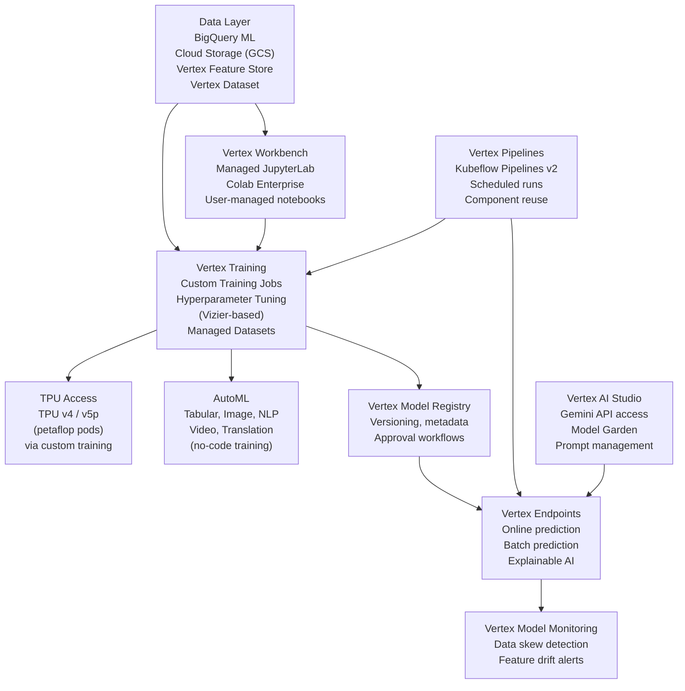

# 🔵 GCP Vertex AI

> [!abstract] TL;DR
> Vertex AI is Google Cloud's unified ML platform, launched 2021 as a consolidation of AI Platform, AutoML, and Data Labeling. It offers managed training (custom jobs, hyperparameter tuning), Vertex Endpoints for serving, Kubeflow-based Vertex Pipelines, a Model Registry, Feature Store, Workbench (managed JupyterLab), and native TPU access. Its differentiators vs SageMaker: tighter BigQuery integration, native TPU support, Colab Enterprise, and better AutoML for tabular/image/NLP. Spotify and Wayfair use it for large-scale recommendation training. Best suited for GCP-native orgs with BigQuery data assets.

## Intuition — Analogy First

GCP Vertex AI is **Google's answer to SageMaker, with its own distinctive flavour**.

If SageMaker is Amazon's professional kitchen rental optimised for AWS ingredients (S3, Lambda), then Vertex AI is Google's research lab kitchen — it has all the same cooking stations but the pantry connects directly to Google's data warehouse (BigQuery), the equipment includes Google's own custom hardware (TPUs), and the recipes (AutoML) are more automated for common tasks.

The unique advantage: if your data lives in BigQuery (petabyte-scale SQL analytics), Vertex AI can read it directly for training — no intermediate S3-equivalent export. And if you need raw compute power beyond what GPUs offer, TPU v4 pods (with 4,096 chips connected by 3D torus interconnect) are available on demand.

Think of it as choosing between two professional kitchens: SageMaker if you're deep in the AWS ecosystem, Vertex AI if you're deep in GCP, especially if you use BigQuery, Looker, or plan to call Gemini APIs.

## How It Works

### Vertex AI Service Components



### Custom Training Jobs

Vertex custom training is container-first: package your code as a Docker image or Python package, specify compute resources, and Vertex provisions and manages the cluster.

Compute options:
- **Standard machine types**: `n1-standard-8`, `c2-standard-60` (CPU-only)
- **Accelerator types**: `NVIDIA_TESLA_V100`, `NVIDIA_A100_80GB`, `NVIDIA_H100_80GB`
- **TPU types**: `TPU_V4_POD`, `TPU_V5_LITEPOD` — unique to GCP
- **Reduction server**: GCP's proprietary all-reduce implementation (replaces NCCL for TPU/GPU hybrid)

### Vertex Pipelines

Built on Kubeflow Pipelines v2 (KFP). Pipelines are defined as Python DAGs using the `@component` decorator:

```python
@component(packages_to_install=["scikit-learn"])
def train_model(dataset: Input[Dataset], model: Output[Model]):
    ...
```

Compiled to YAML and executed on managed Kubernetes. Artifacts (datasets, models) are first-class tracked objects with lineage. Supports conditional branches, loops, and exit handlers.

Vertex Pipelines is interoperable with Kubeflow Pipelines — the same pipeline code runs on self-managed KFP or Vertex.

### Vertex Feature Store

Managed online + offline feature serving:
- **Offline store**: BigQuery tables (columnar, batch queries)
- **Online store**: Cloud Bigtable (low-latency, key-value, <10ms p99)
- **Batch serving**: read features directly into training via BigQuery SQL
- **Online serving**: REST API for real-time feature retrieval at inference

### Vertex AI Model Garden and Gemini

As of 2024, Vertex AI integrates Google's foundation models:
- **Gemini Pro/Ultra** via `vertexai.generative_models`
- **PaLM 2, Codey, Imagen** via Vertex endpoints
- Third-party open-source models (LLaMA-3, Mistral, Gemma) deployable via Model Garden
- Fine-tuning: supervised fine-tuning of Gemini and PaLM 2 via managed fine-tuning API

## The Math

**Vertex AI pricing** (Custom Training, as of 2024):

$$\text{Cost} = \text{accelerator count} \times \text{hours} \times \text{price/accelerator-hour}$$

- A100 (40GB): \$2.93/hr per GPU
- A100 (80GB): \$3.67/hr per GPU
- TPU v4 (8 cores): \$4.00/hr per chip

**TPU v4 advantage for transformers**: TPU v4 128-core pod: 275 PFLOPS at BF16. vs 128× A100 80GB: ~127 PFLOPS. TPU v4 is ~2× more efficient for transformer-style workloads with regular memory access patterns.

**BigQuery ML training cost**: BigQuery charges per bytes processed + per model training hour, making it much cheaper than provisioning a GPU cluster for simple models:

$$\text{BigQuery ML cost} \approx \$5\text{/GB processed} + \text{compute for training}$$

## Code Demo

```python
from google.cloud import aiplatform
from google.cloud.aiplatform import CustomTrainingJob, Endpoint
import vertexai
from vertexai.language_models import TextGenerationModel
from kfp import dsl
from kfp.dsl import Dataset, Input, Output, Model, Metrics
from google.cloud.aiplatform import pipeline_jobs

# ── Setup ─────────────────────────────────────────────────────────
PROJECT_ID = "my-gcp-project"
REGION = "us-central1"
BUCKET = "gs://my-bucket"

aiplatform.init(project=PROJECT_ID, location=REGION, staging_bucket=BUCKET)

# ── Custom Training Job (pre-built PyTorch container) ─────────────
job = aiplatform.CustomTrainingJob(
    display_name="pytorch-training-job",
    script_path="train.py",             # local script, uploaded to GCS
    container_uri="us-docker.pkg.dev/vertex-ai/training/pytorch-gpu.2-1:latest",
    requirements=["transformers==4.40.0", "datasets==2.14.0"],
    model_serving_container_image_uri="us-docker.pkg.dev/vertex-ai/prediction/pytorch-gpu.2-1:latest",
)

model = job.run(
    dataset=None,
    model_display_name="my-pytorch-model",
    args=["--epochs=10", "--batch-size=32"],
    replica_count=1,
    machine_type="n1-standard-8",
    accelerator_type="NVIDIA_TESLA_A100",
    accelerator_count=1,
    base_output_dir=f"{BUCKET}/training-output",
    sync=True,  # wait for job to complete
)

# ── Multi-GPU distributed training ────────────────────────────────
distributed_job = aiplatform.CustomContainerTrainingJob(
    display_name="distributed-training",
    container_uri="gcr.io/my-project/my-training-image:latest",
)

distributed_model = distributed_job.run(
    replica_count=4,                    # 4 machines × 8 GPUs = 32 GPUs
    machine_type="a2-highgpu-8g",       # 8× A100 40GB
    accelerator_type="NVIDIA_TESLA_A100",
    accelerator_count=8,
    args=["--use-distributed"],
    # Vertex handles torchrun / nccl init automatically
)

# ── Hyperparameter Tuning (Vizier-backed) ────────────────────────
from google.cloud.aiplatform import HyperparameterTuningJob
import google.cloud.aiplatform_v1beta1 as aip_v1beta1

hp_job = aiplatform.HyperparameterTuningJob(
    display_name="hp-tuning",
    custom_job=job,
    metric_spec={"val_accuracy": "maximize"},
    parameter_spec={
        "lr": aip_v1beta1.DoubleParameterSpec(min=1e-5, max=1e-2, scale="log"),
        "batch_size": aip_v1beta1.DiscreteParameterSpec(values=[16, 32, 64, 128]),
        "num_layers": aip_v1beta1.IntegerParameterSpec(min=2, max=12, scale="linear"),
    },
    max_trial_count=50,
    parallel_trial_count=5,
    search_algorithm="random",  # or "grid" or "bayesian" (default)
)
hp_job.run()

# ── Deploy Model to Endpoint ──────────────────────────────────────
endpoint = model.deploy(
    machine_type="n1-standard-4",
    min_replica_count=1,
    max_replica_count=10,
    accelerator_type="NVIDIA_TESLA_T4",
    accelerator_count=1,
    endpoint_display_name="my-model-endpoint",
    traffic_split={"0": 100},
)

# Prediction
import numpy as np
instances = [{"inputs": np.random.randn(512).tolist()}]
predictions = endpoint.predict(instances=instances)
print(predictions)

# ── Vertex Pipeline (Kubeflow v2) ──────────────────────────────────
@dsl.component(
    packages_to_install=["sklearn", "pandas"],
    base_image="python:3.10",
)
def preprocess(
    raw_data: Input[Dataset],
    processed_data: Output[Dataset],
    metrics: Output[Metrics],
):
    import pandas as pd
    df = pd.read_csv(raw_data.path)
    # ... preprocessing ...
    df.to_csv(processed_data.path, index=False)
    metrics.log_metric("num_rows", len(df))

@dsl.component(packages_to_install=["sklearn"])
def train_and_evaluate(
    data: Input[Dataset],
    model_artifact: Output[Model],
    metrics: Output[Metrics],
    learning_rate: float = 0.01,
):
    # ... training ...
    metrics.log_metric("accuracy", 0.95)

@dsl.pipeline(name="ml-pipeline", pipeline_root=f"{BUCKET}/pipeline-root")
def ml_pipeline(project: str = PROJECT_ID):
    raw_dataset = dsl.importer(
        artifact_uri=f"{BUCKET}/data/raw.csv",
        artifact_class=Dataset,
    ).output

    preprocess_task = preprocess(raw_data=raw_dataset)
    train_task = train_and_evaluate(
        data=preprocess_task.outputs["processed_data"],
        learning_rate=0.001,
    )

# Compile and run
from kfp import compiler
compiler.Compiler().compile(ml_pipeline, "pipeline.yaml")

pipeline_job = aiplatform.PipelineJob(
    display_name="ml-pipeline-run",
    template_path="pipeline.yaml",
    parameter_values={"project": PROJECT_ID},
)
pipeline_job.run(sync=True)

# ── Vertex AI Studio / Gemini (LLM) ──────────────────────────────
vertexai.init(project=PROJECT_ID, location=REGION)
model = TextGenerationModel.from_pretrained("text-bison")
response = model.predict("Summarise this document: ...", max_output_tokens=256)
print(response.text)
```

## Real-World Example

**Spotify** — recommendation systems and podcast discovery on Vertex AI.

Spotify generates personalised "Daily Mix" and "Discover Weekly" playlists using models trained on billions of user interactions. Their ML pipeline on Vertex AI:

- **Scale**: 400M+ users, training on petabyte-scale interaction data in BigQuery.
- **BigQuery ML integration**: feature engineering SQL runs directly in BigQuery; exported features feed into Vertex Training jobs without intermediate ETL pipelines — saving ~6 hours of daily data prep.
- **Vertex Pipelines**: automated weekly retraining triggered by data freshness metrics (BigQuery row count crossing a threshold → EventBridge → Vertex Pipeline run).
- **TPU training**: transformer-based Two-Tower retrieval models (user embedding + item embedding) train 3× faster on TPU v3 pods vs equivalent A100 count due to TPU's superior matrix multiply efficiency for dense attention.
- **A/B testing**: Vertex Endpoint traffic splitting allows 95%/5% A/B tests between model versions with automatic rollback on quality degradation.

**Wayfair** uses Vertex AI for product search ranking: daily BigQuery feature export → Vertex custom training (LambdaRank on 100M product interactions) → deployment to real-time Vertex endpoints (< 50ms p99 serving latency).

## Trade-offs

| Feature | Vertex AI Advantage | Vertex AI Limitation |
|---|---|---|
| BigQuery integration | Native, no ETL | Not useful if data isn't in BQ |
| TPU access | Only cloud with easy TPU access | TPU debugging is harder than GPU |
| AutoML | Best-in-class for tabular/image | Less flexible than custom code |
| Gemini/PaLM integration | Direct API access | Tied to Google's model versions |
| KFP Pipelines | Open-source standard | KFP learning curve |
| Pricing | Competitive GPU pricing | TPU can be expensive for small jobs |
| Managed Jupyter | Colab Enterprise integration | Less mature than SageMaker Studio |
| Multi-region | Supports multi-region endpoints | Complex setup vs SageMaker |

## When to Use vs Avoid

**Use Vertex AI when:**
- Data is in BigQuery — seamless training data access
- Need TPU access for transformer training at scale
- Using Google foundation models (Gemini, PaLM, Imagen)
- Team is familiar with Kubeflow Pipelines (open standard)
- AutoML for tabular or image classification is sufficient

**Avoid Vertex AI when:**
- Primarily on AWS or Azure — integration cost is high
- Need SageMaker's mature endpoint management features (canary deployments, shadow testing)
- Data is not in BigQuery and migration is expensive

## Common Pitfalls

1. **Forgetting to delete endpoints**: Vertex real-time endpoints bill per minute regardless of traffic. Unused endpoints from experiments can accumulate significant cost.
2. **Ignoring VPC Service Controls**: for sensitive data (healthcare, finance), configure VPC-SC perimeter to prevent data exfiltration. Vertex AI without VPC-SC can expose data to public internet.
3. **Training container mismatch**: the training container and serving container must have compatible Python/package versions. Test both before production deployment.
4. **KFP pipeline component caching**: Vertex Pipelines caches component outputs by default. When debugging, pass `enable_caching=False` to force re-execution, or use a new pipeline run ID.
5. **TPU topology mismatch**: specifying `tpu_topology="2x2"` (4 chips) but requesting 8 chips causes a silent misconfiguration. Always verify topology × chip count = total chips.

## Related Concepts

- [[_MOC_Infrastructure|↑ Section MOC]]

- [[AWS_SageMaker]] — AWS's equivalent; compare for migration decisions
- [[Azure_ML]] — Microsoft's equivalent
- [[Kubeflow]] — open-source KFP that Vertex Pipelines builds on
- [[Docker_for_ML]] — Vertex custom training requires Docker containers
- [[BigQuery]] — the data warehouse that gives Vertex AI its edge

## Review Questions

1. A team has 50TB of training data in BigQuery and wants to train a gradient boosting model weekly. Compare the effort and cost of: (a) BigQuery ML `CREATE MODEL` in SQL, (b) Vertex custom training with XGBoost, (c) exporting to GCS and training on SageMaker. Which would you recommend?
2. Explain why TPUs outperform equivalent-FLOP GPU clusters for training transformer models. What type of operations do TPUs excel at, and what workloads are they less suited for?
3. Your Vertex Pipeline runs successfully in testing but fails in production with `ResourceExhausted` errors on the training step. List three possible causes and the diagnostic command or console view for each.

## Sources

- Google Cloud Vertex AI documentation: https://cloud.google.com/vertex-ai/docs
- Vertex AI pricing: https://cloud.google.com/vertex-ai/pricing
- Kubeflow Pipelines on Vertex: https://www.kubeflow.org/docs/components/pipelines/
- Google, "The Pathways Language Model" (2022) — trained on TPU v4
- Jouppi et al., "In-Datacenter Performance Analysis of a Tensor Processing Unit" (ISCA 2017)

#gcp #vertex-ai #cloud #infrastructure #mlops #tpu #kubeflow
